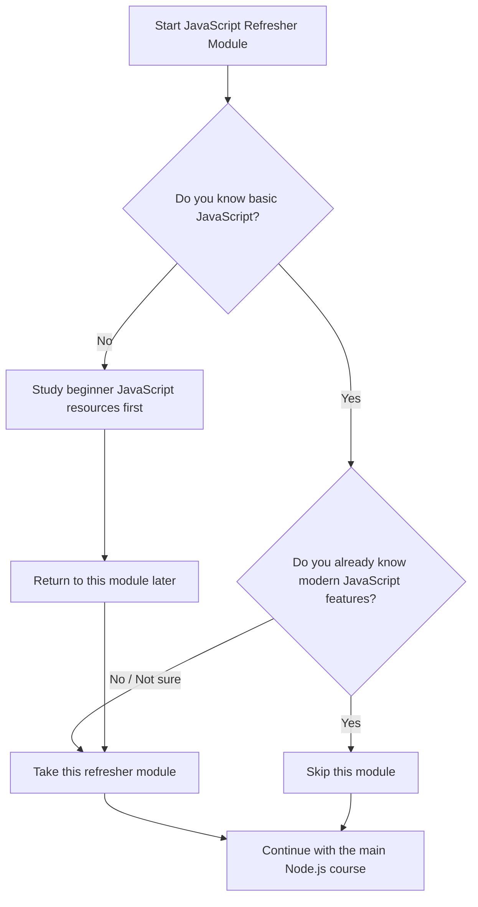
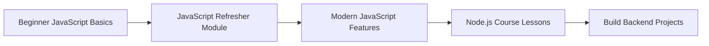

# 001 - Module Introduction

## Section

Optional: JavaScript - A Quick Refresher

## Duration

2 minutes

---

## Main Idea

This lesson introduces the optional JavaScript refresher module. The module is designed for learners who already have some basic JavaScript knowledge but need a quick review before continuing with the rest of the course.

It is **not a full beginner JavaScript course**. Instead, it helps learners refresh important JavaScript concepts, especially if they have not used JavaScript for a while.

---

## Learning Objectives

By the end of this lesson, you should be able to:

* Understand the purpose of the optional JavaScript refresher module.
* Decide whether you should take or skip this module.
* Recognize that basic JavaScript knowledge is required for the main course.
* Know when to use external beginner-friendly JavaScript resources.
* Prepare for later lessons that depend on JavaScript syntax and modern JavaScript features.

---

## Who Should Take This Module?

This module is recommended for you if:

* You have only basic JavaScript knowledge.
* You have not used JavaScript for a long time.
* You want to refresh core JavaScript syntax.
* You are not fully comfortable with modern JavaScript features.

This module may be too basic for you if:

* You already know JavaScript well.
* You understand modern JavaScript features such as:

  * Rest operator
  * Spread operator
  * Object destructuring
  * Modern syntax improvements

---

## Important Note

This module does **not** replace a full JavaScript beginner course.

If you are completely new to JavaScript, this module may feel difficult. In that case, you should first study some beginner JavaScript resources, then return to this module and continue with the rest of the course.

---

## Decision Flow



---

## Key Concepts

### 1. This Module Is Optional

The instructor clearly explains that this module is optional. You do not need to watch it if you already feel comfortable with JavaScript.

### 2. It Is a Refresher, Not a Beginner Course

The module assumes that you already know the basics of JavaScript. It is meant to refresh your memory, not teach JavaScript from zero.

### 3. Basic JavaScript Is Required

To follow the main course effectively, you need a basic understanding of JavaScript syntax and how JavaScript works.

### 4. Modern JavaScript Features Are Useful

If you already understand features like the rest operator, spread operator, and object destructuring, you can probably skip this module.

### 5. Beginners Should Use Extra Resources First

If you are brand new to JavaScript, the next lecture provides useful links to beginner-friendly resources.

---

## Simple Learning Path



---

## Practical Example

Before starting the Node.js course, you should be able to understand simple JavaScript code like this:

```js
const user = {
  name: "Alex",
  age: 25,
};

const { name, age } = user;

console.log(`${name} is ${age} years old.`);
```

This small example uses:

* An object
* Constant variables
* Object destructuring
* Template literals

These are examples of JavaScript concepts that may appear throughout the course.

---

## Practice Task

Write a short JavaScript example that uses:

* A variable
* A function
* An object
* A console output

Example:

```js
const course = {
  title: "Node.js Complete Guide",
  level: "Beginner to Advanced",
};

function printCourseInfo(courseData) {
  console.log(`Course: ${courseData.title}`);
  console.log(`Level: ${courseData.level}`);
}

printCourseInfo(course);
```

---

## Review Questions

1. What is the main purpose of this optional JavaScript module?
2. Why is this module not suitable for complete JavaScript beginners?
3. When should you skip this module?
4. Which modern JavaScript features does the instructor mention?
5. Why is basic JavaScript knowledge important before learning Node.js?
6. What should you do if you are brand new to JavaScript?

---

## Summary

This lesson introduces the optional JavaScript refresher module. The module is useful for learners who already know some JavaScript but want to review the basics before continuing with the Node.js course.

If you already understand JavaScript and modern features such as rest and spread operators or object destructuring, you can skip this module. However, if your JavaScript knowledge is weak or outdated, this refresher will help you prepare for the rest of the course.

For complete beginners, the instructor recommends using beginner JavaScript resources first before returning to this module.
