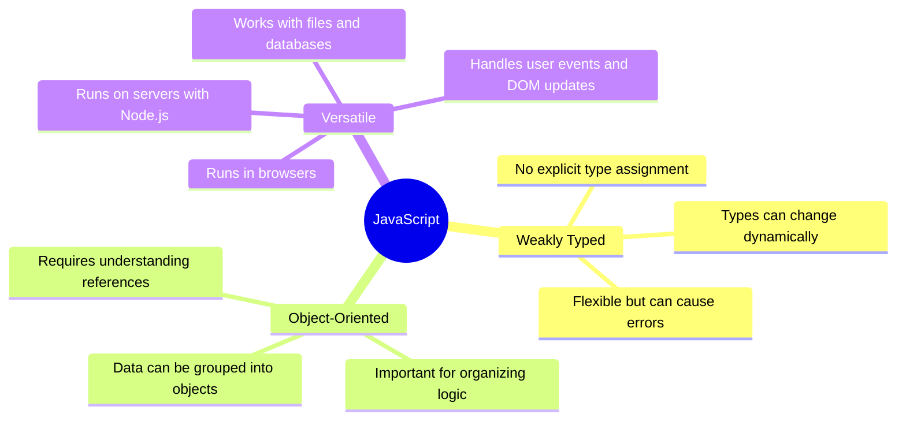
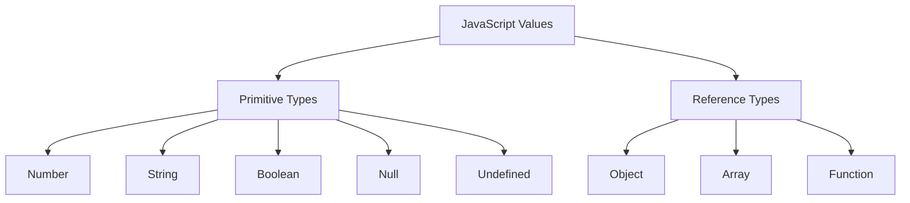
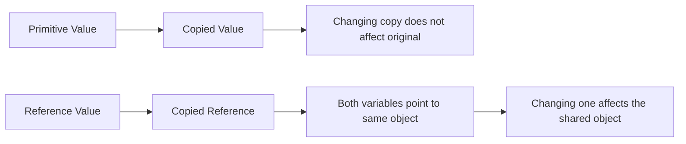
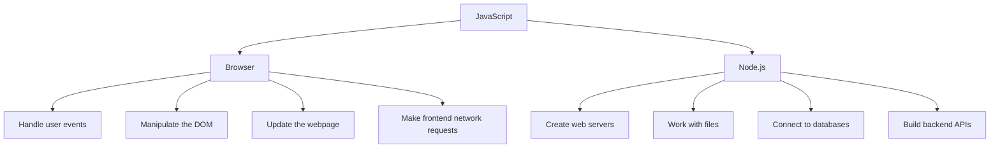
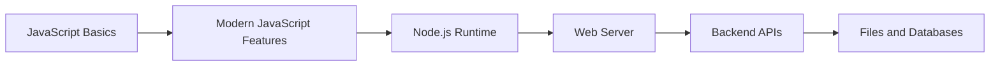

# 002 - JavaScript in a Nutshell

## Section

Optional: JavaScript - A Quick Refresher

## Duration

3 minutes

---

## Main Idea

This lesson gives a short overview of what JavaScript is and why it is important for the course. JavaScript is described as a **weakly typed**, **object-oriented**, and **versatile** programming language.

The goal is not to teach JavaScript from zero, but to remind learners of the core characteristics of the language before moving into more practical Node.js topics.

---

## Learning Objectives

By the end of this lesson, you should be able to:

* Explain what JavaScript is in simple terms.
* Understand what it means that JavaScript is weakly typed.
* Recognize JavaScript as an object-oriented language.
* Understand the difference between primitive and reference types at a high level.
* Explain why JavaScript is considered versatile.
* Identify where JavaScript can run, including the browser and Node.js.
* Understand why JavaScript is useful for both frontend and backend development.

---

## JavaScript in One Sentence

JavaScript is a flexible programming language that can run in the browser, on a computer, or on a server, and it is commonly used to build interactive websites, web applications, and backend services.

---

## Core Characteristics of JavaScript



---

## 1. JavaScript Is Weakly Typed

JavaScript is a **weakly typed** language. This means that you do not need to explicitly define the type of a variable.

For example, a variable can first store a number and later store text:

```js id="weakly-typed-example"
let value = 10;
value = "Hello JavaScript";

console.log(value);
```

In some other programming languages, changing a variable from a number to a string would cause an error. JavaScript allows this flexibility, but it can also create unexpected bugs if you are not careful.

---

## Common JavaScript Data Types



---

## 2. JavaScript Uses Objects

JavaScript can organize data into logical structures called **objects**.

Example:

```js id="object-example"
const user = {
  name: "Anna",
  age: 24,
  isStudent: true,
};

console.log(user.name);
console.log(user.age);
```

Objects are important because they allow us to group related data together. In Node.js and backend development, objects are used frequently for requests, responses, users, products, configuration, and database records.

---

## 3. Primitive Types vs Reference Types

One important concept in JavaScript is the difference between **primitive types** and **reference types**.

### Primitive Types

Primitive values are copied directly.

```js id="primitive-example"
let a = 5;
let b = a;

b = 10;

console.log(a); // 5
console.log(b); // 10
```

Changing `b` does not affect `a` because the value was copied.

### Reference Types

Objects and arrays are reference types. They are not copied directly. Instead, the variable stores a reference to the object in memory.

```js id="reference-example"
const personA = {
  name: "Max",
};

const personB = personA;

personB.name = "Anna";

console.log(personA.name); // Anna
console.log(personB.name); // Anna
```

Both `personA` and `personB` point to the same object. Changing one affects the other.

---

## Primitive vs Reference Types Diagram



---

## 4. JavaScript Is Versatile

JavaScript originally became popular as a browser language, but today it can run in many environments.

### In the Browser

JavaScript can:

* React to user events
* Change HTML and CSS through the DOM
* Validate forms
* Make network requests
* Build interactive user interfaces

Example browser tasks:

```js id="browser-example"
document.querySelector("button").addEventListener("click", function () {
  console.log("Button clicked!");
});
```

### On the Server with Node.js

With Node.js, JavaScript can also run outside the browser.

JavaScript on the server can:

* Create web servers
* Handle HTTP requests
* Work with files
* Connect to databases
* Build APIs
* Process backend logic

Example Node.js task:

```js id="node-example"
const http = require("http");

const server = http.createServer(function (req, res) {
  res.write("Hello from Node.js!");
  res.end();
});

server.listen(3000);
```

---

## Browser JavaScript vs Node.js JavaScript



---

## Why This Matters for Node.js

This course uses JavaScript on the server through Node.js. That means the same language used in the browser can also be used to build backend applications.

Before learning Node.js deeply, you should feel comfortable with:

* Variables
* Functions
* Objects
* Arrays
* Conditions
* Loops
* Basic types
* Modern JavaScript syntax
* Primitive and reference behavior

---

## Learning Path



---

## Key Concepts

### Weak Typing

JavaScript does not force you to declare variable types. This makes the language flexible, but it also means you need to be careful about unexpected type changes.

### Objects

Objects help organize related data. They are one of the most important structures in JavaScript.

### Primitive Types

Primitive values are copied directly. Examples include numbers, strings, and booleans.

### Reference Types

Objects and arrays are reference types. Variables store references to the same underlying data.

### Versatility

JavaScript can run in different environments, including browsers and servers.

### Node.js

Node.js allows JavaScript to run outside the browser, making it possible to build backend applications with JavaScript.

---

## Practical Example

This example combines variables, objects, functions, and basic type behavior:

```js id="practical-example"
const course = {
  title: "Node.js Complete Guide",
  language: "JavaScript",
  duration: "Long-form course",
};

function printCourseSummary(courseData) {
  console.log(`Course: ${courseData.title}`);
  console.log(`Language: ${courseData.language}`);
  console.log(`Duration: ${courseData.duration}`);
}

printCourseSummary(course);
```

This example is useful because Node.js applications often pass objects into functions to process data.

---

## Practice Task

Create a small JavaScript file called `app.js`.

Inside it:

1. Create an object called `user`.
2. Add properties like `name`, `age`, and `role`.
3. Create a function that prints the user information.
4. Call the function.

Example:

```js id="practice-task"
const user = {
  name: "Alex",
  age: 25,
  role: "Developer",
};

function printUserInfo(userData) {
  console.log(`${userData.name} is a ${userData.role}.`);
}

printUserInfo(user);
```

Expected output:

```txt id="expected-output"
Alex is a Developer.
```

---

## Review Questions

1. What does it mean that JavaScript is weakly typed?
2. Why can weak typing sometimes lead to errors?
3. What is an object in JavaScript?
4. What is the difference between primitive and reference types?
5. Why is JavaScript considered versatile?
6. Where did JavaScript originally run?
7. How does Node.js expand the use of JavaScript?
8. What kinds of tasks can JavaScript perform in the browser?
9. What kinds of tasks can JavaScript perform on the server?
10. Why is JavaScript knowledge important before learning Node.js?

---

## Summary

This lesson summarizes JavaScript as a weakly typed, object-oriented, and versatile programming language.

JavaScript is weakly typed because variables do not require explicit type declarations and can change types dynamically. It is object-oriented because data can be organized into objects. It is versatile because it can run in the browser, on a computer, or on a server through Node.js.

For this course, the most important takeaway is that Node.js allows JavaScript to be used for backend development. With Node.js, JavaScript can create web servers, handle requests, work with files, connect to databases, and build complete backend applications.

---

# Bài luyện tập

## Mục tiêu


## Đề bài


## Yêu cầu hoàn thành

- [ ] 
- [ ] 
- [ ] 

## Kết quả / lời giải


## Ghi chú
