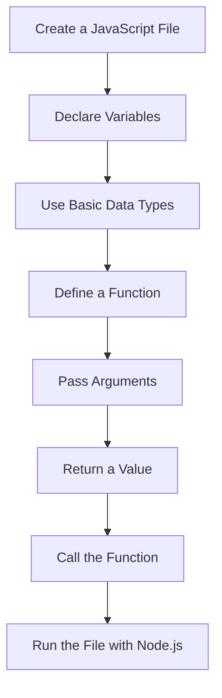
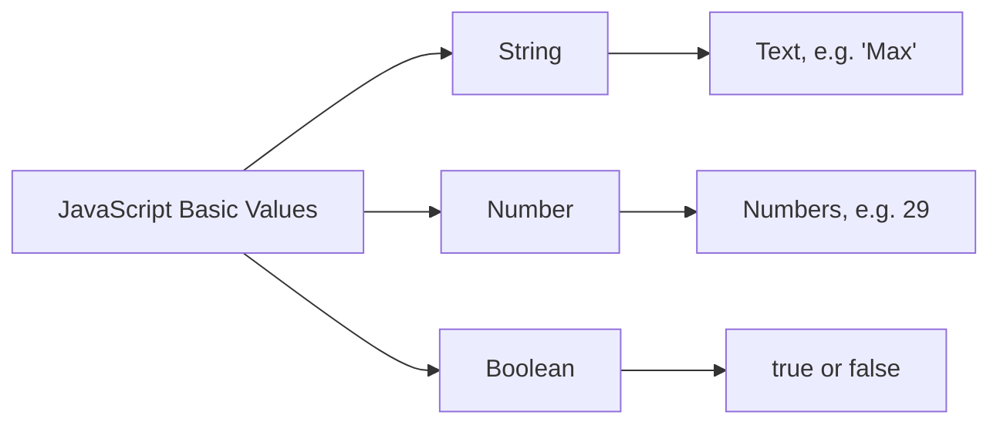
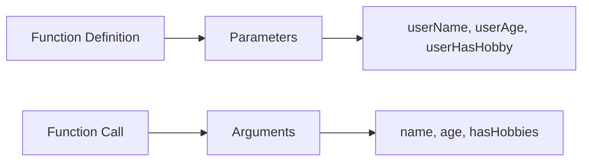
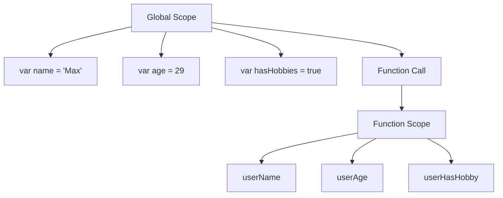
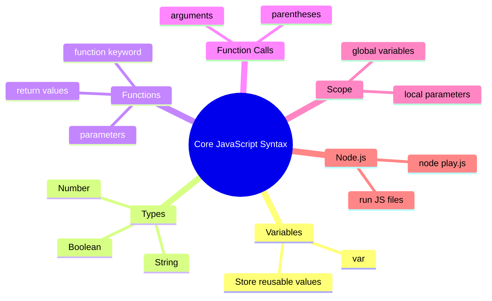

# 003 - Refreshing the Core Syntax

## Section

Optional: JavaScript - A Quick Refresher

## Duration

5 minutes

---

## Main Idea

This lesson refreshes the core JavaScript syntax that you need before working with Node.js. It reviews variables, basic data types, functions, parameters, return values, function calls, and scope.

The goal is not to teach JavaScript from zero, but to make sure you remember the essential syntax required throughout the course.

---

## Learning Objectives

By the end of this lesson, you should be able to:

* Create and run a simple JavaScript file with Node.js.
* Declare variables using JavaScript syntax.
* Recognize basic data types such as strings, numbers, and booleans.
* Define a function with parameters.
* Return a value from a function.
* Call a function and pass arguments into it.
* Understand the difference between global variables and local function parameters.
* Explain why pure functions are useful.

---

## Lesson Overview



---

## 1. Creating a JavaScript File

The instructor starts by creating a new empty folder and opening it in Visual Studio Code.

Inside the folder, create a new JavaScript file.

Example file name:

```txt id="file-name"
play.js
```

The file name is flexible. You can choose another name, but `play.js` is simple and useful for testing JavaScript syntax.

---

## 2. Running JavaScript with Node.js

To run the file, open a terminal in the project folder and use:

```bash id="run-node"
node play.js
```

This command tells Node.js to execute the JavaScript code inside `play.js`.

---

## 3. Variables

A variable stores a value that can be reused later.

Older JavaScript often uses the `var` keyword:

```js id="var-example"
var name = "Max";

console.log(name);
```

Expected output:

```txt id="var-output"
Max
```

In modern JavaScript, you will often see `let` and `const`, but this lesson starts with `var` because it is part of the traditional JavaScript syntax.

---

## 4. Basic Data Types

JavaScript has several basic data types. In this lesson, the instructor focuses on three common ones:



Example:

```js id="basic-types"
var name = "Max";
var age = 29;
var hasHobbies = true;

console.log(name);
console.log(age);
console.log(hasHobbies);
```

Explanation:

| Variable     |   Value | Type    |
| ------------ | ------: | ------- |
| `name`       | `"Max"` | String  |
| `age`        |    `29` | Number  |
| `hasHobbies` |  `true` | Boolean |

---

## 5. Functions

A function is a reusable block of code. It can receive input, process it, and return a result.

Basic syntax:

```js id="function-syntax"
function summarizeUser(userName, userAge, userHasHobby) {
  return (
    "Name is " +
    userName +
    ", age is " +
    userAge +
    ", and the user has hobbies: " +
    userHasHobby
  );
}
```

The function above receives three parameters:

* `userName`
* `userAge`
* `userHasHobby`

These parameters are local variables. They only exist inside the function.

---

## 6. Calling a Function

A function does not run automatically. You need to call it.

```js id="function-call"
var name = "Max";
var age = 29;
var hasHobbies = true;

function summarizeUser(userName, userAge, userHasHobby) {
  return (
    "Name is " +
    userName +
    ", age is " +
    userAge +
    ", and the user has hobbies: " +
    userHasHobby
  );
}

console.log(summarizeUser(name, age, hasHobbies));
```

Expected output:

```txt id="function-output"
Name is Max, age is 29, and the user has hobbies: true
```

---

## 7. Parameters vs Arguments

Parameters are the names used inside the function definition.

Arguments are the actual values passed into the function when it is called.



Example:

```js id="parameter-argument-example"
function greetUser(userName) {
  return "Hello, " + userName;
}

console.log(greetUser("Max"));
```

In this example:

| Concept   | Example    |
| --------- | ---------- |
| Parameter | `userName` |
| Argument  | `"Max"`    |

---

## 8. Return Values

A function can return a result using the `return` keyword.

```js id="return-example"
function add(a, b) {
  return a + b;
}

var result = add(5, 3);

console.log(result);
```

Expected output:

```txt id="return-output"
8
```

The returned value can be stored in a variable, printed, or used in another expression.

---

## 9. Scope

Scope controls where variables can be accessed.

Variables created outside a function are usually available globally in the file.

Variables created as function parameters only exist inside that function.

```js id="scope-example"
var name = "Max";

function printName(userName) {
  console.log(userName);
}

printName(name);

// This would cause an error because userName only exists inside the function:
// console.log(userName);
```

---

## Scope Diagram



---

## 10. Pure Functions

The instructor explains that the function can directly access global variables, but a better approach is to pass data into the function through parameters.

This makes the function more independent.

Example of a less reusable function:

```js id="non-pure-function"
var name = "Max";

function printUserName() {
  console.log(name);
}

printUserName();
```

This function depends on the external variable `name`.

A better version:

```js id="pure-function"
function printUserName(userName) {
  console.log(userName);
}

printUserName("Max");
```

This function receives the data it needs as an argument. It is easier to test, reuse, and understand.

---

## Core Syntax Summary Diagram



---

## Complete Example

Create a file named `play.js`:

```js id="complete-example"
var name = "Max";
var age = 29;
var hasHobbies = true;

function summarizeUser(userName, userAge, userHasHobby) {
  return (
    "Name is " +
    userName +
    ", age is " +
    userAge +
    ", and the user has hobbies: " +
    userHasHobby
  );
}

console.log(summarizeUser(name, age, hasHobbies));
```

Run it with:

```bash id="complete-run"
node play.js
```

Expected output:

```txt id="complete-output"
Name is Max, age is 29, and the user has hobbies: true
```

---

## Why This Matters for Node.js

Node.js applications are built with JavaScript. Before working with servers, routes, requests, responses, files, and databases, you need to be comfortable with the basic syntax.

These concepts appear everywhere in Node.js:

* Variables store data and configuration.
* Functions organize logic.
* Parameters pass request data into functions.
* Return values produce results.
* Scope prevents variables from leaking into places where they should not be used.
* `console.log()` helps with debugging.

---

## Practice Task

Create a new file called `app.js`.

Inside it:

1. Create three variables:

   * `productName`
   * `price`
   * `isAvailable`

2. Create a function called `summarizeProduct`.

3. The function should receive the three values as parameters.

4. Return a summary string.

5. Print the result with `console.log()`.

Example solution:

```js id="practice-solution"
var productName = "Laptop";
var price = 1200;
var isAvailable = true;

function summarizeProduct(name, productPrice, available) {
  return (
    "Product: " +
    name +
    ", price: $" +
    productPrice +
    ", available: " +
    available
  );
}

console.log(summarizeProduct(productName, price, isAvailable));
```

Expected output:

```txt id="practice-output"
Product: Laptop, price: $1200, available: true
```

---

## Mini Challenge

Rewrite the example using different data:

```js id="mini-challenge"
var userName = "Anna";
var userAge = 24;
var isAdmin = false;

function summarizeAccount(name, age, adminStatus) {
  return "User " + name + " is " + age + " years old. Admin: " + adminStatus;
}

console.log(summarizeAccount(userName, userAge, isAdmin));
```

Then change the values and run the file again.

---

## Review Questions

1. How do you create a JavaScript file?
2. Which command runs a JavaScript file with Node.js?
3. What is a variable?
4. What is the difference between a string, a number, and a boolean?
5. How do you define a function in JavaScript?
6. What is a parameter?
7. What is an argument?
8. What does the `return` keyword do?
9. Why can function parameters not be used outside the function?
10. Why is it useful to pass data into a function instead of relying on global variables?

---

## Summary

This lesson refreshes the most important JavaScript syntax needed for the course. You reviewed how to create a JavaScript file, run it with Node.js, declare variables, use strings, numbers, and booleans, define functions, pass arguments, return values, and understand basic scope.

These are foundational JavaScript skills. They will appear constantly when building Node.js applications, especially when handling request data, creating reusable logic, and debugging backend code.
