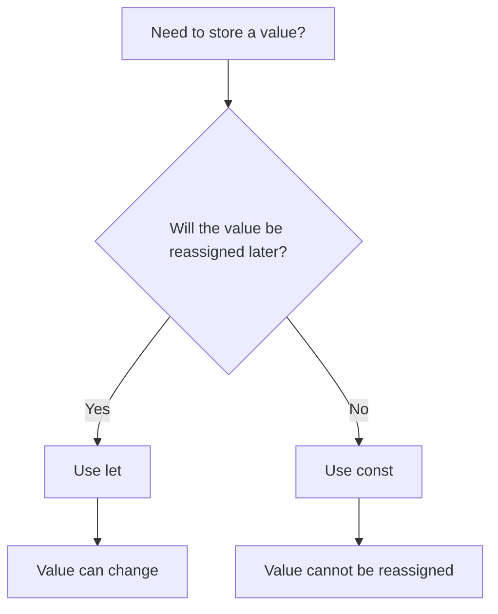
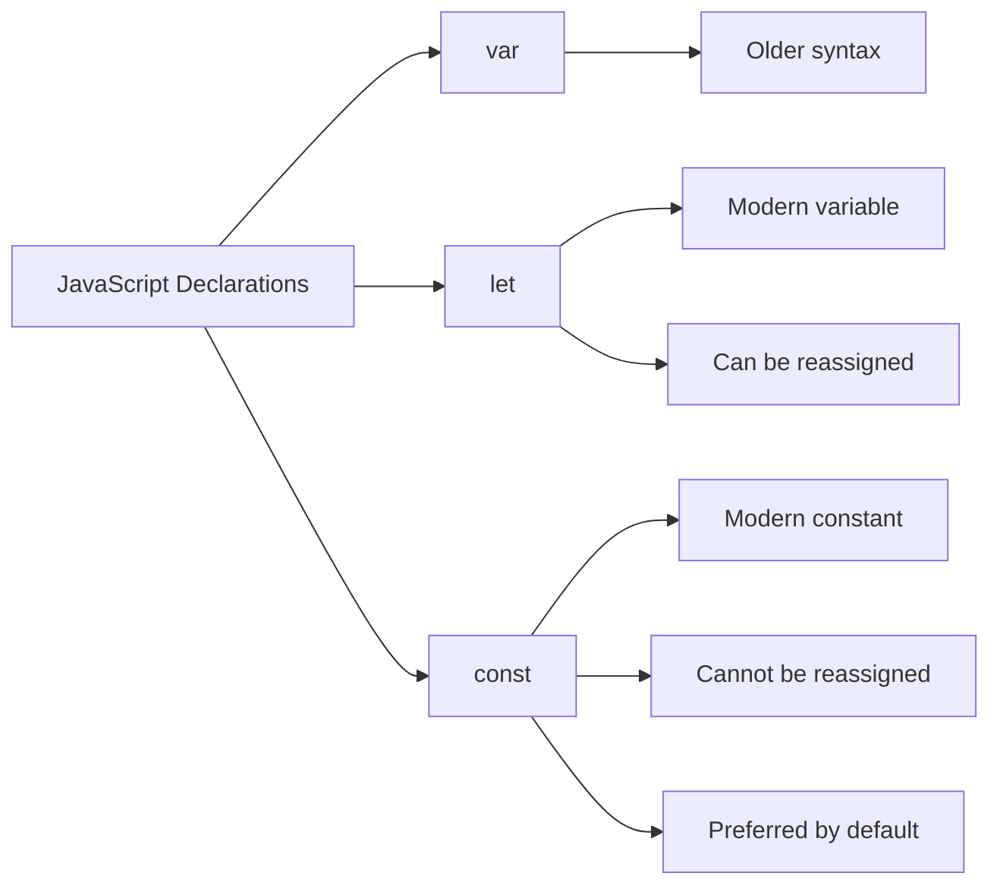
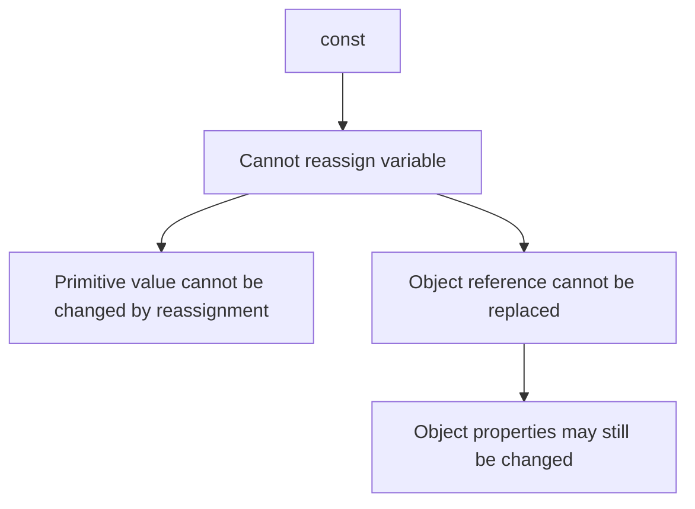

# 004 - let & const

## Section

Optional: JavaScript - A Quick Refresher

## Duration

2 minutes

---

## Main Idea

This lesson introduces two modern JavaScript keywords for declaring values: `let` and `const`.

In older JavaScript, variables were commonly declared with `var`. In modern JavaScript, `let` and `const` are preferred because they make code clearer and safer.

The main idea is:

* Use `let` when the value may change.
* Use `const` when the value should not change.

---

## Learning Objectives

By the end of this lesson, you should be able to:

* Understand why `var` is considered older syntax.
* Use `let` to declare values that can change.
* Use `const` to declare values that should not change.
* Explain why `const` helps prevent accidental reassignment.
* Decide when to use `let` and when to use `const`.
* Understand why modern JavaScript prefers `const` by default.

---

## From `var` to `let` and `const`

Older JavaScript often used `var`:

```js id="var-example"
var name = "Max";
var age = 29;
var hasHobbies = true;
```

Modern JavaScript usually uses `let` and `const` instead:

```js id="modern-example"
const name = "Max";
let age = 29;
const hasHobbies = true;
```

In this example:

| Value        | Keyword | Reason                                             |
| ------------ | ------- | -------------------------------------------------- |
| `name`       | `const` | The name should not change                         |
| `age`        | `let`   | The age may change                                 |
| `hasHobbies` | `const` | The hobby status should not change in this example |

---

## Decision Rule



---

## 1. Using `let`

Use `let` when you plan to assign a new value later.

```js id="let-example"
let age = 29;

age = 30;

console.log(age);
```

Expected output:

```txt id="let-output"
30
```

Here, `age` is declared with `let` because the value changes from `29` to `30`.

---

## 2. Using `const`

Use `const` when the value should not be reassigned.

```js id="const-example"
const name = "Max";

console.log(name);
```

Expected output:

```txt id="const-output"
Max
```

The value of `name` is meant to stay the same.

---

## 3. Reassigning a `const` Causes an Error

If you try to assign a new value to a constant, JavaScript will throw an error.

```js id="const-error-example"
const name = "Max";

name = "Maximilian";

console.log(name);
```

This causes an error similar to:

```txt id="const-error-output"
TypeError: Assignment to constant variable.
```

This is useful because it protects your code from accidental changes.

---

## Why `const` Is Useful

`const` makes your intention clear.

When another developer sees this:

```js id="clear-intention"
const userName = "Max";
```

They know that `userName` should not be reassigned later.

This makes code easier to understand and safer to maintain.

---

## `let` vs `const`



---

## Updated Example from the Previous Lesson

Before:

```js id="old-var-example"
var name = "Max";
var age = 29;
var hasHobbies = true;

function summarizeUser(userName, userAge, userHasHobby) {
  return (
    "Name is " +
    userName +
    ", age is " +
    userAge +
    ", and the user has hobbies: " +
    userHasHobby
  );
}

console.log(summarizeUser(name, age, hasHobbies));
```

After using `let` and `const`:

```js id="let-const-summary-example"
const name = "Max";
let age = 29;
const hasHobbies = true;

age = 30;

function summarizeUser(userName, userAge, userHasHobby) {
  return (
    "Name is " +
    userName +
    ", age is " +
    userAge +
    ", and the user has hobbies: " +
    userHasHobby
  );
}

console.log(summarizeUser(name, age, hasHobbies));
```

Expected output:

```txt id="summary-output"
Name is Max, age is 30, and the user has hobbies: true
```

---

## Best Practice

Use `const` by default.

Only use `let` when you know the value needs to change later.

Recommended approach:

```js id="best-practice"
const userName = "Max";
const hasHobbies = true;

let age = 29;
age = 30;
```

Avoid using `var` in modern JavaScript unless you are working with older code.

---

## Common Mistake

Do not use `const` for a value that must be reassigned.

Incorrect:

```js id="incorrect-const"
const counter = 0;

counter = counter + 1;
```

Correct:

```js id="correct-let"
let counter = 0;

counter = counter + 1;

console.log(counter);
```

Expected output:

```txt id="counter-output"
1
```

---

## Important Note About `const`

`const` prevents reassignment, but it does not always make complex values completely unchangeable.

For example, with an object:

```js id="const-object"
const user = {
  name: "Max",
};

user.name = "Anna";

console.log(user.name);
```

Expected output:

```txt id="const-object-output"
Anna
```

This works because the variable `user` still points to the same object. The object property changed, but the variable itself was not reassigned.

However, this would cause an error:

```js id="object-reassignment-error"
const user = {
  name: "Max",
};

user = {
  name: "Anna",
};
```

---

## Mental Model



---

## Why This Matters for Node.js

In Node.js projects, you will declare many values:

* Imported modules
* Server configuration
* Request data
* Response data
* Database connections
* Helper functions
* Temporary values

Using `const` and `let` correctly makes your backend code easier to read and less error-prone.

Example:

```js id="node-style-example"
const http = require("http");

let requestCount = 0;

const server = http.createServer(function (req, res) {
  requestCount++;

  res.write("Hello from Node.js!");
  res.end();
});

server.listen(3000);
```

Explanation:

| Code           | Keyword | Reason                                       |
| -------------- | ------- | -------------------------------------------- |
| `http`         | `const` | The imported module should not be reassigned |
| `requestCount` | `let`   | The value changes over time                  |
| `server`       | `const` | The server reference should stay the same    |

---

## Practice Task

Create a file called `app.js`.

Inside it:

1. Create a constant called `productName`.
2. Create a variable called `price`.
3. Change the value of `price`.
4. Print both values.

Example solution:

```js id="practice-solution"
const productName = "Laptop";
let price = 1200;

price = 1000;

console.log(productName);
console.log(price);
```

Expected output:

```txt id="practice-output"
Laptop
1000
```

---

## Mini Challenge

Fix the following code:

```js id="mini-challenge-broken"
const score = 0;

score = 10;

console.log(score);
```

Correct version:

```js id="mini-challenge-fixed"
let score = 0;

score = 10;

console.log(score);
```

Expected output:

```txt id="mini-challenge-output"
10
```

---

## Review Questions

1. Why is `var` considered older JavaScript syntax?
2. What is the main difference between `let` and `const`?
3. When should you use `let`?
4. When should you use `const`?
5. What happens if you try to reassign a `const` value?
6. Why is `const` useful for preventing accidental changes?
7. Why should you prefer `const` by default?
8. Can you change a property inside an object declared with `const`?
9. Why would a counter usually be declared with `let`?
10. How do `let` and `const` make Node.js code clearer?

---

## Summary

This lesson introduces `let` and `const`, two modern JavaScript keywords used instead of the older `var` syntax.

Use `let` when a value needs to be reassigned later. Use `const` when a value should not be reassigned. In modern JavaScript, it is best to use `const` by default and only use `let` when reassignment is necessary.

This makes your code clearer, safer, and easier to maintain, especially in Node.js projects where many values should remain stable throughout the application.
