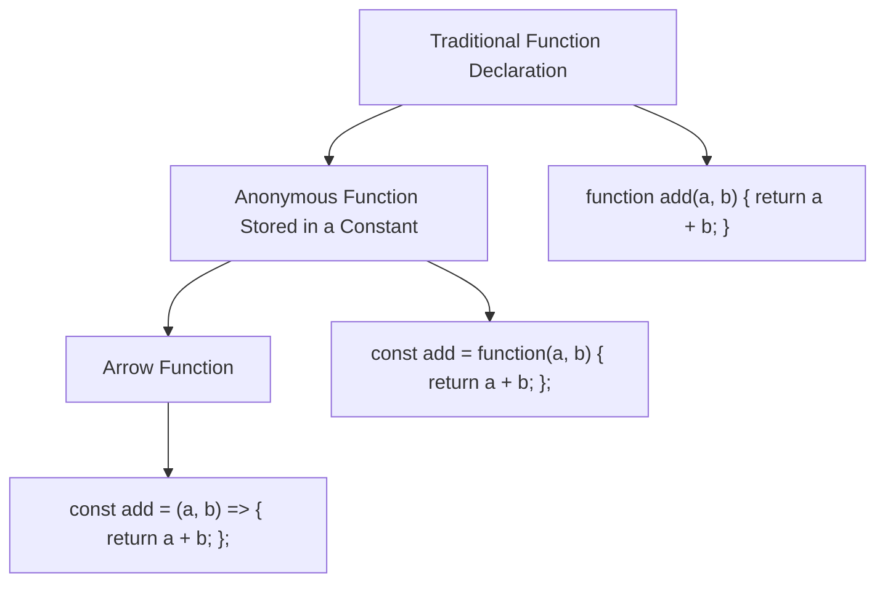
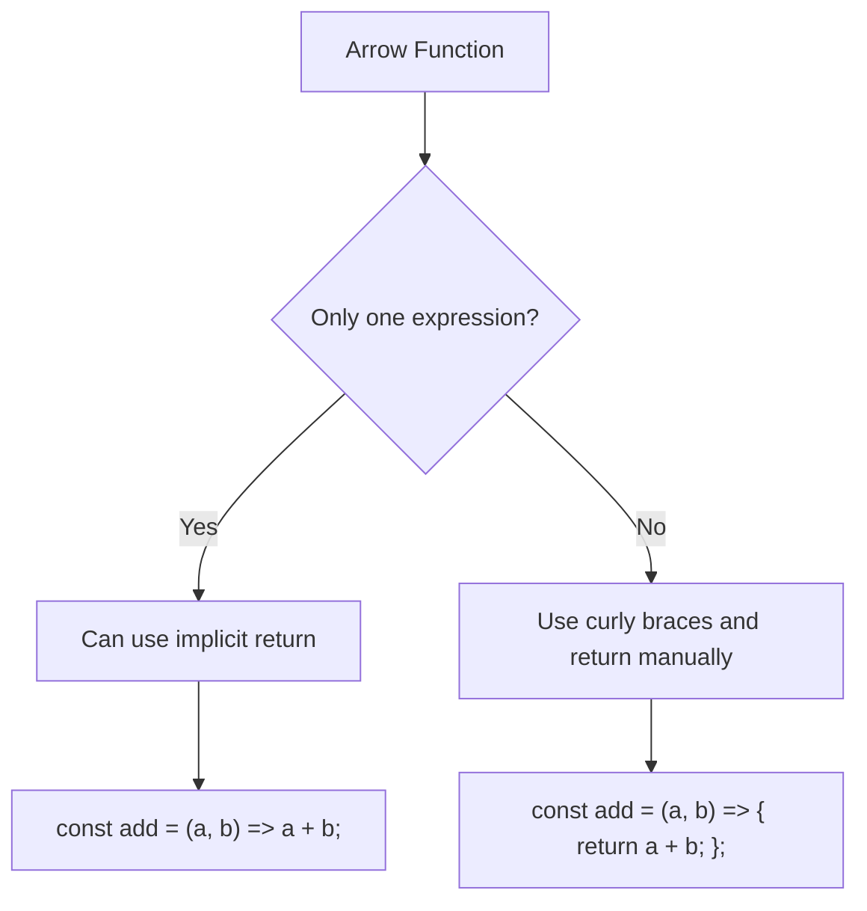
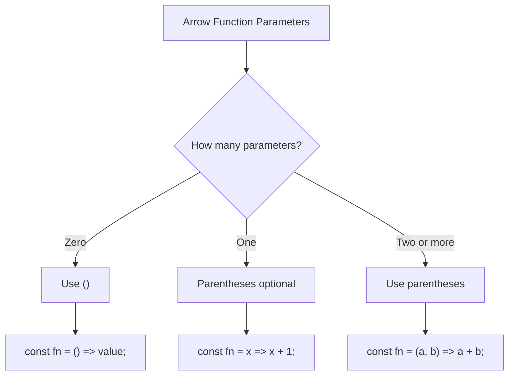
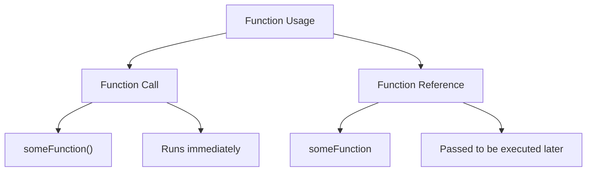

# 005 - Understanding Arrow Functions

## Section

Optional: JavaScript - A Quick Refresher

## Duration

5 minutes

---

## Main Idea

This lesson introduces **arrow functions**, a modern JavaScript syntax for writing functions in a shorter and often cleaner way.

Arrow functions are used frequently throughout modern JavaScript and Node.js projects. They can replace many traditional function declarations, especially for small helper functions, callbacks, and inline logic.

---

## Learning Objectives

By the end of this lesson, you should be able to:

* Understand what an arrow function is.
* Rewrite a traditional function as an arrow function.
* Recognize different arrow function syntax styles.
* Use arrow functions with multiple parameters, one parameter, or no parameters.
* Understand when curly braces and the `return` keyword can be omitted.
* Understand that arrow functions behave differently with the `this` keyword.
* Recognize arrow functions when reading modern Node.js code.

---

## Why Arrow Functions Matter

In modern JavaScript, you will often see this style:

```js id="arrow-basic"
const summarizeUser = (userName, userAge, userHasHobby) => {
  return (
    "Name is " +
    userName +
    ", age is " +
    userAge +
    ", and the user has hobbies: " +
    userHasHobby
  );
};
```

This is an arrow function.

It does the same job as a traditional function, but it uses a shorter syntax.

---

## Traditional Function vs Arrow Function

### Traditional Function

```js id="traditional-function"
function summarizeUser(userName, userAge, userHasHobby) {
  return (
    "Name is " +
    userName +
    ", age is " +
    userAge +
    ", and the user has hobbies: " +
    userHasHobby
  );
}
```

### Function Stored in a Constant

Before arrow functions, JavaScript could already store anonymous functions in variables or constants:

```js id="anonymous-function"
const summarizeUser = function (userName, userAge, userHasHobby) {
  return (
    "Name is " +
    userName +
    ", age is " +
    userAge +
    ", and the user has hobbies: " +
    userHasHobby
  );
};
```

The function itself has no name after the `function` keyword, so it is called an **anonymous function**. However, it can still be called through the constant `summarizeUser`.

### Arrow Function

```js id="arrow-function"
const summarizeUser = (userName, userAge, userHasHobby) => {
  return (
    "Name is " +
    userName +
    ", age is " +
    userAge +
    ", and the user has hobbies: " +
    userHasHobby
  );
};
```

The `function` keyword is removed and replaced with the arrow syntax:

```js id="arrow-symbol"
=>
```

---

## Function Syntax Evolution



---

## Anatomy of an Arrow Function

```js id="arrow-anatomy"
const add = (a, b) => {
  return a + b;
};
```

| Part           | Meaning                                       |
| -------------- | --------------------------------------------- |
| `const add`    | Stores the function in a constant named `add` |
| `(a, b)`       | Parameters                                    |
| `=>`           | Arrow function syntax                         |
| `{ ... }`      | Function body                                 |
| `return a + b` | Returned result                               |

---

## 1. Arrow Function with Multiple Parameters

When a function has two or more parameters, use parentheses.

```js id="multiple-parameters"
const add = (a, b) => {
  return a + b;
};

console.log(add(1, 2));
```

Expected output:

```txt id="multiple-parameters-output"
3
```

---

## 2. Shorter Syntax with Implicit Return

If the arrow function only has one expression and that expression should be returned, you can omit:

* Curly braces `{ }`
* The `return` keyword

Long version:

```js id="explicit-return"
const add = (a, b) => {
  return a + b;
};
```

Short version:

```js id="implicit-return"
const add = (a, b) => a + b;
```

Both versions return the same result.

```js id="implicit-return-run"
console.log(add(1, 2));
```

Expected output:

```txt id="implicit-return-output"
3
```

---

## Explicit Return vs Implicit Return



---

## 3. Arrow Function with One Parameter

If an arrow function has exactly one parameter, parentheses are optional.

With parentheses:

```js id="one-parameter-with-parentheses"
const addOne = (a) => a + 1;
```

Without parentheses:

```js id="one-parameter-no-parentheses"
const addOne = a => a + 1;
```

Example:

```js id="one-parameter-example"
const addOne = a => a + 1;

console.log(addOne(1));
```

Expected output:

```txt id="one-parameter-output"
2
```

---

## 4. Arrow Function with No Parameters

If an arrow function has no parameters, you must use empty parentheses.

```js id="no-parameters"
const addRandom = () => 1 + 2;

console.log(addRandom());
```

Expected output:

```txt id="no-parameters-output"
3
```

This is incorrect:

```js id="incorrect-no-parameters"
const addRandom = => 1 + 2;
```

A function with no parameters still needs `()`.

---

## Arrow Function Syntax Rules



---

## Complete Example

Create a file named `play.js`:

```js id="complete-example"
const name = "Max";
let age = 29;
const hasHobbies = true;

age = 30;

const summarizeUser = (userName, userAge, userHasHobby) => {
  return (
    "Name is " +
    userName +
    ", age is " +
    userAge +
    ", and the user has hobbies: " +
    userHasHobby
  );
};

const add = (a, b) => a + b;

const addOne = a => a + 1;

const addRandom = () => 1 + 2;

console.log(summarizeUser(name, age, hasHobbies));
console.log(add(1, 2));
console.log(addOne(1));
console.log(addRandom());
```

Run it with:

```bash id="run-example"
node play.js
```

Expected output:

```txt id="complete-output"
Name is Max, age is 30, and the user has hobbies: true
3
2
3
```

---

## Arrow Functions and `this`

Arrow functions are not only shorter. They also behave differently with the `this` keyword.

In traditional functions, the value of `this` can change depending on who calls the function.

In arrow functions, `this` is handled differently. Arrow functions do not create their own `this`; instead, they use `this` from the surrounding scope.

This is especially useful in situations such as:

* Callbacks
* Event handlers
* Class methods
* Nested functions

However, `this` can be a more advanced topic. For this course, the most important point is that arrow functions are common in modern JavaScript and you should recognize their syntax.

---

## Function Reference vs Function Call

Another important concept mentioned in the attached material is the difference between **calling a function** and **passing a function reference**.

### Calling a Function Immediately

```js id="function-call"
someFunction();
```

The parentheses `()` execute the function immediately.

### Passing a Function Reference

```js id="function-reference"
someFunction;
```

Without parentheses, you are not executing the function. You are passing a reference to it.

This is common in callbacks:

```js id="callback-reference"
button.addEventListener("click", someFunction);
```

The function is not executed immediately. It is executed later when the button is clicked.

---

## Function Call vs Function Reference Diagram



---

## Why This Matters for Node.js

Arrow functions are used everywhere in Node.js, especially in callback-based code.

Example:

```js id="node-arrow-example"
const http = require("http");

const server = http.createServer((req, res) => {
  res.write("Hello from Node.js!");
  res.end();
});

server.listen(3000);
```

In this example:

```js id="node-callback"
(req, res) => {
  res.write("Hello from Node.js!");
  res.end();
}
```

is an arrow function passed into `createServer`.

Node.js will execute this function whenever a request reaches the server.

---

## Common Arrow Function Forms

| Form                | Example                  | Use Case                   |
| ------------------- | ------------------------ | -------------------------- |
| Multiple parameters | `(a, b) => a + b`        | Add two values             |
| One parameter       | `name => "Hi " + name`   | Transform one value        |
| No parameters       | `() => "Hello"`          | Run logic without input    |
| Multiple statements | `(req, res) => { ... }`  | More complex logic         |
| Implicit return     | `x => x * 2`             | Short calculation          |
| Explicit return     | `x => { return x * 2; }` | Clear return in block body |

---

## Practice Task

Create a file called `app.js`.

Inside it:

1. Create an arrow function called `multiply`.
2. It should accept two numbers.
3. It should return the multiplication result.
4. Print the result with `console.log()`.

Example solution:

```js id="practice-solution"
const multiply = (a, b) => a * b;

console.log(multiply(4, 5));
```

Expected output:

```txt id="practice-output"
20
```

---

## Mini Challenge

Rewrite the following traditional function as an arrow function.

Original:

```js id="mini-challenge-original"
function greetUser(name) {
  return "Hello, " + name;
}

console.log(greetUser("Max"));
```

Arrow function version:

```js id="mini-challenge-solution"
const greetUser = name => "Hello, " + name;

console.log(greetUser("Max"));
```

Expected output:

```txt id="mini-challenge-output"
Hello, Max
```

---

## Extra Practice

Convert each function into an arrow function.

### 1. Add Two Numbers

```js id="extra-practice-1"
function add(a, b) {
  return a + b;
}
```

Solution:

```js id="extra-solution-1"
const add = (a, b) => a + b;
```

### 2. Return a Fixed Text

```js id="extra-practice-2"
function sayHello() {
  return "Hello!";
}
```

Solution:

```js id="extra-solution-2"
const sayHello = () => "Hello!";
```

### 3. Check If User Is Adult

```js id="extra-practice-3"
function isAdult(age) {
  return age >= 18;
}
```

Solution:

```js id="extra-solution-3"
const isAdult = age => age >= 18;
```

---

## Review Questions

1. What is an arrow function?
2. How do you rewrite a traditional function as an arrow function?
3. What does the `=>` symbol mean?
4. When can you omit curly braces in an arrow function?
5. When can you omit the `return` keyword?
6. When can you omit parentheses around parameters?
7. Why do arrow functions with no parameters still need `()`?
8. What is the difference between calling a function and passing a function reference?
9. Why are arrow functions common in Node.js?
10. What is one important difference between arrow functions and traditional functions regarding `this`?

---

## Summary

This lesson introduces arrow functions, a modern JavaScript syntax used to write functions more concisely.

A traditional function can be rewritten as an arrow function by removing the `function` keyword and placing the `=>` arrow between the parameter list and the function body.

Arrow functions can be written in several forms. If there is only one expression, the curly braces and `return` keyword can be omitted. If there is only one parameter, parentheses around the parameter can also be omitted. If there are no parameters, empty parentheses are required.

Arrow functions are used frequently in modern JavaScript and Node.js, especially for callbacks and short helper functions. Understanding this syntax is essential for reading and writing code throughout the course.

---

# Bài luyện tập

## Mục tiêu


## Đề bài


## Yêu cầu hoàn thành

- [ ] 
- [ ] 
- [ ] 

## Kết quả / lời giải


## Ghi chú
