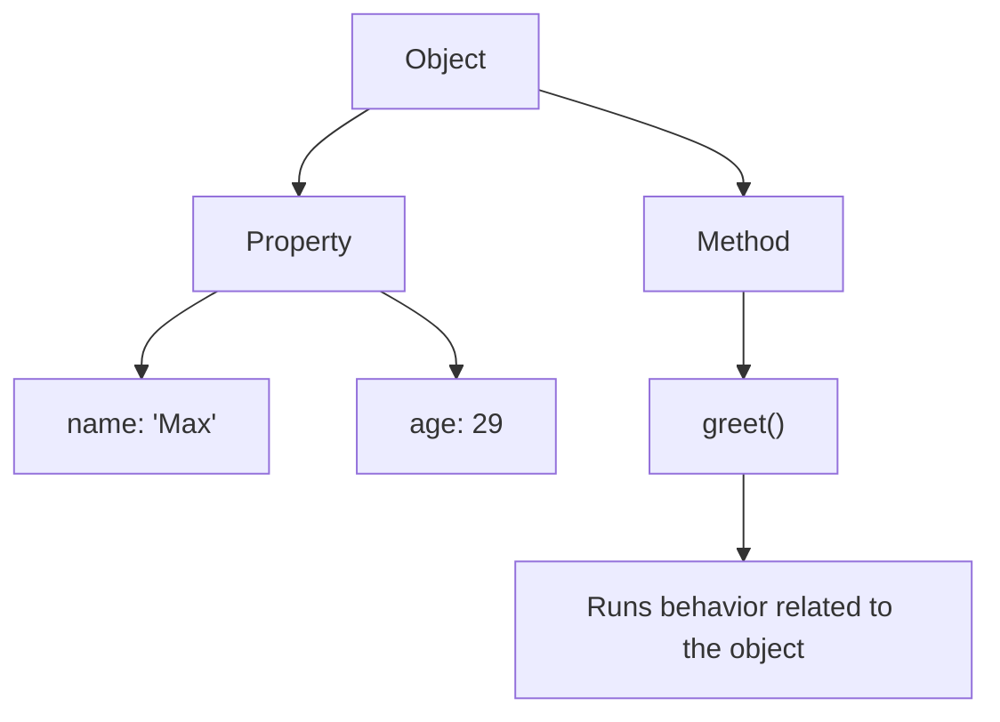
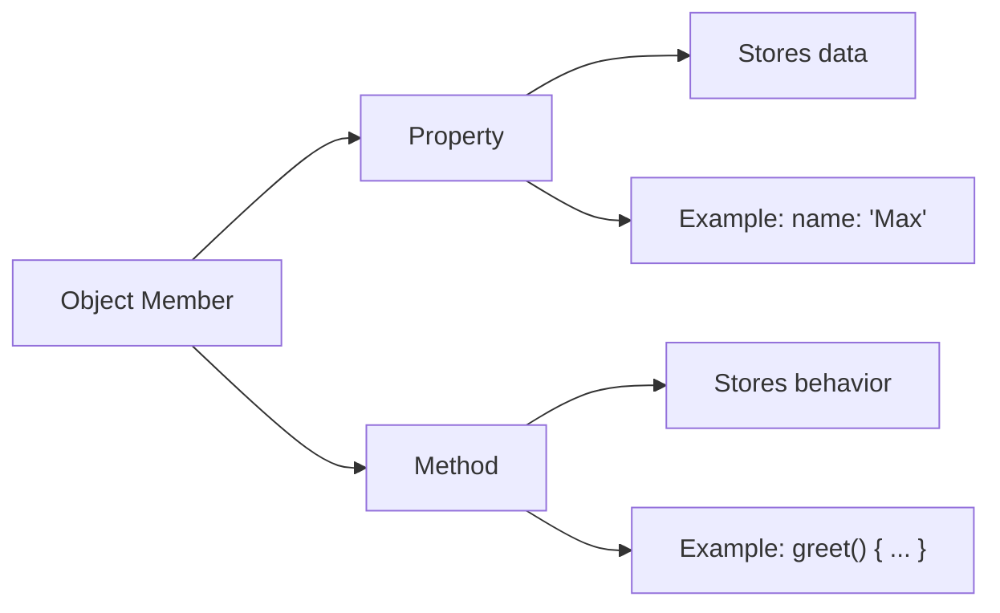
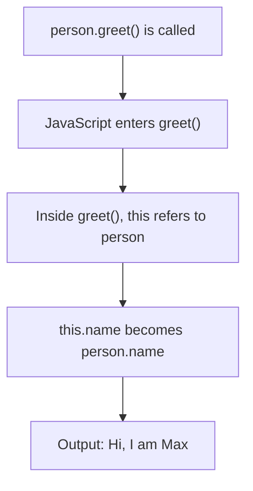
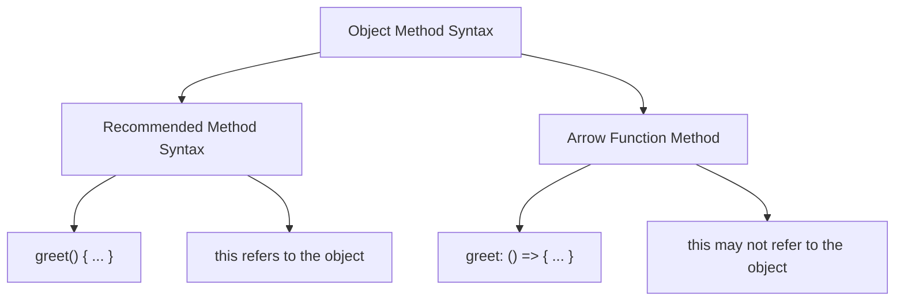
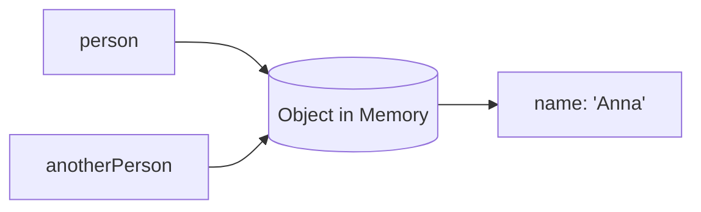

# 006 - Working with Objects, Properties & Methods

## Section

Optional: JavaScript - A Quick Refresher

## Duration

3 minutes

---

## Main Idea

This lesson introduces one of the most important data structures in JavaScript: **objects**.

Objects allow you to group related data and behavior together. Inside an object, you can store:

* **Properties**: data values such as `name`, `age`, or `email`
* **Methods**: functions that belong to the object

This lesson also explains how to access object properties and methods using **dot notation**, and why the `this` keyword behaves differently depending on how a method is written.

---

## Learning Objectives

By the end of this lesson, you should be able to:

* Create a JavaScript object using curly braces.
* Store key-value pairs inside an object.
* Access object properties with dot notation.
* Add methods to an object.
* Call object methods.
* Understand how `this` refers to the surrounding object in normal methods.
* Recognize why arrow functions should be used carefully inside objects.
* Understand why objects are important in Node.js applications.

---

## What Is an Object?

An object is a structure that groups related data together.

Example:

```js id="basic-object"
const person = {
  name: "Max",
  age: 29,
};

console.log(person);
```

Expected output:

```txt id="basic-object-output"
{ name: 'Max', age: 29 }
```

In this example:

| Key    | Value   | Type   |
| ------ | ------- | ------ |
| `name` | `"Max"` | String |
| `age`  | `29`    | Number |

---

## Object Structure



---

## 1. Creating Object Properties

Objects are created with curly braces `{}`.

Inside the object, each property is written as a key-value pair.

```js id="object-properties"
const person = {
  name: "Max",
  age: 29,
  hasHobbies: true,
};
```

Each property follows this structure:

```txt id="key-value-format"
key: value
```

Multiple properties are separated by commas.

```js id="multiple-properties"
const product = {
  title: "Laptop",
  price: 1200,
  isAvailable: true,
};
```

---

## 2. Accessing Object Properties

You can access object properties with **dot notation**.

```js id="dot-notation"
const person = {
  name: "Max",
  age: 29,
};

console.log(person.name);
console.log(person.age);
```

Expected output:

```txt id="dot-notation-output"
Max
29
```

Dot notation means:

```txt id="dot-notation-meaning"
objectName.propertyName
```

---

## 3. Adding Methods to Objects

A method is a function stored inside an object.

Example:

```js id="object-method"
const person = {
  name: "Max",
  age: 29,

  greet() {
    console.log("Hi, I am " + this.name);
  },
};

person.greet();
```

Expected output:

```txt id="object-method-output"
Hi, I am Max
```

Here, `greet()` is a method because it is a function that belongs to the `person` object.

---

## Properties vs Methods



---

## 4. Understanding `this`

Inside an object method, `this` usually refers to the object that owns the method.

```js id="this-example"
const person = {
  name: "Max",

  greet() {
    console.log("Hi, I am " + this.name);
  },
};

person.greet();
```

In this example:

```js id="this-meaning"
this.name
```

means:

```js id="this-equivalent"
person.name
```

So the output is:

```txt id="this-output"
Hi, I am Max
```

---

## `this` Mental Model



---

## 5. Important Arrow Function Warning

Arrow functions behave differently with `this`.

This code looks reasonable, but it does not work as expected:

```js id="arrow-method-problem"
const person = {
  name: "Max",

  greet: () => {
    console.log("Hi, I am " + this.name);
  },
};

person.greet();
```

Possible output:

```txt id="arrow-method-output"
Hi, I am undefined
```

Why?

Because arrow functions do **not** create their own `this`. In this case, `this` does not refer to the `person` object.

---

## Correct Method Syntax

Use this method syntax inside objects:

```js id="correct-method-syntax"
const person = {
  name: "Max",
  age: 29,

  greet() {
    console.log("Hi, I am " + this.name);
  },
};

person.greet();
```

Expected output:

```txt id="correct-method-output"
Hi, I am Max
```

This is the syntax commonly used throughout the course.

---

## Object Method Syntax Comparison



---

## Complete Example

Create a file called `play.js`:

```js id="complete-example"
const person = {
  name: "Max",
  age: 29,

  greet() {
    console.log("Hi, I am " + this.name);
  },
};

console.log(person);
console.log(person.name);
console.log(person.age);

person.greet();
```

Run it with:

```bash id="run-example"
node play.js
```

Expected output:

```txt id="complete-output"
{ name: 'Max', age: 29, greet: [Function: greet] }
Max
29
Hi, I am Max
```

The exact function display may vary depending on your Node.js version, but the important part is that the object and greeting are printed.

---

## Objects as Reference Types

Objects are **reference types**.

That means when you assign an object to another variable, you do not copy the full object. You copy a reference to the same object.

Example:

```js id="reference-type-example"
const person = {
  name: "Max",
};

const anotherPerson = person;

anotherPerson.name = "Anna";

console.log(person.name);
```

Expected output:

```txt id="reference-type-output"
Anna
```

Both `person` and `anotherPerson` point to the same object in memory.

---

## Reference Type Diagram



This is important because changing the object through one variable affects the same object used by the other variable.

---

## How to Copy an Object

To create a shallow copy of an object, you can use the spread operator:

```js id="object-copy"
const person = {
  name: "Max",
  age: 29,
};

const copiedPerson = {
  ...person,
};

copiedPerson.name = "Anna";

console.log(person.name);
console.log(copiedPerson.name);
```

Expected output:

```txt id="object-copy-output"
Max
Anna
```

Now `copiedPerson` is a separate object.

---

## Important Note About Shallow Copies

The spread operator creates a **shallow copy**.

This means it copies the top-level properties, but nested objects or arrays may still share references.

Example:

```js id="shallow-copy-warning"
const person = {
  name: "Max",
  address: {
    city: "Berlin",
  },
};

const copiedPerson = {
  ...person,
};

copiedPerson.address.city = "Munich";

console.log(person.address.city);
```

Expected output:

```txt id="shallow-copy-output"
Munich
```

The nested `address` object is still shared.

---

## Why Objects Matter in Node.js

Objects appear everywhere in Node.js.

You will often use objects for:

* Request data
* Response data
* Configuration
* Database records
* User profiles
* Product data
* Route handlers
* Imported modules

Example:

```js id="node-object-example"
const serverConfig = {
  port: 3000,
  host: "localhost",

  start() {
    console.log("Server running on " + this.host + ":" + this.port);
  },
};

serverConfig.start();
```

Expected output:

```txt id="node-object-output"
Server running on localhost:3000
```

---

## Practical Backend Example

A simple user object might look like this:

```js id="backend-user-object"
const user = {
  id: 1,
  name: "Max",
  email: "max@example.com",

  describe() {
    return this.name + " can be contacted at " + this.email;
  },
};

console.log(user.describe());
```

Expected output:

```txt id="backend-user-output"
Max can be contacted at max@example.com
```

This pattern is useful because backend applications often need to group related data and behavior together.

---

## Practice Task

Create a file called `app.js`.

Inside it:

1. Create an object called `product`.
2. Add three properties:

   * `title`
   * `price`
   * `isAvailable`
3. Add a method called `describe`.
4. Inside `describe`, use `this` to access the object properties.
5. Call the method.

Example solution:

```js id="practice-solution"
const product = {
  title: "Laptop",
  price: 1200,
  isAvailable: true,

  describe() {
    console.log(
      this.title + " costs $" + this.price + ". Available: " + this.isAvailable
    );
  },
};

product.describe();
```

Expected output:

```txt id="practice-output"
Laptop costs $1200. Available: true
```

---

## Mini Challenge

Fix this code:

```js id="mini-challenge-broken"
const person = {
  name: "Max",

  greet: () => {
    console.log("Hi, I am " + this.name);
  },
};

person.greet();
```

Correct version:

```js id="mini-challenge-fixed"
const person = {
  name: "Max",

  greet() {
    console.log("Hi, I am " + this.name);
  },
};

person.greet();
```

Expected output:

```txt id="mini-challenge-output"
Hi, I am Max
```

---

## Review Questions

1. What is an object in JavaScript?
2. How do you create an object?
3. What is a property?
4. What is a method?
5. How do you access an object property?
6. How do you call an object method?
7. What does `this` refer to inside a normal object method?
8. Why can arrow functions cause problems when used as object methods?
9. Why are objects called reference types?
10. How can you create a shallow copy of an object?

---

## Summary

This lesson introduces objects, properties, and methods in JavaScript.

Objects are created with curly braces and store data as key-value pairs. Properties hold values, while methods hold functions. You can access object members with dot notation, such as `person.name` or `person.greet()`.

The `this` keyword is important inside object methods because it allows a method to access other properties of the same object. However, arrow functions do not bind `this` in the same way, so they can produce unexpected results when used as object methods.

Objects are essential in Node.js because they are used to represent configuration, request data, response data, database records, and reusable backend logic.

---

# Bài luyện tập

## Mục tiêu


## Đề bài


## Yêu cầu hoàn thành

- [ ] 
- [ ] 
- [ ] 

## Kết quả / lời giải


## Ghi chú
