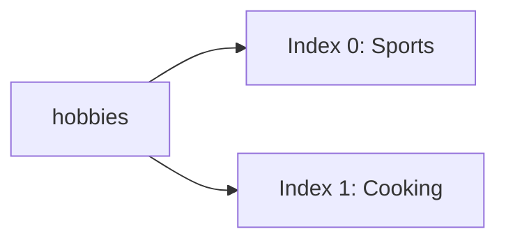
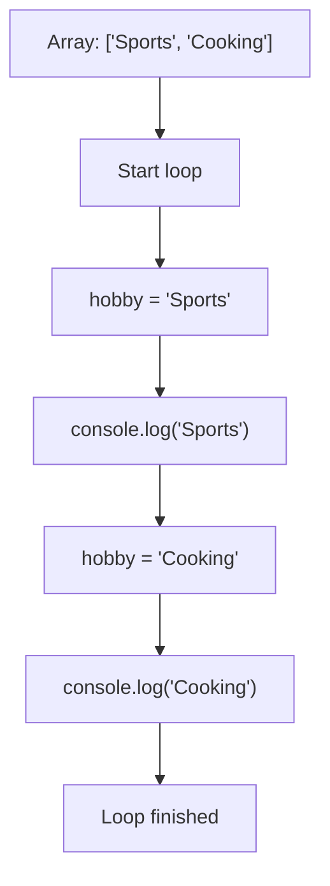
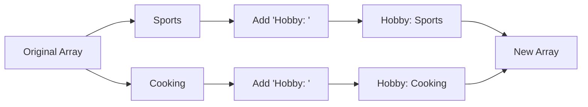
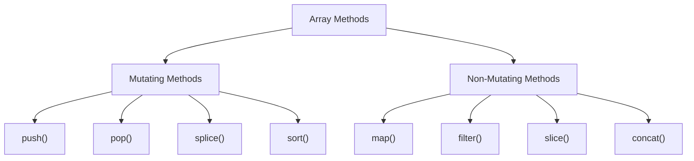
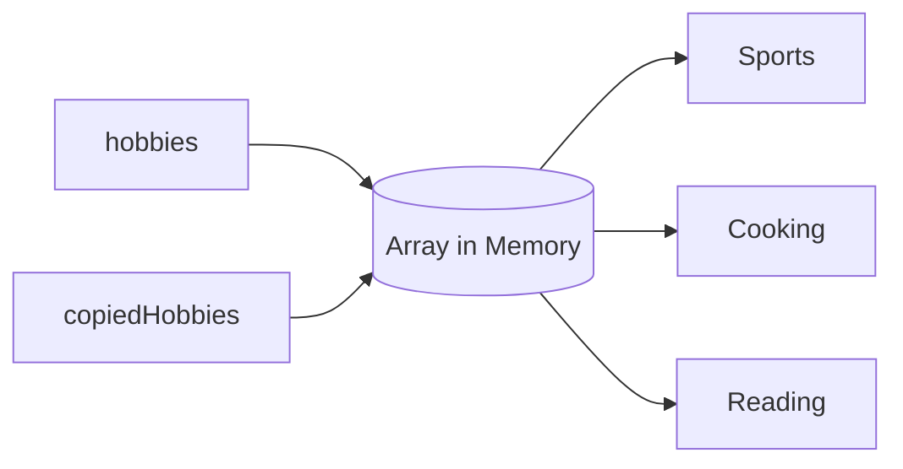

# 007 - Arrays & Array Methods

## Section

Optional: JavaScript - A Quick Refresher

## Duration

4 minutes

---

## Main Idea

This lesson introduces **arrays**, one of the most important data structures in JavaScript and Node.js.

Arrays allow you to store multiple values under one variable name. You can loop through arrays, access individual items, and use built-in array methods such as `map()` to transform data.

The lesson focuses especially on:

* Creating arrays with square brackets
* Storing multiple values in an array
* Looping through arrays with `for...of`
* Using array methods
* Understanding how `map()` creates a new transformed array

---

## Learning Objectives

By the end of this lesson, you should be able to:

* Create an array in JavaScript.
* Store strings, numbers, booleans, objects, or other arrays inside an array.
* Understand that arrays are ordered collections.
* Access array elements by index.
* Loop through arrays using `for...of`.
* Use `map()` to transform array values.
* Understand that `map()` returns a new array.
* Explain why array methods are useful in Node.js applications.

---

## What Is an Array?

An array is a data structure that stores multiple values in a single variable.

Example:

```js id="basic-array"
const hobbies = ["Sports", "Cooking"];

console.log(hobbies);
```

Expected output:

```txt id="basic-array-output"
[ 'Sports', 'Cooking' ]
```

Arrays are created with square brackets:

```js id="array-syntax"
const arrayName = [item1, item2, item3];
```

---

## Array Structure



JavaScript arrays are **zero-indexed**. This means the first item is at index `0`, not index `1`.

```js id="array-index"
const hobbies = ["Sports", "Cooking"];

console.log(hobbies[0]);
console.log(hobbies[1]);
```

Expected output:

```txt id="array-index-output"
Sports
Cooking
```

---

## 1. Arrays Can Store Different Types

Arrays can store many kinds of values.

```js id="mixed-array"
const values = ["Sports", 29, true];
```

However, in real projects, it is usually cleaner to keep arrays consistent.

Good example:

```js id="same-type-array"
const hobbies = ["Sports", "Cooking", "Reading"];
```

Possible but less clean:

```js id="mixed-type-array"
const mixedValues = ["Max", 29, true, { city: "Berlin" }];
```

---

## Common Array Value Types

```mermaid id="array-value-types"
mindmap
  root((Array Values))
    Strings
      "Sports"
      "Cooking"
    Numbers
      29
      100
    Booleans
      true
      false
    Objects
      "{ name: 'Max' }"
    Nested Arrays
      "[1, 2, 3]"
```

---

## 2. Looping Through Arrays with `for...of`

A `for...of` loop lets you go through every item in an array.

```js id="for-of-loop"
const hobbies = ["Sports", "Cooking"];

for (const hobby of hobbies) {
  console.log(hobby);
}
```

Expected output:

```txt id="for-of-output"
Sports
Cooking
```

The loop runs once for each item in the array.

In this example:

| Iteration | `hobby` value |
| --------- | ------------- |
| 1         | `"Sports"`    |
| 2         | `"Cooking"`   |

---

## `for...of` Loop Diagram



---

## 3. Built-in Array Methods

JavaScript arrays come with many built-in methods.

These methods help you:

* Add items
* Remove items
* Find items
* Transform items
* Filter items
* Copy arrays
* Combine arrays
* Loop through arrays

Common examples:

| Method      | Purpose                       | Mutates Original Array? |
| ----------- | ----------------------------- | ----------------------- |
| `push()`    | Adds an item to the end       | Yes                     |
| `pop()`     | Removes the last item         | Yes                     |
| `map()`     | Transforms every item         | No                      |
| `filter()`  | Keeps matching items          | No                      |
| `find()`    | Finds the first matching item | No                      |
| `forEach()` | Runs a function for each item | No                      |
| `slice()`   | Copies part of an array       | No                      |
| `splice()`  | Adds or removes items         | Yes                     |

---

## 4. The `map()` Method

The `map()` method is one of the most useful array methods.

It transforms every item in an array and returns a **new array**.

Example:

```js id="map-example"
const hobbies = ["Sports", "Cooking"];

const updatedHobbies = hobbies.map(hobby => "Hobby: " + hobby);

console.log(updatedHobbies);
console.log(hobbies);
```

Expected output:

```txt id="map-output"
[ 'Hobby: Sports', 'Hobby: Cooking' ]
[ 'Sports', 'Cooking' ]
```

The original array is not changed.

---

## How `map()` Works



---

## 5. `map()` Uses a Callback Function

`map()` receives a function as an argument.

That function runs once for every item in the array.

```js id="map-callback"
const hobbies = ["Sports", "Cooking"];

const updatedHobbies = hobbies.map(hobby => {
  return "Hobby: " + hobby;
});

console.log(updatedHobbies);
```

Because the arrow function has only one return statement, it can be shortened:

```js id="map-short"
const hobbies = ["Sports", "Cooking"];

const updatedHobbies = hobbies.map(hobby => "Hobby: " + hobby);

console.log(updatedHobbies);
```

Both versions do the same thing.

---

## Anatomy of `map()`

```js id="map-anatomy"
const updatedHobbies = hobbies.map(hobby => "Hobby: " + hobby);
```

| Part                | Meaning                       |
| ------------------- | ----------------------------- |
| `hobbies`           | Original array                |
| `.map()`            | Array method                  |
| `hobby => ...`      | Callback function             |
| `hobby`             | Current item in the array     |
| `"Hobby: " + hobby` | Transformed value             |
| `updatedHobbies`    | New array returned by `map()` |

---

## 6. Original Array vs New Array

One important idea in this lesson is that `map()` does not edit the original array.

```js id="map-original-new"
const hobbies = ["Sports", "Cooking"];

const updatedHobbies = hobbies.map(hobby => "Hobby: " + hobby);

console.log("Updated:", updatedHobbies);
console.log("Original:", hobbies);
```

Expected output:

```txt id="map-original-new-output"
Updated: [ 'Hobby: Sports', 'Hobby: Cooking' ]
Original: [ 'Sports', 'Cooking' ]
```

This makes `map()` useful when you want to transform data without destroying the original data.

---

## Mutating vs Non-Mutating Methods



### Mutating Method Example

```js id="push-example"
const hobbies = ["Sports", "Cooking"];

hobbies.push("Reading");

console.log(hobbies);
```

Expected output:

```txt id="push-output"
[ 'Sports', 'Cooking', 'Reading' ]
```

`push()` changes the original array.

### Non-Mutating Method Example

```js id="non-mutating-example"
const hobbies = ["Sports", "Cooking"];

const copiedHobbies = hobbies.slice();

console.log(copiedHobbies);
console.log(hobbies);
```

Expected output:

```txt id="non-mutating-output"
[ 'Sports', 'Cooking' ]
[ 'Sports', 'Cooking' ]
```

`slice()` creates a copy and does not change the original array.

---

## 7. Arrays Are Reference Types

Arrays are reference types, just like objects.

This means assigning an array to another variable does not create a real copy. It creates another reference to the same array.

```js id="array-reference"
const hobbies = ["Sports", "Cooking"];

const copiedHobbies = hobbies;

copiedHobbies.push("Reading");

console.log(hobbies);
console.log(copiedHobbies);
```

Expected output:

```txt id="array-reference-output"
[ 'Sports', 'Cooking', 'Reading' ]
[ 'Sports', 'Cooking', 'Reading' ]
```

Both variables point to the same array.

---

## Array Reference Diagram



---

## 8. Copying Arrays Correctly

To create a real shallow copy of an array, you can use the spread operator:

```js id="array-copy-spread"
const hobbies = ["Sports", "Cooking"];

const copiedHobbies = [...hobbies];

copiedHobbies.push("Reading");

console.log(hobbies);
console.log(copiedHobbies);
```

Expected output:

```txt id="array-copy-spread-output"
[ 'Sports', 'Cooking' ]
[ 'Sports', 'Cooking', 'Reading' ]
```

Now the two arrays are separate.

You can also use `slice()`:

```js id="array-copy-slice"
const hobbies = ["Sports", "Cooking"];

const copiedHobbies = hobbies.slice();

console.log(copiedHobbies);
```

---

## Important Note About Shallow Copies

Array copy operations usually create **shallow copies**.

This means top-level values are copied, but nested objects or arrays may still share references.

Example:

```js id="shallow-array-copy"
const users = [
  { name: "Max" },
  { name: "Anna" },
];

const copiedUsers = [...users];

copiedUsers[0].name = "Manuel";

console.log(users[0].name);
```

Expected output:

```txt id="shallow-array-copy-output"
Manuel
```

The array was copied, but the object inside the array was still shared.

---

## Complete Example

Create a file called `play.js`:

```js id="complete-example"
const hobbies = ["Sports", "Cooking"];

for (const hobby of hobbies) {
  console.log(hobby);
}

const updatedHobbies = hobbies.map(hobby => "Hobby: " + hobby);

console.log(updatedHobbies);
console.log(hobbies);
```

Run it with:

```bash id="run-example"
node play.js
```

Expected output:

```txt id="complete-output"
Sports
Cooking
[ 'Hobby: Sports', 'Hobby: Cooking' ]
[ 'Sports', 'Cooking' ]
```

---

## Why Arrays Matter in Node.js

Arrays are used constantly in Node.js applications.

You may use arrays to store:

* Users
* Products
* Orders
* Routes
* Middleware functions
* Database results
* Validation errors
* File paths
* API response data

Example:

```js id="node-array-example"
const users = [
  { id: 1, name: "Max" },
  { id: 2, name: "Anna" },
];

const userNames = users.map(user => user.name);

console.log(userNames);
```

Expected output:

```txt id="node-array-output"
[ 'Max', 'Anna' ]
```

This is common in backend development because database queries often return arrays of objects.

---

## Practical Backend Example

Imagine you receive a list of products from a database:

```js id="backend-products"
const products = [
  { title: "Laptop", price: 1200 },
  { title: "Mouse", price: 25 },
  { title: "Keyboard", price: 75 },
];

const productTitles = products.map(product => product.title);

console.log(productTitles);
```

Expected output:

```txt id="backend-products-output"
[ 'Laptop', 'Mouse', 'Keyboard' ]
```

This transforms an array of product objects into an array of product titles.

---

## Common Array Methods Cheat Sheet

| Method       | Example                         | Result                     |
| ------------ | ------------------------------- | -------------------------- |
| `push()`     | `arr.push("New")`               | Adds item to the end       |
| `pop()`      | `arr.pop()`                     | Removes last item          |
| `map()`      | `arr.map(item => item + "!")`   | Returns transformed array  |
| `filter()`   | `arr.filter(item => condition)` | Returns matching items     |
| `find()`     | `arr.find(item => condition)`   | Returns first match        |
| `forEach()`  | `arr.forEach(item => ...)`      | Runs logic for each item   |
| `includes()` | `arr.includes("Sports")`        | Checks if value exists     |
| `indexOf()`  | `arr.indexOf("Sports")`         | Finds index of value       |
| `slice()`    | `arr.slice()`                   | Copies array or part of it |
| `concat()`   | `arr.concat(otherArr)`          | Combines arrays            |

---

## Practice Task

Create a file called `app.js`.

Inside it:

1. Create an array called `products`.
2. Add three product names.
3. Loop through the array with `for...of`.
4. Use `map()` to create a new array where each product has `"Product: "` in front.
5. Print both the new array and the original array.

Example solution:

```js id="practice-solution"
const products = ["Laptop", "Mouse", "Keyboard"];

for (const product of products) {
  console.log(product);
}

const labeledProducts = products.map(product => "Product: " + product);

console.log(labeledProducts);
console.log(products);
```

Expected output:

```txt id="practice-output"
Laptop
Mouse
Keyboard
[ 'Product: Laptop', 'Product: Mouse', 'Product: Keyboard' ]
[ 'Laptop', 'Mouse', 'Keyboard' ]
```

---

## Mini Challenge

Convert this array of numbers into doubled numbers:

```js id="mini-challenge"
const numbers = [1, 2, 3, 4];
```

Solution:

```js id="mini-challenge-solution"
const numbers = [1, 2, 3, 4];

const doubledNumbers = numbers.map(number => number * 2);

console.log(doubledNumbers);
console.log(numbers);
```

Expected output:

```txt id="mini-challenge-output"
[ 2, 4, 6, 8 ]
[ 1, 2, 3, 4 ]
```

---

## Extra Practice

### 1. Loop Through Hobbies

```js id="extra-practice-1"
const hobbies = ["Sports", "Cooking", "Reading"];

for (const hobby of hobbies) {
  console.log(hobby);
}
```

### 2. Add a Prefix with `map()`

```js id="extra-practice-2"
const hobbies = ["Sports", "Cooking", "Reading"];

const updatedHobbies = hobbies.map(hobby => "Hobby: " + hobby);

console.log(updatedHobbies);
```

### 3. Extract Names from Objects

```js id="extra-practice-3"
const users = [
  { name: "Max", age: 29 },
  { name: "Anna", age: 24 },
];

const names = users.map(user => user.name);

console.log(names);
```

Expected output:

```txt id="extra-practice-3-output"
[ 'Max', 'Anna' ]
```

---

## Review Questions

1. What is an array in JavaScript?
2. Which brackets are used to create an array?
3. Can arrays store different data types?
4. What does it mean that arrays are zero-indexed?
5. How do you access the first item in an array?
6. What does a `for...of` loop do?
7. What is an array method?
8. What does `map()` do?
9. Does `map()` change the original array?
10. What is the difference between mutating and non-mutating array methods?
11. Why are arrays reference types?
12. How can you create a shallow copy of an array?
13. Why are arrays important in Node.js?

---

## Summary

This lesson introduces arrays and array methods in JavaScript.

Arrays store multiple values under one variable name and are created with square brackets. They can contain strings, numbers, booleans, objects, or even other arrays. You can loop through arrays with `for...of`, access values by index, and use built-in methods to work with the data.

The `map()` method is especially important because it transforms every item in an array and returns a new array without changing the original one.

Arrays are essential in Node.js because backend applications often work with lists of users, products, routes, requests, database results, and API response data.

---

# Bài luyện tập

## Mục tiêu


## Đề bài


## Yêu cầu hoàn thành

- [ ] 
- [ ] 
- [ ] 

## Kết quả / lời giải


## Ghi chú
