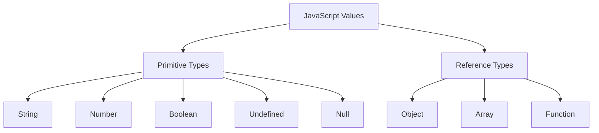
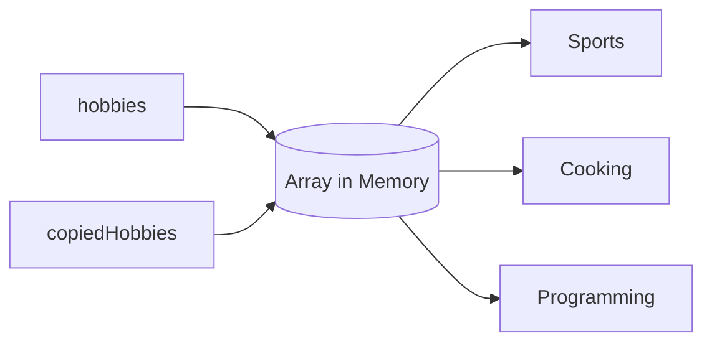
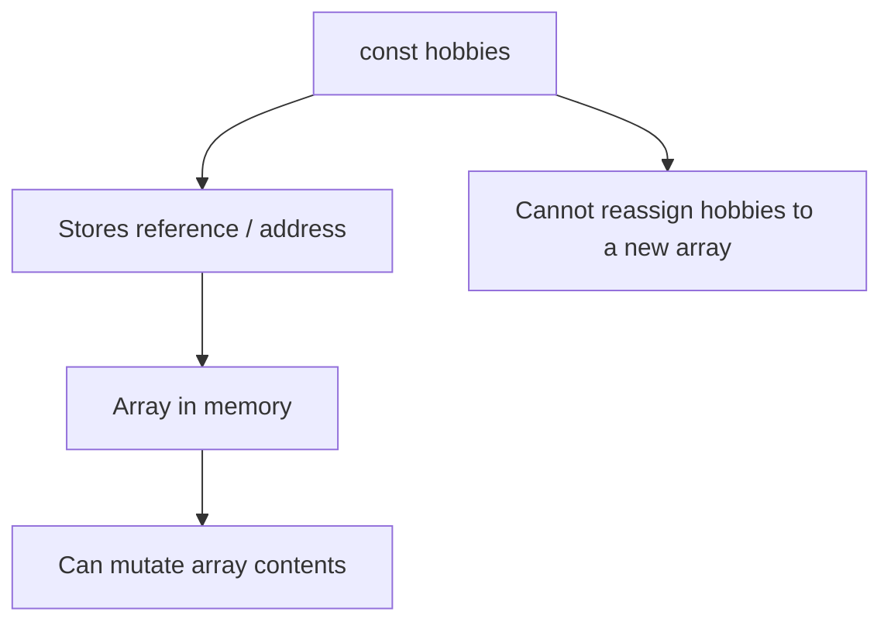
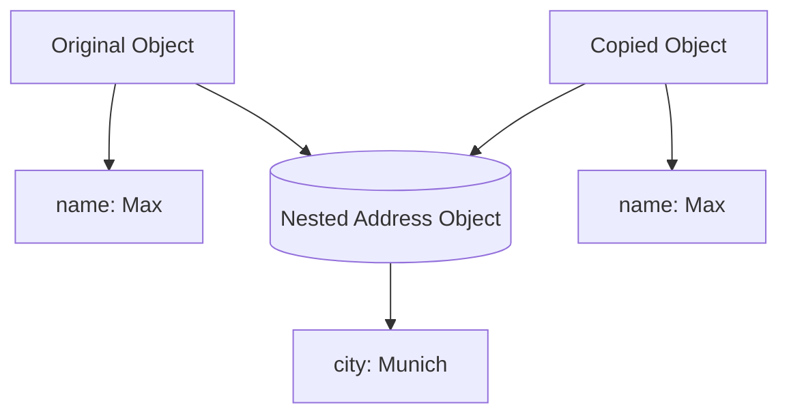
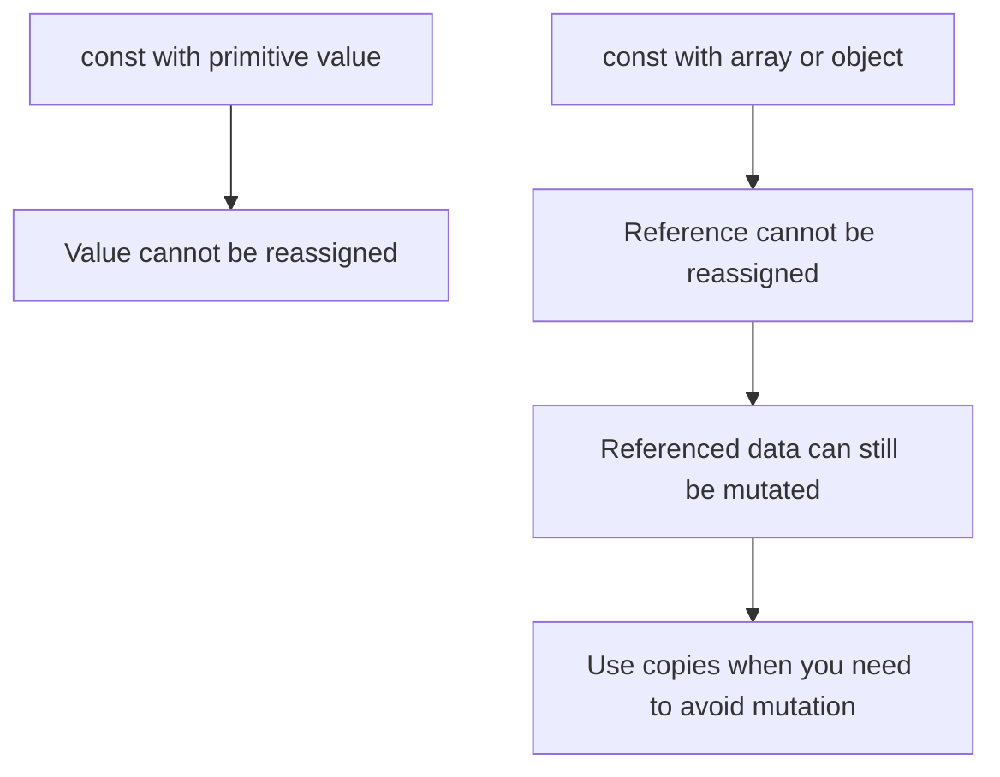

# 008 - Arrays, Objects & Reference Types

## Section

Optional: JavaScript - A Quick Refresher

## Duration

2 minutes

---

## Main Idea

This lesson explains an important JavaScript concept: **arrays and objects are reference types**.

This means that when an array or object is stored in a variable, the variable does not directly store the full array or object. Instead, it stores a reference, or pointer, to the location in memory where that array or object exists.

This concept also explains why an array declared with `const` can still be changed with methods like `push()`.

---

## Learning Objectives

By the end of this lesson, you should be able to:

* Understand what reference types are.
* Explain why arrays and objects are reference types.
* Understand why `const` does not make arrays or objects fully immutable.
* Use `push()` to add data to an array declared with `const`.
* Explain the difference between changing a reference and changing the value behind the reference.
* Recognize common bugs caused by copying object or array references.
* Create shallow copies of arrays and objects when needed.

---

## Key Points

* Primitive values are copied directly.
* Objects and arrays are reference types.
* A `const` variable cannot be reassigned.
* A `const` array or object can still be mutated.
* Methods like `push()` change the existing array.
* Assigning an object or array to another variable copies the reference, not the full value.
* Use spread syntax, `slice()`, or `Object.assign()` to create shallow copies.
* Shallow copies do not deeply clone nested objects or arrays.

---

## Primitive Types vs Reference Types



---

## 1. Primitive Values

Primitive values are simple values such as strings, numbers, and booleans.

Example:

```js id="primitive-example"
let age = 29;
let copiedAge = age;

copiedAge = 30;

console.log(age);
console.log(copiedAge);
```

Expected output:

```txt id="primitive-output"
29
30
```

Changing `copiedAge` does not change `age`, because the primitive value was copied directly.

---

## 2. Reference Values

Objects and arrays are reference types.

Example:

```js id="reference-example"
const hobbies = ["Sports", "Cooking"];

const copiedHobbies = hobbies;

copiedHobbies.push("Programming");

console.log(hobbies);
console.log(copiedHobbies);
```

Expected output:

```txt id="reference-output"
[ 'Sports', 'Cooking', 'Programming' ]
[ 'Sports', 'Cooking', 'Programming' ]
```

Both `hobbies` and `copiedHobbies` point to the same array in memory.

---

## Reference Type Diagram



The variables are different names, but they point to the same array.

---

## 3. Why Can a `const` Array Be Changed?

A common misconception is that `const` makes an array impossible to change.

That is not exactly true.

`const` prevents reassignment of the variable, but it does not prevent mutation of the array or object behind the reference.

Example:

```js id="const-array-mutation"
const hobbies = ["Sports", "Cooking"];

hobbies.push("Programming");

console.log(hobbies);
```

Expected output:

```txt id="const-array-mutation-output"
[ 'Sports', 'Cooking', 'Programming' ]
```

This works because the variable `hobbies` still points to the same array. The reference did not change.

---

## What `const` Actually Protects



---

## 4. Reassignment Is Not Allowed with `const`

This causes an error:

```js id="const-reassignment-error"
const hobbies = ["Sports", "Cooking"];

hobbies = ["Programming", "Reading"];
```

Possible error:

```txt id="const-reassignment-output"
TypeError: Assignment to constant variable.
```

Why?

Because this code tries to replace the reference stored in `hobbies` with a new reference.

That is not allowed when using `const`.

---

## Mutation vs Reassignment

| Action                 | Example                       | Allowed with `const`? | Reason                |
| ---------------------- | ----------------------------- | --------------------- | --------------------- |
| Mutate array           | `hobbies.push("Programming")` | Yes                   | Same array reference  |
| Reassign array         | `hobbies = ["Reading"]`       | No                    | New array reference   |
| Mutate object property | `person.name = "Anna"`        | Yes                   | Same object reference |
| Reassign object        | `person = { name: "Anna" }`   | No                    | New object reference  |

---

## 5. Object Reference Example

Objects behave the same way as arrays.

```js id="object-reference-example"
const person = {
  name: "Max",
};

person.name = "Anna";

console.log(person.name);
```

Expected output:

```txt id="object-reference-output"
Anna
```

This works because the object itself is still the same object in memory.

But this does not work:

```js id="object-reassignment-error"
const person = {
  name: "Max",
};

person = {
  name: "Anna",
};
```

This tries to assign a new object to the `person` constant.

---

## 6. Copying References Can Cause Bugs

This code does not create a real copy:

```js id="bad-array-copy"
const hobbies = ["Sports", "Cooking"];

const copiedHobbies = hobbies;

copiedHobbies.push("Programming");

console.log(hobbies);
```

Expected output:

```txt id="bad-array-copy-output"
[ 'Sports', 'Cooking', 'Programming' ]
```

The original array changed because `copiedHobbies` and `hobbies` point to the same array.

---

## 7. Creating a Shallow Copy of an Array

To create a new array, use the spread operator:

```js id="array-copy-spread"
const hobbies = ["Sports", "Cooking"];

const copiedHobbies = [...hobbies];

copiedHobbies.push("Programming");

console.log(hobbies);
console.log(copiedHobbies);
```

Expected output:

```txt id="array-copy-spread-output"
[ 'Sports', 'Cooking' ]
[ 'Sports', 'Cooking', 'Programming' ]
```

Now the original array stays unchanged.

You can also use `slice()`:

```js id="array-copy-slice"
const hobbies = ["Sports", "Cooking"];

const copiedHobbies = hobbies.slice();
```

---

## 8. Creating a Shallow Copy of an Object

To copy an object, use the spread operator:

```js id="object-copy-spread"
const person = {
  name: "Max",
  age: 29,
};

const copiedPerson = {
  ...person,
};

copiedPerson.name = "Anna";

console.log(person.name);
console.log(copiedPerson.name);
```

Expected output:

```txt id="object-copy-spread-output"
Max
Anna
```

You can also use `Object.assign()`:

```js id="object-copy-assign"
const copiedPerson = Object.assign({}, person);
```

---

## 9. Shallow Copy Warning

Spread syntax creates a **shallow copy**, not a deep copy.

Example:

```js id="shallow-copy-warning"
const person = {
  name: "Max",
  address: {
    city: "Berlin",
  },
};

const copiedPerson = {
  ...person,
};

copiedPerson.address.city = "Munich";

console.log(person.address.city);
```

Expected output:

```txt id="shallow-copy-warning-output"
Munich
```

The top-level object was copied, but the nested `address` object was still shared.

---

## Shallow Copy Diagram



Both objects still point to the same nested object.

---

## 10. Complete Example

Create a file called `play.js`:

```js id="complete-example"
const hobbies = ["Sports", "Cooking"];

hobbies.push("Programming");

console.log(hobbies);

const copiedHobbies = [...hobbies];

copiedHobbies.push("Reading");

console.log("Original:", hobbies);
console.log("Copy:", copiedHobbies);
```

Run it with:

```bash id="run-example"
node play.js
```

Expected output:

```txt id="complete-output"
[ 'Sports', 'Cooking', 'Programming' ]
Original: [ 'Sports', 'Cooking', 'Programming' ]
Copy: [ 'Sports', 'Cooking', 'Programming', 'Reading' ]
```

---

## Why This Matters for Node.js

Reference types are very important in Node.js because backend applications often work with arrays and objects.

You will often handle:

* Request objects
* Response objects
* User objects
* Product arrays
* Database result arrays
* Configuration objects
* Middleware arrays
* Route handler objects

If you accidentally mutate shared data, you can create bugs that are difficult to find.

Example:

```js id="node-reference-example"
const users = [
  { name: "Max" },
  { name: "Anna" },
];

const copiedUsers = users;

copiedUsers.push({ name: "Manuel" });

console.log(users);
```

Expected output:

```txt id="node-reference-output"
[ { name: 'Max' }, { name: 'Anna' }, { name: 'Manuel' } ]
```

The original `users` array changed because no real copy was created.

---

## Safer Backend Example

```js id="safe-backend-example"
const users = [
  { name: "Max" },
  { name: "Anna" },
];

const copiedUsers = [...users];

copiedUsers.push({ name: "Manuel" });

console.log("Original:", users);
console.log("Copy:", copiedUsers);
```

Expected output:

```txt id="safe-backend-output"
Original: [ { name: 'Max' }, { name: 'Anna' } ]
Copy: [ { name: 'Max' }, { name: 'Anna' }, { name: 'Manuel' } ]
```

This is safer because the array itself was copied.

---

## Mental Model



---

## Practice Task

Create a file called `app.js`.

Inside it:

1. Create a `const` array called `products`.
2. Add two product names.
3. Use `push()` to add another product.
4. Print the array.
5. Create a shallow copy with the spread operator.
6. Add a new product to the copied array.
7. Print both arrays.

Example solution:

```js id="practice-solution"
const products = ["Laptop", "Mouse"];

products.push("Keyboard");

console.log("Original after push:", products);

const copiedProducts = [...products];

copiedProducts.push("Monitor");

console.log("Original:", products);
console.log("Copy:", copiedProducts);
```

Expected output:

```txt id="practice-output"
Original after push: [ 'Laptop', 'Mouse', 'Keyboard' ]
Original: [ 'Laptop', 'Mouse', 'Keyboard' ]
Copy: [ 'Laptop', 'Mouse', 'Keyboard', 'Monitor' ]
```

---

## Mini Challenge

Predict the output:

```js id="mini-challenge"
const person = {
  name: "Max",
};

const anotherPerson = person;

anotherPerson.name = "Anna";

console.log(person.name);
```

Answer:

```txt id="mini-challenge-answer"
Anna
```

Explanation:

`anotherPerson` and `person` point to the same object in memory.

---

## Review Questions

1. What is a reference type in JavaScript?
2. Why are arrays and objects called reference types?
3. What does a `const` variable store when it holds an array?
4. Why can you use `push()` on an array declared with `const`?
5. What is the difference between mutation and reassignment?
6. Why does assigning an array to another variable not create a real copy?
7. How can you create a shallow copy of an array?
8. How can you create a shallow copy of an object?
9. What is the limitation of shallow copies?
10. Why is understanding reference types important in Node.js?

---

## Summary

This lesson explains that arrays and objects are reference types in JavaScript.

When you store an array or object in a variable, the variable stores a reference to the data in memory. If the variable is declared with `const`, the reference cannot be reassigned, but the data behind the reference can still be changed.

That is why this works:

```js id="summary-example"
const hobbies = ["Sports", "Cooking"];

hobbies.push("Programming");
```

The array is mutated, but the reference stored in `hobbies` remains the same.

Understanding reference types is essential for writing reliable JavaScript and Node.js code, especially when working with shared data, arrays of objects, request data, and database results.
