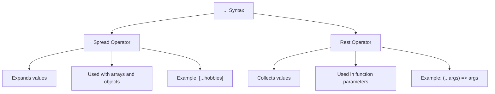
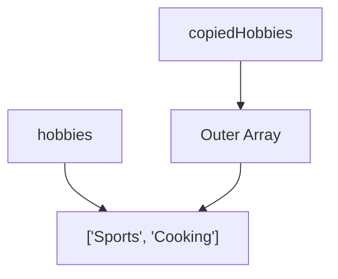
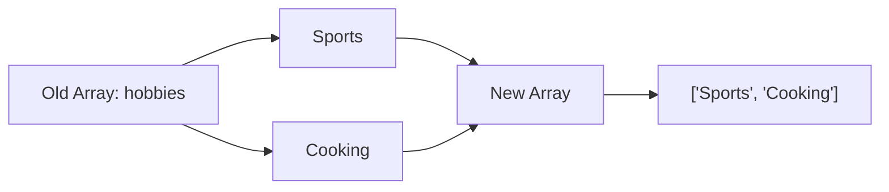
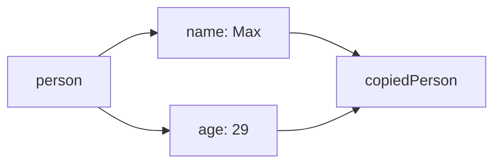
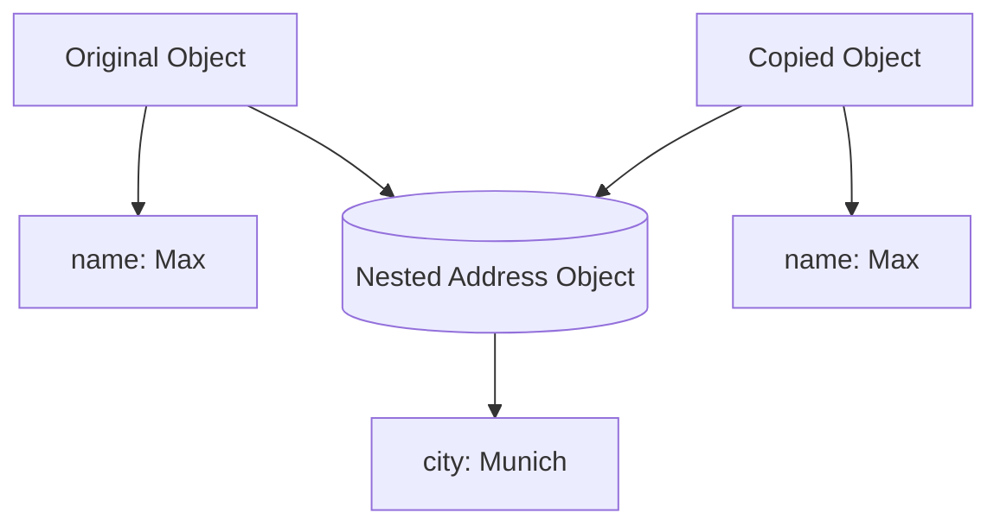
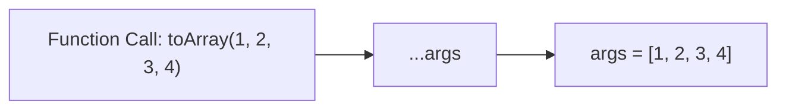
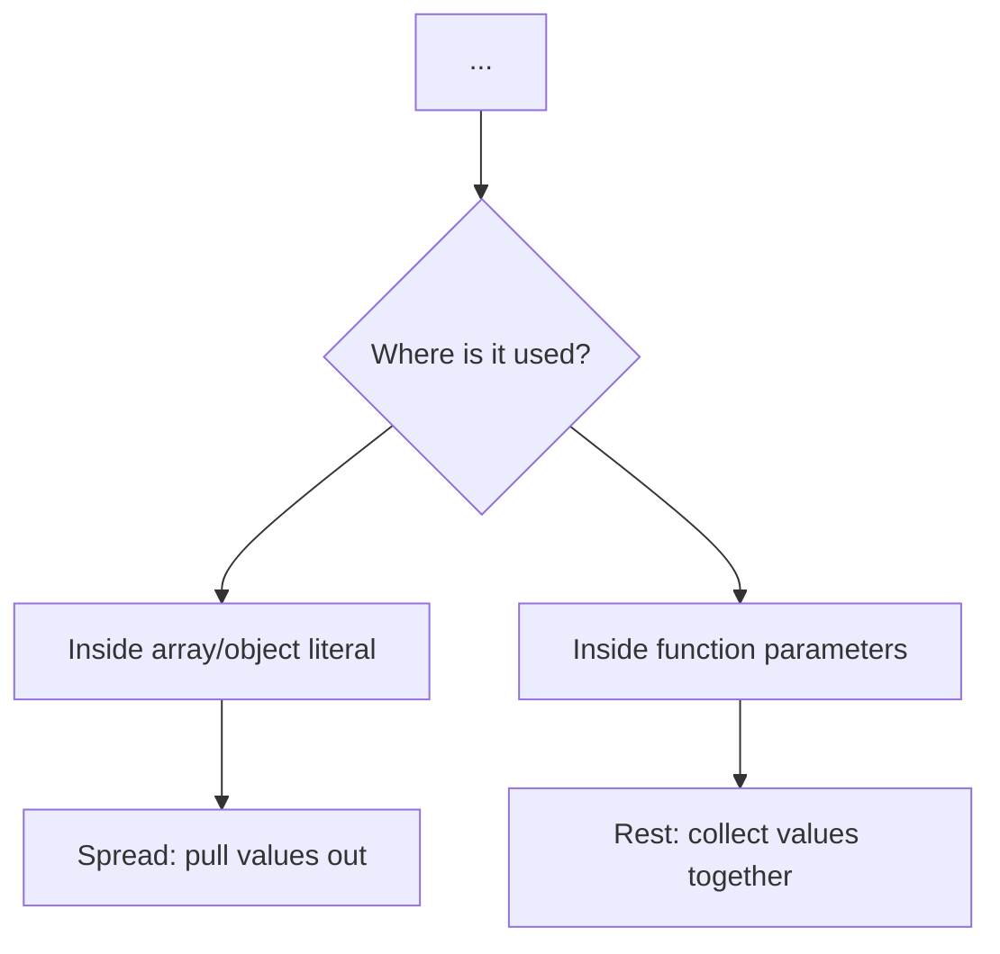

# 009 - Understanding Spread & Rest Operators

## Section

Optional: JavaScript - A Quick Refresher

## Duration

7 minutes

---

## Main Idea

This lesson explains two important modern JavaScript features: the **spread operator** and the **rest operator**.

Both use the same syntax:

```js
...
```

However, they are used in different places and serve different purposes.

* The **spread operator** expands arrays or objects.
* The **rest operator** collects multiple values into an array.

The spread operator is especially important because it is commonly used to copy arrays and objects without directly mutating the original data.

---

## Learning Objectives

By the end of this lesson, you should be able to:

* Understand what the spread operator does.
* Use spread syntax to copy arrays.
* Use spread syntax to copy objects.
* Understand why `[hobbies]` creates a nested array.
* Understand how `[...hobbies]` creates a copied array.
* Use the rest operator to collect multiple function arguments.
* Explain the difference between spread and rest syntax.
* Understand why spread syntax supports immutable coding patterns.

---

## Key Points

* Spread and rest use the same `...` syntax.
* Spread expands arrays or objects into individual elements or properties.
* Rest collects multiple function arguments into one array.
* Spread is commonly used to copy arrays and objects.
* `[hobbies]` creates a nested array, not a copy.
* `[...hobbies]` creates a shallow copy of the array.
* `{ ...person }` creates a shallow copy of the object.
* Rest syntax is useful when a function should accept any number of arguments.
* Spread helps support immutability by creating copies instead of changing original data.

---

## Spread vs Rest Overview



---

## 1. Why Copy Arrays?

In JavaScript, arrays are reference types. If you directly edit an existing array, other parts of your code may also be affected.

Instead of mutating the original array, a common pattern is:

1. Copy the old array.
2. Add or change data in the copy.
3. Keep the original array unchanged.

This pattern is often called **immutability**.

---

## 2. Copying an Array with `slice()`

Before using spread syntax, you can copy an array with `slice()`.

```js
const hobbies = ["Sports", "Cooking"];

const copiedHobbies = hobbies.slice();

console.log(copiedHobbies);
```

Expected output:

```txt
[ 'Sports', 'Cooking' ]
```

Calling `slice()` without arguments copies the full array.

---

## 3. The Nested Array Problem

This code may look like it copies the array:

```js
const hobbies = ["Sports", "Cooking"];

const copiedHobbies = [hobbies];

console.log(copiedHobbies);
```

Expected output:

```txt
[ [ 'Sports', 'Cooking' ] ]
```

This is **not** a real copy of the array elements.

Instead, it creates a new outer array where the first element is the original `hobbies` array.

---

## Nested Array Diagram



The result is an array inside another array.

---

## 4. Copying an Array with the Spread Operator

The spread operator solves this problem.

```js
const hobbies = ["Sports", "Cooking"];

const copiedHobbies = [...hobbies];

console.log(copiedHobbies);
```

Expected output:

```txt
[ 'Sports', 'Cooking' ]
```

The spread operator pulls out the elements from the old array and places them into a new array.

---

## How Array Spread Works



This creates a new array with the same top-level elements.

---

## 5. Adding a New Item Without Mutating the Original Array

Without spread, you might mutate the original array:

```js
const hobbies = ["Sports", "Cooking"];

hobbies.push("Programming");

console.log(hobbies);
```

Expected output:

```txt
[ 'Sports', 'Cooking', 'Programming' ]
```

With spread, you can create a new array instead:

```js
const hobbies = ["Sports", "Cooking"];

const updatedHobbies = [...hobbies, "Programming"];

console.log(updatedHobbies);
console.log(hobbies);
```

Expected output:

```txt
[ 'Sports', 'Cooking', 'Programming' ]
[ 'Sports', 'Cooking' ]
```

The original array stays unchanged.

---

## 6. Copying Objects with the Spread Operator

Spread syntax also works with objects.

```js
const person = {
  name: "Max",
  age: 29,
};

const copiedPerson = {
  ...person,
};

console.log(copiedPerson);
```

Expected output:

```txt
{ name: 'Max', age: 29 }
```

The spread operator pulls out the properties from the old object and adds them to a new object.

---

## Object Spread Diagram



---

## 7. Updating an Object Copy

Spread syntax is often used to copy an object and change one property.

```js
const person = {
  name: "Max",
  age: 29,
};

const updatedPerson = {
  ...person,
  age: 30,
};

console.log(updatedPerson);
console.log(person);
```

Expected output:

```txt
{ name: 'Max', age: 30 }
{ name: 'Max', age: 29 }
```

The original object remains unchanged.

---

## 8. Important Note: Spread Creates a Shallow Copy

Spread syntax creates a **shallow copy**.

That means it copies the top-level array or object, but nested objects or arrays may still share references.

Example:

```js
const person = {
  name: "Max",
  address: {
    city: "Berlin",
  },
};

const copiedPerson = {
  ...person,
};

copiedPerson.address.city = "Munich";

console.log(person.address.city);
```

Expected output:

```txt
Munich
```

The nested `address` object is still shared.

---

## Shallow Copy Diagram



---

## 9. The Rest Operator

The rest operator also uses `...`, but it works differently.

Rest syntax collects multiple values into one array.

Example:

```js
const toArray = (...args) => {
  return args;
};

console.log(toArray(1, 2, 3, 4));
```

Expected output:

```txt
[ 1, 2, 3, 4 ]
```

Here, `args` becomes an array containing all arguments passed into the function.

---

## 10. Why Rest Is Useful

Without rest syntax, a function has a fixed number of parameters:

```js
const toArray = (arg1, arg2, arg3) => {
  return [arg1, arg2, arg3];
};

console.log(toArray(1, 2, 3));
```

Expected output:

```txt
[ 1, 2, 3 ]
```

But this is not flexible. If you pass a fourth argument, it will be ignored:

```js
console.log(toArray(1, 2, 3, 4));
```

The function only handles three parameters.

With rest syntax:

```js
const toArray = (...args) => args;

console.log(toArray(1, 2, 3, 4));
console.log(toArray("Max", "Anna", "Manuel"));
```

Expected output:

```txt
[ 1, 2, 3, 4 ]
[ 'Max', 'Anna', 'Manuel' ]
```

---

## Rest Operator Diagram



---

## 11. Spread vs Rest: Same Syntax, Different Meaning

The syntax is the same, but the meaning depends on where it is used.

| Operator Name | Where It Is Used        | What It Does       | Example             |
| ------------- | ----------------------- | ------------------ | ------------------- |
| Spread        | Array or object literal | Expands values     | `[...hobbies]`      |
| Spread        | Function call           | Expands arguments  | `sum(...numbers)`   |
| Rest          | Function parameters     | Collects arguments | `(...args) => args` |

---

## Spread vs Rest Mental Model



---

## 12. Complete Example

Create a file called `play.js`:

```js
const hobbies = ["Sports", "Cooking"];

const copiedHobbies = [...hobbies];
const updatedHobbies = [...hobbies, "Programming"];

console.log("Copied hobbies:", copiedHobbies);
console.log("Updated hobbies:", updatedHobbies);
console.log("Original hobbies:", hobbies);

const person = {
  name: "Max",
  age: 29,
};

const copiedPerson = {
  ...person,
};

console.log("Copied person:", copiedPerson);

const toArray = (...args) => args;

console.log(toArray(1, 2, 3, 4));
```

Run it with:

```bash
node play.js
```

Expected output:

```txt
Copied hobbies: [ 'Sports', 'Cooking' ]
Updated hobbies: [ 'Sports', 'Cooking', 'Programming' ]
Original hobbies: [ 'Sports', 'Cooking' ]
Copied person: { name: 'Max', age: 29 }
[ 1, 2, 3, 4 ]
```

---

## Why This Matters for Node.js

Spread and rest syntax are common in Node.js projects.

You may use spread to:

* Copy request data
* Copy response objects
* Add items to arrays without mutating the original array
* Merge configuration objects
* Update user or product objects
* Build new arrays from database results

Example:

```js
const defaultConfig = {
  port: 3000,
  host: "localhost",
};

const productionConfig = {
  ...defaultConfig,
  host: "myserver.com",
};

console.log(productionConfig);
```

Expected output:

```txt
{ port: 3000, host: 'myserver.com' }
```

You may use rest to:

* Accept flexible function arguments
* Build helper utilities
* Collect unknown numbers of values

Example:

```js
const sum = (...numbers) => {
  return numbers.reduce((total, number) => total + number, 0);
};

console.log(sum(1, 2, 3, 4));
```

Expected output:

```txt
10
```

---

## Practice Task

Create a file called `app.js`.

Inside it:

1. Create an array called `products`.
2. Use spread syntax to create a copied array.
3. Add a new product to the copied array.
4. Print both arrays.
5. Create a function called `toArray` using rest syntax.
6. Pass several values into it and print the result.

Example solution:

```js
const products = ["Laptop", "Mouse"];

const updatedProducts = [...products, "Keyboard"];

console.log("Original:", products);
console.log("Updated:", updatedProducts);

const toArray = (...items) => items;

console.log(toArray("Node.js", "Express", "MongoDB"));
```

Expected output:

```txt
Original: [ 'Laptop', 'Mouse' ]
Updated: [ 'Laptop', 'Mouse', 'Keyboard' ]
[ 'Node.js', 'Express', 'MongoDB' ]
```

---

## Mini Challenge

Predict the output:

```js
const hobbies = ["Sports", "Cooking"];

const copiedHobbies = [hobbies];

console.log(copiedHobbies);
```

Answer:

```txt
[ [ 'Sports', 'Cooking' ] ]
```

Explanation:

`[hobbies]` creates a new array that contains the old array as its first element.

Correct copy:

```js
const copiedHobbies = [...hobbies];
```

---

## Extra Practice

### 1. Copy an Array

```js
const numbers = [1, 2, 3];

const copiedNumbers = [...numbers];

console.log(copiedNumbers);
```

### 2. Add a Value Immutably

```js
const numbers = [1, 2, 3];

const updatedNumbers = [...numbers, 4];

console.log(updatedNumbers);
console.log(numbers);
```

### 3. Copy and Update an Object

```js
const user = {
  name: "Max",
  role: "student",
};

const updatedUser = {
  ...user,
  role: "developer",
};

console.log(updatedUser);
console.log(user);
```

### 4. Use Rest Parameters

```js
const collectNames = (...names) => names;

console.log(collectNames("Max", "Anna", "Manuel"));
```

---

## Review Questions

1. What syntax is used for both spread and rest?
2. What does the spread operator do?
3. What does the rest operator do?
4. Why does `[hobbies]` create a nested array?
5. Why does `[...hobbies]` create a copied array?
6. How do you copy an object with spread syntax?
7. What is immutability?
8. Why is immutability useful in JavaScript?
9. What does `(...args)` mean in a function parameter list?
10. How can you tell whether `...` is being used as spread or rest?
11. What is the limitation of spread syntax when copying nested objects?
12. Why are spread and rest useful in Node.js?

---

## Summary

This lesson introduces the spread and rest operators in modern JavaScript.

The **spread operator** expands arrays or objects. It is commonly used to copy arrays and objects or to create updated versions without mutating the original data.

Example:

```js
const copiedHobbies = [...hobbies];
const copiedPerson = { ...person };
```

The **rest operator** collects multiple function arguments into an array.

Example:

```js
const toArray = (...args) => args;
```

Both operators use the same `...` syntax. The difference depends on where the syntax is used. If it expands values, it is spread. If it collects values, it is rest.

Understanding spread and rest is important because these patterns appear frequently in modern JavaScript and Node.js code.
