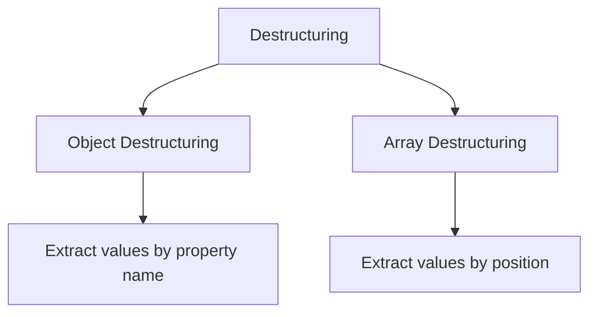
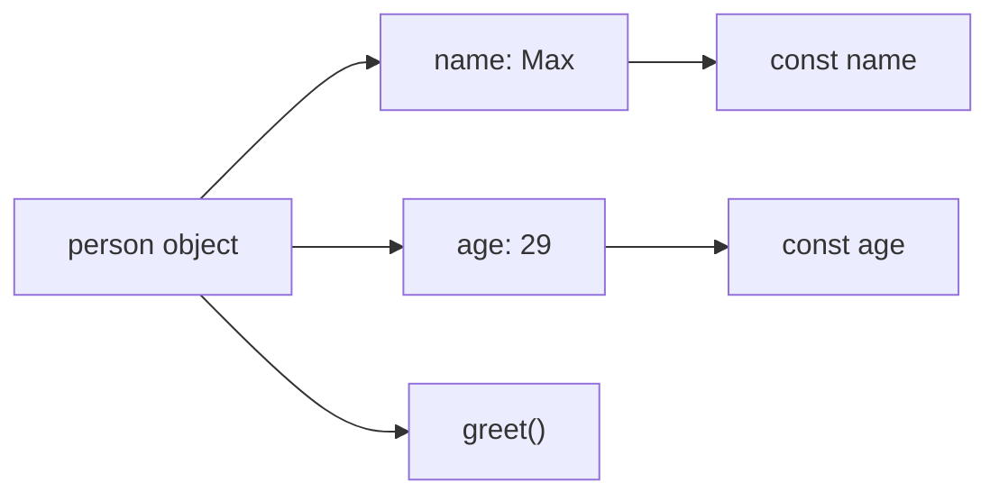
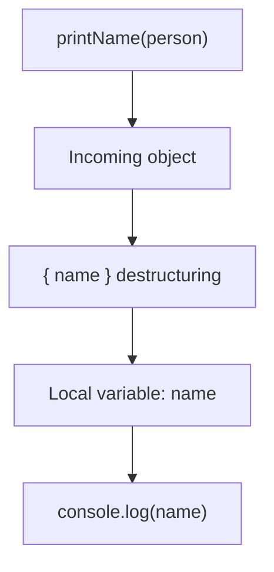
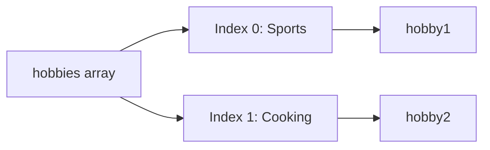
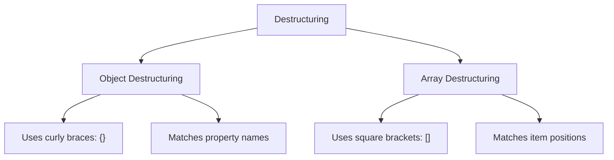
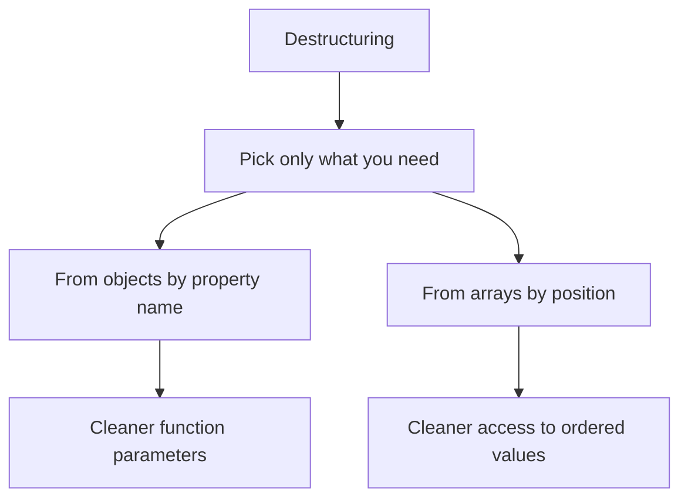

# 010 - Destructuring

## Section

Optional: JavaScript - A Quick Refresher

## Duration

6 minutes

---

## Main Idea

This lesson introduces **destructuring**, a modern JavaScript feature that allows you to extract values from objects or arrays more easily.

Instead of manually accessing values like this:

```js
person.name
person.age
```

You can pull out the values you need directly:

```js
const { name, age } = person;
```

Destructuring helps make code shorter, clearer, and more focused on the data that is actually needed.

---

## Learning Objectives

By the end of this lesson, you should be able to:

* Understand what destructuring means in JavaScript.
* Use object destructuring to extract properties from an object.
* Use destructuring directly in function parameters.
* Use array destructuring to extract values by position.
* Understand the difference between object destructuring and array destructuring.
* Recognize that destructuring does not delete unused data.
* Apply destructuring in small Node.js examples.

---

## What Is Destructuring?

Destructuring means extracting values from arrays or objects and storing them in variables.

There are two common forms:



---

## 1. Object Destructuring

Suppose you have this object:

```js
const person = {
  name: "Max",
  age: 29,
  greet() {
    console.log("Hi, I am " + this.name);
  },
};
```

Without destructuring, you access properties like this:

```js
console.log(person.name);
console.log(person.age);
```

With destructuring, you can write:

```js
const { name, age } = person;

console.log(name);
console.log(age);
```

Expected output:

```txt
Max
29
```

---

## Object Destructuring Diagram



Object destructuring extracts values by **property name**.

---

## 2. Object Destructuring in Function Parameters

Before destructuring, a function might receive a full object and access one property manually:

```js
const person = {
  name: "Max",
  age: 29,
};

const printName = personData => {
  console.log(personData.name);
};

printName(person);
```

Expected output:

```txt
Max
```

This works, but the function only needs the `name` property.

With destructuring, you can write:

```js
const person = {
  name: "Max",
  age: 29,
};

const printName = ({ name }) => {
  console.log(name);
};

printName(person);
```

Expected output:

```txt
Max
```

Here, JavaScript extracts the `name` property from the incoming object and creates a local variable called `name`.

---

## Function Parameter Destructuring Flow



---

## 3. Why Use Destructuring in Function Parameters?

Destructuring makes the function clearer.

Instead of this:

```js
const printName = personData => {
  console.log(personData.name);
};
```

You can write this:

```js
const printName = ({ name }) => {
  console.log(name);
};
```

This tells the reader immediately:

> This function expects an object, but it only needs the `name` property.

This is useful when:

* A function receives a large object.
* You only need one or two properties.
* A third-party package gives you an object.
* You want to make function inputs clearer.

---

## 4. Destructuring Multiple Object Properties

You can extract more than one property:

```js
const person = {
  name: "Max",
  age: 29,
  hasHobbies: true,
};

const { name, age, hasHobbies } = person;

console.log(name);
console.log(age);
console.log(hasHobbies);
```

Expected output:

```txt
Max
29
true
```

The variable names must match the object property names.

---

## Important Rule for Object Destructuring

With object destructuring, property names matter.

```js
const person = {
  name: "Max",
  age: 29,
};

const { name } = person;
```

This works because `name` exists as a property on `person`.

But this gives `undefined`:

```js
const { userName } = person;

console.log(userName);
```

Expected output:

```txt
undefined
```

Why?

Because there is no `userName` property in the object.

---

## 5. Destructuring Outside a Function

Destructuring can also be used outside function parameters.

```js
const person = {
  name: "Max",
  age: 29,
};

const { name, age } = person;

console.log(name, age);
```

Expected output:

```txt
Max 29
```

At first, this syntax may look unusual:

```js
const { name, age } = person;
```

But it simply means:

> Create constants named `name` and `age` from the matching properties inside `person`.

---

## 6. Array Destructuring

Destructuring also works with arrays.

Suppose you have this array:

```js
const hobbies = ["Sports", "Cooking"];
```

You can extract the first and second values like this:

```js
const [hobby1, hobby2] = hobbies;

console.log(hobby1);
console.log(hobby2);
```

Expected output:

```txt
Sports
Cooking
```

---

## Array Destructuring Diagram



Array destructuring extracts values by **position**.

---

## 7. Object vs Array Destructuring

| Type                 | Syntax     | Extraction Rule  | Example                     |
| -------------------- | ---------- | ---------------- | --------------------------- |
| Object destructuring | `{ name }` | By property name | `const { name } = person;`  |
| Array destructuring  | `[hobby1]` | By position      | `const [hobby1] = hobbies;` |

---

## Object vs Array Destructuring Diagram



---

## 8. Array Destructuring Names Are Flexible

In object destructuring, names must match property names.

In array destructuring, you can choose any variable names because array values are extracted by position.

```js
const hobbies = ["Sports", "Cooking"];

const [firstHobby, secondHobby] = hobbies;

console.log(firstHobby);
console.log(secondHobby);
```

Expected output:

```txt
Sports
Cooking
```

This also works:

```js
const [a, b] = hobbies;

console.log(a);
console.log(b);
```

Expected output:

```txt
Sports
Cooking
```

---

## 9. Destructuring Does Not Delete Data

When you destructure an object or array, unused values are not deleted.

Example:

```js
const person = {
  name: "Max",
  age: 29,
  hasHobbies: true,
};

const { name } = person;

console.log(name);
console.log(person);
```

Expected output:

```txt
Max
{ name: 'Max', age: 29, hasHobbies: true }
```

The `age` and `hasHobbies` properties still exist. They are simply not used in that destructuring statement.

---

## 10. Complete Example

Create a file called `play.js`:

```js
const person = {
  name: "Max",
  age: 29,
  greet() {
    console.log("Hi, I am " + this.name);
  },
};

const printName = ({ name }) => {
  console.log(name);
};

printName(person);

const { name, age } = person;

console.log(name);
console.log(age);

const hobbies = ["Sports", "Cooking"];

const [hobby1, hobby2] = hobbies;

console.log(hobby1);
console.log(hobby2);
```

Run it with:

```bash
node play.js
```

Expected output:

```txt
Max
Max
29
Sports
Cooking
```

---

## Why This Matters for Node.js

Destructuring is common in Node.js because backend code often works with objects.

For example, request data often comes as an object:

```js
const requestBody = {
  title: "Node.js Course",
  price: 99,
};
```

Instead of writing:

```js
const title = requestBody.title;
const price = requestBody.price;
```

You can write:

```js
const { title, price } = requestBody;
```

This makes the code shorter and clearer.

---

## Practical Backend Example

```js
const createProduct = ({ title, price }) => {
  return {
    title: title,
    price: price,
    createdAt: new Date().toISOString(),
  };
};

const productData = {
  title: "Laptop",
  price: 1200,
  isAvailable: true,
};

const product = createProduct(productData);

console.log(product);
```

Expected output:

```txt
{
  title: 'Laptop',
  price: 1200,
  createdAt: '...'
}
```

The function receives the full object, but only extracts `title` and `price`.

---

## Common Destructuring Patterns

### Extract Object Properties

```js
const { name, age } = person;
```

### Destructure in Function Parameters

```js
const printName = ({ name }) => {
  console.log(name);
};
```

### Extract Array Values

```js
const [firstHobby, secondHobby] = hobbies;
```

### Ignore Some Array Values

```js
const [firstHobby] = hobbies;
```

Only the first value is extracted.

---

## Mental Model



---

## Practice Task

Create a file called `app.js`.

Inside it:

1. Create an object called `product`.
2. Add properties:

   * `title`
   * `price`
   * `category`
3. Use object destructuring to extract `title` and `price`.
4. Create an array called `tags`.
5. Use array destructuring to extract the first two tags.
6. Print all extracted values.

Example solution:

```js
const product = {
  title: "Laptop",
  price: 1200,
  category: "Electronics",
};

const { title, price } = product;

console.log(title);
console.log(price);

const tags = ["New", "Popular", "Discounted"];

const [firstTag, secondTag] = tags;

console.log(firstTag);
console.log(secondTag);
```

Expected output:

```txt
Laptop
1200
New
Popular
```

---

## Mini Challenge

Rewrite this code using destructuring:

```js
const user = {
  name: "Anna",
  age: 24,
};

const userName = user.name;
const userAge = user.age;

console.log(userName, userAge);
```

Solution:

```js
const user = {
  name: "Anna",
  age: 24,
};

const { name, age } = user;

console.log(name, age);
```

Expected output:

```txt
Anna 24
```

---

## Extra Practice

### 1. Destructure a User Object

```js
const user = {
  id: 1,
  name: "Max",
  email: "max@example.com",
};

const { name, email } = user;

console.log(name);
console.log(email);
```

### 2. Destructure Function Parameters

```js
const printUser = ({ name, email }) => {
  console.log(name + " - " + email);
};

printUser({
  name: "Anna",
  email: "anna@example.com",
});
```

### 3. Destructure an Array

```js
const colors = ["red", "green", "blue"];

const [primaryColor, secondaryColor] = colors;

console.log(primaryColor);
console.log(secondaryColor);
```

---

## Review Questions

1. What is destructuring in JavaScript?
2. What syntax is used for object destructuring?
3. What syntax is used for array destructuring?
4. How does object destructuring choose which values to extract?
5. How does array destructuring choose which values to extract?
6. Why is destructuring useful in function parameters?
7. Does destructuring delete unused properties?
8. Why must object destructuring names match property names?
9. Why can array destructuring variable names be anything?
10. How is destructuring useful in Node.js?

---

## Summary

This lesson introduces destructuring in JavaScript.

Destructuring allows you to extract values from objects and arrays in a shorter and clearer way. With object destructuring, values are extracted by property name. With array destructuring, values are extracted by position.

Example:

```js
const { name, age } = person;
const [hobby1, hobby2] = hobbies;
```

Destructuring is especially useful in function parameters because it makes clear which parts of an incoming object the function actually needs.

This feature is used frequently in modern JavaScript and Node.js code, especially when working with request data, configuration objects, database results, and arrays of values.

---

# Bài luyện tập

## Mục tiêu


## Đề bài


## Yêu cầu hoàn thành

- [ ] 
- [ ] 
- [ ] 

## Kết quả / lời giải


## Ghi chú
