# 011 - Async Code & Promises

## Section

Optional: JavaScript - A Quick Refresher

## Duration

11 minutes

---

## Main Idea

This lesson introduces **asynchronous code** and **Promises**, two core concepts in JavaScript and Node.js.

Synchronous code runs line by line, one statement after another. Asynchronous code starts a task that may finish later, while JavaScript continues executing the rest of the program.

Promises help manage asynchronous code in a cleaner way than deeply nested callbacks.

---

## Learning Objectives

By the end of this lesson, you should be able to:

* Understand the difference between synchronous and asynchronous code.
* Use `setTimeout()` to simulate asynchronous behavior.
* Explain what a callback function is.
* Understand why callback nesting can become hard to read.
* Create and return a Promise.
* Use `.then()` to handle resolved Promise values.
* Chain multiple Promise-based operations.
* Understand the basic idea of `resolve` and `reject`.
* Recognize why asynchronous code is essential in Node.js.

---

## Key Points

* Synchronous code runs immediately, line by line.
* Asynchronous code does not finish immediately.
* Node.js can continue executing other code while waiting for async work to finish.
* A callback is a function that runs later.
* Callbacks can become hard to manage when async tasks depend on each other.
* Promises represent work that will finish later.
* A Promise can resolve successfully or reject with an error.
* `.then()` runs when a Promise resolves.
* Promise chaining is usually easier to read than nested callbacks.
* `async` and `await` are modern tools for working with Promises, but this lesson focuses mainly on `.then()`.

---

## 1. Synchronous Code

Synchronous code runs from top to bottom.

```js id="sync-code"
console.log("Hello");
console.log("Hi");
```

Expected output:

```txt id="sync-output"
Hello
Hi
```

The second line runs only after the first line has finished.

---

## Synchronous Execution Flow

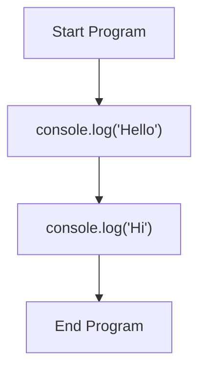

---

## 2. Asynchronous Code

Asynchronous code starts an operation that finishes later.

A common example is `setTimeout()`.

```js id="async-timeout"
setTimeout(() => {
  console.log("Timer is done!");
}, 2000);

console.log("Hello");
console.log("Hi");
```

Expected output:

```txt id="async-timeout-output"
Hello
Hi
Timer is done!
```

Even though `setTimeout()` appears first in the code, its callback runs later after the timer finishes.

---

## Asynchronous Execution Flow

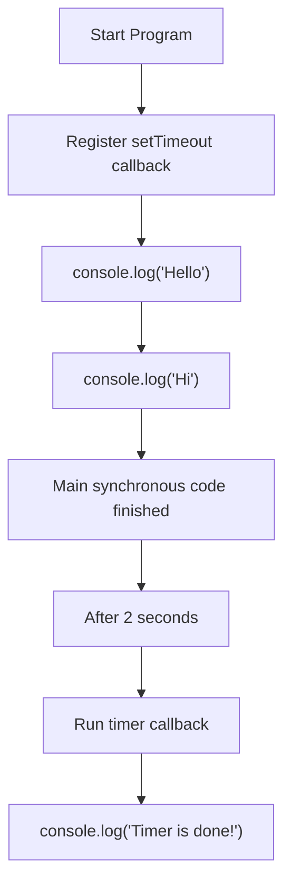

---

## 3. What Is a Callback?

A **callback** is a function passed into another function so it can be executed later.

Example:

```js id="callback-example"
setTimeout(() => {
  console.log("This runs later.");
}, 2000);
```

The arrow function is the callback:

```js id="callback-function"
() => {
  console.log("This runs later.");
}
```

`setTimeout()` does not execute the callback immediately. It executes it after the timer finishes.

---

## Callback Mental Model

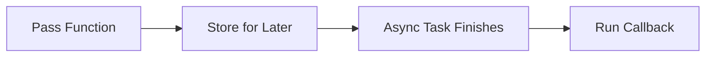

---

## 4. Why Async Code Matters

Node.js often performs tasks that take time, such as:

* Reading files
* Writing files
* Connecting to databases
* Querying databases
* Calling APIs
* Handling HTTP requests
* Waiting for user input
* Processing network data

If Node.js waited and blocked everything each time one task was running, backend applications would become slow.

Asynchronous code allows Node.js to keep working while waiting for slow operations to finish.

---

## 5. Nested Callbacks

You can create your own function that accepts a callback.

```js id="nested-callback"
const fetchData = callback => {
  setTimeout(() => {
    callback("Done!");
  }, 1500);
};

setTimeout(() => {
  console.log("Timer is done!");

  fetchData(text => {
    console.log(text);
  });
}, 2000);
```

Expected output:

```txt id="nested-callback-output"
Timer is done!
Done!
```

The outer timer finishes after 2 seconds. Then `fetchData()` starts another timer. After 1.5 seconds, it calls the callback and prints `"Done!"`.

---

## Nested Callback Flow

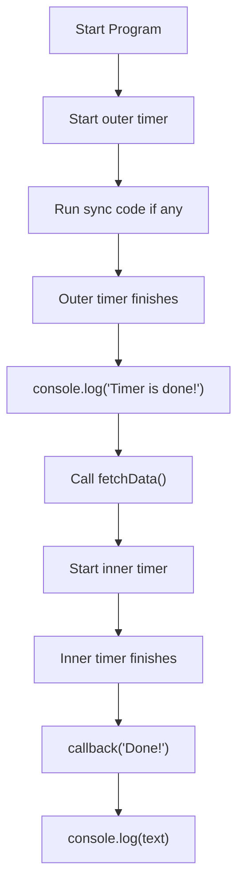

---

## 6. The Problem with Nested Callbacks

Callbacks work, but they can become difficult to read when multiple async operations depend on each other.

Example:

```js id="callback-hell"
firstTask(result1 => {
  secondTask(result1, result2 => {
    thirdTask(result2, result3 => {
      fourthTask(result3, result4 => {
        console.log(result4);
      });
    });
  });
});
```

This style is often called **callback hell** because the code becomes deeply nested and harder to maintain.

---

## Callback Hell Diagram

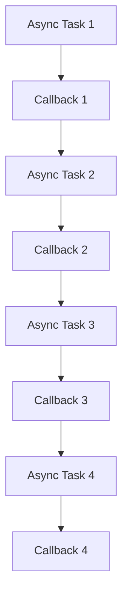

---

## 7. Introduction to Promises

A **Promise** represents a value that may be available later.

A Promise can be in one of three states:

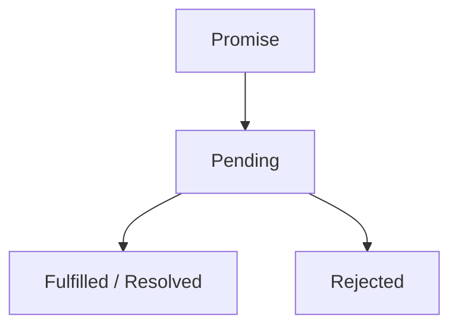

| State                    | Meaning                              |
| ------------------------ | ------------------------------------ |
| `pending`                | The async operation is still running |
| `fulfilled` / `resolved` | The operation finished successfully  |
| `rejected`               | The operation failed                 |

---

## 8. Creating a Promise

You can create a Promise with the `Promise` constructor.

```js id="promise-create"
const fetchData = () => {
  const promise = new Promise((resolve, reject) => {
    setTimeout(() => {
      resolve("Done!");
    }, 1500);
  });

  return promise;
};
```

The Promise receives a function with two arguments:

| Argument  | Purpose                            |
| --------- | ---------------------------------- |
| `resolve` | Completes the Promise successfully |
| `reject`  | Fails the Promise with an error    |

---

## Promise Creation Flow

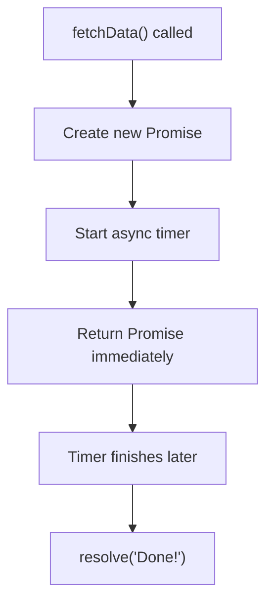

---

## 9. Handling a Promise with `.then()`

A Promise can be handled with `.then()`.

```js id="promise-then"
const fetchData = () => {
  const promise = new Promise((resolve, reject) => {
    setTimeout(() => {
      resolve("Done!");
    }, 1500);
  });

  return promise;
};

fetchData().then(text => {
  console.log(text);
});
```

Expected output:

```txt id="promise-then-output"
Done!
```

The function inside `.then()` runs when the Promise resolves.

---

## 10. Rewriting the Timer Example with Promises

```js id="timer-promise-example"
const fetchData = () => {
  const promise = new Promise((resolve, reject) => {
    setTimeout(() => {
      resolve("Done!");
    }, 1500);
  });

  return promise;
};

setTimeout(() => {
  console.log("Timer is done!");

  fetchData().then(text => {
    console.log(text);
  });
}, 2000);

console.log("Hello");
console.log("Hi");
```

Expected output:

```txt id="timer-promise-output"
Hello
Hi
Timer is done!
Done!
```

---

## 11. Promise Chaining

One major advantage of Promises is that you can chain async operations.

Instead of nesting callbacks like this:

```js id="nested-promise-bad"
fetchData().then(text => {
  console.log(text);

  fetchData().then(text2 => {
    console.log(text2);
  });
});
```

You can return another Promise and chain another `.then()`:

```js id="promise-chain"
fetchData()
  .then(text => {
    console.log(text);
    return fetchData();
  })
  .then(text2 => {
    console.log(text2);
  });
```

This is flatter and easier to read.

---

## Promise Chain Flow

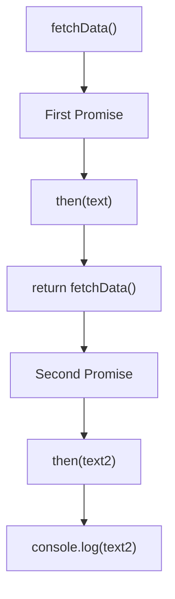

---

## 12. Complete Promise Example

Create a file called `play.js`:

```js id="complete-promise-example"
const fetchData = () => {
  const promise = new Promise((resolve, reject) => {
    setTimeout(() => {
      resolve("Done!");
    }, 1500);
  });

  return promise;
};

setTimeout(() => {
  console.log("Timer is done!");

  fetchData()
    .then(text => {
      console.log(text);
      return fetchData();
    })
    .then(text2 => {
      console.log(text2);
    });
}, 2000);

console.log("Hello");
console.log("Hi");
```

Run it with:

```bash id="run-complete-promise"
node play.js
```

Expected output:

```txt id="complete-promise-output"
Hello
Hi
Timer is done!
Done!
Done!
```

Explanation:

1. `setTimeout()` registers async code.
2. `"Hello"` and `"Hi"` print first.
3. After 2 seconds, `"Timer is done!"` prints.
4. `fetchData()` runs and resolves after 1.5 seconds.
5. The first `.then()` prints `"Done!"`.
6. Another `fetchData()` Promise is returned.
7. The second `.then()` prints `"Done!"`.

---

## 13. Handling Errors with `reject` and `.catch()`

A Promise can fail by calling `reject()`.

```js id="promise-reject"
const fetchData = shouldFail => {
  return new Promise((resolve, reject) => {
    setTimeout(() => {
      if (shouldFail) {
        reject("Something went wrong!");
      } else {
        resolve("Data loaded!");
      }
    }, 1500);
  });
};

fetchData(false)
  .then(data => {
    console.log(data);
  })
  .catch(error => {
    console.log(error);
  });
```

Expected output:

```txt id="promise-reject-output-success"
Data loaded!
```

If you call:

```js id="promise-reject-failure-call"
fetchData(true)
```

Expected output:

```txt id="promise-reject-output-failure"
Something went wrong!
```

---

## Error Handling Flow

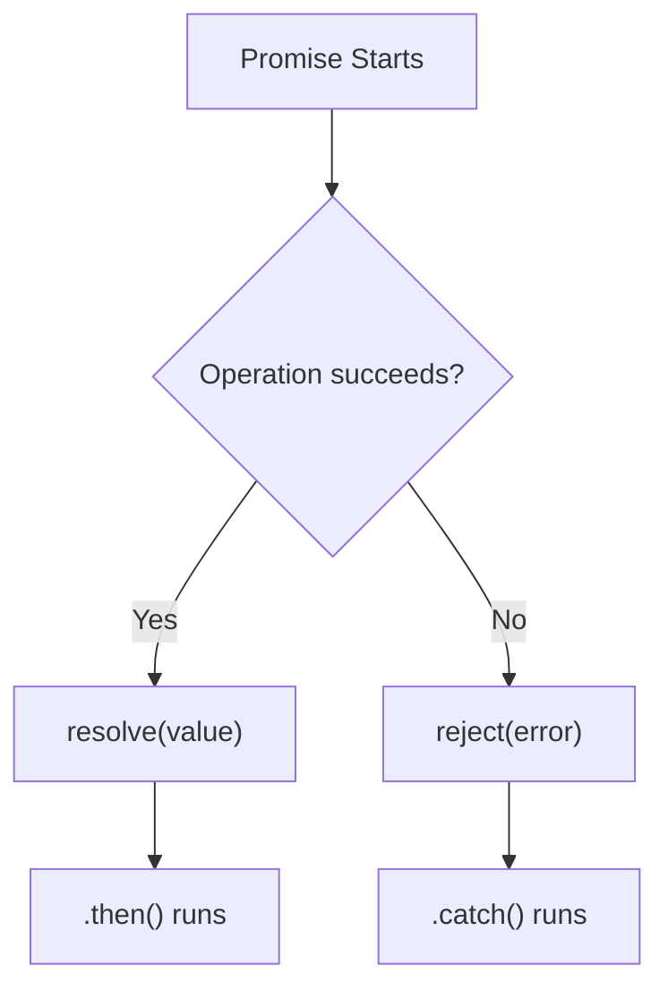

---

## 14. `async` and `await`

Modern JavaScript also supports `async` and `await`.

They make Promise-based code look more like synchronous code.

Example:

```js id="async-await-preview"
const fetchData = () => {
  return new Promise(resolve => {
    setTimeout(() => {
      resolve("Done!");
    }, 1500);
  });
};

const main = async () => {
  const text = await fetchData();
  console.log(text);
};

main();
```

Expected output:

```txt id="async-await-output"
Done!
```

However, this lesson mainly focuses on `.then()` because it is important to understand Promises directly before using `async` and `await`.

---

## Promises vs Async/Await

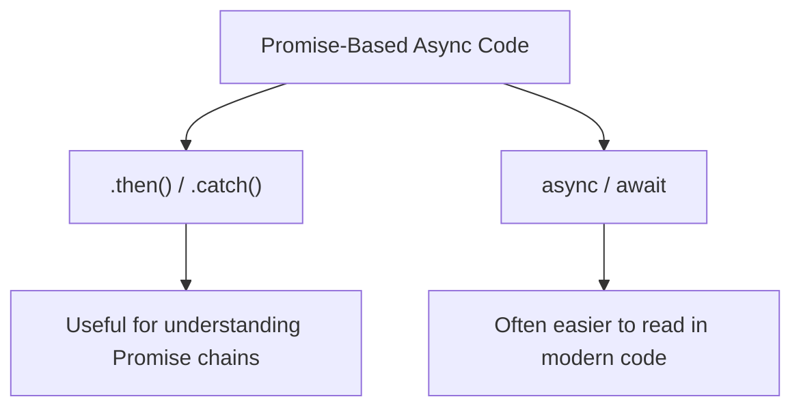

---

## 15. Why This Matters for Node.js

Asynchronous code is one of the most important concepts in Node.js.

In backend applications, many tasks are asynchronous:

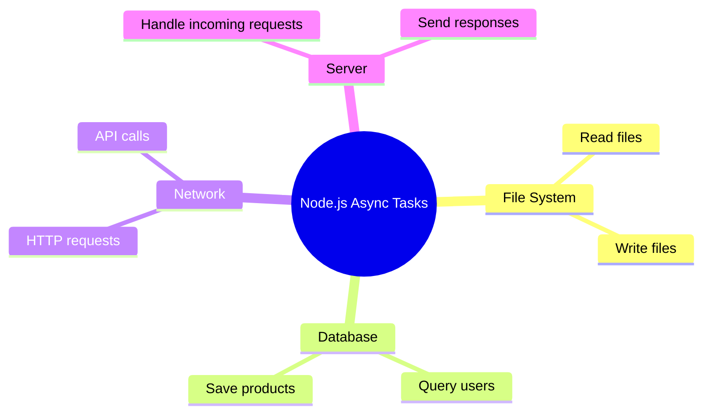

For example, database code often works asynchronously:

```js id="database-like-example"
const getUser = () => {
  return new Promise(resolve => {
    setTimeout(() => {
      resolve({ id: 1, name: "Max" });
    }, 1000);
  });
};

getUser().then(user => {
  console.log(user.name);
});
```

Expected output:

```txt id="database-like-output"
Max
```

---

## 16. Practical Backend Example

Imagine a backend route needs to load user data before sending a response.

```js id="backend-async-example"
const fetchUser = userId => {
  return new Promise(resolve => {
    setTimeout(() => {
      resolve({
        id: userId,
        name: "Max",
        email: "max@example.com",
      });
    }, 1000);
  });
};

fetchUser(1)
  .then(user => {
    return {
      message: "User loaded successfully",
      user: user,
    };
  })
  .then(response => {
    console.log(response);
  });
```

Expected output:

```txt id="backend-async-output"
{
  message: 'User loaded successfully',
  user: { id: 1, name: 'Max', email: 'max@example.com' }
}
```

This pattern is similar to what happens when Node.js loads data from databases, files, or external APIs.

---

## Common Async Patterns

| Pattern          | Example                      | Purpose                 |
| ---------------- | ---------------------------- | ----------------------- |
| Callback         | `setTimeout(() => {}, 1000)` | Run code later          |
| Promise          | `new Promise(...)`           | Represent future result |
| `.then()`        | `promise.then(data => {})`   | Handle success          |
| `.catch()`       | `promise.catch(err => {})`   | Handle failure          |
| Promise chaining | `then(...).then(...)`        | Sequence async tasks    |
| `async/await`    | `await fetchData()`          | Cleaner Promise syntax  |

---

## Mental Model

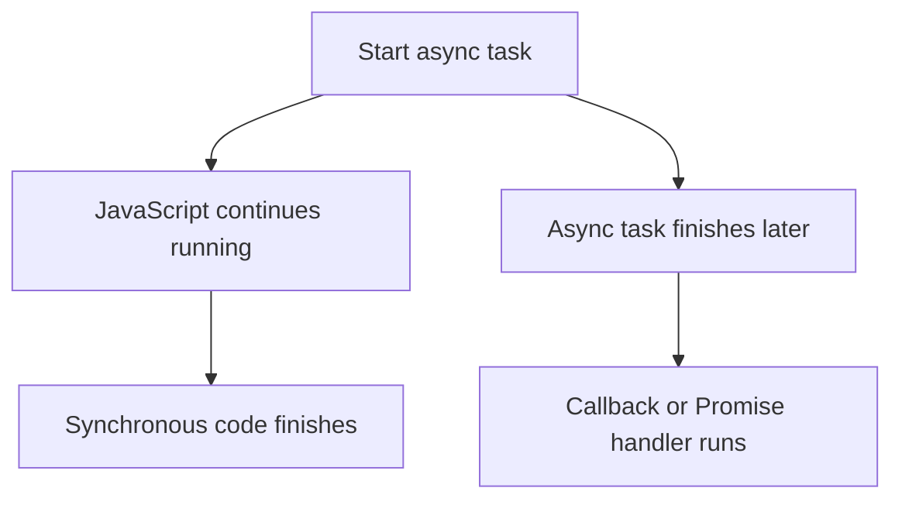

---

## Practice Task

Create a file called `app.js`.

Inside it:

1. Print `"Start"`.
2. Create a function called `fetchProduct`.
3. Inside `fetchProduct`, return a Promise.
4. Resolve the Promise after 1 second with a product object.
5. Use `.then()` to print the product.
6. Print `"End"` outside the Promise.

Example solution:

```js id="practice-solution"
console.log("Start");

const fetchProduct = () => {
  return new Promise((resolve, reject) => {
    setTimeout(() => {
      resolve({
        title: "Laptop",
        price: 1200,
      });
    }, 1000);
  });
};

fetchProduct().then(product => {
  console.log(product);
});

console.log("End");
```

Expected output:

```txt id="practice-output"
Start
End
{ title: 'Laptop', price: 1200 }
```

The product prints last because it is loaded asynchronously.

---

## Mini Challenge

Predict the output:

```js id="mini-challenge"
console.log("A");

setTimeout(() => {
  console.log("B");
}, 1000);

console.log("C");
```

Answer:

```txt id="mini-challenge-answer"
A
C
B
```

Explanation:

`A` and `C` are synchronous. The `setTimeout()` callback runs later.

---

## Extra Practice

### 1. Create a Delayed Message

```js id="extra-practice-1"
const delayedMessage = () => {
  return new Promise(resolve => {
    setTimeout(() => {
      resolve("Message loaded!");
    }, 1000);
  });
};

delayedMessage().then(message => {
  console.log(message);
});
```

### 2. Chain Two Async Tasks

```js id="extra-practice-2"
const fetchStep = step => {
  return new Promise(resolve => {
    setTimeout(() => {
      resolve("Step " + step + " done");
    }, 1000);
  });
};

fetchStep(1)
  .then(result => {
    console.log(result);
    return fetchStep(2);
  })
  .then(result => {
    console.log(result);
  });
```

### 3. Handle an Error

```js id="extra-practice-3"
const fetchData = shouldFail => {
  return new Promise((resolve, reject) => {
    setTimeout(() => {
      if (shouldFail) {
        reject("Failed to load data");
      } else {
        resolve("Data loaded");
      }
    }, 1000);
  });
};

fetchData(true)
  .then(data => {
    console.log(data);
  })
  .catch(error => {
    console.log(error);
  });
```

---

## Review Questions

1. What is synchronous code?
2. What is asynchronous code?
3. Why does `setTimeout()` not block the rest of the code?
4. What is a callback function?
5. Why can deeply nested callbacks become a problem?
6. What is a Promise?
7. What does `resolve()` do?
8. What does `reject()` do?
9. What does `.then()` do?
10. What does `.catch()` do?
11. Why is Promise chaining easier to read than nested callbacks?
12. What is the basic idea behind `async` and `await`?
13. Why is asynchronous code important in Node.js?

---

## Summary

This lesson introduces asynchronous code and Promises in JavaScript.

Synchronous code runs immediately, line by line. Asynchronous code starts a task that finishes later, allowing JavaScript and Node.js to continue executing other code in the meantime.

Callbacks are one way to handle asynchronous code, but nested callbacks can become difficult to read. Promises provide a cleaner structure by representing a future result that can either resolve successfully or reject with an error.

Example:

```js id="summary-example"
const fetchData = () => {
  return new Promise(resolve => {
    setTimeout(() => {
      resolve("Done!");
    }, 1500);
  });
};

fetchData().then(text => {
  console.log(text);
});
```

Understanding asynchronous code is essential for Node.js because backend applications constantly work with delayed operations such as file access, database queries, network requests, and HTTP responses.

---

# Bài luyện tập

## Mục tiêu


## Đề bài


## Yêu cầu hoàn thành

- [ ] 
- [ ] 
- [ ] 

## Kết quả / lời giải


## Ghi chú
