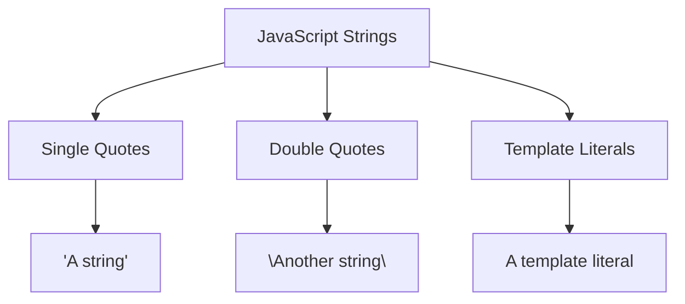
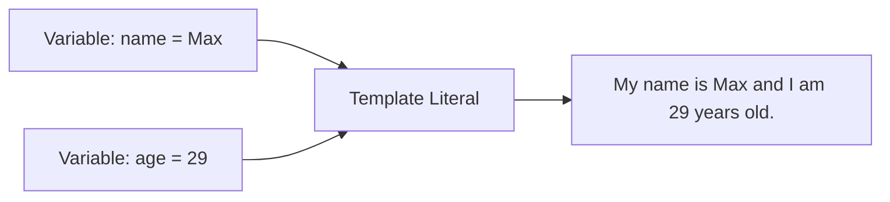
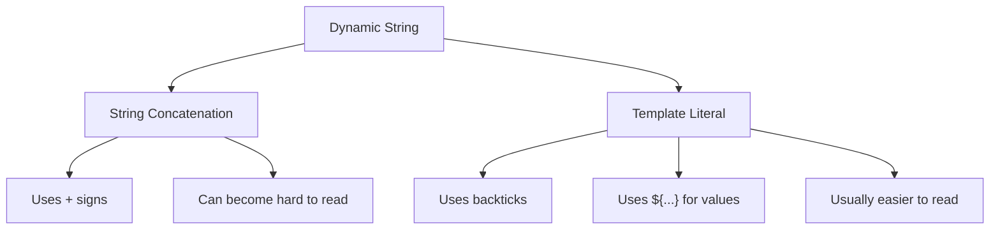

# 012 - Template Literals

## Section

Optional: JavaScript - A Quick Refresher

## Duration

1 minute

---

## Main Idea

This lesson introduces **template literals**, a modern JavaScript feature for writing strings in a cleaner and more flexible way.

Instead of using single quotes or double quotes, template literals use **backticks**.

They are especially useful when you want to insert dynamic values into a string.

---

## Learning Objectives

By the end of this lesson, you should be able to:

* Understand what template literals are.
* Write strings using backticks.
* Insert variables into strings with `${...}`.
* Compare template literals with traditional string concatenation.
* Use template literals to make JavaScript code easier to read.
* Apply template literals in small Node.js examples.

---

## Key Points

* Template literals are written with backticks.
* They are an alternative to single-quoted and double-quoted strings.
* Template literals allow variable interpolation with `${...}`.
* They make dynamic strings easier to read.
* They reduce the need for repeated `+` string concatenation.
* They are commonly used in modern JavaScript and Node.js.

---

## String Syntax Options



---

## 1. Traditional Strings

In JavaScript, you can create strings with single quotes:

```js id="single-quote-string"
const message = 'A String';
```

Or with double quotes:

```js id="double-quote-string"
const message = "Another string";
```

Both are valid.

---

## 2. Template Literals

Template literals use backticks:

```js id="template-literal-basic"
const message = `Another way of writing strings`;

console.log(message);
```

Expected output:

```txt id="template-literal-basic-output"
Another way of writing strings
```

---

## 3. Why Use Template Literals?

Template literals are useful because they allow you to insert variables directly into a string.

Example:

```js id="template-literal-example"
const name = "Max";
const age = 29;

console.log(`My name is ${name} and I am ${age} years old.`);
```

Expected output:

```txt id="template-literal-output"
My name is Max and I am 29 years old.
```

The `${name}` and `${age}` parts are replaced with the values of the variables.

---

## Template Literal Flow



---

## 4. Old Way: String Concatenation

Before template literals, you often had to combine strings with `+`.

```js id="string-concatenation"
const name = "Max";
const age = 29;

console.log("My name is " + name + " and I am " + age + " years old.");
```

Expected output:

```txt id="string-concatenation-output"
My name is Max and I am 29 years old.
```

This works, but it is harder to read.

---

## 5. Better Way: Template Literals

The template literal version is shorter and clearer:

```js id="better-template-literal"
const name = "Max";
const age = 29;

console.log(`My name is ${name} and I am ${age} years old.`);
```

The result is the same, but the code is easier to understand.

---

## Concatenation vs Template Literals



---

## Syntax Breakdown

```js id="syntax-breakdown"
const message = `My name is ${name} and I am ${age} years old.`;
```

| Part        | Meaning                    |
| ----------- | -------------------------- |
| `` `...` `` | Template literal string    |
| `${name}`   | Insert the value of `name` |
| `${age}`    | Insert the value of `age`  |
| `message`   | Final generated string     |

---

## 6. Complete Example

Create a file called `play.js`:

```js id="complete-example"
const name = "Max";
const age = 29;
const hobby = "Cooking";

const message = `My name is ${name}. I am ${age} years old and I like ${hobby}.`;

console.log(message);
```

Run it with:

```bash id="run-example"
node play.js
```

Expected output:

```txt id="complete-output"
My name is Max. I am 29 years old and I like Cooking.
```

---

## Why This Matters for Node.js

Template literals are useful in Node.js because backend code often creates dynamic strings.

You may use them for:

* Log messages
* Error messages
* Response messages
* File paths
* Debug output
* Dynamic URLs
* Database messages

Example:

```js id="node-example"
const userName = "Anna";
const userId = 15;

console.log(`User ${userName} has the ID ${userId}.`);
```

Expected output:

```txt id="node-example-output"
User Anna has the ID 15.
```

---

## Practical Backend Example

```js id="backend-example"
const product = {
  title: "Laptop",
  price: 1200,
};

const message = `The product ${product.title} costs $${product.price}.`;

console.log(message);
```

Expected output:

```txt id="backend-example-output"
The product Laptop costs $1200.
```

This is easier to read than:

```js id="backend-concat-example"
const message = "The product " + product.title + " costs $" + product.price + ".";
```

---

## Practice Task

Create a file called `app.js`.

Inside it:

1. Create a variable called `courseName`.
2. Create a variable called `duration`.
3. Use a template literal to create a sentence.
4. Print the sentence.

Example solution:

```js id="practice-solution"
const courseName = "Node.js Complete Guide";
const duration = "40 hours";

const summary = `The course "${courseName}" has a duration of ${duration}.`;

console.log(summary);
```

Expected output:

```txt id="practice-output"
The course "Node.js Complete Guide" has a duration of 40 hours.
```

---

## Mini Challenge

Rewrite this code using a template literal:

```js id="mini-challenge"
const name = "Max";
const age = 29;

console.log("My name is " + name + " and I am " + age + " years old.");
```

Solution:

```js id="mini-challenge-solution"
const name = "Max";
const age = 29;

console.log(`My name is ${name} and I am ${age} years old.`);
```

Expected output:

```txt id="mini-challenge-output"
My name is Max and I am 29 years old.
```

---

## Extra Practice

### 1. User Message

```js id="extra-practice-1"
const user = "Anna";
const role = "admin";

console.log(`${user} is an ${role}.`);
```

### 2. Product Message

```js id="extra-practice-2"
const product = "Keyboard";
const price = 75;

console.log(`The ${product} costs $${price}.`);
```

### 3. API Route Message

```js id="extra-practice-3"
const resource = "products";
const id = 10;

console.log(`/api/${resource}/${id}`);
```

Expected output:

```txt id="extra-practice-3-output"
/api/products/10
```

---

## Review Questions

1. What are template literals?
2. Which symbol is used to create a template literal?
3. How do you insert a variable into a template literal?
4. What does `${...}` do?
5. Why are template literals often easier to read than string concatenation?
6. Can template literals be used in Node.js?
7. What kinds of backend messages can template literals help create?
8. How would you rewrite `"Hello " + name` with a template literal?

---

## Summary

This lesson introduces template literals in JavaScript.

Template literals are strings written with backticks. They allow you to insert dynamic values directly into a string using `${...}`.

Example:

```js id="summary-example"
const name = "Max";
const age = 29;

console.log(`My name is ${name} and I am ${age} years old.`);
```

This is shorter and easier to read than traditional string concatenation with `+`.

Template literals are used frequently in modern JavaScript and Node.js, especially for log messages, response messages, dynamic paths, URLs, and readable string output.

---

# Bài luyện tập

## Mục tiêu


## Đề bài


## Yêu cầu hoàn thành

- [ ] 
- [ ] 
- [ ] 

## Kết quả / lời giải


## Ghi chú
