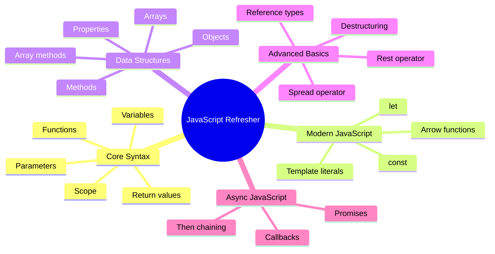
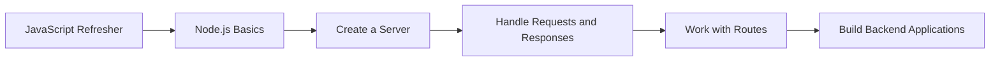

# 013 - Wrap Up

## Section

Optional: JavaScript - A Quick Refresher

## Duration

1 minute

---

## Main Idea

This lesson wraps up the optional JavaScript refresher module.

The instructor reminds learners that this module is **not a complete JavaScript course**. Instead, it is a quick review of the most important JavaScript basics and modern JavaScript features needed before continuing with the Node.js course.

If you are still new to JavaScript, you should review additional beginner resources before moving forward.

---

## Learning Objectives

By the end of this lesson, you should be able to:

* Review the main concepts covered in the JavaScript refresher module.
* Understand that this module is only a quick refresher, not a full JavaScript course.
* Identify which JavaScript concepts should feel familiar before continuing.
* Know when to use additional JavaScript learning resources.
* Feel prepared to continue into the Node.js section of the course.

---

## Module Recap

This refresher module reviewed the JavaScript knowledge needed for the rest of the course.



---

## Important Reminder

This module does not cover every JavaScript feature.

JavaScript is a large language, and there are many additional topics that are not deeply explained here, such as:

* Classes
* Prototypes
* Modules
* Error handling
* Advanced asynchronous patterns
* Browser APIs
* DOM manipulation
* Advanced object behavior
* Advanced array methods

The purpose of this module is to refresh the most important concepts you will need for Node.js.

---

## What You Should Know Before Moving On

Before continuing with the main Node.js course, you should be comfortable with:

| Topic           | You Should Be Able To                          |
| --------------- | ---------------------------------------------- |
| Variables       | Use `let` and `const` correctly                |
| Functions       | Define, call, and return values from functions |
| Arrow functions | Read and write modern function syntax          |
| Objects         | Work with properties and methods               |
| Arrays          | Store lists and use array methods like `map()` |
| Reference types | Understand mutation vs reassignment            |
| Spread operator | Copy arrays and objects                        |
| Rest operator   | Collect multiple function arguments            |
| Destructuring   | Extract values from objects and arrays         |
| Promises        | Understand basic async code flow               |

---

## Learning Path After This Module



---

## Why This Module Matters

Node.js uses JavaScript outside the browser.

That means every Node.js topic in the course depends on JavaScript fundamentals.

For example:

* Server logic uses functions.
* Route handlers often use arrow functions.
* Request and response data are usually objects.
* Database results are often arrays.
* Configuration is often stored in objects.
* Async work often uses callbacks or Promises.
* Dynamic messages often use template literals.

---

## Practical Connection to Node.js

A lot of the refreshed concepts appear together in real Node.js code.

Example:

```js id="node-preview-example"
const users = [
  { id: 1, name: "Max" },
  { id: 2, name: "Anna" },
];

const getUserNames = users => {
  return users.map(({ name }) => `User: ${name}`);
};

console.log(getUserNames(users));
```

Expected output:

```txt id="node-preview-output"
[ 'User: Max', 'User: Anna' ]
```

This small example uses:

* `const`
* Arrow functions
* Arrays
* Objects
* `map()`
* Destructuring
* Template literals

These are exactly the kinds of features that will appear throughout the Node.js course.

---

## Five-Bullet Recap

* JavaScript basics such as variables, functions, objects, and arrays are required before learning Node.js.
* Modern JavaScript uses `let`, `const`, arrow functions, spread/rest syntax, destructuring, and template literals.
* Objects and arrays are reference types, so mutation and copying must be understood carefully.
* Asynchronous code is essential in Node.js because many backend tasks finish later.
* Promises help make asynchronous JavaScript easier to manage than deeply nested callbacks.

---

## Practice Task

Write a five-bullet recap from memory.

Try to include:

1. One point about variables.
2. One point about functions.
3. One point about objects or arrays.
4. One point about modern JavaScript syntax.
5. One point about asynchronous code.

Example:

```md id="practice-recap-example"
- `const` should be used when a value should not be reassigned.
- Arrow functions provide a shorter way to write functions.
- Objects group related data and methods together.
- Spread syntax can copy arrays and objects.
- Promises represent async work that finishes later.
```

---

## Review Questions

1. Why is this module optional?
2. Why is this module not a complete JavaScript course?
3. Which JavaScript concepts are most important before learning Node.js?
4. Why are objects and arrays important in backend development?
5. Why is asynchronous code especially important in Node.js?
6. What should you do if JavaScript still feels unfamiliar?
7. How do modern JavaScript features help make code cleaner?
8. How does this refresher prepare you for the next section?

---

## Summary

This lesson concludes the optional JavaScript refresher module.

The module reviewed core JavaScript syntax and modern JavaScript features that will appear throughout the Node.js course. It covered variables, functions, arrow functions, objects, arrays, reference types, spread and rest operators, destructuring, asynchronous code, Promises, and template literals.

The instructor emphasizes that this is not a full JavaScript course. If you still feel unsure about the basics, you should review additional beginner JavaScript resources before moving on.

With these refreshed concepts, you are now ready to continue into Node.js and start building real backend applications.
