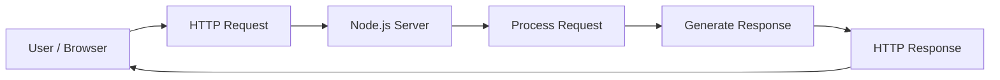
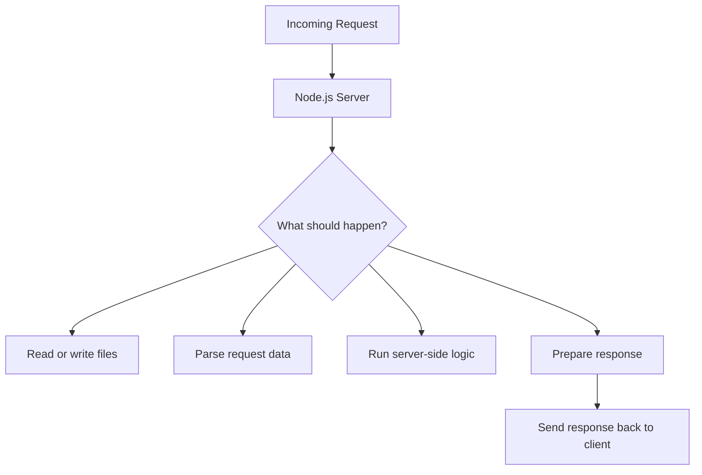
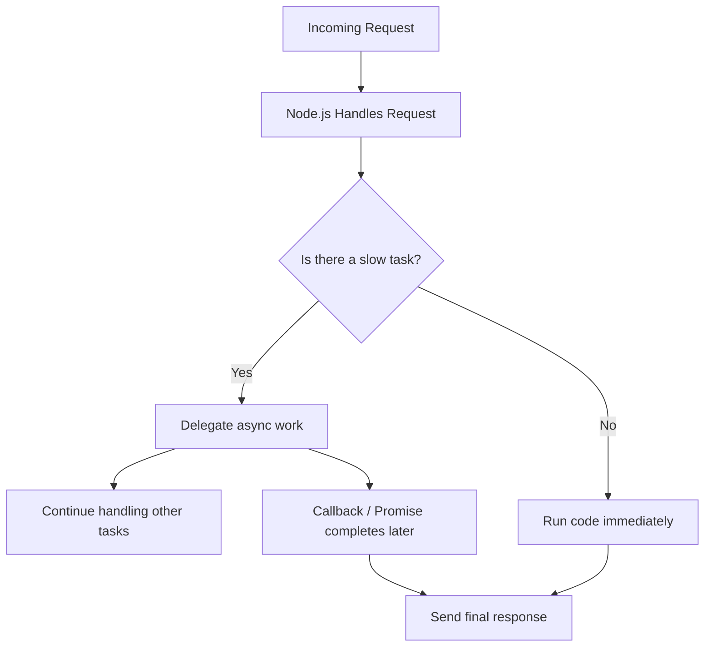

# 001 - Module Introduction

## Section

Understanding the Basics

## Duration

2min

## Main Idea

This lesson introduces the **Understanding the Basics** module of the Node.js course.

Before building servers, web applications, and server-side logic with Node.js, it is important to understand how the web works at a basic level. This module acts as a short refresher on the relationship between browsers, servers, requests, responses, and the role Node.js plays in that process.

You will gradually move from understanding the basic web flow to creating a Node.js server, handling incoming requests, processing data, and sending responses back to the client.

---

## Learning Objectives

By the end of this lesson, you should be able to:

* Understand the purpose of the **Understanding the Basics** module.
* Explain how the web works at a high level.
* Describe the role of Node.js in building a web server.
* Understand that servers receive requests and send responses.
* Recognize that Node.js uses core modules to build server-side functionality.
* Prepare for concepts such as asynchronous code and the event loop.

---

## Why This Module Matters

Node.js is often used to build server-side applications. That means it runs code on a server, not in the browser.

To work with Node.js effectively, you need to understand:

* How a browser sends a request.
* How a server receives and processes that request.
* How the server sends a response back.
* How Node.js helps create and manage that server.
* Why asynchronous code is important for keeping the server fast and responsive.

---

## Basic Web Flow



---

## Node.js Role in the Web



---

## Key Concepts Introduced

### 1. The Web Works Through Requests and Responses

A browser sends a request to a server. The server processes that request and sends a response back.

Example:

```text
Browser requests: GET /home
Server responds: HTML page for the home route
```

---

### 2. Node.js Can Create a Web Server

Node.js allows us to write JavaScript code that runs on the server. This means we can use JavaScript to handle requests, process data, and return responses.

---

### 3. Node.js Uses Core Modules

Node.js includes built-in modules that help us perform common server-side tasks.

Examples:

* `fs` for working with the file system.
* `http` for creating a web server.
* Other core modules for paths, streams, events, and more.

In this module, the `http` module becomes especially important because it allows us to create a basic web server.

---

### 4. Request and Response Handling Is Essential

When building a server, we need to know how to:

* Accept incoming requests.
* Inspect or parse request data.
* Decide what logic should run.
* Send back the correct response.

This is one of the most important foundations of Node.js backend development.

---

### 5. Node.js Uses Asynchronous Code

Node.js is designed to handle many tasks efficiently without blocking the entire application.

Instead of waiting for one slow operation to finish before doing anything else, Node.js can continue handling other work.

This is closely connected to the **event loop**, which helps Node.js stay responsive.

---

## Event Loop Preview



---

## Practical Example

A very simple Node.js server might:

1. Receive a request from the browser.
2. Check which URL was requested.
3. Run some JavaScript logic.
4. Send back an HTML response.

Example behavior:

```text
User visits: http://localhost:3000
Node.js server receives the request
Node.js sends back: <h1>Hello from Node.js</h1>
```

---

## Practice

Create a short explanation of what happens when a user opens a website in their browser.

Use this structure:

```text
1. The browser sends a request.
2. The server receives the request.
3. The server processes the request.
4. The server sends back a response.
5. The browser displays the response.
```

Then explain where Node.js fits into this flow.

---

## Review Questions

1. What is the main purpose of the **Understanding the Basics** module?
2. Why do we need to understand how the web works before building a Node.js server?
3. What is the role of a server in the request-response cycle?
4. Which Node.js core module can be used to create a web server?
5. Why is request and response handling important in backend development?
6. What does asynchronous code help Node.js do?
7. What is the basic idea behind the event loop?

---

## Summary

This lesson introduces the foundation of Node.js backend development.

The main goal is to understand how the web works and where Node.js fits into the bigger picture. A browser sends requests, a server processes them, and the server sends responses back. Node.js allows us to build that server using JavaScript.

This module will later expand into creating a real Node.js server, handling requests, sending responses, using core modules, and understanding asynchronous code through the event loop.

---

# Bài luyện tập

## Mục tiêu


## Đề bài


## Yêu cầu hoàn thành

- [ ] 
- [ ] 
- [ ] 

## Kết quả / lời giải


## Ghi chú
