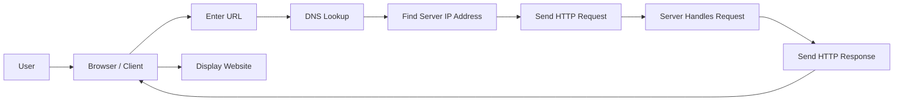
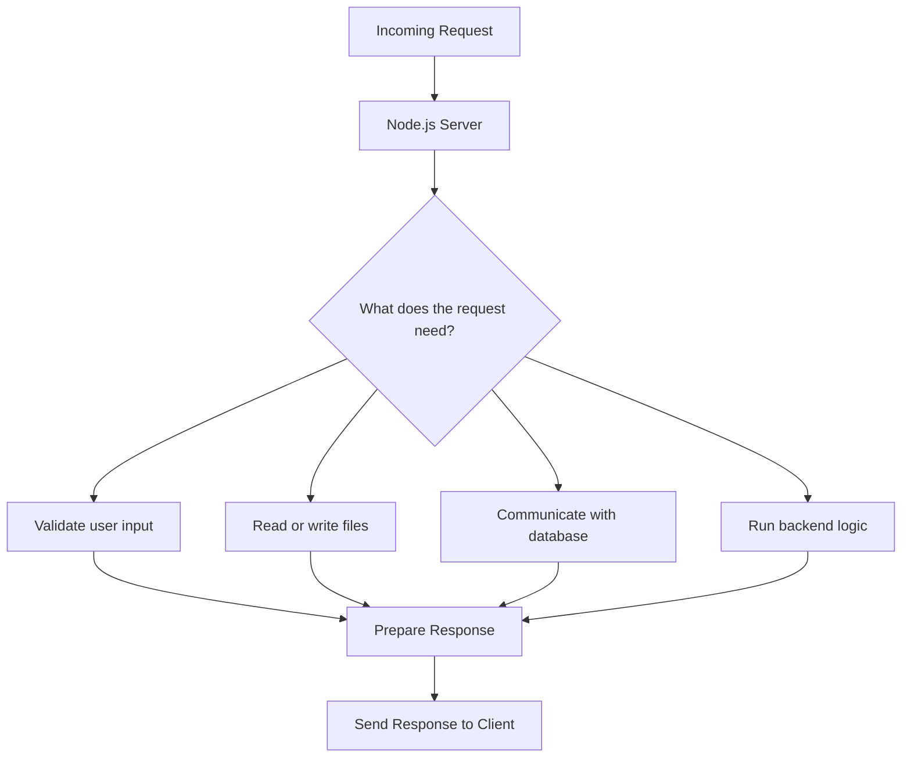
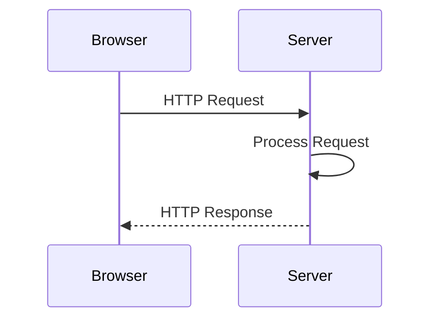
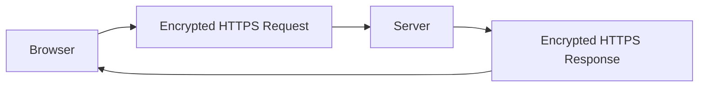
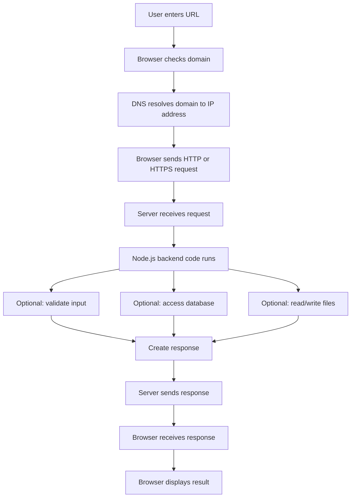

# 002 - How The Web Works

## Section

Understanding the Basics

## Duration

4min

## Main Idea

This lesson explains how the web works at a high level and shows where Node.js fits into the process.

When a user opens a website, the browser does not directly understand a domain name as the final server address. Instead, the browser looks up the domain, finds the server’s IP address, sends a request to that server, waits for the server to process the request, and then receives a response.

Node.js becomes important on the server side. It allows us to write JavaScript code that runs on a server, handles incoming requests, performs backend logic, and sends responses back to the client.

---

## Learning Objectives

By the end of this lesson, you should be able to:

* Explain the basic request-response cycle of the web.
* Understand the relationship between a browser, domain name, IP address, and server.
* Describe the role of DNS in finding the correct server.
* Explain where Node.js fits into web development.
* Understand that a server can return different types of responses.
* Recognize that HTTP and HTTPS define how requests and responses are transferred.
* Understand why HTTPS is important for encrypted communication.

---

## How The Web Works

At a basic level, the web works through communication between a **client** and a **server**.

The client is usually a browser. The server is a computer on the internet that runs code and sends data back to the browser.



---

## Step-by-Step Explanation

### 1. The User Enters a URL

A user enters a URL into the browser, for example:

```text
https://example.com
```

The domain name `example.com` is easy for humans to read, but it is not the actual technical address of the server.

---

### 2. The Browser Uses DNS

The browser contacts a **Domain Name System**, also called **DNS**, to find the IP address that belongs to the domain.

A domain is like a human-readable name.

An IP address is the actual technical address of the server.

```text
Domain name: example.com
IP address: 93.184.216.34
```

---

### 3. The Browser Sends a Request

After finding the correct IP address, the browser sends a request to the server.

This request asks the server for something, such as:

* A webpage.
* An image.
* A file.
* JSON data.
* A submitted form action.
* An API response.

Example:

```text
GET /home HTTP/1.1
Host: example.com
```

---

### 4. The Server Receives the Request

The server receives the incoming request and decides what to do with it.

This is where backend code runs.

In this course, that backend code will be written with **Node.js**.



---

## Where Node.js Fits In

Node.js runs on the server.

It is responsible for creating the server and handling requests that come from the browser.

You could use other backend technologies, such as:

* PHP
* ASP.NET
* Ruby on Rails
* Python
* Java
* Go

However, in this course, we use **Node.js** to write server-side JavaScript.

---

## What Node.js Can Do On The Server

With Node.js, the server can:

* Receive incoming requests.
* Parse request data.
* Validate user input.
* Communicate with a database.
* Read or write files.
* Execute server-side logic.
* Generate responses.
* Send data back to the browser.

---

## The Response

After the server finishes processing the request, it sends a response back to the client.

A response can contain different types of data.

Examples:

```text
HTML page
JSON data
XML data
Image file
PDF file
Text response
```

For example, a Node.js server might send back HTML:

```html
<h1>Hello from Node.js</h1>
```

Or it might send back JSON:

```json
{
  "message": "Data loaded successfully"
}
```

---

## Requests and Responses Have Headers

A request or response does not only contain content.

It also contains **headers**.

Headers are metadata that describe the request or response.

For example, headers can describe:

* The type of content being sent.
* The browser making the request.
* The server sending the response.
* Authentication information.
* Accepted response formats.
* Encoding information.

Example response header:

```text
Content-Type: text/html
```

This tells the browser that the response contains HTML.

Another example:

```text
Content-Type: application/json
```

This tells the browser or client that the response contains JSON data.

---

## HTTP and HTTPS

The browser and server communicate through a protocol.

A protocol is a standardized set of rules for communication.

The most important protocols for the web are:

* `HTTP`
* `HTTPS`

---

## HTTP

HTTP stands for **HyperText Transfer Protocol**.

It defines how requests and responses should be structured and transferred between client and server.

HTTP makes sure that the browser and server understand each other.



---

## HTTPS

HTTPS is the secure version of HTTP.

It uses encryption through SSL/TLS so that data transferred between the browser and server cannot easily be read by attackers.

This is especially important when sending sensitive data such as:

* Passwords.
* Payment information.
* Personal information.
* Authentication tokens.
* Private user data.



---

## Development vs Production

During local development, it is common to use HTTP.

Example:

```text
http://localhost:3000
```

For production applications, HTTPS should be enabled.

Example:

```text
https://myapp.com
```

In this course, HTTP is used for most local development. Later, HTTPS will be introduced for production deployment.

---

## Full Web Request-Response Flow



---

## Practical Example

Imagine a user visits this URL:

```text
http://localhost:3000/users
```

The process may look like this:

```text
1. The browser sends a GET request to /users.
2. The Node.js server receives the request.
3. The server checks the requested path.
4. The server may fetch users from a database.
5. The server creates a response.
6. The server sends the response back to the browser.
7. The browser displays the result.
```

Example response:

```json
[
  {
    "id": 1,
    "name": "Anna"
  },
  {
    "id": 2,
    "name": "Max"
  }
]
```

---

## Key Concepts

### Client

The client is usually the browser or frontend application that sends requests.

### Server

The server is a computer that receives requests, runs backend code, and sends responses.

### Domain

A domain is a human-readable name for a website.

Example:

```text
google.com
```

### IP Address

An IP address is the technical address of a server.

Example:

```text
142.250.190.78
```

### DNS

DNS translates a domain name into an IP address.

### Request

A request is sent from the client to the server.

### Response

A response is sent from the server back to the client.

### HTTP

HTTP is the protocol used to transfer requests and responses.

### HTTPS

HTTPS is HTTP with encryption enabled.

### Node.js

Node.js allows JavaScript to run on the server and handle backend logic.

---

## Practice

Write a short explanation of what happens when a user visits a website.

Use this structure:

```text
1. The user enters a URL in the browser.
2. The browser looks up the domain using DNS.
3. DNS returns the server IP address.
4. The browser sends a request to the server.
5. The Node.js server receives and processes the request.
6. The server sends a response back.
7. The browser displays the response.
```

Then answer this question:

```text
Where does Node.js fit into this process?
```

---

## Review Questions

1. What is the difference between a domain name and an IP address?
2. What does DNS do?
3. What is the role of the browser in the web request-response cycle?
4. What is the role of the server?
5. Where does Node.js run?
6. What kinds of tasks can Node.js perform on the server?
7. What can a server send back as a response?
8. What are headers used for?
9. What does HTTP stand for?
10. How is HTTPS different from HTTP?
11. Why is HTTPS important in production applications?
12. Why do we usually use HTTP during local development?

---

## Summary

This lesson explains the basic flow of how the web works.

A user enters a URL in the browser. The browser uses DNS to find the server’s IP address. Then it sends a request to that server. The server processes the request and sends back a response.

Node.js fits into this process on the server side. It allows us to create a server, handle incoming requests, run backend logic, communicate with databases or files, and send responses back to the client.

The communication between browser and server follows protocols such as HTTP and HTTPS. HTTP defines how requests and responses are exchanged, while HTTPS adds encryption for secure communication.

Understanding this flow is essential before building a Node.js web server.

---

# Bài luyện tập

## Mục tiêu


## Đề bài


## Yêu cầu hoàn thành

- [ ] 
- [ ] 
- [ ] 

## Kết quả / lời giải


## Ghi chú
