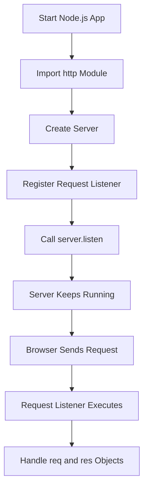
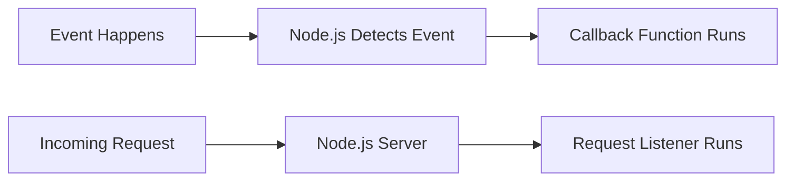
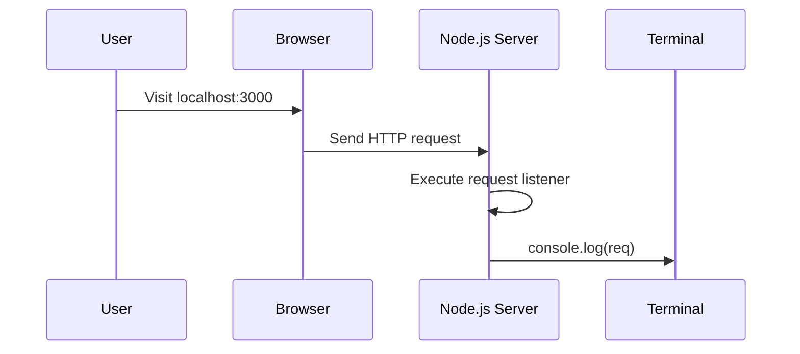
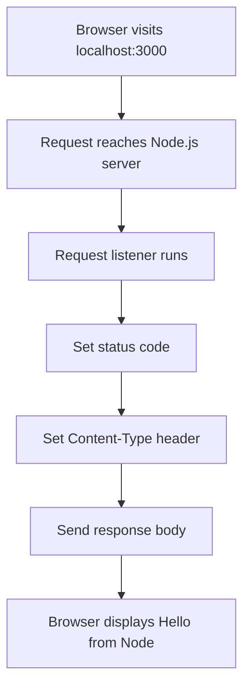

# 003 - Creating a Node Server

## Section

Understanding the Basics

## Duration

13min

## Main Idea

This lesson introduces how to create a basic web server with Node.js.

Instead of only running JavaScript code once and then stopping, we use Node.js to create a server process that keeps running and listens for incoming requests. This is one of the most important differences between simple scripts and backend applications.

In this lesson, we create an `app.js` file, import the built-in `http` core module, create a server with `http.createServer()`, define a request listener function, and start the server with `server.listen()`.

---

## Learning Objectives

By the end of this lesson, you should be able to:

* Create a root Node.js application file such as `app.js` or `server.js`.
* Import a Node.js core module using `require()`.
* Understand the purpose of the built-in `http` module.
* Create a basic server with `http.createServer()`.
* Understand what a request listener function is.
* Explain the role of the `req` and `res` objects.
* Start a server by calling `server.listen()`.
* Test a local Node.js server in the browser using `localhost`.

---

## Project Setup

We start with an empty project folder.

A common structure at this stage may look like this:

```text
node-basics/
├── .gitignore
└── app.js
```

The `.gitignore` file is optional. It is only useful if you are using Git for version control.

The important file here is:

```text
app.js
```

This file acts as the root file of the Node.js application.

Common names for this file include:

```text
app.js
server.js
```

---

## Why We Need to Import Modules

JavaScript and Node.js provide some global features by default, but most functionality is not globally available.

This keeps the global namespace clean and makes it clear which features a file depends on.

For example, if we want to work with files, we can import the `fs` module.

If we want to create a web server, we import the `http` module.

---

## Important Node.js Core Modules

Node.js comes with many built-in modules.

Some common examples are:

| Module  | Purpose                                                |
| ------- | ------------------------------------------------------ |
| `fs`    | Work with the file system                              |
| `path`  | Build file paths that work across operating systems    |
| `os`    | Access operating system information                    |
| `http`  | Create HTTP servers and handle HTTP requests/responses |
| `https` | Create HTTPS servers with encryption                   |

In this lesson, the most important module is:

```js
http
```

---

## Importing the HTTP Module

To use the `http` module, we import it with `require()`.

```js
const http = require('http');
```

### Explanation

```js
const http
```

Creates a constant named `http`.

```js
require('http')
```

Imports the built-in Node.js `http` module.

We use `const` because we do not plan to overwrite the imported module later.

---

## How `require()` Works

The `require()` function is globally available in Node.js.

It can be used to import:

1. Node.js core modules.
2. Third-party packages.
3. Your own local files.

### Importing a Core Module

```js
const http = require('http');
```

Because there is no `./` at the beginning, Node.js looks for a built-in or installed module named `http`.

### Importing a Local File

```js
const helper = require('./helper');
```

The `./` means Node.js should look for a file in the current folder.

Node.js automatically understands this as:

```js
./helper.js
```

---

## Creating a Server

The `http` module gives us access to the `createServer()` method.

```js
const server = http.createServer();
```

However, a server needs to know what to do when a request reaches it.

That is why we pass a function to `createServer()`.

---

## Request Listener Function

A request listener is a function that runs every time a request reaches the server.

It receives two important arguments:

```js
req
res
```

| Argument | Meaning                                    |
| -------- | ------------------------------------------ |
| `req`    | The incoming request object                |
| `res`    | The response object used to send data back |

Example:

```js
const server = http.createServer((req, res) => {
  console.log(req);
});
```

---

## Basic Server Flow



---

## Full Basic Server Example

```js
const http = require('http');

const server = http.createServer((req, res) => {
  console.log(req);
});

server.listen(3000);
```

This creates a server that listens on port `3000`.

When a request reaches the server, the request object is logged to the terminal.

---

## The `http.createServer()` Method

The `createServer()` method creates a server object.

```js
const server = http.createServer((req, res) => {
  console.log(req);
});
```

The function passed to `createServer()` is not executed immediately.

Instead, Node.js stores this function and executes it later whenever a request reaches the server.

This is an example of event-driven programming.

---

## Event-Driven Architecture

Node.js often works like this:

```text
If something happens, run this function.
```

In this case:

```text
If a request reaches the server, run the request listener function.
```



---

## Different Ways to Write the Request Listener

### 1. Named Function

```js
const http = require('http');

function requestListener(req, res) {
  console.log(req);
}

const server = http.createServer(requestListener);

server.listen(3000);
```

Notice that we pass the function name only:

```js
http.createServer(requestListener);
```

We do not execute it manually like this:

```js
http.createServer(requestListener());
```

Node.js will execute it automatically when a request comes in.

---

### 2. Anonymous Function

```js
const http = require('http');

const server = http.createServer(function(req, res) {
  console.log(req);
});

server.listen(3000);
```

This function has no name, so it is called an anonymous function.

---

### 3. Arrow Function

```js
const http = require('http');

const server = http.createServer((req, res) => {
  console.log(req);
});

server.listen(3000);
```

This is the modern JavaScript syntax and is commonly used in Node.js projects.

---

## Starting the Server

Creating a server is not enough.

We also need to tell it to start listening for requests.

This is done with:

```js
server.listen(3000);
```

The number `3000` is the port.

---

## What Is a Port?

A port is like a specific door on a computer where a server listens for requests.

For local development, port `3000` is commonly used.

Example:

```text
http://localhost:3000
```

| Part        | Meaning                                        |
| ----------- | ---------------------------------------------- |
| `localhost` | Your own local computer                        |
| `3000`      | The port where the Node.js server is listening |

---

## What Happens When We Run the File?

Run the file in the terminal:

```bash
node app.js
```

At first, it may look like nothing happens.

But actually, the server is now running.

The terminal does not return to a new prompt because Node.js keeps the process alive.

That is expected.

A web server should keep running so that it can continue listening for incoming requests.

---

## Testing the Server

Open your browser and visit:

```text
http://localhost:3000
```

The browser may not display anything useful yet because we have not sent a real response.

However, in the terminal, you should see the request object logged.

This means the browser sent a request and the Node.js server received it.

---

## Request Flow



---

## Why Nothing Appears in the Browser Yet

In the first version of the server, we only log the request:

```js
console.log(req);
```

We do not send a response yet.

That means the browser sends a request, but the server does not return meaningful content.

Later, we will use the `res` object to send a response back to the browser.

---

## Sending a Simple Response

A more complete version can send text back to the browser:

```js
const http = require('http');

const server = http.createServer((req, res) => {
  res.statusCode = 200;
  res.setHeader('Content-Type', 'text/plain');
  res.end('Hello from Node');
});

server.listen(3000);
```

Now, when visiting:

```text
http://localhost:3000
```

The browser displays:

```text
Hello from Node
```

---

## Response Flow



---

## Understanding `req` and `res`

### `req`

The `req` object contains information about the incoming request.

It can include:

* URL path.
* HTTP method.
* Headers.
* Request body data.
* Client information.

Example:

```js
console.log(req.url);
console.log(req.method);
console.log(req.headers);
```

---

### `res`

The `res` object is used to send a response back.

It can be used to:

* Set status codes.
* Set headers.
* Send text.
* Send HTML.
* Send JSON.
* End the response.

Example:

```js
res.statusCode = 200;
res.setHeader('Content-Type', 'text/plain');
res.end('Hello from Node');
```

---

## Important Concepts

### Root File

The main file that starts the Node.js application.

Example:

```text
app.js
```

---

### Core Module

A module that ships with Node.js.

Example:

```js
const http = require('http');
```

---

### Request Listener

A function that runs for every incoming request.

Example:

```js
(req, res) => {
  console.log(req);
}
```

---

### Server

The object created by `http.createServer()`.

Example:

```js
const server = http.createServer(...);
```

---

### Listening

Starting the server so that it waits for requests.

Example:

```js
server.listen(3000);
```

---

### Localhost

A name that refers to your own machine.

Example:

```text
localhost
```

---

## Final Code

```js
const http = require('http');

const server = http.createServer((req, res) => {
  res.statusCode = 200;
  res.setHeader('Content-Type', 'text/plain');
  res.end('Hello from Node');
});

server.listen(3000);
```

---

## How to Run

In the terminal, run:

```bash
node app.js
```

Then open the browser and visit:

```text
http://localhost:3000
```

Expected result:

```text
Hello from Node
```

---

## Practice

Create a file named:

```text
app.js
```

Then:

1. Import the `http` module.
2. Create a server with `http.createServer()`.
3. Add a request listener with `req` and `res`.
4. Log the request URL.
5. Send a simple text response.
6. Start the server on port `3000`.
7. Visit `http://localhost:3000` in the browser.

Example challenge:

```js
const http = require('http');

const server = http.createServer((req, res) => {
  console.log(req.url);

  res.statusCode = 200;
  res.setHeader('Content-Type', 'text/html');
  res.end('<h1>Hello from my first Node.js server!</h1>');
});

server.listen(3000);
```

---

## Review Questions

1. What is the purpose of the `app.js` file?
2. Why do we need to import the `http` module?
3. What does `require('http')` do?
4. What is the difference between importing a core module and importing a local file?
5. What does `http.createServer()` create?
6. What is a request listener?
7. What are the `req` and `res` objects used for?
8. Why do we pass a function to `createServer()` instead of executing it immediately?
9. What does `server.listen(3000)` do?
10. Why does the Node.js process keep running after calling `listen()`?
11. What does `localhost:3000` mean?
12. How can you prove that the server received a request?
13. Why does the browser not show useful content if we only call `console.log(req)`?
14. How do you send a simple response back to the browser?

---

## Summary

This lesson shows how to create a basic Node.js web server.

We start with an empty project folder and create an `app.js` file. Then we import the built-in `http` module using `require()`. With `http.createServer()`, we create a server and provide a request listener function that runs whenever a request reaches the server.

The server only starts listening for requests after calling `server.listen(3000)`. Once the server is running, we can visit `http://localhost:3000` in the browser.

This lesson is the foundation for backend development with Node.js. From here, we can continue learning how to inspect requests, handle routes, parse data, and send proper responses.
