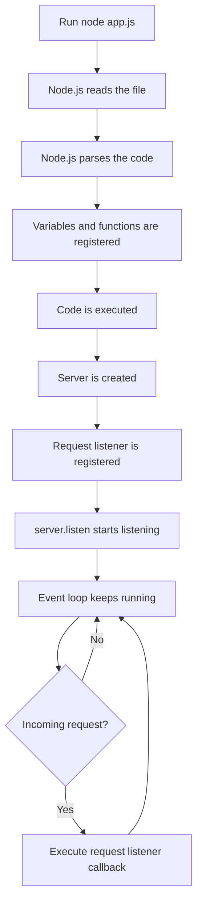
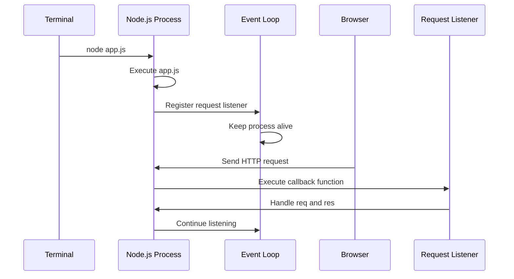
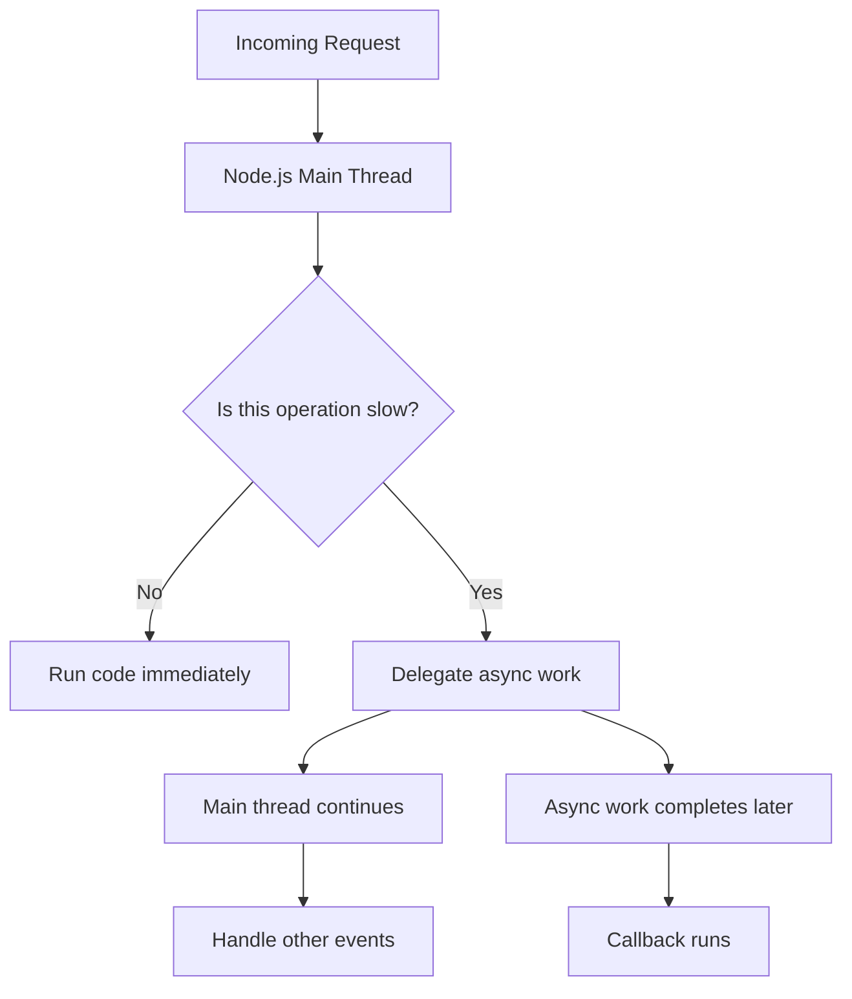
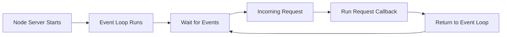

# 004 - The Node Lifecycle & Event Loop

## Section

Understanding the Basics

## Duration

5min

## Main Idea

This lesson explains what happens after we run a Node.js file and why a Node.js server keeps running instead of immediately stopping.

When we execute a file with `node app.js`, Node.js reads, parses, and executes the code inside that file. For normal scripts, the program finishes once all code has been executed. However, when we create a server with `http.createServer()` and call `server.listen()`, Node.js keeps the process alive because there is still ongoing work to do.

That ongoing work is managed by the **event loop**.

The event loop is one of the most important concepts in Node.js. It allows Node.js to stay active, listen for events such as incoming requests, and run callback functions whenever those events happen.

---

## Learning Objectives

By the end of this lesson, you should be able to:

* Explain what happens when you run a Node.js file.
* Understand why a Node.js server does not immediately stop.
* Describe the role of the event loop.
* Understand how Node.js handles incoming requests through event listeners.
* Explain why Node.js uses an event-driven architecture.
* Understand that Node.js runs JavaScript mainly on a single main thread.
* Recognize that Node.js can still handle many requests efficiently.
* Understand why `process.exit()` stops the Node.js process.

---

## Starting a Node.js File

When we run:

```bash id="x9s2mk"
node app.js
```

Node.js starts executing the `app.js` file.

It does several things:

```text id="z6wvud"
1. Reads the file.
2. Parses the JavaScript code.
3. Registers variables and functions.
4. Executes the code from top to bottom.
5. Keeps running if there is still active work to do.
```

For a simple script, Node.js may finish quickly.

Example:

```js id="fg87ip"
console.log('Hello from Node.js');
```

When this file runs, Node.js prints the message and exits.

---

## Why a Node Server Keeps Running

In the previous lesson, we created a basic server:

```js id="byo2pf"
const http = require('http');

const server = http.createServer((req, res) => {
  console.log(req);
});

server.listen(3000);
```

When we run this file, the terminal does not immediately return to a new prompt.

That is because `server.listen(3000)` starts a server that keeps listening for incoming requests.

Node.js does not exit because there is still an active event listener registered.

---

## Node.js Lifecycle



---

## What Is the Event Loop?

The **event loop** is a process managed by Node.js.

It keeps the application running as long as there is work to do.

That work can include:

* Listening for incoming HTTP requests.
* Waiting for timers.
* Waiting for file system operations.
* Waiting for database operations.
* Waiting for network requests.
* Running callback functions when events complete.

In simple terms:

```text id="a41pnb"
The event loop keeps checking whether there is any work that needs to continue.
```

---

## Event-Driven Architecture

Node.js uses an event-driven architecture.

This means we often write code like this:

```text id="j4fhjj"
When something happens, run this function.
```

For example:

```text id="m6ibij"
When an HTTP request reaches the server, execute the request listener.
```

```js id="qm18x8"
const server = http.createServer((req, res) => {
  console.log('Incoming request');
});
```

The function passed to `createServer()` is not executed immediately.

Instead, Node.js saves it and executes it later whenever a request comes in.

---

## Request Listener and Event Loop



---

## Why Node.js Uses This Model

Node.js runs JavaScript mainly on a single main thread.

That means it does not create a new JavaScript thread for every request.

Instead, Node.js stays efficient by using:

* Event listeners.
* Callback functions.
* Asynchronous operations.
* The event loop.
* Runtime and operating system support for background I/O work.

This allows Node.js to handle many incoming requests without blocking the whole application for every single operation.

---

## Single Thread Does Not Mean Weak

At first, it may sound like a problem that Node.js uses one main JavaScript thread.

However, Node.js is designed to avoid blocking that thread whenever possible.

For example, when Node.js needs to do file system work or communicate with a database, it can delegate that work and continue handling other events.



---

## Example: Database Operation

Later in a real application, a request may need to insert data into a database.

Node.js does not usually stop the entire server while waiting for the database.

Instead, the logic often works like this:

```text id="nm1kfz"
1. A request reaches the server.
2. Node.js starts a database operation.
3. Node.js registers a callback or promise continuation.
4. Node.js continues handling other work.
5. The database operation finishes.
6. The callback or promise continuation runs.
7. The server sends a response.
```

This is one reason Node.js is useful for web servers.

---

## The Server Listener Keeps the App Alive

This line creates a long-running listener:

```js id="h4ntkn"
server.listen(3000);
```

Because the server is listening for future requests, Node.js keeps the process alive.

The application does not end because Node.js knows there is still active work.

That active work is:

```text id="sd6eiv"
Waiting for incoming HTTP requests.
```

---

## What Happens When a Request Comes In?

When the browser visits:

```text id="sczukb"
http://localhost:3000
```

The browser sends a request to the server.

Then Node.js executes the callback function:

```js id="z6wc7q"
const server = http.createServer((req, res) => {
  console.log(req);
});
```

The `req` object contains information about the incoming request.

The `res` object can be used to send a response back.

---

## Long-Running Server Flow



---

## What Is `process.exit()`?

`process.exit()` tells Node.js to stop the process manually.

Example:

```js id="r4mwgj"
process.exit();
```

This forces the Node.js application to quit.

In a server, this is usually not something we want to do.

If the server exits, users can no longer reach the application.

---

## Example With `process.exit()`

```js id="ehe9m8"
const http = require('http');

const server = http.createServer((req, res) => {
  console.log(req);
  process.exit();
});

server.listen(3000);
```

In this example:

```text id="i2hofg"
1. The server starts.
2. Node.js keeps listening for requests.
3. A browser sends a request.
4. The request listener runs.
5. The request is logged.
6. process.exit() runs.
7. The Node.js process stops.
8. The terminal returns to a new prompt.
```

---

## Why We Usually Avoid `process.exit()` in Servers

A web server should stay available.

If we call `process.exit()` inside a request handler, the server will stop after handling that request.

That means:

```text id="yzwwlo"
The application becomes unreachable.
```

In real backend applications, we normally let the server continue running.

---

## Event Loop and Server Availability

The event loop helps Node.js stay available.

It allows the server to:

* Keep listening for new requests.
* Run callbacks when events happen.
* Continue after asynchronous tasks finish.
* Avoid stopping after the initial file execution.
* Handle many operations efficiently.

---

## CPU-Bound Work Warning

Node.js is good at handling asynchronous I/O work, such as:

* Reading files.
* Writing files.
* Waiting for database results.
* Making network requests.
* Handling HTTP requests.

However, long CPU-heavy work can block the main JavaScript thread.

Examples of CPU-heavy work:

```text id="ixn5cb"
Complex calculations
Large loops
Image processing
Video processing
Heavy data transformation
Cryptographic calculations
```

If CPU-heavy work blocks the main thread, Node.js may not be able to handle new requests quickly.

---

## Blocking Example

```js id="bgu70v"
const http = require('http');

const server = http.createServer((req, res) => {
  for (let i = 0; i < 10000000000; i++) {
    // Heavy blocking loop
  }

  res.end('Done');
});

server.listen(3000);
```

This is bad for a server because the loop blocks request handling.

While the loop is running, other users may have to wait.

---

## Key Concepts

### Node Lifecycle

The sequence of steps Node.js goes through when executing a file.

```text id="atw3gm"
Start file → Execute code → Register listeners → Event loop continues → Handle events
```

---

### Event Loop

The mechanism that keeps Node.js running and coordinates callbacks, timers, and asynchronous operations.

---

### Event Listener

A function registered to run when a specific event occurs.

Example:

```js id="iq4l98"
http.createServer((req, res) => {
  // Runs for every incoming request
});
```

---

### Callback Function

A function passed into another function to be executed later.

Example:

```js id="u9i8ek"
(req, res) => {
  console.log(req);
}
```

---

### Single Main Thread

Node.js runs JavaScript on one main thread, but it can delegate many I/O tasks to the runtime and operating system.

---

### Non-Blocking Code

Code that allows Node.js to continue handling other work instead of waiting in place.

---

### Blocking Code

Code that occupies the main thread and prevents Node.js from handling other events quickly.

---

## Practical Example

Create a basic server:

```js id="gq26nu"
const http = require('http');

const server = http.createServer((req, res) => {
  console.log('Request received');

  res.statusCode = 200;
  res.setHeader('Content-Type', 'text/plain');
  res.end('Hello from the event loop!');
});

server.listen(3000);
```

Run it:

```bash id="tkc68r"
node app.js
```

Then visit:

```text id="r3l3wv"
http://localhost:3000
```

Every time you refresh the page, the request listener runs again.

The server does not stop because the event loop keeps it alive.

---

## Practice

Create a small experiment to observe the Node.js lifecycle.

### Step 1: Create `app.js`

```js id="ovfa53"
const http = require('http');

console.log('File execution started');

const server = http.createServer((req, res) => {
  console.log('Request received');

  res.statusCode = 200;
  res.setHeader('Content-Type', 'text/plain');
  res.end('Response sent');
});

server.listen(3000);

console.log('Server is listening on port 3000');
```

### Step 2: Run the file

```bash id="jowpb4"
node app.js
```

### Step 3: Open the browser

```text id="lr77s8"
http://localhost:3000
```

### Step 4: Observe the terminal

Expected output:

```text id="x3aokn"
File execution started
Server is listening on port 3000
Request received
```

When you refresh the page, `Request received` appears again.

This shows that the file was executed once, but the request listener can run many times.

---

## Review Questions

1. What happens when we run `node app.js`?
2. Why does a normal Node.js script usually stop after execution?
3. Why does a Node.js server keep running?
4. What is the event loop?
5. What does it mean that Node.js is event-driven?
6. What event listener did we register with `http.createServer()`?
7. Why does `server.listen(3000)` keep the process alive?
8. What happens when a request reaches the server?
9. What does `process.exit()` do?
10. Why should we usually avoid `process.exit()` in a web server?
11. What does it mean that Node.js runs JavaScript on a single main thread?
12. How can Node.js still handle many requests efficiently?
13. What type of work can block the Node.js event loop?
14. Why should long CPU-bound tasks be handled carefully?

---

## Summary

This lesson explains the Node.js lifecycle and the event loop.

When we run `node app.js`, Node.js reads, parses, and executes the file. If the file only contains simple synchronous code, the program finishes quickly. However, when we create a server and call `server.listen()`, Node.js keeps running because there is an active listener waiting for incoming requests.

The event loop manages this ongoing process. It keeps the application alive as long as there is work to do, such as request listeners, timers, or pending asynchronous operations.

Node.js uses an event-driven architecture. Instead of blocking the application for every task, it registers callbacks and runs them when events occur. This makes Node.js efficient for server-side applications, especially applications that handle many I/O operations.

However, CPU-heavy code can block the main thread, so it should be handled carefully in real applications.
