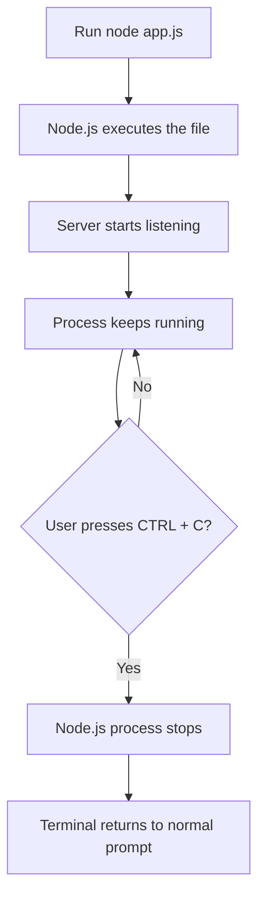

# 005 - Controlling the Node.js Process

## Section

Understanding the Basics

## Duration

1min

## Main Idea

This lesson explains how to stop a running Node.js server from the terminal.

When we start a Node.js server with a command like:

```bash
node app.js
```

the process keeps running because the server is listening for incoming requests. This is normal behavior for a web server.

To stop the running server manually, we can use:

```text
CTRL + C
```

inside the same terminal or command prompt window where the server was started.

---

## Learning Objectives

By the end of this lesson, you should be able to:

* Understand why a Node.js server keeps running after it starts.
* Stop a running Node.js process from the terminal.
* Know the difference between a running server process and a completed script.
* Recognize when you need to restart the server after making code changes.

---

## Why the Node.js Process Keeps Running

A normal Node.js script may finish immediately after all code has executed.

Example:

```js
console.log('Hello Node.js');
```

After printing the message, the process ends.

However, a server is different:

```js
const http = require('http');

const server = http.createServer((req, res) => {
  res.end('Hello from Node');
});

server.listen(3000);
```

This server keeps running because it is waiting for future requests.

---

## Node.js Server Process Flow



---

## How to Stop the Server

To stop a running Node.js server:

1. Go to the terminal where you started the server.
2. Press:

```text
CTRL + C
```

After that, the server process stops and the terminal becomes available again.

---

## Example

Start the server:

```bash
node app.js
```

The terminal may look like it is waiting:

```text
Server is listening on port 3000
```

Now stop it by pressing:

```text
CTRL + C
```

After stopping the server, visiting this URL will no longer work:

```text
http://localhost:3000
```

because the server is no longer running.

---

## When Do You Need to Stop the Process?

You may need to stop the Node.js process when:

* You want to shut down the server.
* You changed the code and need to restart the app.
* The server is stuck or behaving incorrectly.
* You want to run another command in the same terminal.
* You want to change the port or server configuration.

---

## Restarting the Server

After stopping the process, you can start it again with:

```bash
node app.js
```

If you changed your code, restarting the server allows Node.js to load the updated version of the file.

---

## Important Note

`CTRL + C` stops the Node.js process from outside the application.

This is different from using:

```js
process.exit();
```

`process.exit()` stops the process from inside the code, but it is usually not used in normal server request handling because it would shut down the server and make the application unavailable.

---

## Practical Example

```js
const http = require('http');

const server = http.createServer((req, res) => {
  res.statusCode = 200;
  res.setHeader('Content-Type', 'text/plain');
  res.end('Server is running');
});

server.listen(3000, () => {
  console.log('Server is listening on port 3000');
});
```

Run:

```bash
node app.js
```

Visit:

```text
http://localhost:3000
```

Stop the server:

```text
CTRL + C
```

---

## Practice

Create a basic Node.js server and practice controlling the process.

Steps:

```text
1. Create app.js.
2. Start the server with node app.js.
3. Visit localhost:3000 in the browser.
4. Stop the server with CTRL + C.
5. Try visiting localhost:3000 again.
6. Restart the server with node app.js.
```

This helps you understand that the server only works while the Node.js process is running.

---

## Review Questions

1. Why does a Node.js server keep running after executing `node app.js`?
2. What keyboard shortcut stops a running Node.js process?
3. Where should you press `CTRL + C`?
4. What happens to `localhost:3000` after the server is stopped?
5. Why might you need to restart a Node.js server?
6. What is the difference between using `CTRL + C` and calling `process.exit()`?
7. How can you prove that the server has stopped?

---

## Summary

This lesson explains how to control a running Node.js process.

When a server is started with `node app.js`, it keeps running because it listens for incoming requests. To stop it, press `CTRL + C` in the terminal where the server was started.

This is an essential habit when working with Node.js because you will often start, stop, and restart your server while developing backend applications.
