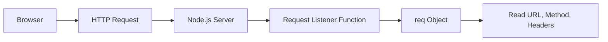
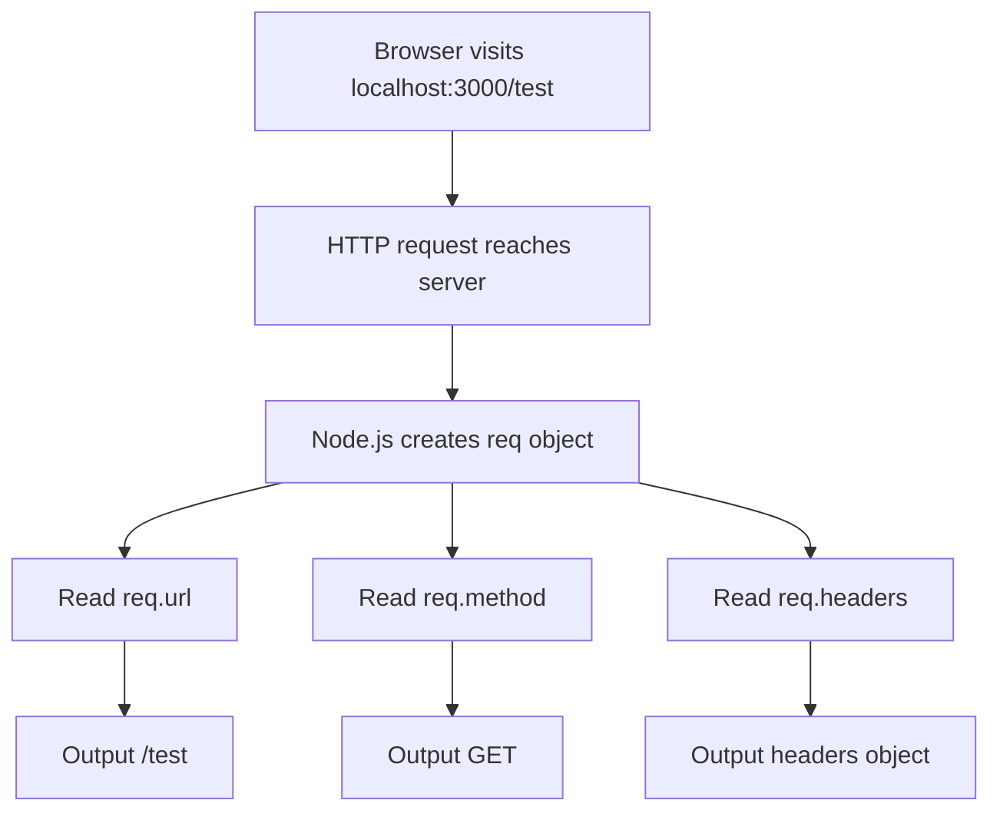
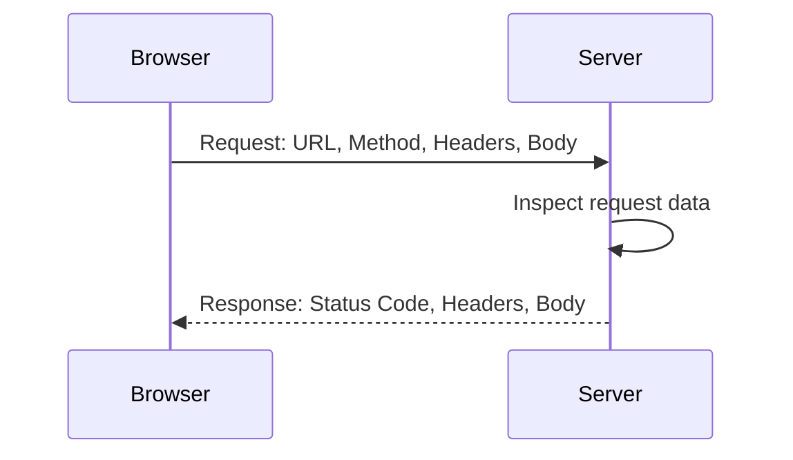

# 006 - Understanding Requests

## Section

Understanding the Basics

## Duration

3min

## Main Idea

This lesson explains how to inspect the incoming request object in a Node.js server.

When a browser sends a request to a Node.js server, Node.js creates a request object for us. This object contains information about the incoming request, such as the requested URL, the HTTP method, and the headers.

The request object can be very large and complex, but in most cases, we only need a few important properties to understand what the client is asking for.

---

## Learning Objectives

By the end of this lesson, you should be able to:

* Understand what the request object represents.
* Access important request information in Node.js.
* Read the requested URL path.
* Read the HTTP request method.
* Inspect request headers.
* Understand that headers contain metadata about the request.
* Recognize why request data is important for routing and backend logic.

---

## What Is the Request Object?

In a Node.js server, the request object is automatically created by Node.js for every incoming request.

Example:

```js id="s2qcyp"
const http = require('http');

const server = http.createServer((req, res) => {
  console.log(req);
});

server.listen(3000);
```

In this example, `req` represents the incoming request.

When the browser visits:

```text id="plg7uo"
http://localhost:3000
```

Node.js receives the request and gives us access to its data through the `req` object.

---

## Request Object Flow



---

## Why the Request Object Is Important

The server needs to understand what the client wants.

For example, the server may need to know:

* Which page was requested.
* Which HTTP method was used.
* Which headers were sent.
* Whether the client accepts HTML, JSON, or other formats.
* Whether cookies were attached.
* Whether request body data was sent.

Without inspecting the request, the server cannot decide what response to send back.

---

## Important Request Properties

The full request object contains a lot of data, but some properties are especially useful.

| Property      | Meaning                                  |
| ------------- | ---------------------------------------- |
| `req.url`     | The requested path after the domain      |
| `req.method`  | The HTTP method, such as `GET` or `POST` |
| `req.headers` | Metadata sent with the request           |

---

## Reading the Request URL

The `url` property tells us which path the client requested.

```js id="x84ojr"
console.log(req.url);
```

If the browser visits:

```text id="6gtlhj"
http://localhost:3000/
```

The logged URL is:

```text id="j79c0z"
/
```

If the browser visits:

```text id="i7cavi"
http://localhost:3000/test
```

The logged URL is:

```text id="v71n9l"
/test
```

The URL stored in `req.url` is not the full address. It is the part after the host.

---

## Reading the Request Method

The `method` property tells us which HTTP method was used.

```js id="bx6kuy"
console.log(req.method);
```

For a normal browser page visit, the method is usually:

```text id="grz9px"
GET
```

Example:

```text id="z4nhl4"
GET /
GET /test
```

Later, when working with forms or APIs, we will also use methods such as:

```text id="ge2l68"
POST
PUT
PATCH
DELETE
```

---

## Reading Request Headers

Headers contain metadata about the request.

```js id="ig8nzu"
console.log(req.headers);
```

Headers can include information such as:

* The host.
* The browser being used.
* Accepted response formats.
* Accepted encoding.
* Cookies.
* Cache preferences.
* Language preferences.

Example header data:

```js id="vc9bpt"
{
  host: 'localhost:3000',
  connection: 'keep-alive',
  accept: 'text/html,application/xhtml+xml,application/xml',
  'accept-encoding': 'gzip, deflate, br',
  'user-agent': 'Mozilla/5.0'
}
```

---

## What Are Headers?

Headers are metadata attached to requests and responses.

They do not usually contain the main content. Instead, they describe the request or response.

For example:

```text id="m412py"
Accept: text/html
```

This tells the server that the browser can accept an HTML response.

Another example:

```text id="sd981j"
Accept-Encoding: gzip, deflate, br
```

This tells the server that the browser can accept compressed responses.

---

## Request Inspection Example

```js id="rzm3t8"
const http = require('http');

const server = http.createServer((req, res) => {
  console.log(req.url);
  console.log(req.method);
  console.log(req.headers);
});

server.listen(3000);
```

Run the file:

```bash id="m5hw10"
node app.js
```

Then visit:

```text id="p7jj70"
http://localhost:3000
```

The terminal may show:

```text id="cmnri2"
/
GET
{
  host: 'localhost:3000',
  connection: 'keep-alive',
  accept: 'text/html,application/xhtml+xml,application/xml',
  'user-agent': 'Mozilla/5.0'
}
```

---

## Testing Different URLs

Visit:

```text id="qkfru1"
http://localhost:3000/test
```

Now the logged URL changes:

```text id="qxak9h"
/test
GET
{
  host: 'localhost:3000',
  ...
}
```

This proves that the server can inspect the requested path.

---

## Request Analysis Flow



---

## Why This Matters for Routing

The requested URL helps the server decide what logic should run.

For example:

```text id="gq5tfc"
/           → show homepage
/users      → show users page
/products   → show products page
/login      → show login page
```

A simple server can use `req.url` to decide which response to send.

Example:

```js id="bi38bf"
const http = require('http');

const server = http.createServer((req, res) => {
  const url = req.url;

  if (url === '/') {
    res.end('Welcome to the homepage');
  } else if (url === '/users') {
    res.end('Here are the users');
  } else {
    res.end('Page not found');
  }
});

server.listen(3000);
```

---

## Why This Matters for Request Methods

The method helps the server understand the intention of the request.

Example:

```text id="capomh"
GET /users     → fetch users
POST /users    → create a new user
DELETE /users  → delete users
```

The same URL can behave differently depending on the method.

Example:

```js id="k0m0kx"
if (req.url === '/message' && req.method === 'POST') {
  // Handle submitted form data
}
```

---

## Why This Matters for Headers

Headers affect how the server and client communicate.

Headers can influence:

* Content type.
* Caching.
* Cookies.
* Authentication.
* Compression.
* Redirects.
* Security.
* Content negotiation.

For example, a client may send:

```text id="nrbqzl"
Accept: application/json
```

This tells the server that the client expects JSON.

---

## Request vs Response



A request carries information from the client to the server.

A response carries information from the server back to the client.

---

## Important Note

In this lesson, we only inspect the request.

The server does not yet send a meaningful response.

That means the browser may keep waiting or show an empty result.

In the next step, we need to use the `res` object to send a response back.

---

## Complete Example

```js id="ax16an"
const http = require('http');

const server = http.createServer((req, res) => {
  console.log('URL:', req.url);
  console.log('Method:', req.method);
  console.log('Headers:', req.headers);

  res.statusCode = 200;
  res.setHeader('Content-Type', 'text/plain');
  res.end('Request received');
});

server.listen(3000);
```

Run:

```bash id="shn4s6"
node app.js
```

Test these URLs:

```text id="j7xpbg"
http://localhost:3000/
http://localhost:3000/test
http://localhost:3000/users
```

Observe how `req.url` changes in the terminal.

---

## Practice

Create a small Node.js server that logs request information.

Steps:

```text id="prw9oj"
1. Create app.js.
2. Import the http module.
3. Create a server with http.createServer().
4. Log req.url.
5. Log req.method.
6. Log req.headers.
7. Send a simple response.
8. Start the server on port 3000.
9. Visit different paths in the browser.
10. Compare the terminal output.
```

Example challenge:

```js id="ddzicc"
const http = require('http');

const server = http.createServer((req, res) => {
  console.log('Requested URL:', req.url);
  console.log('Request Method:', req.method);

  res.setHeader('Content-Type', 'text/html');

  if (req.url === '/') {
    res.end('<h1>Home Page</h1>');
  } else if (req.url === '/test') {
    res.end('<h1>Test Page</h1>');
  } else {
    res.end('<h1>Not Found</h1>');
  }
});

server.listen(3000);
```

---

## Review Questions

1. What does the `req` object represent?
2. Who creates the request object?
3. Why is the request object complex?
4. What does `req.url` return?
5. What does `req.method` return?
6. What does `req.headers` contain?
7. What is the URL value when visiting `localhost:3000/`?
8. What is the URL value when visiting `localhost:3000/test`?
9. Why are headers called metadata?
10. What kind of information can headers contain?
11. Why is the request method important?
12. How can the requested URL help with routing?
13. Why is inspecting the request important before sending a response?
14. What is still missing if we only log the request object?

---

## Summary

This lesson explains how to inspect incoming requests in Node.js.

Every time a browser sends a request to the server, Node.js creates a request object. This object contains a lot of information, but the most important properties at this stage are `req.url`, `req.method`, and `req.headers`.

The URL tells us which path was requested. The method tells us what kind of action the client wants to perform. The headers provide metadata about the request.

Understanding requests is essential because backend applications need request data to decide which logic to run and which response to send back.

---

# Bài luyện tập

## Mục tiêu


## Đề bài


## Yêu cầu hoàn thành

- [ ] 
- [ ] 
- [ ] 

## Kết quả / lời giải


## Ghi chú
