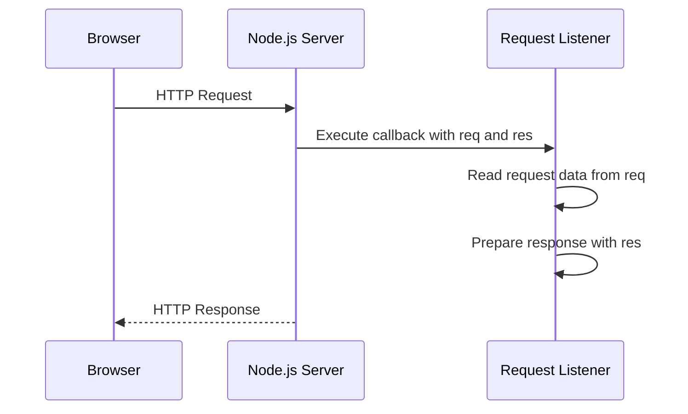
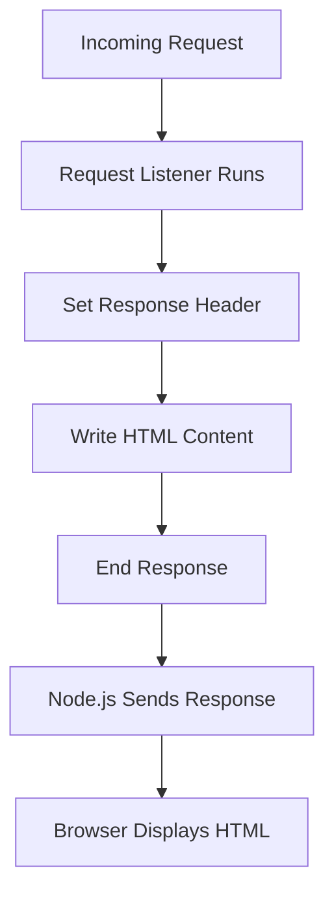
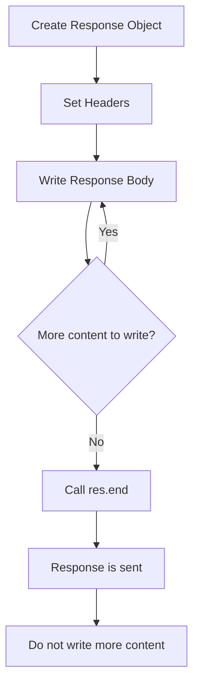

# 007 - Sending Responses

## Section

Understanding the Basics

## Duration

6min

## Main Idea

This lesson explains how to send a response from a Node.js server back to the browser.

In the previous lesson, we inspected the incoming request object and learned how to read data such as the request URL, method, and headers. In this lesson, we use the second object passed into the request listener: the **response object**, usually named `res`.

The response object allows us to define what the server sends back to the client. We can set response headers, write response body content, and finally end the response so Node.js can send it to the browser.

---

## Learning Objectives

By the end of this lesson, you should be able to:

* Understand what the `res` object is used for.
* Set response headers with `res.setHeader()`.
* Send HTML content from a Node.js server.
* Use `res.write()` to write response body data.
* Use `res.end()` to finish and send the response.
* Understand why you should not write to the response after calling `res.end()`.
* Inspect response headers and response body in browser developer tools.
* Understand the relationship between request handling and response sending.

---

## Request and Response Review

When a browser sends a request to a Node.js server, the request listener receives two objects:

```js
(req, res) => {
  // req = incoming request
  // res = outgoing response
}
```

| Object | Purpose                                         |
| ------ | ----------------------------------------------- |
| `req`  | Contains information about the incoming request |
| `res`  | Allows us to send a response back to the client |

---

## Request-Response Flow



---

## Why We Need to Restart the Server

When you edit your Node.js file, the already running process does not automatically use the new code.

You need to stop the server and restart it.

Stop the server:

```text
CTRL + C
```

Start it again:

```bash
node app.js
```

This reloads the updated code.

---

## The Response Object

The `res` object does not mainly contain useful data for us to inspect.

Instead, we use it to create the response that should be sent back to the browser.

With `res`, we can:

* Set headers.
* Set status codes.
* Write response content.
* Send HTML.
* Send text.
* Send JSON.
* End the response.

---

## Setting a Response Header

Before sending HTML, we should tell the browser what kind of content it is receiving.

We do that with:

```js
res.setHeader('Content-Type', 'text/html');
```

### Explanation

```text
Content-Type
```

is the name of the header.

```text
text/html
```

tells the browser that the response body contains HTML.

This is important because the browser uses the `Content-Type` header to decide how to handle the response.

---

## Important Note About Content-Type

The correct value for HTML is:

```text
text/html
```

Not:

```text
text.html
```

`text/html` is the MIME type understood by browsers.

---

## Writing Response Body Content

To send content, we can use:

```js
res.write();
```

Example:

```js
res.write('<html>');
res.write('<head><title>My First Page</title></head>');
res.write('<body><h1>Hello from my Node.js Server!</h1></body>');
res.write('</html>');
```

Each `res.write()` call adds more content to the response body.

You can think of it as writing the response in chunks.

---

## Ending the Response

After writing all response content, we must call:

```js
res.end();
```

This tells Node.js:

```text
The response is complete. Send it back to the client.
```

After calling `res.end()`, we should not call `res.write()` again.

Doing so can cause an error because the response has already been finalized.

---

## Basic Response Flow



---

## Complete Code Example

```js
const http = require('http');

const server = http.createServer((req, res) => {
  res.setHeader('Content-Type', 'text/html');

  res.write('<html>');
  res.write('<head><title>My First Page</title></head>');
  res.write('<body>');
  res.write('<h1>Hello from my Node.js Server!</h1>');
  res.write('</body>');
  res.write('</html>');

  res.end();
});

server.listen(3000);
```

---

## Running the Server

Run the file:

```bash
node app.js
```

Then open the browser and visit:

```text
http://localhost:3000
```

Expected browser output:

```text
Hello from my Node.js Server!
```

The browser displays the text as a heading because the response contains HTML.

---

## What Happens Internally


---

## Inspecting the Response in Developer Tools

You can inspect the response using browser developer tools.

In Chrome:

```text
Right click page → Inspect → Network tab → Reload page → Click the request
```

There you can inspect:

* Request headers.
* Response headers.
* Response body.
* Status code.
* Content type.

You should see the response header:

```text
Content-Type: text/html
```

And the response body should contain the HTML code sent from Node.js.

---

## Example Response Body

The browser receives something like this:

```html
<html>
  <head>
    <title>My First Page</title>
  </head>
  <body>
    <h1>Hello from my Node.js Server!</h1>
  </body>
</html>
```

The browser then renders the HTML page.

---

## Why Headers Matter

Headers provide metadata about the response.

For example, the `Content-Type` header tells the browser how to interpret the response body.

Common response content types include:

| Content-Type             | Meaning         |
| ------------------------ | --------------- |
| `text/html`              | HTML document   |
| `text/plain`             | Plain text      |
| `application/json`       | JSON data       |
| `text/css`               | CSS file        |
| `application/javascript` | JavaScript file |
| `image/png`              | PNG image       |

---

## Response Methods Used in This Lesson

| Method            | Purpose                          |
| ----------------- | -------------------------------- |
| `res.setHeader()` | Adds metadata to the response    |
| `res.write()`     | Writes data to the response body |
| `res.end()`       | Finishes and sends the response  |

---

## Response Lifecycle



---

## Important Rule

Once you call:

```js
res.end();
```

you should not call:

```js
res.write();
```

again for the same response.

Bad example:

```js
res.end();
res.write('This will cause a problem');
```

The response has already been finished, so writing more data is invalid.

---

## Connecting Requests and Responses

A real server usually reads the request and then decides what response to send.

Example:

```js
const http = require('http');

const server = http.createServer((req, res) => {
  const url = req.url;

  res.setHeader('Content-Type', 'text/html');

  if (url === '/') {
    res.write('<html>');
    res.write('<head><title>Home</title></head>');
    res.write('<body><h1>Welcome Home</h1></body>');
    res.write('</html>');
    return res.end();
  }

  if (url === '/users') {
    res.write('<html>');
    res.write('<head><title>Users</title></head>');
    res.write('<body><h1>Users Page</h1></body>');
    res.write('</html>');
    return res.end();
  }

  res.write('<html>');
  res.write('<head><title>Not Found</title></head>');
  res.write('<body><h1>Page Not Found</h1></body>');
  res.write('</html>');
  res.end();
});

server.listen(3000);
```

---

## Why This Lesson Matters

This lesson shows the most basic version of server-side response handling.

Later, frameworks like Express.js will make this much easier.

Instead of manually writing every HTML line with `res.write()`, we will use cleaner tools and methods.

However, it is important to understand what happens behind the scenes:

```text
Request comes in → Server prepares response → Server sends response back
```

---

## Practical Example

Create a simple HTML response:

```js
const http = require('http');

const server = http.createServer((req, res) => {
  res.statusCode = 200;
  res.setHeader('Content-Type', 'text/html');

  res.write('<html>');
  res.write('<head><title>Node Response</title></head>');
  res.write('<body>');
  res.write('<h1>Hello from Node.js!</h1>');
  res.write('<p>This page was generated by a Node.js server.</p>');
  res.write('</body>');
  res.write('</html>');

  res.end();
});

server.listen(3000);
```

Run:

```bash
node app.js
```

Visit:

```text
http://localhost:3000
```

Expected result:

```text
Hello from Node.js!
This page was generated by a Node.js server.
```

---

## Practice

Recreate the response handling logic in a small `app.js` file.

Steps:

```text
1. Stop the old server with CTRL + C.
2. Open app.js.
3. Import the http module.
4. Create a server with http.createServer().
5. Set the Content-Type header to text/html.
6. Write a complete HTML response.
7. End the response with res.end().
8. Restart the server with node app.js.
9. Visit localhost:3000 in the browser.
10. Inspect the response in the Network tab.
```

---

## Practice Challenge

Create a server with two different pages:

```text
/       → Home page
/about  → About page
```

Example behavior:

```text
http://localhost:3000/
Displays: Welcome to the Home Page

http://localhost:3000/about
Displays: About This Node.js App
```

Starter code:

```js
const http = require('http');

const server = http.createServer((req, res) => {
  const url = req.url;

  res.setHeader('Content-Type', 'text/html');

  if (url === '/') {
    res.write('<h1>Welcome to the Home Page</h1>');
    return res.end();
  }

  if (url === '/about') {
    res.write('<h1>About This Node.js App</h1>');
    return res.end();
  }

  res.write('<h1>404 - Page Not Found</h1>');
  res.end();
});

server.listen(3000);
```

---

## Review Questions

1. What is the purpose of the `res` object?
2. Why do we use `res.setHeader()`?
3. What does the `Content-Type` header do?
4. What is the correct content type for HTML?
5. What does `res.write()` do?
6. Why can we call `res.write()` multiple times?
7. What does `res.end()` do?
8. Why should we not call `res.write()` after `res.end()`?
9. Why do we need to restart the server after editing the code?
10. How can you inspect response headers in the browser?
11. What should the browser display after receiving the HTML response?
12. Why is it useful to understand this before learning Express.js?

---

## Summary

This lesson explains how to send responses from a Node.js server.

The `res` object is used to build and send the response. We can use `res.setHeader()` to define metadata such as the response content type, `res.write()` to add body content, and `res.end()` to finish and send the response.

In this lesson, we send a simple HTML document from a Node.js server to the browser. The browser receives the response, reads the `Content-Type: text/html` header, and renders the HTML content.

Although writing HTML manually with `res.write()` is not convenient for larger applications, it helps us understand the low-level process behind server responses. Later, frameworks like Express.js will simplify this workflow.
