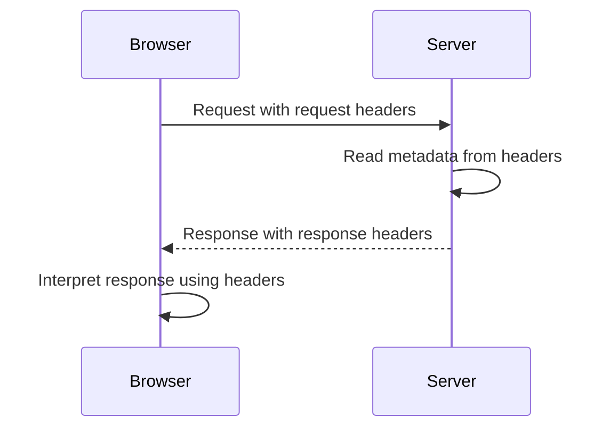

# 008 - Request & Response Headers

## Section

Understanding the Basics

## Duration

1min

## Main Idea

This lesson introduces the role of **HTTP headers** in requests and responses.

Headers are used to transport metadata between the client and the server. They do not usually contain the main content of the request or response. Instead, they describe important information about that content, the connection, caching behavior, accepted formats, cookies, security settings, and more.

You do not need to memorize all HTTP headers. Instead, you should understand the general idea and learn specific headers when they appear in real examples throughout the course.

---

## Learning Objectives

By the end of this lesson, you should be able to:

* Understand what HTTP headers are.
* Explain why requests and responses use headers.
* Recognize headers as metadata.
* Identify common use cases for headers.
* Understand that headers are important but do not need to be memorized.
* Know where to find official documentation for HTTP headers.

---

## What Are HTTP Headers?

HTTP headers are pieces of metadata attached to HTTP requests and responses.

They help describe how data should be sent, interpreted, cached, secured, or processed.


---

## Request Headers

Request headers are sent from the client to the server.

They can tell the server information such as:

* Which browser or client is making the request.
* Which content types the client accepts.
* Which language the client prefers.
* Whether cookies are attached.
* Whether the client accepts compressed responses.
* Authentication or authorization data.
* Cache-related instructions.

Example request headers:

```text id="f23y39"
Host: localhost:3000
Accept: text/html
Accept-Encoding: gzip, deflate, br
User-Agent: Mozilla/5.0
Cookie: sessionId=abc123
```

---

## Response Headers

Response headers are sent from the server back to the client.

They can tell the browser information such as:

* What type of content is being returned.
* Whether the response should be cached.
* Whether cookies should be stored.
* Whether the browser should redirect.
* Which security rules should apply.
* How the response body is encoded.

Example response headers:

```text id="qdmw0z"
Content-Type: text/html
Set-Cookie: sessionId=abc123
Cache-Control: no-cache
Location: /login
```

---

## Request and Response Header Flow



---

## Why Headers Matter

Headers influence many important parts of web communication.

They can affect:

| Area                | Example                                                                     |
| ------------------- | --------------------------------------------------------------------------- |
| Content type        | Tell the browser whether the response is HTML, JSON, CSS, or another format |
| Caching             | Control whether the browser should reuse a response                         |
| Cookies             | Send or receive stored client data                                          |
| Redirects           | Tell the browser to visit another URL                                       |
| Security            | Apply browser security rules                                                |
| Compression         | Reduce response size                                                        |
| Content negotiation | Decide which format the client wants                                        |

---

## Common Header Examples

### `Content-Type`

Tells the client what kind of data is being sent.

```text id="js1od7"
Content-Type: text/html
```

Example in Node.js:

```js id="rkd35k"
res.setHeader('Content-Type', 'text/html');
```

---

### `Accept`

Tells the server what kind of response the client can accept.

```text id="y8q7k9"
Accept: text/html, application/json
```

---

### `User-Agent`

Tells the server which browser or client is making the request.

```text id="rxbkyr"
User-Agent: Mozilla/5.0
```

---

### `Cookie`

Sends stored cookie data from the browser to the server.

```text id="26dnfu"
Cookie: sessionId=abc123
```

---

### `Set-Cookie`

Sends a cookie from the server to the browser.

```text id="z925m2"
Set-Cookie: sessionId=abc123
```

---

### `Location`

Often used for redirects.

```text id="si0oyr"
Location: /login
```

---

## Headers in a Node.js Server

In Node.js, we can inspect request headers through `req.headers`.

```js id="zbi9xk"
const http = require('http');

const server = http.createServer((req, res) => {
  console.log(req.headers);

  res.setHeader('Content-Type', 'text/html');
  res.write('<h1>Hello from Node.js</h1>');
  res.end();
});

server.listen(3000);
```

In this example:

```text id="dtilwk"
req.headers
```

contains metadata sent by the browser.

```text id="nzzdox"
res.setHeader()
```

adds metadata to the response.

---

## Practical Example

```js id="y6fm57"
const http = require('http');

const server = http.createServer((req, res) => {
  console.log('Request Headers:', req.headers);

  res.statusCode = 200;
  res.setHeader('Content-Type', 'text/html');
  res.setHeader('Cache-Control', 'no-cache');

  res.write('<html>');
  res.write('<head><title>Headers Example</title></head>');
  res.write('<body>');
  res.write('<h1>Request and Response Headers</h1>');
  res.write('<p>Check the terminal and browser developer tools.</p>');
  res.write('</body>');
  res.write('</html>');

  res.end();
});

server.listen(3000);
```

Run:

```bash id="sbtyly"
node app.js
```

Then visit:

```text id="ozdvqr"
http://localhost:3000
```

Open the browser developer tools and inspect the **Network** tab to see request and response headers.

---

## Useful Resource

A useful reference for HTTP headers is the MDN documentation:

```text id="whj7ol"
https://developer.mozilla.org/en-US/docs/Web/HTTP/Headers
```

This page provides a detailed overview of available HTTP headers and their roles.

However, you do not need to memorize the full list. You will encounter important headers gradually as they become relevant.

---

## Practice

Create a small Node.js server that logs request headers and sends response headers.

Steps:

```text id="fl2ua8"
1. Create app.js.
2. Import the http module.
3. Create a server with http.createServer().
4. Log req.headers.
5. Set the Content-Type response header.
6. Send a simple HTML response.
7. Run the server.
8. Open the browser developer tools.
9. Inspect the request and response headers.
```

---

## Review Questions

1. What are HTTP headers?
2. Why are headers called metadata?
3. Are headers used only in requests?
4. What kind of information can request headers contain?
5. What kind of information can response headers contain?
6. What does the `Content-Type` header do?
7. What does the `Accept` header tell the server?
8. What is the difference between `Cookie` and `Set-Cookie`?
9. How can you read request headers in Node.js?
10. How can you set response headers in Node.js?
11. Why should you not memorize all HTTP headers?
12. Where can you find a detailed reference for HTTP headers?

---

## Summary

This lesson explains that HTTP headers are metadata added to both requests and responses.

Request headers help the server understand details about the client and the incoming request. Response headers help the browser understand how to handle the returned data.

Headers can influence content types, caching, cookies, redirects, compression, security, and more.

Although headers are very important, you do not need to memorize every possible header. It is better to understand their general purpose and learn specific headers when they appear in real projects.
