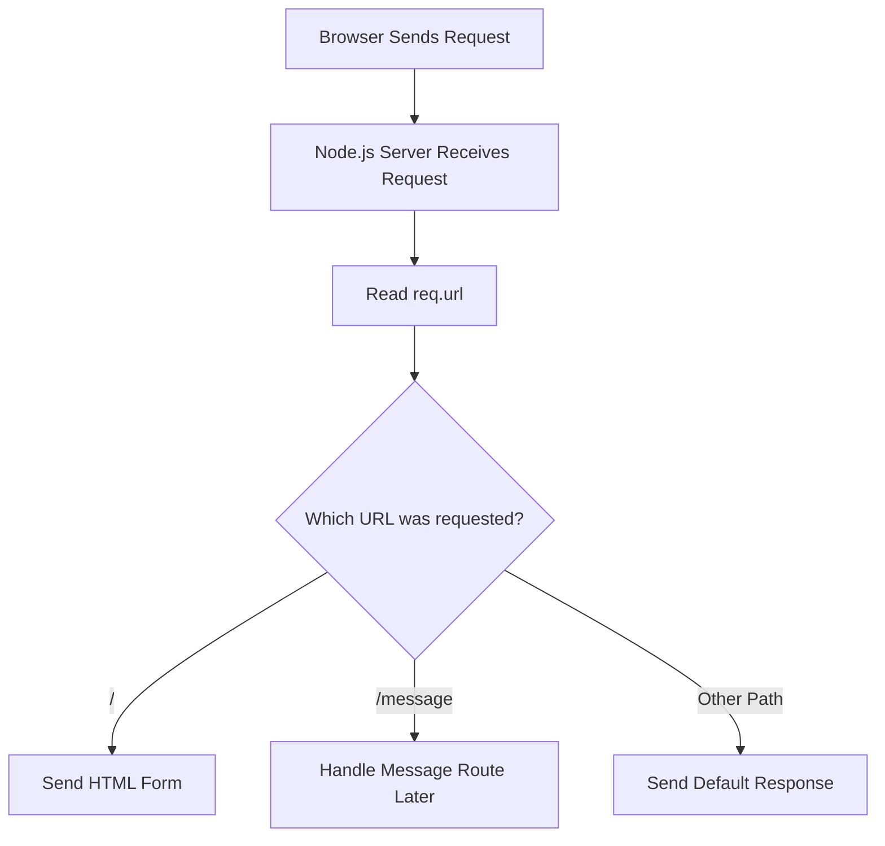
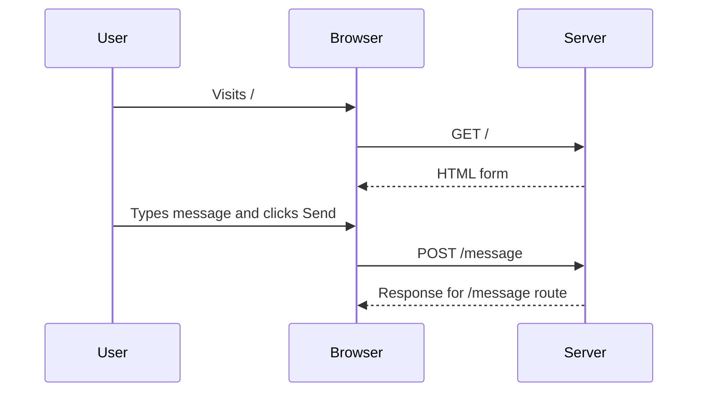

# 009 - Routing Requests

## Section

Understanding the Basics

## Duration

6min

## Main Idea

This lesson explains how to route incoming requests in a basic Node.js server.

So far, we have learned how to create a server, inspect incoming requests, and send responses. Now we connect those ideas together by checking the requested URL and returning different responses depending on the route.

A route is a combination of:

```text id="b51x3f"
HTTP method + URL path + response logic
```

In this lesson, we use `req.url` to check which path the browser requested. If the user visits `/`, we send back an HTML form. That form can submit a new request to `/message` using the `POST` method.

---

## Learning Objectives

By the end of this lesson, you should be able to:

* Understand what routing means in a backend application.
* Use `req.url` to inspect the requested path.
* Send different responses for different URLs.
* Build a simple HTML form from a Node.js response.
* Understand the difference between `GET` and `POST` requests.
* Use a form’s `action` and `method` attributes.
* Understand why `return res.end()` is useful.
* Prepare for handling submitted form data in later lessons.

---

## What Is Routing?

Routing means deciding what the server should do based on the incoming request.

For example:

```text id="s2bteh"
/          → Show homepage
/message   → Handle submitted message
/users     → Show users page
/products  → Show products page
```

A server needs routing because different URLs should usually trigger different behavior.

---

## Basic Routing Flow



---

## Reading the URL

Inside the request listener, we can access the requested path with:

```js id="wvvzrr"
const url = req.url;
```

Example:

```text id="ydwuig"
http://localhost:3000/        → req.url is "/"
http://localhost:3000/test    → req.url is "/test"
http://localhost:3000/message → req.url is "/message"
```

The URL does not include the full domain. It only includes the path after the host.

---

## Creating a Route for `/`

We can use an `if` statement to check whether the user requested the homepage.

```js id="cbb3iv"
if (url === '/') {
  // Send homepage response
}
```

The triple equals operator `===` checks both value and type.

So this condition is true only when `url` is a string with the exact value `/`.

---

## Sending an HTML Form

For the `/` route, we send an HTML form to the browser.

```js id="w3h8ka"
res.setHeader('Content-Type', 'text/html');

res.write('<html>');
res.write('<head><title>Enter Message</title></head>');
res.write('<body>');
res.write('<form action="/message" method="POST">');
res.write('<input type="text" name="message">');
res.write('<button type="submit">Send</button>');
res.write('</form>');
res.write('</body>');
res.write('</html>');

return res.end();
```

This returns a basic page where the user can enter a message and submit it.

---

## Complete Basic Routing Example

```js id="oqzyjk"
const http = require('http');

const server = http.createServer((req, res) => {
  const url = req.url;

  if (url === '/') {
    res.setHeader('Content-Type', 'text/html');

    res.write('<html>');
    res.write('<head><title>Enter Message</title></head>');
    res.write('<body>');
    res.write('<form action="/message" method="POST">');
    res.write('<input type="text" name="message">');
    res.write('<button type="submit">Send</button>');
    res.write('</form>');
    res.write('</body>');
    res.write('</html>');

    return res.end();
  }

  res.setHeader('Content-Type', 'text/html');
  res.write('<html>');
  res.write('<head><title>My First Page</title></head>');
  res.write('<body><h1>Hello from my Node.js Server!</h1></body>');
  res.write('</html>');
  res.end();
});

server.listen(3000);
```

---

## Understanding the Form

The form element is important because it can automatically send a new request when the user clicks the submit button.

```html id="rhtrif"
<form action="/message" method="POST">
  <input type="text" name="message">
  <button type="submit">Send</button>
</form>
```

---

## Form Attributes

| Attribute           | Meaning                                       |
| ------------------- | --------------------------------------------- |
| `action="/message"` | The URL where the form request should be sent |
| `method="POST"`     | The HTTP method used for the form submission  |
| `name="message"`    | The key used for the submitted input value    |
| `type="submit"`     | Makes the button submit the form              |

---

## Form Submission Flow



---

## GET vs POST

In this lesson, we see two important HTTP methods: `GET` and `POST`.

### GET

A `GET` request is usually used to request or load data.

Examples:

```text id="sfa6tz"
Opening a URL in the browser
Clicking a normal link
Loading a webpage
```

When we visit:

```text id="m5uhyu"
http://localhost:3000/
```

the browser sends a `GET` request by default.

---

### POST

A `POST` request is usually used to send data to the server.

Examples:

```text id="ubwofw"
Submitting a form
Creating a new message
Sending login information
Creating a new user
```

In this lesson, the form sends a `POST` request to `/message`.

```html id="j54hgq"
<form action="/message" method="POST">
```

---

## Why the Input Needs a `name`

The input field should have a `name` attribute.

```html id="yfd3l4"
<input type="text" name="message">
```

The `name` becomes the key for the submitted form data.

For example, if the user types:

```text id="byw66x"
Hello Node.js
```

the submitted data will be associated with the key:

```text id="ku4hnv"
message
```

Later, we can parse this submitted data on the server.

---

## Why We Use `return res.end()`

Inside the `/` route, we call:

```js id="njeymr"
return res.end();
```

The `res.end()` part finishes the response.

The `return` part exits the request listener function immediately.

This matters because after ending a response, we should not continue writing more response data.

---

## Without `return`

Bad example:

```js id="e6h918"
if (url === '/') {
  res.write('<h1>Home</h1>');
  res.end();
}

res.write('<h1>Another Response</h1>');
res.end();
```

This can cause problems because the code continues after the first response has already ended.

---

## With `return`

Better example:

```js id="l7akp7"
if (url === '/') {
  res.write('<h1>Home</h1>');
  return res.end();
}

res.write('<h1>Another Response</h1>');
res.end();
```

Now the function stops after sending the homepage response.

---

## Route Handling Flow

```mermaid id="uxedc5"
flowchart TD
    A[Request Arrives] --> B[Store req.url in url]
    B --> C{url === "/"?}
    C -->|Yes| D[Set Content-Type header]
    D --> E[Write HTML form]
    E --> F[return res.end]
    C -->|No| G[Run default response code]
    G --> H[Send default HTML page]
```

---

## What Happens When Visiting `/`

Visit:

```text id="ds8hry"
http://localhost:3000/
```

The server checks:

```js id="dq8xdc"
url === '/'
```

This condition is true, so the server sends the HTML form.

Expected browser output:

```text id="j57h4u"
[ input field ] [ Send button ]
```

---

## What Happens When Submitting the Form

After typing a message and clicking **Send**, the browser sends a new request:

```text id="uvzxll"
POST /message
```

At this point in the lesson, there is no special `/message` route yet.

So the request does not match the `/` route and falls through to the default response.

Later lessons will handle the `/message` route properly.

---

## Current Behavior

| User Action   | Request         | Server Behavior                           |
| ------------- | --------------- | ----------------------------------------- |
| Visit `/`     | `GET /`         | Sends HTML form                           |
| Submit form   | `POST /message` | Falls through to default response for now |
| Visit `/test` | `GET /test`     | Sends default response                    |

---

## Important Concept: Method + Path

A route is not only about the path.

A complete route usually combines:

```text id="p6aofw"
HTTP method + URL path
```

Example:

```text id="ogj3k1"
GET /message   → Show message page
POST /message  → Submit a new message
```

The same path can have different behavior depending on the method.

---

## Express.js Preview

Later, when using Express.js, routing will become much cleaner.

Example:

```js id="worr3f"
app.get('/products/:productId', (req, res) => {
  res.send(`Product ${req.params.productId}`);
});
```

This Express route means:

```text id="gv5ryn"
GET request to /products/:productId
```

The `:productId` part is a dynamic route parameter.

Example:

```text id="d3ub67"
/products/10  → productId is 10
/products/25  → productId is 25
```

In this current lesson, however, we are still using the native Node.js `http` module to understand what happens behind the scenes.

---

## Practical Example

Try adding one more route:

```js id="seq3d9"
const http = require('http');

const server = http.createServer((req, res) => {
  const url = req.url;

  res.setHeader('Content-Type', 'text/html');

  if (url === '/') {
    res.write('<h1>Home Page</h1>');
    res.write('<form action="/message" method="POST">');
    res.write('<input type="text" name="message">');
    res.write('<button type="submit">Send</button>');
    res.write('</form>');
    return res.end();
  }

  if (url === '/about') {
    res.write('<h1>About Page</h1>');
    return res.end();
  }

  res.write('<h1>Default Page</h1>');
  res.end();
});

server.listen(3000);
```

Test these paths:

```text id="ldpw6n"
http://localhost:3000/
http://localhost:3000/about
http://localhost:3000/test
```

---

## Practice

Create a small routing experiment.

Steps:

```text id="qdzbbf"
1. Create or open app.js.
2. Import the http module.
3. Create a server.
4. Store req.url in a constant named url.
5. If url is "/", send a form.
6. The form should submit to "/message" with method "POST".
7. Use return res.end() after sending the form response.
8. Add a default response for all other routes.
9. Restart the server.
10. Visit "/" and submit the form.
```

---

## Review Questions

1. What does routing mean in a server application?
2. Which request property can we use to inspect the requested path?
3. What does `req.url` return for `localhost:3000/`?
4. What does `req.url` return for `localhost:3000/message`?
5. Why do we check `url === '/'`?
6. What does a form’s `action` attribute define?
7. What does a form’s `method` attribute define?
8. What is the default method when entering a URL in the browser?
9. What is a `POST` request usually used for?
10. Why should an input field have a `name` attribute?
11. Why do we use `return res.end()` inside the `if` block?
12. What happens if we call `res.write()` after `res.end()`?
13. What happens after submitting the form to `/message` in this lesson?
14. Why is routing important before building larger applications?

---

## Summary

This lesson introduces routing in a basic Node.js server.

Routing allows the server to do different things depending on the requested URL. By checking `req.url`, we can decide which response should be sent back to the browser.

For the `/` route, we send an HTML form. The form uses `action="/message"` and `method="POST"` so that submitting it sends a new request to `/message`.

This lesson also introduces an important pattern: after sending a response inside a route, we use `return res.end()` to stop the function and avoid writing more response data later.

Routing is a core backend concept. As applications grow, routes help organize how different URLs and HTTP methods map to different pieces of server-side logic.
