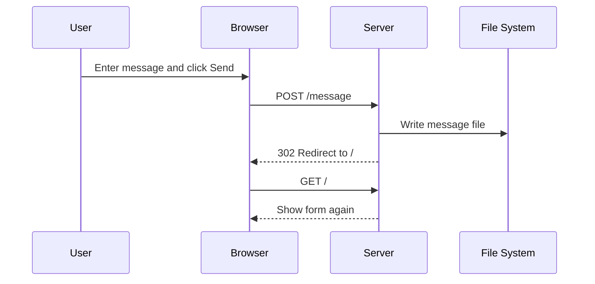
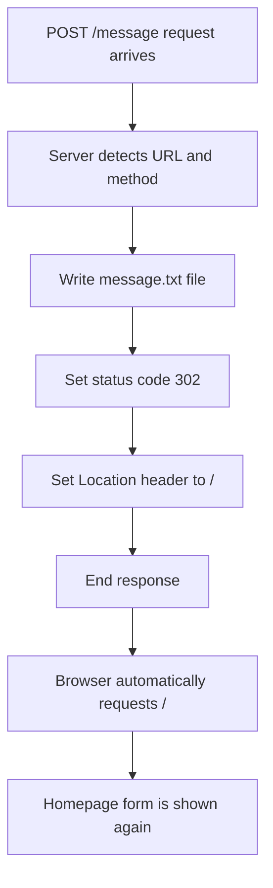

# 010 - Redirecting Requests

## Section

Understanding the Basics

## Duration

4min

## Main Idea

This lesson explains how to handle a submitted form request and redirect the user after processing it.

In the previous lesson, we created a form on the `/` route. When the user enters a message and clicks the **Send** button, the browser sends a `POST` request to `/message`.

In this lesson, we add a new route condition for:

```text
POST /message
```

When this request is received, the server writes a file using Node.js’ `fs` module and then redirects the user back to `/`.

---

## Learning Objectives

By the end of this lesson, you should be able to:

* Handle a specific route using both `req.url` and `req.method`.
* Understand why `POST /message` is different from `GET /message`.
* Import and use the Node.js `fs` core module.
* Write data to a file on the server.
* Redirect the browser using a `302` status code.
* Set the `Location` header for redirection.
* Use `return res.end()` to stop further response execution.
* Understand the basic flow of form submission and redirection.

---

## Why Redirecting Is Needed

When the user submits the form, the browser sends a request to:

```text
/message
```

If we do not redirect, the user stays on `/message`.

Instead, we want to:

```text
1. Receive the submitted request.
2. Process the request on the server.
3. Store some data in a file.
4. Redirect the user back to the homepage.
```

This is a common backend pattern after form submissions.

---

## Current Form Route

The form from the previous lesson looks like this:

```html
<form action="/message" method="POST">
  <input type="text" name="message">
  <button type="submit">Send</button>
</form>
```

This means:

| Part                | Meaning                                      |
| ------------------- | -------------------------------------------- |
| `action="/message"` | Send the form request to `/message`          |
| `method="POST"`     | Use the `POST` HTTP method                   |
| `name="message"`    | Send the input value under the key `message` |

---

## Form Submission Flow



---

## Importing the File System Module

To write a file, we need Node.js’ built-in file system module.

```js
const fs = require('fs');
```

The `fs` module allows us to work with files on the server.

For example, we can:

* Create files.
* Read files.
* Write files.
* Delete files.
* Update file contents.

---

## Detecting the `/message` Route

We need to check both the URL and the HTTP method.

```js
const url = req.url;
const method = req.method;

if (url === '/message' && method === 'POST') {
  // Handle form submission
}
```

This condition only runs when the browser sends a `POST` request to `/message`.

---

## Why Check Both URL and Method?

The path alone is not always enough.

These two requests are different:

```text
GET /message
POST /message
```

A `GET` request usually asks for data or a page.

A `POST` request usually sends data to the server.

So this condition is more precise:

```js
if (url === '/message' && method === 'POST') {
  // Handle submitted form data
}
```

---

## Writing a File

For now, we write dummy text into a file.

```js
fs.writeFileSync('message.txt', 'DUMMY');
```

This creates or overwrites a file named:

```text
message.txt
```

The file is created in the same folder as `app.js`.

---

## Redirecting the User

To redirect the user, we send a response with:

```js
res.statusCode = 302;
res.setHeader('Location', '/');
return res.end();
```

### Explanation

| Code          | Meaning                                   |
| ------------- | ----------------------------------------- |
| `302`         | HTTP status code for redirect             |
| `Location: /` | Tells the browser where to go next        |
| `res.end()`   | Finishes and sends the response           |
| `return`      | Stops the request handler from continuing |

---

## Redirect Flow



---

## Complete Code Example

```js
const http = require('http');
const fs = require('fs');

const server = http.createServer((req, res) => {
  const url = req.url;
  const method = req.method;

  if (url === '/') {
    res.setHeader('Content-Type', 'text/html');

    res.write('<html>');
    res.write('<head><title>Enter Message</title></head>');
    res.write('<body>');
    res.write('<form action="/message" method="POST">');
    res.write('<input type="text" name="message">');
    res.write('<button type="submit">Send</button>');
    res.write('</form>');
    res.write('</body>');
    res.write('</html>');

    return res.end();
  }

  if (url === '/message' && method === 'POST') {
    fs.writeFileSync('message.txt', 'DUMMY');

    res.statusCode = 302;
    res.setHeader('Location', '/');
    return res.end();
  }

  res.setHeader('Content-Type', 'text/html');
  res.write('<html>');
  res.write('<head><title>My First Page</title></head>');
  res.write('<body><h1>Hello from my Node.js Server!</h1></body>');
  res.write('</html>');
  res.end();
});

server.listen(3000);
```

---

## What Happens When This Code Runs?

### 1. User visits `/`

```text
GET /
```

The server sends back the HTML form.

---

### 2. User submits the form

```text
POST /message
```

The server enters this block:

```js
if (url === '/message' && method === 'POST') {
  fs.writeFileSync('message.txt', 'DUMMY');

  res.statusCode = 302;
  res.setHeader('Location', '/');
  return res.end();
}
```

---

### 3. Server writes a file

The file is created:

```text
message.txt
```

Its content is:

```text
DUMMY
```

---

### 4. Server redirects the browser

The server sends:

```text
Status Code: 302
Location: /
```

The browser understands this and automatically visits:

```text
http://localhost:3000/
```

---

## Status Code 302

`302` means temporary redirect.

It tells the browser:

```text
The requested resource temporarily redirects to another location.
```

In this lesson, the redirect target is:

```text
/
```

So the user returns to the homepage after submitting the form.

---

## The `Location` Header

The `Location` header tells the browser where to redirect.

Example:

```js
res.setHeader('Location', '/');
```

This redirects to the root page of the current host.

If the current server is:

```text
http://localhost:3000
```

then `/` means:

```text
http://localhost:3000/
```

---

## Alternative Redirect Syntax

Instead of writing:

```js
res.statusCode = 302;
res.setHeader('Location', '/');
```

you may also see:

```js
res.writeHead(302, {
  Location: '/'
});
```

Both approaches can be used to send redirect metadata.

---

## Why We Use `return res.end()`

After redirecting, we must finish the response.

```js
return res.end();
```

This does two things:

```text
1. res.end() sends the response.
2. return stops the function from continuing.
```

This is important because we should not continue writing another response after the redirect response is already finished.

---

## Testing the Redirect

### Step 1: Start the server

```bash
node app.js
```

### Step 2: Open the form page

```text
http://localhost:3000/
```

### Step 3: Enter any message and click Send

The browser sends:

```text
POST /message
```

### Step 4: Check the result

You should be redirected back to:

```text
http://localhost:3000/
```

A file should be created:

```text
message.txt
```

with this content:

```text
DUMMY
```

---

## Inspecting the Redirect in DevTools

Open the browser developer tools and go to the **Network** tab.

After submitting the form, you should see a request to:

```text
/message
```

Its status code should be:

```text
302
```

Then the browser sends another request to:

```text
/
```

This proves that the redirect worked.

---

## Request and Response Summary

| User Action              | Request         | Server Action           | Response          |
| ------------------------ | --------------- | ----------------------- | ----------------- |
| Visit homepage           | `GET /`         | Send HTML form          | `200 OK`          |
| Submit form              | `POST /message` | Write file and redirect | `302 Location: /` |
| Browser follows redirect | `GET /`         | Send HTML form again    | `200 OK`          |

---

## Important Limitation

At this point, the server does not yet read the actual message entered by the user.

It only writes dummy text:

```js
fs.writeFileSync('message.txt', 'DUMMY');
```

In the next step, we need to parse the request body so we can store the real submitted message.

---

## Practical Example

Try changing the dummy text:

```js
fs.writeFileSync('message.txt', 'Hello from the server');
```

Then submit the form again and check the file content.

This confirms that the server can write data to the file system when the `/message` route receives a `POST` request.

---

## Practice

Create a small route that handles form submission and redirects the user.

Steps:

```text
1. Import the http module.
2. Import the fs module.
3. Create a server.
4. Add a GET / route that returns an HTML form.
5. Add a POST /message route.
6. Inside POST /message, write a file with dummy content.
7. Set statusCode to 302.
8. Set the Location header to /.
9. End the response with return res.end().
10. Test the redirect in the browser.
```

---

## Review Questions

1. What request is sent when the form is submitted?
2. Why do we check both `req.url` and `req.method`?
3. What does `POST /message` mean?
4. Which Node.js core module allows us to work with files?
5. What does `fs.writeFileSync()` do?
6. What file is created in this lesson?
7. What does HTTP status code `302` mean?
8. What does the `Location` header do?
9. Why do we redirect the user after handling the form request?
10. Why should we call `return res.end()` after setting redirect headers?
11. How can you prove that the redirect worked?
12. What is still missing before we can save the real user input?

---

## Summary

This lesson shows how to handle a submitted form request and redirect the user.

The server checks whether the request is a `POST` request to `/message`. If it is, the server writes a file using the `fs` module and then sends a redirect response.

The redirect is created with a `302` status code and a `Location` header. The browser receives this response and automatically navigates back to `/`.

At this stage, we only write dummy text into the file. The next important step is to parse the actual form data sent by the user.
