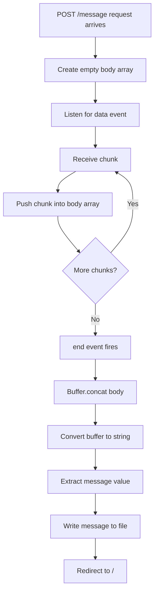
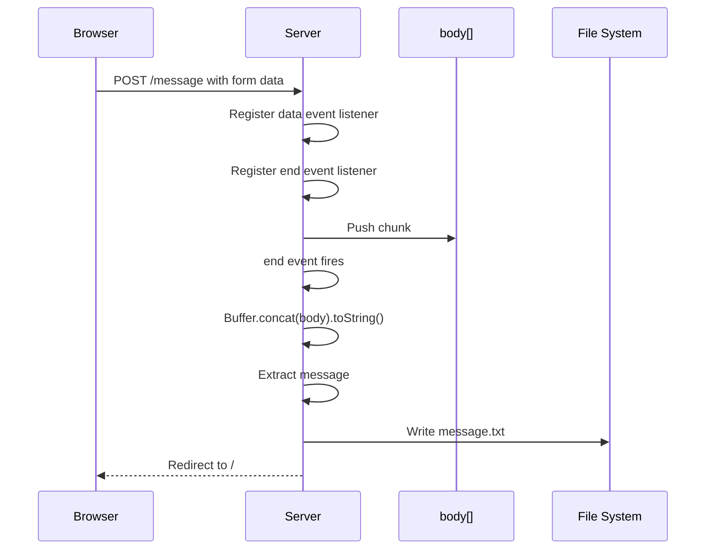

# 011 - Parsing Request Bodies

## Section

Understanding the Basics

## Duration

11min

## Main Idea

This lesson explains how to parse incoming request body data in a basic Node.js server.

In the previous lesson, we handled a `POST /message` request and wrote dummy text into a file. Now we want to store the real message entered by the user in the form.

Unlike `req.url` or `req.method`, request body data is not available as a simple property like `req.body` when using the raw Node.js `http` module. Instead, Node.js receives incoming request data as a **stream**.

To work with the full submitted data, we listen for incoming data chunks, collect them, combine them with `Buffer.concat()`, convert the result into a string, and then extract the submitted message.

---

## Learning Objectives

By the end of this lesson, you should be able to:

* Understand why request body data is not directly available as `req.body`.
* Explain what a stream is in Node.js.
* Understand why request data arrives in chunks.
* Use the `data` event to collect incoming request chunks.
* Use the `end` event to know when all request data has arrived.
* Use `Buffer.concat()` to combine chunks.
* Convert buffered request data into a string.
* Extract form data from the parsed request body.
* Write the submitted message into a file.
* Understand why dependent code must run inside the `end` event listener.

---

## Starting Point

In the previous lesson, we handled the form submission like this:

```js id="jbxj8n"
if (url === '/message' && method === 'POST') {
  fs.writeFileSync('message.txt', 'DUMMY');

  res.statusCode = 302;
  res.setHeader('Location', '/');
  return res.end();
}
```

This worked, but it only wrote dummy text.

Now we want to write the actual value submitted by the user.

---

## The HTML Form

The form sends data to `/message` using the `POST` method.

```html id="pkdmhw"
<form action="/message" method="POST">
  <input type="text" name="message">
  <button type="submit">Send</button>
</form>
```

The important part is:

```html id="dpr3v8"
<input type="text" name="message">
```

The `name` attribute becomes the key in the submitted form data.

If the user types:

```text id="iop4ze"
hello
```

the request body will contain something like:

```text id="l9mliq"
message=hello
```

---

## Why There Is No `req.body`

When using the raw Node.js `http` module, the request body is not automatically parsed.

This means we cannot simply write:

```js id="hqxskg"
console.log(req.body);
```

Instead, Node.js gives us the incoming request as a stream.

Frameworks like Express.js can parse request bodies automatically with middleware, but in this lesson we are learning what happens behind the scenes.

---

## What Is a Stream?

A stream is a flow of data that arrives over time.

Node.js does not always receive the full request body at once. Instead, it can receive the data in smaller pieces called **chunks**.

This is useful because requests can be small or very large.

For example:

* A simple text form may be small.
* A large file upload may be huge.
* A video upload may arrive slowly over time.

Streams allow Node.js to start handling data before the entire request has arrived.

---

## Stream Concept


---

## Chunks and Buffers

A **chunk** is one piece of incoming data.

A **buffer** is a temporary place where chunks can be collected and combined.

A useful analogy:

```text id="vq9z1g"
Stream = buses moving continuously
Chunks = passengers arriving in groups
Buffer = bus stop where passengers gather
```

In Node.js, we collect all incoming chunks in an array. Then we use `Buffer.concat()` to combine them into one complete buffer.

---

## Request Body Parsing Flow



---

## Listening for Data Events

To collect incoming body data, we register a listener for the `data` event.

```js id="i06ima"
const body = [];

req.on('data', (chunk) => {
  body.push(chunk);
});
```

The `data` event fires whenever a new chunk of request data is available.

Each `chunk` is pushed into the `body` array.

---

## Why `const body = []` Can Still Change

We define the array with `const`:

```js id="w8a7wv"
const body = [];
```

This means we cannot reassign `body` to a new value.

Bad:

```js id="lb7n3l"
body = [];
```

But we can still modify the array itself:

```js id="vf3jm5"
body.push(chunk);
```

So `const` prevents reassignment, but it does not make the array immutable.

---

## Listening for the End Event

After all chunks have arrived, Node.js fires the `end` event.

```js id="rd2d9z"
req.on('end', () => {
  const parsedBody = Buffer.concat(body).toString();
  console.log(parsedBody);
});
```

The `end` event tells us:

```text id="x0nn5p"
All request body data has been received.
```

Only inside this event can we safely process the full request body.

---

## Using Buffer.concat()

The `body` array contains multiple chunks.

To combine them, we use:

```js id="tsctk6"
Buffer.concat(body)
```

Then we convert the buffer into a string:

```js id="c3cikj"
Buffer.concat(body).toString()
```

For a normal form submission, this gives us a string like:

```text id="fq8l37"
message=hello
```

---

## Extracting the Message

The parsed body is a string:

```text id="o6ezsf"
message=hello
```

We can split it at the equal sign:

```js id="fvdcwp"
const message = parsedBody.split('=')[1];
```

Explanation:

```text id="ppl6oa"
parsedBody.split('=')
```

creates:

```js id="u59h87"
['message', 'hello']
```

Then:

```js id="nhcrlr"
[1]
```

gets the second element:

```text id="k7ke1w"
hello
```

---

## Important Limitation

This simple parsing technique works for a very basic form with one input.

It does not properly handle all real-world form cases.

For example:

* Multiple form fields.
* Encoded characters.
* Spaces.
* Special symbols.
* Uploaded files.
* JSON request bodies.

In real projects, tools like Express.js middleware will handle this more safely and conveniently.

---

## Moving File Writing Into the `end` Event

This is important.

The request body data is not available immediately. The `data` and `end` event callbacks run later.

Therefore, code that depends on the parsed body must be placed inside the `end` event listener.

Wrong idea:

```js id="p6b6nz"
req.on('end', () => {
  const parsedBody = Buffer.concat(body).toString();
});

fs.writeFileSync('message.txt', message);
```

The file writing may run before the body is parsed.

Correct idea:

```js id="xg64z6"
req.on('end', () => {
  const parsedBody = Buffer.concat(body).toString();
  const message = parsedBody.split('=')[1];

  fs.writeFileSync('message.txt', message);
});
```

---

## Complete Code Example

```js id="pw7fmh"
const http = require('http');
const fs = require('fs');

const server = http.createServer((req, res) => {
  const url = req.url;
  const method = req.method;

  if (url === '/') {
    res.setHeader('Content-Type', 'text/html');

    res.write('<html>');
    res.write('<head><title>Enter Message</title></head>');
    res.write('<body>');
    res.write('<form action="/message" method="POST">');
    res.write('<input type="text" name="message">');
    res.write('<button type="submit">Send</button>');
    res.write('</form>');
    res.write('</body>');
    res.write('</html>');

    return res.end();
  }

  if (url === '/message' && method === 'POST') {
    const body = [];

    req.on('data', (chunk) => {
      console.log(chunk);
      body.push(chunk);
    });

    req.on('end', () => {
      const parsedBody = Buffer.concat(body).toString();
      console.log(parsedBody);

      const message = parsedBody.split('=')[1];

      fs.writeFileSync('message.txt', message);
    });

    res.statusCode = 302;
    res.setHeader('Location', '/');
    return res.end();
  }

  res.setHeader('Content-Type', 'text/html');

  res.write('<html>');
  res.write('<head><title>My First Page</title></head>');
  res.write('<body><h1>Hello from my Node.js Server!</h1></body>');
  res.write('</html>');

  res.end();
});

server.listen(3000);
```

---

## What Happens When This Code Runs?

### 1. User visits `/`

```text id="zgbfup"
GET /
```

The server sends back an HTML form.

---

### 2. User submits the form

```text id="twvb6r"
POST /message
```

The request body contains the submitted message.

Example:

```text id="fv1wfa"
message=hello
```

---

### 3. Node.js receives the body as chunks

The `data` event fires one or more times.

```js id="m8ozrc"
req.on('data', (chunk) => {
  body.push(chunk);
});
```

---

### 4. Node.js finishes reading the request body

The `end` event fires.

```js id="vytyuf"
req.on('end', () => {
  const parsedBody = Buffer.concat(body).toString();
});
```

---

### 5. The message is extracted and written to a file

```js id="tobzya"
const message = parsedBody.split('=')[1];

fs.writeFileSync('message.txt', message);
```

The file now contains the submitted message.

---

## Example Terminal Output

If the user enters:

```text id="k8mj4w"
hello
```

The terminal may show something like:

```text id="e16wd3"
<Buffer 6d 65 73 73 61 67 65 3d 68 65 6c 6c 6f>
message=hello
```

The first line is the raw chunk.

The second line is the parsed body string.

---

## Encoded Characters

If the user enters special characters, they may be encoded.

For example:

```text id="ae07ri"
hello!
```

may appear as:

```text id="qrwbbu"
message=hello%21
```

The exclamation mark is encoded as `%21`.

This is normal for form submissions. Later, better parsing tools can decode this automatically.

---

## Request Body Timeline



---

## A More Correct Redirect Placement

In this lesson, the redirect response may be shown right after registering the event listeners.

However, because writing the file depends on the parsed body, a safer structure is to send the redirect after writing the file inside the `end` event.

```js id="tw9hnc"
if (url === '/message' && method === 'POST') {
  const body = [];

  req.on('data', (chunk) => {
    body.push(chunk);
  });

  req.on('end', () => {
    const parsedBody = Buffer.concat(body).toString();
    const message = parsedBody.split('=')[1];

    fs.writeFileSync('message.txt', message);

    res.statusCode = 302;
    res.setHeader('Location', '/');
    return res.end();
  });
}
```

This ensures the file operation happens before the redirect response is sent.

---

## Cleaner Final Version

```js id="kizqeo"
const http = require('http');
const fs = require('fs');

const server = http.createServer((req, res) => {
  const url = req.url;
  const method = req.method;

  if (url === '/') {
    res.setHeader('Content-Type', 'text/html');

    res.write('<html>');
    res.write('<head><title>Enter Message</title></head>');
    res.write('<body>');
    res.write('<form action="/message" method="POST">');
    res.write('<input type="text" name="message">');
    res.write('<button type="submit">Send</button>');
    res.write('</form>');
    res.write('</body>');
    res.write('</html>');

    return res.end();
  }

  if (url === '/message' && method === 'POST') {
    const body = [];

    req.on('data', (chunk) => {
      body.push(chunk);
    });

    req.on('end', () => {
      const parsedBody = Buffer.concat(body).toString();
      const message = parsedBody.split('=')[1];

      fs.writeFileSync('message.txt', message);

      res.statusCode = 302;
      res.setHeader('Location', '/');
      return res.end();
    });

    return;
  }

  res.setHeader('Content-Type', 'text/html');

  res.write('<html>');
  res.write('<head><title>My First Page</title></head>');
  res.write('<body><h1>Hello from my Node.js Server!</h1></body>');
  res.write('</html>');

  res.end();
});

server.listen(3000);
```

---

## Why Express.js Will Help Later

This raw Node.js approach is useful for learning, but it is verbose.

Later, Express.js can simplify this kind of work.

Instead of manually collecting chunks and buffering them, Express can provide parsed body data through middleware.

For example, later code may look more like:

```js id="qmqe6u"
app.post('/message', (req, res) => {
  const message = req.body.message;
  res.redirect('/');
});
```

But before using Express, it is important to understand what it hides behind the scenes.

---

## Practice

Recreate the request body parsing logic.

Steps:

```text id="zn0w92"
1. Create a form that sends a POST request to /message.
2. In the /message route, create an empty body array.
3. Listen for the data event.
4. Push every chunk into the body array.
5. Listen for the end event.
6. Combine all chunks with Buffer.concat(body).
7. Convert the result to a string.
8. Extract the message value.
9. Write the message into message.txt.
10. Redirect the user back to /.
```

---

## Practice Challenge

Extend the form with another input:

```html id="h0c4jm"
<input type="text" name="username">
<input type="text" name="message">
```

Then inspect the parsed body output.

Example:

```text id="lgjouf"
username=max&message=hello
```

Try to split this string manually and identify both values.

This shows why real-world form parsing can become more complex.

---

## Review Questions

1. Why is there no simple `req.body` property when using the raw Node.js `http` module?
2. What is a stream?
3. Why does Node.js receive request body data in chunks?
4. What is a chunk?
5. What is a buffer?
6. Which event fires when a new request body chunk is available?
7. Which event fires when all request body data has arrived?
8. Why do we store chunks in an array?
9. What does `Buffer.concat(body)` do?
10. Why do we call `.toString()` after buffering the chunks?
11. What does the parsed body look like for an input named `message`?
12. How can we extract the submitted message from `message=hello`?
13. Why must file writing happen inside the `end` event listener?
14. What can go wrong if we try to use the body data too early?
15. Why will Express.js make this process easier later?

---

## Summary

This lesson explains how to parse request body data in raw Node.js.

When a form sends a `POST` request, Node.js receives the request body as a stream. The data may arrive in multiple chunks, so we listen for the `data` event and push each chunk into an array.

Once all data has arrived, the `end` event fires. At that point, we combine the chunks with `Buffer.concat()`, convert the result into a string, and extract the submitted value.

This allows us to write the actual message entered by the user into `message.txt`.

Although this process is quite manual, it reveals what happens behind the scenes. Later, Express.js will simplify body parsing and make this workflow much cleaner.
