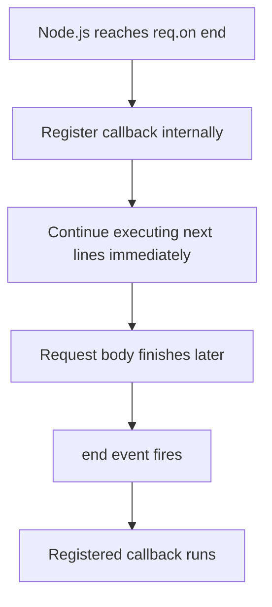
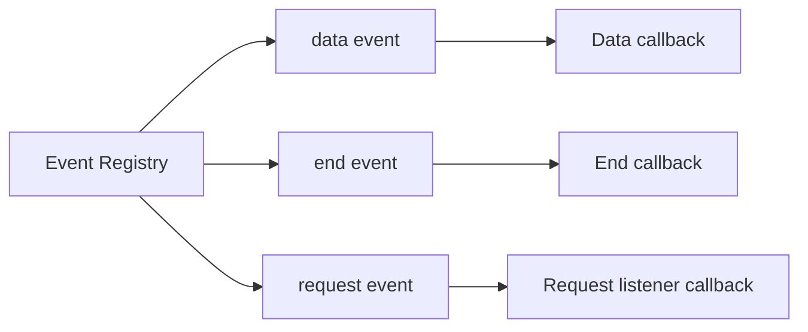
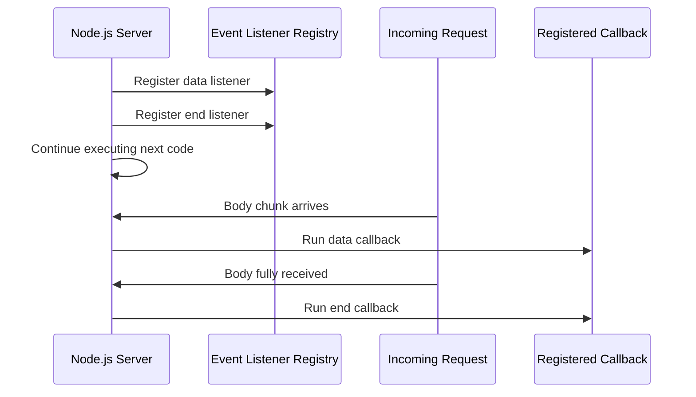
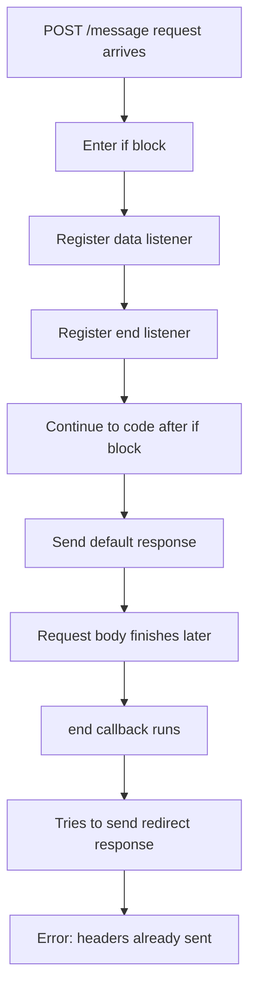
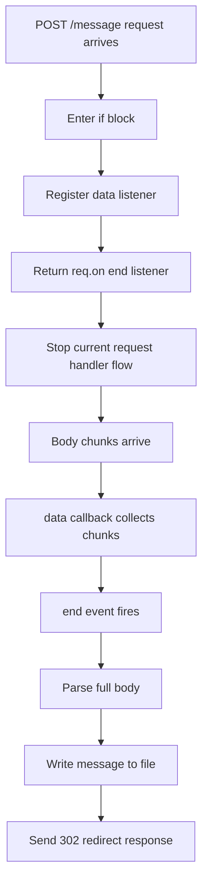
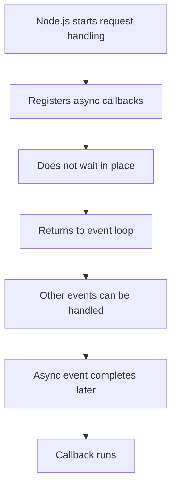

# 012 - Understanding Event Driven Code Execution

## Section

Understanding the Basics

## Duration

6min

## Main Idea

This lesson explains how event-driven code execution works in Node.js.

In Node.js, the order in which code is written is not always the same as the order in which it runs. This is especially important when working with callbacks, event listeners, request streams, and asynchronous code.

When we register event listeners such as `req.on('data', ...)` or `req.on('end', ...)`, Node.js does not execute those callback functions immediately. Instead, it stores them internally and executes them later when the related event happens.

Understanding this execution model is essential because it affects where we place response logic such as `res.end()`, redirects, and file operations.

---

## Learning Objectives

By the end of this lesson, you should be able to:

* Understand that Node.js uses event-driven execution heavily.
* Explain why callbacks may run later, not immediately.
* Understand why code execution order can differ from code writing order.
* Recognize that `req.on()` registers event listeners.
* Explain why Node.js does not block while waiting for request body data.
* Understand why response logic must be placed inside the correct callback.
* Avoid sending multiple responses for the same request.
* Understand why `return req.on('end', ...)` can prevent code from continuing too early.

---

## The Problem

In the previous lesson, we parsed request body data with event listeners:

```js id="bdrm86"
req.on('data', (chunk) => {
  body.push(chunk);
});

req.on('end', () => {
  const parsedBody = Buffer.concat(body).toString();
  const message = parsedBody.split('=')[1];

  fs.writeFileSync('message.txt', message);

  res.statusCode = 302;
  res.setHeader('Location', '/');
  return res.end();
});
```

This code looks like it should run from top to bottom.

However, the callback inside `req.on('end', ...)` does **not** run immediately.

It only runs later, after Node.js finishes reading the incoming request body.

---

## Key Idea

When Node.js sees this code:

```js id="aozohs"
req.on('end', () => {
  console.log('Request body parsing finished');
});
```

It does not immediately execute this function:

```js id="gqbsg2"
() => {
  console.log('Request body parsing finished');
}
```

Instead, Node.js registers the function as an event listener.

The function will run later when the `end` event happens.

---

## Event Listener Registration



---

## Event-Driven Execution

Node.js often works with this pattern:

```text id="v8olc3"
Register now, execute later.
```

Examples:

```js id="j9ftrg"
http.createServer((req, res) => {
  // Runs later when a request arrives
});
```

```js id="lgbokf"
req.on('data', (chunk) => {
  // Runs later when a data chunk arrives
});
```

```js id="aygdmx"
req.on('end', () => {
  // Runs later when the request body is fully read
});
```

In each case, we pass a function into another function. Node.js stores that function and calls it later when the correct event occurs.

---

## Internal Event Registry Concept

You can imagine Node.js keeping an internal registry of events and listeners.



When an event happens, Node.js checks which listeners are registered for that event and executes them.

---

## Example: Request Body Events



---

## Why This Matters

This matters because some code depends on data that is only available later.

For example, this code is wrong:

```js id="oyt4dw"
if (url === '/message' && method === 'POST') {
  const body = [];

  req.on('data', (chunk) => {
    body.push(chunk);
  });

  req.on('end', () => {
    const parsedBody = Buffer.concat(body).toString();
    const message = parsedBody.split('=')[1];
    fs.writeFileSync('message.txt', message);

    res.statusCode = 302;
    res.setHeader('Location', '/');
    return res.end();
  });
}

res.setHeader('Content-Type', 'text/html');
res.write('<h1>Hello from my Node.js Server!</h1>');
res.end();
```

The problem is that Node.js registers the `data` and `end` listeners, but then immediately continues to the code after the `if` block.

That means the default response may be sent before the `end` callback runs.

---

## Wrong Execution Flow



---

## The Common Error

If the server already sent one response and then the callback tries to send another response, you may get an error like:

```text id="cqf68w"
Cannot set headers after they are sent to the client
```

This happens because each request should receive only one final response.

Once `res.end()` has been called, the response is finished.

You cannot later set new headers or send another response for the same request.

---

## Why the Error Happens

This response may run too early:

```js id="kq0ihp"
res.write('<h1>Hello from my Node.js Server!</h1>');
res.end();
```

Then later, the `end` callback tries to run this:

```js id="jzqizd"
res.statusCode = 302;
res.setHeader('Location', '/');
return res.end();
```

That is too late because the response has already been sent.

---

## Correct Idea

If the response depends on request body data, the response must be sent inside the callback where that data is available.

Correct structure:

```js id="djdiel"
if (url === '/message' && method === 'POST') {
  const body = [];

  req.on('data', (chunk) => {
    body.push(chunk);
  });

  return req.on('end', () => {
    const parsedBody = Buffer.concat(body).toString();
    const message = parsedBody.split('=')[1];

    fs.writeFileSync('message.txt', message);

    res.statusCode = 302;
    res.setHeader('Location', '/');
    return res.end();
  });
}
```

The `return` before `req.on('end', ...)` is important.

It prevents the request handler from continuing to the default response code below.

---

## Correct Execution Flow



---

## Why `return req.on('end', ...)` Helps

This line:

```js id="xarqle"
return req.on('end', () => {
  // async callback logic
});
```

does not make the callback run immediately.

But it does stop the outer request listener from continuing to the code below.

So it solves this part of the problem:

```text id="skwzfh"
Do not send the default response while waiting for the end event.
```

The callback still runs later, but the route handler does not fall through to another response.

---

## Code Writing Order vs Execution Order

Code writing order:

```text id="v9cj33"
1. Register data listener
2. Register end listener
3. Code after the if block
4. Code inside the end callback
```

Actual execution order:

```text id="kcu1vw"
1. Register data listener
2. Register end listener
3. Continue immediately unless returned
4. Later: data callback runs
5. Later: end callback runs
```

This is the key mental shift when learning Node.js.

---

## Event-Driven Code Example

```js id="fjjv5h"
console.log('A');

setTimeout(() => {
  console.log('B');
}, 0);

console.log('C');
```

Output:

```text id="s0tlhw"
A
C
B
```

Even though `B` is written before `C`, it runs later because it is inside a callback.

This is the same general idea behind many Node.js event listeners.

---

## Applying This to Request Parsing

```js id="i7wo2m"
req.on('end', () => {
  console.log('B: Request body parsed');
});

console.log('A: Listener registered');
```

The output order is:

```text id="w7hr41"
A: Listener registered
B: Request body parsed
```

The callback only runs after the `end` event fires.

---

## Full Corrected Server Example

```js id="qdm9n8"
const http = require('http');
const fs = require('fs');

const server = http.createServer((req, res) => {
  const url = req.url;
  const method = req.method;

  if (url === '/') {
    res.setHeader('Content-Type', 'text/html');

    res.write('<html>');
    res.write('<head><title>Enter Message</title></head>');
    res.write('<body>');
    res.write('<form action="/message" method="POST">');
    res.write('<input type="text" name="message">');
    res.write('<button type="submit">Send</button>');
    res.write('</form>');
    res.write('</body>');
    res.write('</html>');

    return res.end();
  }

  if (url === '/message' && method === 'POST') {
    const body = [];

    req.on('data', (chunk) => {
      body.push(chunk);
    });

    return req.on('end', () => {
      const parsedBody = Buffer.concat(body).toString();
      const message = parsedBody.split('=')[1];

      fs.writeFileSync('message.txt', message);

      res.statusCode = 302;
      res.setHeader('Location', '/');
      return res.end();
    });
  }

  res.setHeader('Content-Type', 'text/html');

  res.write('<html>');
  res.write('<head><title>My First Page</title></head>');
  res.write('<body><h1>Hello from my Node.js Server!</h1></body>');
  res.write('</html>');

  res.end();
});

server.listen(3000);
```

---

## Important Rule

If code depends on asynchronous data, place that code inside the callback where the data becomes available.

For this lesson:

```text id="u3gz2y"
The message value is only available inside the end event callback.
```

Therefore, this logic belongs inside the `end` callback:

```js id="etqlgs"
const parsedBody = Buffer.concat(body).toString();
const message = parsedBody.split('=')[1];

fs.writeFileSync('message.txt', message);

res.statusCode = 302;
res.setHeader('Location', '/');
return res.end();
```

---

## Why Node.js Works This Way

Node.js avoids blocking the main thread.

Instead of waiting for request body parsing to finish before doing anything else, Node.js registers callbacks and continues.

This helps the server stay responsive.

If Node.js blocked every time it waited for request data, file operations, or database results, the server could become slow and unable to handle other incoming requests efficiently.

---

## Non-Blocking Mental Model



---

## One Response Per Request

A server should send one final response per request.

Examples of final response actions:

```js id="lm7il2"
res.end();
```

```js id="n12qn3"
res.statusCode = 302;
res.setHeader('Location', '/');
res.end();
```

After sending the response, do not later try to set new headers or send another response.

---

## Practical Debugging Tip

To understand execution order, add `console.log()` statements:

```js id="p7s4xv"
console.log('1: Request handler started');

req.on('data', (chunk) => {
  console.log('2: Data chunk received');
});

req.on('end', () => {
  console.log('3: End event callback running');
});

console.log('4: After registering listeners');
```

You may see output like:

```text id="bp56xs"
1: Request handler started
4: After registering listeners
2: Data chunk received
3: End event callback running
```

This proves that listener registration happens first, but callback execution happens later.

---

## Practice

Create a small experiment to observe event-driven execution.

Steps:

```text id="flwix7"
1. Add console.log('Start request handler') at the top of createServer.
2. Add console.log('Data event') inside req.on('data').
3. Add console.log('End event') inside req.on('end').
4. Add console.log('After listener registration') after the event listeners.
5. Submit the form.
6. Observe the terminal output order.
```

Then update the code so that the route returns after registering the `end` listener:

```js id="o3q7f0"
return req.on('end', () => {
  // parse body, write file, redirect
});
```

---

## Review Questions

1. What does event-driven execution mean?
2. Does Node.js immediately execute a function passed into `req.on()`?
3. What happens when Node.js reaches `req.on('end', callback)`?
4. When does the `end` callback actually run?
5. Why can code written later run before a callback written earlier?
6. What does Node.js store internally when we register an event listener?
7. Why does Node.js avoid blocking while waiting for request data?
8. Why can sending a response outside the `end` callback cause a problem?
9. What does “Cannot set headers after they are sent to the client” mean?
10. Why should response logic be placed inside the callback if it depends on parsed body data?
11. What does `return req.on('end', ...)` prevent?
12. How can you use `console.log()` to prove the execution order?
13. Why is this event-driven model important for building scalable servers?

---

## Summary

This lesson explains one of the most important concepts in Node.js: event-driven code execution.

Node.js often allows us to register functions that will run later when a specific event occurs. For example, `req.on('data', ...)` registers a callback for incoming request chunks, and `req.on('end', ...)` registers a callback for when the request body has been fully received.

These callbacks do not execute immediately. Node.js registers them internally and continues running the next lines of code.

This matters because response logic must be placed carefully. If the response depends on parsed request body data, it must be sent inside the `end` callback. Otherwise, the server may send a default response too early and later attempt to send another response, causing errors.

Understanding this event-driven model helps explain why Node.js is efficient, non-blocking, and able to handle many server-side tasks without pausing the entire application.

---

# Bài luyện tập

## Mục tiêu


## Đề bài


## Yêu cầu hoàn thành

- [ ] 
- [ ] 
- [ ] 

## Kết quả / lời giải


## Ghi chú
