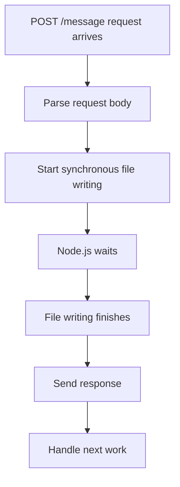
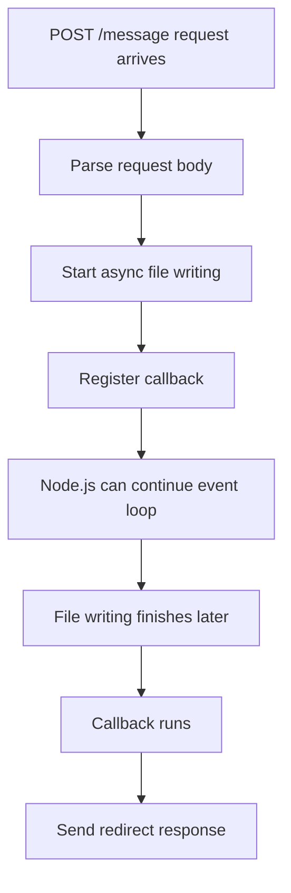
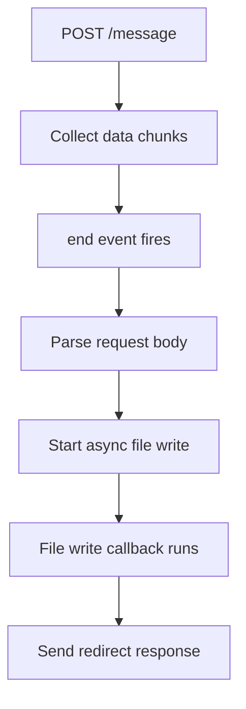
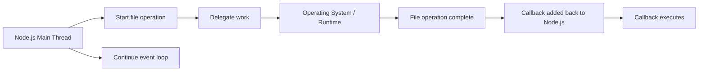
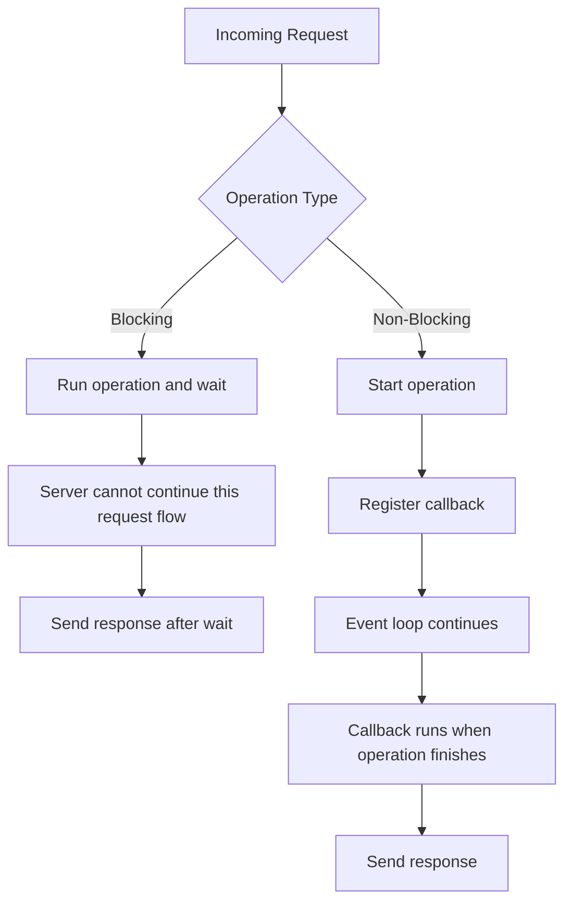

# 013 - Blocking and Non-Blocking Code

## Section

Understanding the Basics

## Duration

5min

## Main Idea

This lesson explains the difference between **blocking** and **non-blocking** code in Node.js.

In the previous lesson, we used `fs.writeFileSync()` to write the submitted message into a file. That worked, but the `Sync` part means the operation is **synchronous**. A synchronous file operation blocks the next lines of code from running until the file operation is finished.

In Node.js, blocking code should usually be avoided in server applications because it can prevent the server from handling other incoming requests while it waits for a slow operation to finish.

Instead, Node.js encourages **asynchronous**, non-blocking code. For file writing, that means using `fs.writeFile()` with a callback that runs after the file has been written.

---

## Learning Objectives

By the end of this lesson, you should be able to:

* Understand what blocking code means.
* Understand what non-blocking code means.
* Explain why `fs.writeFileSync()` can be problematic in a server.
* Use `fs.writeFile()` for asynchronous file writing.
* Understand why callbacks are used for asynchronous operations.
* Place response logic inside the file-writing callback.
* Understand how Node.js avoids blocking the event loop.
* Explain why non-blocking code helps Node.js handle many requests efficiently.

---

## The Problem With `writeFileSync`

In the previous code, we used:

```js
fs.writeFileSync('message.txt', message);
```

This writes data into `message.txt`.

However, the problem is the word:

```text
Sync
```

`Sync` means synchronous.

A synchronous operation blocks code execution until it is finished.

---

## Blocking Code

Blocking code stops the next lines from running until the current operation is complete.

Example:

```js
fs.writeFileSync('message.txt', message);

res.statusCode = 302;
res.setHeader('Location', '/');
return res.end();
```

In this example, Node.js must wait until the file has been written before it continues to the redirect response.

For a tiny text file, this may feel instant.

But for a large file operation, it could slow down the whole server.

---

## Blocking Flow



---

## Why Blocking Code Is Dangerous

Blocking code is dangerous in a server because Node.js runs JavaScript mainly on a single main thread.

If one request blocks the thread, other requests may have to wait.

This can happen with:

* Large file reads.
* Large file writes.
* Heavy calculations.
* Image or video processing.
* Long loops.
* Expensive synchronous operations.

Example problem:

```text
User A uploads or writes a huge file.
Node.js blocks while processing it.
User B sends another request.
User B has to wait until User A's operation finishes.
```

This is not what we want in a web server.

---

## Non-Blocking Code

Non-blocking code allows Node.js to start an operation and continue working while that operation happens in the background.

Instead of waiting in place, Node.js registers a callback.

When the operation finishes, Node.js runs the callback.

For file writing, we use:

```js
fs.writeFile('message.txt', message, callback);
```

---

## `writeFileSync()` vs `writeFile()`

| Method               | Type         | Behavior                                          |
| -------------------- | ------------ | ------------------------------------------------- |
| `fs.writeFileSync()` | Synchronous  | Blocks code execution until the file is written   |
| `fs.writeFile()`     | Asynchronous | Starts file writing and runs a callback when done |

---

## Using `fs.writeFile()`

Instead of this:

```js
fs.writeFileSync('message.txt', message);
```

Use this:

```js
fs.writeFile('message.txt', message, (err) => {
  // Runs after file writing is done
});
```

The callback receives an `err` argument.

If no error occurs, `err` is usually `null`.

If something goes wrong, `err` contains information about the error.

---

## File Writing Callback

```js
fs.writeFile('message.txt', message, (err) => {
  res.statusCode = 302;
  res.setHeader('Location', '/');
  return res.end();
});
```

This means:

```text
Write the file first.
When writing is finished, send the redirect response.
```

The response logic is placed inside the callback because the response should only be sent after the file operation is complete.

---

## Non-Blocking Flow



---

## Why the Response Goes Inside the Callback

If the file writing is asynchronous, this code is wrong:

```js
fs.writeFile('message.txt', message, (err) => {
  console.log('File written');
});

res.statusCode = 302;
res.setHeader('Location', '/');
return res.end();
```

The response may be sent before the file is written.

The correct structure is:

```js
fs.writeFile('message.txt', message, (err) => {
  res.statusCode = 302;
  res.setHeader('Location', '/');
  return res.end();
});
```

Now the redirect happens only after the file writing finishes.

---

## Nested Event-Driven Code

At this point, the server uses multiple event-driven callbacks.

First, we wait for the request body to finish:

```js
req.on('end', () => {
  // Request body is fully available here
});
```

Then, inside that callback, we write the file asynchronously:

```js
fs.writeFile('message.txt', message, (err) => {
  // File writing is finished here
});
```

This creates nested asynchronous logic.



---

## Complete Updated Code Example

```js
const http = require('http');
const fs = require('fs');

const server = http.createServer((req, res) => {
  const url = req.url;
  const method = req.method;

  if (url === '/') {
    res.setHeader('Content-Type', 'text/html');

    res.write('<html>');
    res.write('<head><title>Enter Message</title></head>');
    res.write('<body>');
    res.write('<form action="/message" method="POST">');
    res.write('<input type="text" name="message">');
    res.write('<button type="submit">Send</button>');
    res.write('</form>');
    res.write('</body>');
    res.write('</html>');

    return res.end();
  }

  if (url === '/message' && method === 'POST') {
    const body = [];

    req.on('data', (chunk) => {
      body.push(chunk);
    });

    return req.on('end', () => {
      const parsedBody = Buffer.concat(body).toString();
      const message = parsedBody.split('=')[1];

      fs.writeFile('message.txt', message, (err) => {
        res.statusCode = 302;
        res.setHeader('Location', '/');
        return res.end();
      });
    });
  }

  res.setHeader('Content-Type', 'text/html');

  res.write('<html>');
  res.write('<head><title>My First Page</title></head>');
  res.write('<body><h1>Hello from my Node.js Server!</h1></body>');
  res.write('</html>');

  res.end();
});

server.listen(3000);
```

---

## What Changed?

Before:

```js
fs.writeFileSync('message.txt', message);
```

After:

```js
fs.writeFile('message.txt', message, (err) => {
  res.statusCode = 302;
  res.setHeader('Location', '/');
  return res.end();
});
```

The new version is asynchronous and non-blocking.

---

## Handling Errors

The callback receives an error argument:

```js
fs.writeFile('message.txt', message, (err) => {
  if (err) {
    // Handle error here
  }

  res.statusCode = 302;
  res.setHeader('Location', '/');
  return res.end();
});
```

In this lesson, detailed error handling is not implemented yet.

However, in real applications, this is important.

For example, an error could happen if:

* The server has no permission to write the file.
* The file path is invalid.
* The disk is full.
* The file system operation fails.

A more complete version could send an error response:

```js
fs.writeFile('message.txt', message, (err) => {
  if (err) {
    res.statusCode = 500;
    res.setHeader('Content-Type', 'text/html');
    res.write('<h1>Something went wrong!</h1>');
    return res.end();
  }

  res.statusCode = 302;
  res.setHeader('Location', '/');
  return res.end();
});
```

---

## Node.js and the Operating System

Node.js does not do all slow work directly on the main JavaScript thread.

For many operations, such as file system tasks, Node.js can delegate work to the operating system or internal worker mechanisms.

Then Node.js continues running the event loop.

When the operation is done, the callback is executed.



---

## Why This Makes Node.js Efficient

Node.js is efficient for many backend applications because it avoids waiting unnecessarily.

Instead of this:

```text
Start task → Wait → Continue
```

Node.js prefers this:

```text
Start task → Register callback → Continue event loop → Run callback when ready
```

This allows the server to stay responsive.

---

## Blocking vs Non-Blocking Comparison



---

## Important Mental Model

Blocking code:

```text
Node.js waits.
```

Non-blocking code:

```text
Node.js registers what should happen later and keeps going.
```

That is why callbacks, event listeners, promises, and async operations are so common in Node.js.

---

## Testing the Code

### Step 1: Restart the server

```bash
node app.js
```

### Step 2: Open the form

```text
http://localhost:3000/
```

### Step 3: Submit a message

Example:

```text
hello
```

### Step 4: Check `message.txt`

The file should contain the submitted message.

You may still see encoded characters for special symbols. That is normal at this stage.

---

## Practice

Update the previous server to use non-blocking file writing.

Steps:

```text
1. Find fs.writeFileSync().
2. Replace it with fs.writeFile().
3. Add a callback as the third argument.
4. Move the redirect response into the callback.
5. Restart the server.
6. Submit the form again.
7. Confirm that message.txt still updates correctly.
```

---

## Practice Challenge

Add simple error handling to the file-writing callback.

Expected behavior:

```text
If file writing succeeds:
  Redirect to /

If file writing fails:
  Send a 500 error response
```

Starter logic:

```js
fs.writeFile('message.txt', message, (err) => {
  if (err) {
    res.statusCode = 500;
    res.setHeader('Content-Type', 'text/html');
    res.write('<h1>Internal Server Error</h1>');
    return res.end();
  }

  res.statusCode = 302;
  res.setHeader('Location', '/');
  return res.end();
});
```

---

## Review Questions

1. What does the `Sync` part in `writeFileSync()` mean?
2. What is blocking code?
3. Why can blocking code be dangerous in a Node.js server?
4. What happens to other requests while a long synchronous operation is running?
5. What is the difference between `fs.writeFileSync()` and `fs.writeFile()`?
6. Why does `fs.writeFile()` need a callback?
7. What does the `err` argument represent?
8. Why should the response code be placed inside the `fs.writeFile()` callback?
9. What could happen if the redirect response is sent before the file operation finishes?
10. How does Node.js use event-driven execution for file operations?
11. What does it mean that Node.js delegates work to the operating system or runtime?
12. Why does non-blocking code help Node.js stay responsive?
13. Which style should generally be preferred in server applications: blocking or non-blocking?
14. Why is it useful to understand this before using Express.js?

---

## Summary

This lesson explains the difference between blocking and non-blocking code in Node.js.

`fs.writeFileSync()` is synchronous and blocks code execution until the file operation finishes. This can be a problem in server applications because one slow operation may prevent Node.js from handling other incoming requests.

The better approach is to use `fs.writeFile()`, which is asynchronous and non-blocking. It starts the file operation and runs a callback when the operation is complete.

Because the redirect response should only be sent after the file has been written, the response logic is moved into the `fs.writeFile()` callback.

This event-driven, non-blocking style is one of the core reasons Node.js is effective for backend development. It allows Node.js to stay responsive while waiting for file system operations, database operations, network requests, and other asynchronous tasks.
