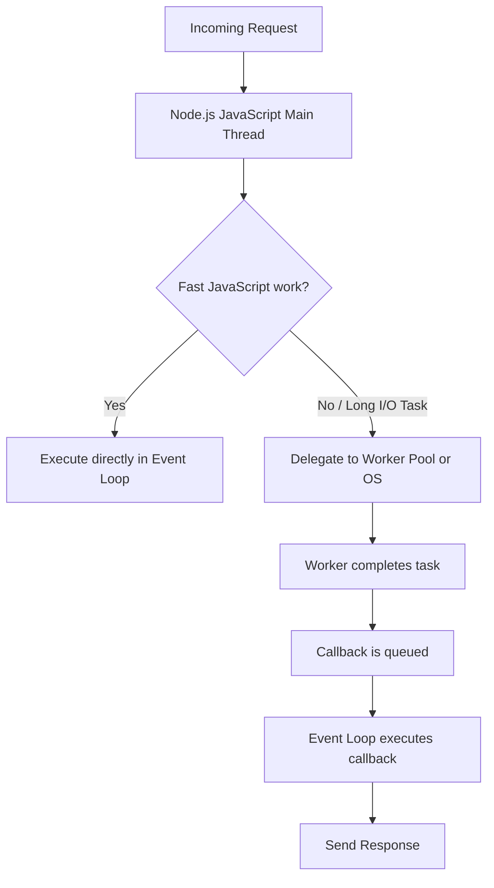
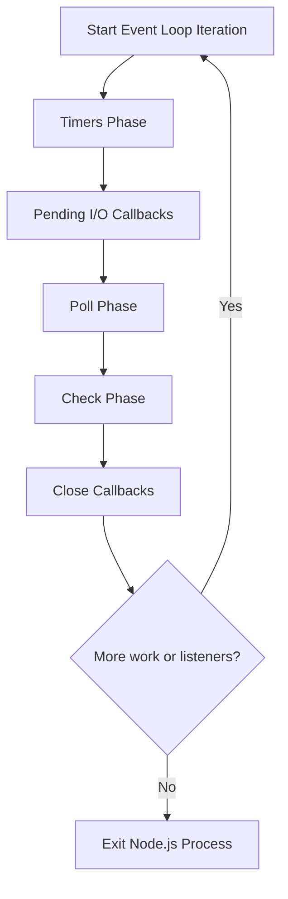
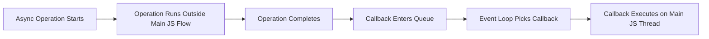
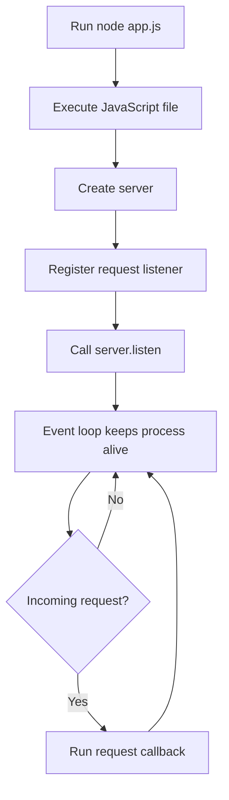
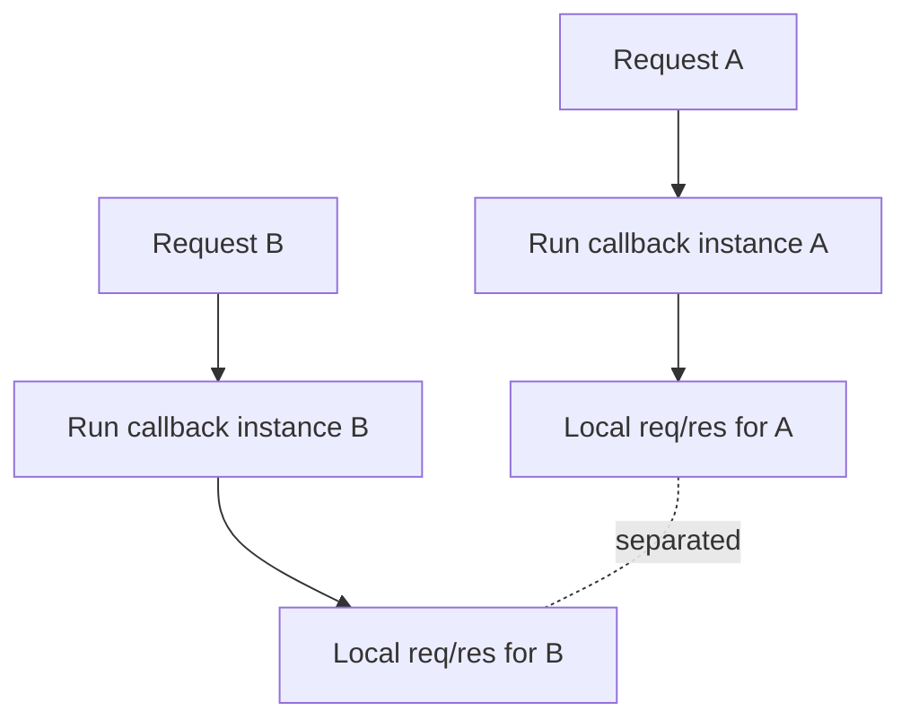
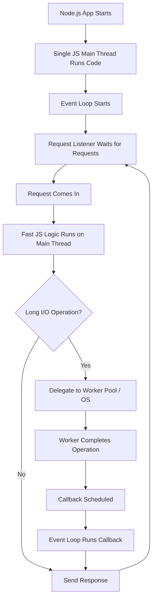

# 014 - Node.js - Looking Behind the Scenes

## Section

Understanding the Basics

## Duration

12min

## Main Idea

This lesson explains what happens behind the scenes when Node.js runs server-side code.

So far, we have used asynchronous code, callbacks, event listeners, request streams, and non-blocking file operations. This lesson connects those ideas and explains how Node.js stays performant even though it mainly runs JavaScript on a single main thread.

The key idea is that Node.js uses an **event loop** to handle callbacks and a **worker pool** for certain long-running operations, such as file system tasks. This allows Node.js to avoid blocking the main JavaScript thread while still handling many incoming requests efficiently.

---

## Learning Objectives

By the end of this lesson, you should be able to:

* Understand that Node.js runs JavaScript mainly on a single main thread.
* Explain why single-threaded JavaScript does not mean Node.js can only handle one request at a time.
* Understand the role of the event loop.
* Understand the role of the worker pool.
* Explain how Node.js handles long-running tasks such as file operations.
* Describe the basic phases of the event loop.
* Understand why a Node.js server keeps running.
* Recognize why request and response objects are separated per request.
* Understand the big picture of how Node.js stays performant.

---

## The Big Question

Node.js runs JavaScript on one main thread.

So an important question is:

```text
If Node.js uses one main JavaScript thread, how can it handle many requests efficiently?
```

The answer is:

```text
Node.js uses the event loop for callbacks and delegates certain heavy tasks to a worker pool.
```

---

## Single JavaScript Thread

Node.js executes JavaScript code mainly on a single thread.

A thread is like a unit of execution in the operating system.

This means JavaScript code itself is not usually running in many separate threads for every request.

However, this does not mean Node.js is weak or slow.

Node.js is designed around:

* Event-driven execution.
* Non-blocking code.
* Callback registration.
* Delegating slow operations.
* Efficient event loop handling.

---

## High-Level Node.js Architecture



---

## Why This Matters

Imagine a request needs to write data to a file.

File operations can take time, especially if the file is large.

If Node.js waited synchronously for every file operation, then other users might have to wait too.

That would be bad for a server.

Instead, Node.js can start the file operation, let the worker pool or operating system handle it, and continue listening for other events.

---

## Event Loop vs Worker Pool

Node.js uses two important concepts behind the scenes:

| Concept     | Role                                                                                    |
| ----------- | --------------------------------------------------------------------------------------- |
| Event Loop  | Handles callbacks and coordinates event-driven execution                                |
| Worker Pool | Handles certain expensive or long-running operations outside the main JavaScript thread |

---

## The Event Loop

The event loop is automatically started by Node.js when the program starts.

You do not need to create it manually.

The event loop is responsible for:

* Keeping the Node.js process alive when there is work to do.
* Handling callbacks.
* Running timer callbacks.
* Running I/O callbacks.
* Running close event callbacks.
* Checking whether the process should continue or exit.

In simple terms:

```text
The event loop decides which callback should run next.
```

---

## The Worker Pool

The worker pool handles certain long-running tasks.

Examples include:

* File system operations.
* Some cryptographic operations.
* Some compression tasks.
* Certain DNS operations.
* Other expensive background operations.

The worker pool can use multiple threads behind the scenes.

This is important because it means slow operations do not always block the main JavaScript thread.

---

## File Operation Example

When we use asynchronous file writing:

```js
fs.writeFile('message.txt', message, (err) => {
  res.statusCode = 302;
  res.setHeader('Location', '/');
  return res.end();
});
```

Node.js does not block the main JavaScript thread until the file is written.

Instead:

```text
1. Node.js starts the file operation.
2. The file operation is delegated.
3. Node.js continues running the event loop.
4. The file operation finishes later.
5. The callback is executed.
6. The response is sent.
```

---

## File Operation Behind the Scenes

```mermaid
sequenceDiagram
    participant Request as Incoming Request
    participant Main as JS Main Thread
    participant Worker as Worker Pool / OS
    participant Loop as Event Loop
    participant Response as Response

    Request->>Main: POST /message
    Main->>Main: Parse request body
    Main->>Worker: Delegate fs.writeFile
    Main->>Loop: Continue event loop
    Worker-->>Loop: File writing finished
    Loop->>Main: Execute writeFile callback
    Main->>Response: Send redirect response
```

---

## Why This Is Non-Blocking

With non-blocking code, Node.js does not wait in place.

Instead of this:

```text
Start task → Wait until finished → Continue
```

Node.js prefers this:

```text
Start task → Register callback → Continue event loop → Run callback when finished
```

This is why asynchronous code is common in Node.js.

---

## Event Loop Phases

The event loop goes through different phases.

You do not need to memorize all details at this stage, but it is helpful to understand the big picture.

A simplified event loop cycle looks like this:



---

## 1. Timers Phase

In this phase, Node.js checks whether timer callbacks are ready to run.

Examples:

```js
setTimeout(() => {
  console.log('Timer finished');
}, 1000);
```

```js
setInterval(() => {
  console.log('Runs repeatedly');
}, 1000);
```

If a timer is due, its callback can be executed.

---

## 2. Pending I/O Callbacks

In this phase, Node.js handles callbacks from completed I/O operations.

I/O means input/output.

Examples of I/O include:

* File operations.
* Network operations.
* Database communication.
* Other operations that involve waiting for external resources.

---

## 3. Poll Phase

The poll phase is where Node.js checks for new I/O events.

Node.js may:

* Retrieve new I/O events.
* Execute callbacks if possible.
* Wait for more events if appropriate.
* Move to another phase if timers or other callbacks need attention.

This phase is very important for server applications because many backend tasks are I/O-based.

---

## 4. Check Phase

The check phase handles callbacks scheduled with:

```js
setImmediate(() => {
  console.log('Runs in the check phase');
});
```

`setImmediate()` is similar to a timer, but it is designed to execute after the current poll phase completes.

---

## 5. Close Callbacks

Close callbacks run when certain resources are closed.

Examples:

* A socket closes.
* A connection closes.
* A stream closes.

If close event handlers are registered, Node.js executes them in this phase.

---

## Simplified Event Loop Table

| Phase             | What Happens                                               |
| ----------------- | ---------------------------------------------------------- |
| Timers            | Executes callbacks from `setTimeout()` and `setInterval()` |
| Pending Callbacks | Executes certain I/O callbacks                             |
| Poll              | Retrieves new I/O events and executes related callbacks    |
| Check             | Executes `setImmediate()` callbacks                        |
| Close Callbacks   | Executes callbacks for closed resources                    |

---

## Event Loop Callback Flow



---

## Why the Server Keeps Running

A Node.js program exits when there is no more work to do.

However, a web server usually keeps running because it has an active listener.

Example:

```js
server.listen(3000);
```

This tells Node.js:

```text
Keep listening for incoming requests.
```

Because this listener remains active, Node.js does not exit automatically.

---

## Internal Reference Count Idea

Internally, Node.js keeps track of active work.

You can think of it like a reference counter:

```text
New active listener registered → counter increases
Listener no longer needed → counter decreases
No active work left → process can exit
```

A web server has an ongoing request listener, so there is always work to keep the process alive.

---

## Server Lifecycle



---

## Why Node.js Does Not Exit Immediately

A simple script may exit:

```js
console.log('Done');
```

After this line runs, there is no more work, so Node.js exits.

But this server does not exit:

```js
const http = require('http');

const server = http.createServer((req, res) => {
  res.end('Hello');
});

server.listen(3000);
```

Because the server is still listening for future requests.

---

## Security and Request Separation

Another question is:

```text
If all requests use the same JavaScript thread, can data from one request accidentally mix with another request?
```

By default, each request gets its own execution of the request listener callback.

Example:

```js
const server = http.createServer((req, res) => {
  const message = 'This belongs to this request only';

  res.end(message);
});
```

The variables inside the callback are scoped to that specific function execution.

That means local variables for one request are not automatically shared with another request.

---

## Request Scope



---

## Important Warning About Global Data

Local request data is separated by function scope.

However, global variables are shared.

Example:

```js
let lastMessage = '';

const server = http.createServer((req, res) => {
  lastMessage = 'New message';
  res.end(lastMessage);
});
```

Because `lastMessage` is outside the request callback, it is shared across requests.

This can be useful in some cases, but it can also create bugs if used carelessly.

Later in the course, global data and state management will be discussed more carefully.

---

## Big Picture: How Node.js Handles Work



---

## What You Should Remember

You do not need to memorize every event loop phase right now.

The most important points are:

```text
1. Node.js runs JavaScript mainly on one main thread.
2. The event loop handles callbacks.
3. Long-running I/O work can be delegated to the worker pool or operating system.
4. Node.js avoids blocking whenever asynchronous APIs are used.
5. A server keeps running because it has active listeners.
6. Each request callback has its own local scope.
```

---

## Practical Example

```js
const http = require('http');
const fs = require('fs');

const server = http.createServer((req, res) => {
  if (req.url === '/file') {
    fs.writeFile('message.txt', 'Hello Node.js', (err) => {
      if (err) {
        res.statusCode = 500;
        return res.end('File writing failed');
      }

      res.end('File written successfully');
    });

    return;
  }

  res.end('Hello from the main route');
});

server.listen(3000);
```

### What Happens Here?

```text
1. A request reaches /file.
2. Node.js starts an asynchronous file write.
3. File writing is delegated.
4. The event loop remains available.
5. When writing finishes, the callback runs.
6. The response is sent.
```

---

## Practice

Create a small experiment to observe non-blocking behavior.

Steps:

```text
1. Create a Node.js server.
2. Add one route that uses fs.writeFile().
3. Add console.log() before and inside the fs.writeFile() callback.
4. Send a request to that route.
5. Observe that the callback runs later.
6. Add another simple route and confirm the server can still respond.
```

Example logs:

```js
console.log('Before file operation');

fs.writeFile('message.txt', 'Hello', () => {
  console.log('File operation finished');
});

console.log('After file operation');
```

Expected order:

```text
Before file operation
After file operation
File operation finished
```

This shows that `fs.writeFile()` is non-blocking.

---

## Review Questions

1. Does Node.js run JavaScript on many main threads by default?
2. What is the event loop responsible for?
3. What kinds of work can be delegated to the worker pool?
4. Why can file operations take longer than normal JavaScript operations?
5. Why does non-blocking code help server performance?
6. What happens when an asynchronous file operation finishes?
7. Which part of Node.js executes the callback after an operation completes?
8. What are timer callbacks?
9. What is the poll phase used for?
10. What does the check phase handle?
11. Why does a Node.js server not exit after `server.listen()`?
12. What does it mean that Node.js tracks active listeners or references?
13. Why are request-specific variables normally separated?
14. Why can global variables be risky in server applications?
15. What is the most important big-picture idea behind Node.js performance?

---

## Summary

This lesson gives a behind-the-scenes look at how Node.js works.

Node.js mainly runs JavaScript on a single main thread, but it can still handle many requests efficiently because it uses an event-driven, non-blocking architecture.

The event loop manages callbacks and keeps the process alive while there is work to do. Long-running operations such as file system tasks can be delegated to the worker pool or operating system. When those operations finish, their callbacks are scheduled and executed by the event loop.

A Node.js server keeps running because it has active listeners, such as the listener created by `server.listen()`. Each incoming request runs the request listener callback with its own `req` and `res` objects, giving requests natural separation through function scope.

You do not need to memorize every event loop phase, but you should remember the big picture: Node.js stays performant by avoiding blocking code, delegating slow work, and using the event loop to execute callbacks when they are ready.
