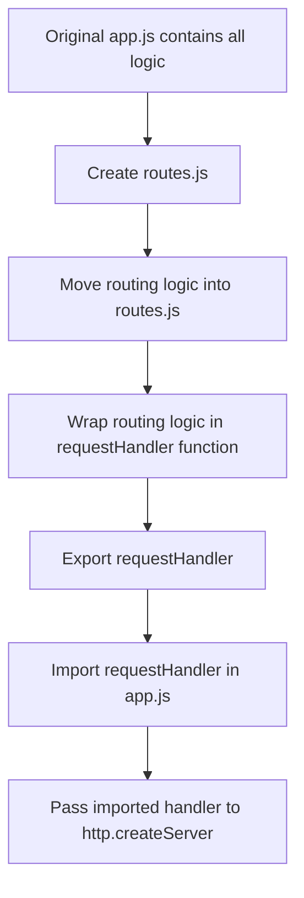
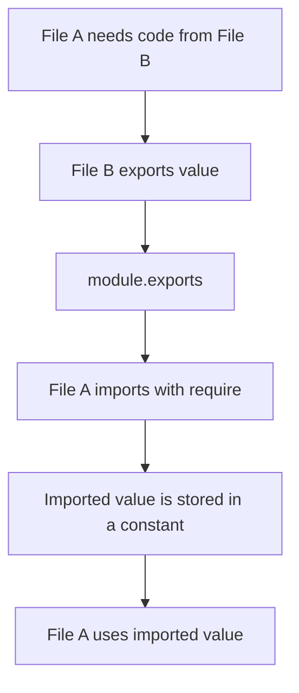
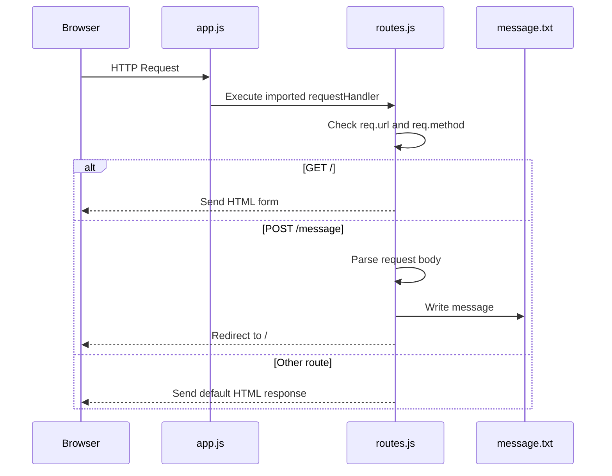

# 015 - Using the Node Modules System

## Section

Understanding the Basics

## Duration

10min

## Main Idea

This lesson explains how to split Node.js code across multiple files by using the Node module system.

So far, all server logic has been written in one file, usually `app.js`. That works for a small example, but real applications quickly become too large to keep everything in one file.

In this lesson, we move the routing logic into a separate file called `routes.js`. Then we export the request handler from `routes.js` and import it into `app.js` using `require()`.

This makes the code cleaner, easier to organize, and easier to maintain.

---

## Learning Objectives

By the end of this lesson, you should be able to:

* Understand why Node.js applications are split into multiple files.
* Move routing logic from `app.js` into `routes.js`.
* Create a reusable request handler function.
* Export values from a file using `module.exports`.
* Import local files using `require('./filename')`.
* Understand the difference between importing core modules and local modules.
* Export a single function from a module.
* Export multiple values from a module.
* Understand the shortcut syntax using `exports`.
* Recognize how Node.js caches module content.

---

## Why Split Code Into Multiple Files?

At this point, `app.js` contains too much logic:

* Server creation.
* Request handling.
* Route checking.
* HTML responses.
* Form parsing.
* File writing.
* Redirect logic.

This makes the file harder to read and maintain.

A better structure is to separate responsibilities.

For example:

```text id="i72q2k"
app.js      → starts the server
routes.js   → handles request routing
```

---

## Before Refactoring

The project may currently look like this:

```text id="1xd9xn"
node-basics/
├── app.js
└── message.txt
```

After refactoring, we add a new file:

```text id="hd9297"
node-basics/
├── app.js
├── routes.js
└── message.txt
```

---

## Refactoring Goal

We want `app.js` to stay lean.

Its job should mainly be:

```text id="uuqztg"
1. Import the http module.
2. Import the route handler.
3. Create the server.
4. Pass the route handler to createServer().
5. Start listening on a port.
```

The route handling details should move into `routes.js`.

---

## Refactoring Flow



---

## Creating `routes.js`

Create a new file:

```text id="pgnhw6"
routes.js
```

This file will contain the route handling logic.

Because the route logic writes data to a file, `routes.js` needs the `fs` module:

```js id="5xk3xu"
const fs = require('fs');
```

---

## Creating a Request Handler Function

In `routes.js`, create a function that receives `req` and `res`.

```js id="9lnc4z"
const requestHandler = (req, res) => {
  const url = req.url;
  const method = req.method;

  // routing logic goes here
};
```

This function replaces the anonymous callback that was previously passed directly to `http.createServer()`.

---

## Why `req` and `res` Are Needed

The routing code needs access to the request and response objects.

| Object | Purpose                                         |
| ------ | ----------------------------------------------- |
| `req`  | Read request data such as URL, method, and body |
| `res`  | Send response data back to the client           |

That is why the exported function must accept both arguments:

```js id="19x6ff"
(req, res) => {
  // handle request and response
}
```

---

## Moving Route Logic Into `routes.js`

The route logic can now live inside `requestHandler`.

```js id="vjj9oz"
const fs = require('fs');

const requestHandler = (req, res) => {
  const url = req.url;
  const method = req.method;

  if (url === '/') {
    res.setHeader('Content-Type', 'text/html');

    res.write('<html>');
    res.write('<head><title>Enter Message</title></head>');
    res.write('<body>');
    res.write('<form action="/message" method="POST">');
    res.write('<input type="text" name="message">');
    res.write('<button type="submit">Send</button>');
    res.write('</form>');
    res.write('</body>');
    res.write('</html>');

    return res.end();
  }

  if (url === '/message' && method === 'POST') {
    const body = [];

    req.on('data', (chunk) => {
      body.push(chunk);
    });

    return req.on('end', () => {
      const parsedBody = Buffer.concat(body).toString();
      const message = parsedBody.split('=')[1];

      fs.writeFile('message.txt', message, (err) => {
        res.statusCode = 302;
        res.setHeader('Location', '/');
        return res.end();
      });
    });
  }

  res.setHeader('Content-Type', 'text/html');

  res.write('<html>');
  res.write('<head><title>My First Page</title></head>');
  res.write('<body><h1>Hello from my Node.js Server!</h1></body>');
  res.write('</html>');

  res.end();
};
```

At this point, the function exists inside `routes.js`, but other files cannot use it yet.

We need to export it.

---

## Exporting a Single Function

Node.js provides a global object called `module`.

This object has an `exports` property.

To export the request handler, write:

```js id="g5dqga"
module.exports = requestHandler;
```

This makes the function available to other files.

Complete `routes.js`:

```js id="f9ga9w"
const fs = require('fs');

const requestHandler = (req, res) => {
  const url = req.url;
  const method = req.method;

  if (url === '/') {
    res.setHeader('Content-Type', 'text/html');

    res.write('<html>');
    res.write('<head><title>Enter Message</title></head>');
    res.write('<body>');
    res.write('<form action="/message" method="POST">');
    res.write('<input type="text" name="message">');
    res.write('<button type="submit">Send</button>');
    res.write('</form>');
    res.write('</body>');
    res.write('</html>');

    return res.end();
  }

  if (url === '/message' && method === 'POST') {
    const body = [];

    req.on('data', (chunk) => {
      body.push(chunk);
    });

    return req.on('end', () => {
      const parsedBody = Buffer.concat(body).toString();
      const message = parsedBody.split('=')[1];

      fs.writeFile('message.txt', message, (err) => {
        res.statusCode = 302;
        res.setHeader('Location', '/');
        return res.end();
      });
    });
  }

  res.setHeader('Content-Type', 'text/html');

  res.write('<html>');
  res.write('<head><title>My First Page</title></head>');
  res.write('<body><h1>Hello from my Node.js Server!</h1></body>');
  res.write('</html>');

  res.end();
};

module.exports = requestHandler;
```

---

## Importing a Local Module

In `app.js`, we import the route handler with `require()`.

Because `routes.js` is a local file, the path must start with:

```text id="za54bq"
./
```

Example:

```js id="x4f5pz"
const routes = require('./routes');
```

Node.js automatically looks for:

```text id="0qlxuo"
routes.js
```

So this is optional:

```js id="5mvazz"
const routes = require('./routes.js');
```

Both work, but `./routes` is commonly used.

---

## Importing Core Modules vs Local Modules

| Import Type | Example               | Meaning                               |
| ----------- | --------------------- | ------------------------------------- |
| Core module | `require('http')`     | Import built-in Node.js module        |
| Core module | `require('fs')`       | Import built-in file system module    |
| Local file  | `require('./routes')` | Import a file from the current folder |

Important difference:

```js id="t1o1qb"
require('routes')
```

would make Node.js look for a core or installed package named `routes`.

But:

```js id="n3lhyr"
require('./routes')
```

tells Node.js to look for a local file named `routes.js`.

---

## Updated `app.js`

After moving routing logic into `routes.js`, `app.js` becomes much cleaner.

```js id="f6jwc6"
const http = require('http');

const routes = require('./routes');

const server = http.createServer(routes);

server.listen(3000);
```

This works because `routes` now stores the exported `requestHandler` function.

We pass it to `http.createServer()` as the request listener.

---

## Important: Do Not Execute the Handler

Correct:

```js id="jjb24o"
const server = http.createServer(routes);
```

Incorrect:

```js id="sg5si3"
const server = http.createServer(routes());
```

We do not call the function ourselves.

We pass the function reference to Node.js.

Node.js will call it automatically for every incoming request.

---

## Module Connection Flow


---

## Testing the Refactor

Run the server:

```bash id="s8fn84"
node app.js
```

Visit:

```text id="57f0to"
http://localhost:3000/
```

You should still see the form.

Submit a message.

Then check:

```text id="n0mmil"
message.txt
```

The submitted message should still be written to the file.

This proves that splitting the code into modules did not break the application.

---

## Exporting Multiple Values

Sometimes a file needs to export more than one thing.

Instead of exporting only the function:

```js id="6bpyou"
module.exports = requestHandler;
```

we can export an object.

Example:

```js id="8pu5o8"
module.exports = {
  handler: requestHandler,
  someText: 'Some hard coded text'
};
```

Now `routes.js` exports an object with two properties:

| Property   | Value                        |
| ---------- | ---------------------------- |
| `handler`  | The request handler function |
| `someText` | A string                     |

---

## Using Multiple Exports in `app.js`

If `routes.js` exports an object, then `app.js` must access the correct property.

```js id="vfu4ur"
const http = require('http');

const routes = require('./routes');

console.log(routes.someText);

const server = http.createServer(routes.handler);

server.listen(3000);
```

Here:

```js id="en6v9z"
routes.handler
```

contains the request handler function.

```js id="qjk7sz"
routes.someText
```

contains the exported text.

---

## Alternative Multiple Export Syntax

Instead of exporting one object directly, we can assign properties to `module.exports`.

```js id="e8ku7o"
module.exports.handler = requestHandler;
module.exports.someText = 'Some hard coded text';
```

This is equivalent to:

```js id="nkis2z"
module.exports = {
  handler: requestHandler,
  someText: 'Some hard coded text'
};
```

Both approaches export one object that contains multiple properties.

---

## Shortcut Syntax: `exports`

Node.js also supports a shortcut:

```js id="k7mzfw"
exports.handler = requestHandler;
exports.someText = 'Some hard coded text';
```

This is a shorter way to add properties to `module.exports`.

However, there is an important rule:

```text id="6lxpmn"
exports works as a shortcut for adding properties.
Do not use it to replace module.exports entirely.
```

Good:

```js id="t6wmf4"
exports.handler = requestHandler;
```

Avoid:

```js id="xwq3n0"
exports = requestHandler;
```

If you want to export one function directly, use:

```js id="h579q3"
module.exports = requestHandler;
```

---

## Export Syntax Comparison

| Syntax                                    | Use Case                            |
| ----------------------------------------- | ----------------------------------- |
| `module.exports = requestHandler`         | Export one main value               |
| `module.exports = { handler, someText }`  | Export multiple values as an object |
| `module.exports.handler = requestHandler` | Add one property to exports         |
| `exports.handler = requestHandler`        | Shortcut for adding one property    |

---

## Module System Overview



---

## Node.js Module Caching

Node.js caches loaded modules.

This means when a file is imported with `require()`, Node.js loads it once and stores the result.

If another file imports the same module again, Node.js can reuse the cached export.

This helps performance and prevents unnecessary repeated loading.

Important idea:

```text id="2afaa4"
You can access what a module exports, but you do not directly manipulate the original file from outside.
```

If a module exports a function, you can call that function.

If a module exports an object, you can access its properties.

---

## Why Module Caching Matters

Module caching means:

* Required files are loaded once.
* Exported values are reused.
* Modules can keep internal private variables.
* Only exported values are accessible from other files.

This supports encapsulation.

A file can keep some code private and only expose what other files need.

---

## Private vs Exported Code

```js id="hspkqv"
const secret = 'Only available inside this file';

const requestHandler = (req, res) => {
  res.end('Hello');
};

module.exports = requestHandler;
```

In this example:

```text id="uuhc1d"
requestHandler is exported.
secret is private to this file.
```

Other files cannot directly access `secret` unless it is exported.

---

## Final Recommended Version

For this lesson, the cleanest version is to export one request handler function.

### `routes.js`

```js id="ix2nxs"
const fs = require('fs');

const requestHandler = (req, res) => {
  const url = req.url;
  const method = req.method;

  if (url === '/') {
    res.setHeader('Content-Type', 'text/html');

    res.write('<html>');
    res.write('<head><title>Enter Message</title></head>');
    res.write('<body>');
    res.write('<form action="/message" method="POST">');
    res.write('<input type="text" name="message">');
    res.write('<button type="submit">Send</button>');
    res.write('</form>');
    res.write('</body>');
    res.write('</html>');

    return res.end();
  }

  if (url === '/message' && method === 'POST') {
    const body = [];

    req.on('data', (chunk) => {
      body.push(chunk);
    });

    return req.on('end', () => {
      const parsedBody = Buffer.concat(body).toString();
      const message = parsedBody.split('=')[1];

      fs.writeFile('message.txt', message, (err) => {
        res.statusCode = 302;
        res.setHeader('Location', '/');
        return res.end();
      });
    });
  }

  res.setHeader('Content-Type', 'text/html');

  res.write('<html>');
  res.write('<head><title>My First Page</title></head>');
  res.write('<body><h1>Hello from my Node.js Server!</h1></body>');
  res.write('</html>');

  res.end();
};

module.exports = requestHandler;
```

### `app.js`

```js id="wd1onu"
const http = require('http');

const routes = require('./routes');

const server = http.createServer(routes);

server.listen(3000);
```

---

## Request Flow After Refactoring



---

## Why This Lesson Matters

This lesson introduces a key habit in Node.js development:

```text id="gu6ksl"
Separate code by responsibility.
```

Instead of keeping everything in one file, we can create separate modules.

This makes projects:

* Easier to read.
* Easier to debug.
* Easier to maintain.
* Easier to expand.
* Easier to test.

As the course continues, this pattern will become more important because real applications use many files and modules.

---

## Practice

Refactor the current server into two files.

Steps:

```text id="r5ew06"
1. Create routes.js.
2. Move routing logic from app.js into routes.js.
3. Wrap the routing logic in a requestHandler function.
4. Import fs inside routes.js.
5. Export requestHandler with module.exports.
6. Import routes.js inside app.js using require('./routes').
7. Pass the imported handler to http.createServer().
8. Restart the server.
9. Test the form and message writing behavior.
```

---

## Practice Challenge

Change `routes.js` to export multiple values.

Example:

```js id="watrtv"
exports.handler = requestHandler;
exports.someText = 'Hello from routes.js';
```

Then update `app.js`:

```js id="4ytnji"
const http = require('http');
const routes = require('./routes');

console.log(routes.someText);

const server = http.createServer(routes.handler);

server.listen(3000);
```

Confirm that:

```text id="np235z"
1. The hardcoded text is logged.
2. The server still works.
3. The form still writes data to message.txt.
```

---

## Review Questions

1. Why should we split Node.js code into multiple files?
2. What responsibility should `app.js` have after refactoring?
3. What responsibility should `routes.js` have?
4. Why does `routes.js` need access to `req` and `res`?
5. What does `module.exports` do?
6. How do we export one function from a file?
7. How do we import a local file with `require()`?
8. Why do local imports usually start with `./`?
9. What happens if we write `require('routes')` instead of `require('./routes')`?
10. Why do we pass `routes` to `http.createServer()` without parentheses?
11. How can we export multiple values from one file?
12. What is the difference between `module.exports = ...` and `module.exports.handler = ...`?
13. What is the `exports` shortcut?
14. Why should we not use `exports = requestHandler` to export one function?
15. What does it mean that Node.js caches modules?
16. How can you prove that the refactor still works?

---

## Summary

This lesson explains how to use the Node.js module system to organize code across multiple files.

We move the routing logic out of `app.js` and into a new file called `routes.js`. Inside `routes.js`, we create a `requestHandler` function that receives `req` and `res`, handles routes, parses submitted form data, writes to a file, and sends responses.

We export that function with `module.exports` and import it in `app.js` with `require('./routes')`. Then we pass the imported function to `http.createServer()`.

This keeps `app.js` clean and focused on starting the server, while `routes.js` focuses on request handling.

The lesson also introduces different export styles, including exporting one value, exporting an object with multiple values, assigning properties to `module.exports`, and using the `exports` shortcut.

Understanding the Node module system is essential because larger Node.js applications are built from many connected files.

---

# Bài luyện tập

## Mục tiêu


## Đề bài


## Yêu cầu hoàn thành

- [ ] 
- [ ] 
- [ ] 

## Kết quả / lời giải


## Ghi chú
