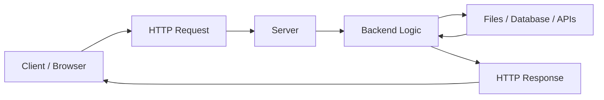
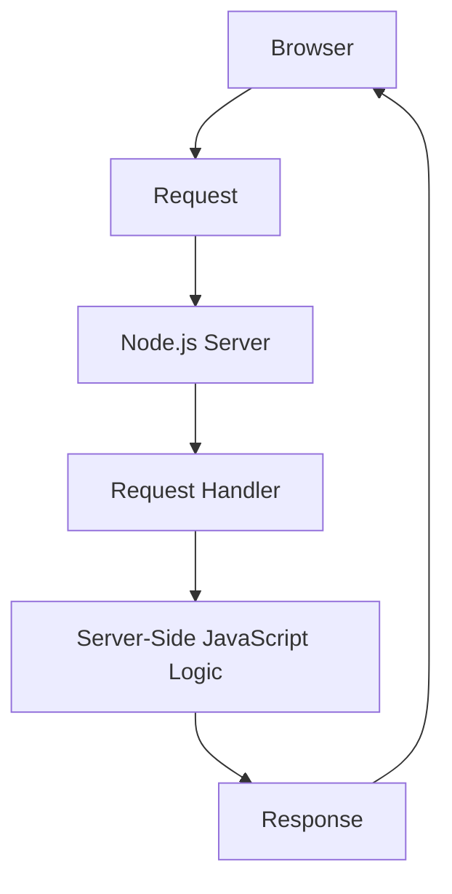
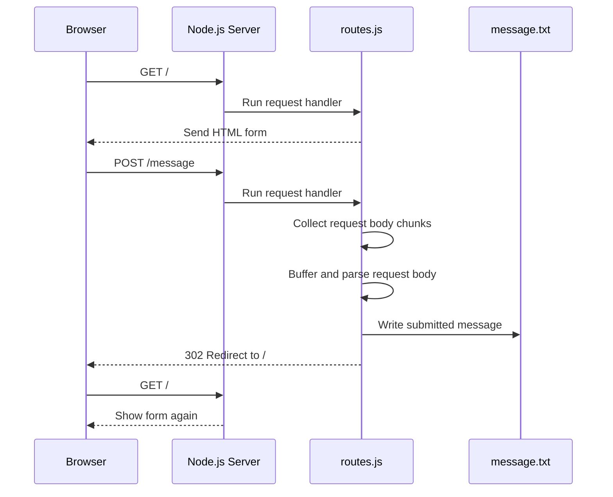
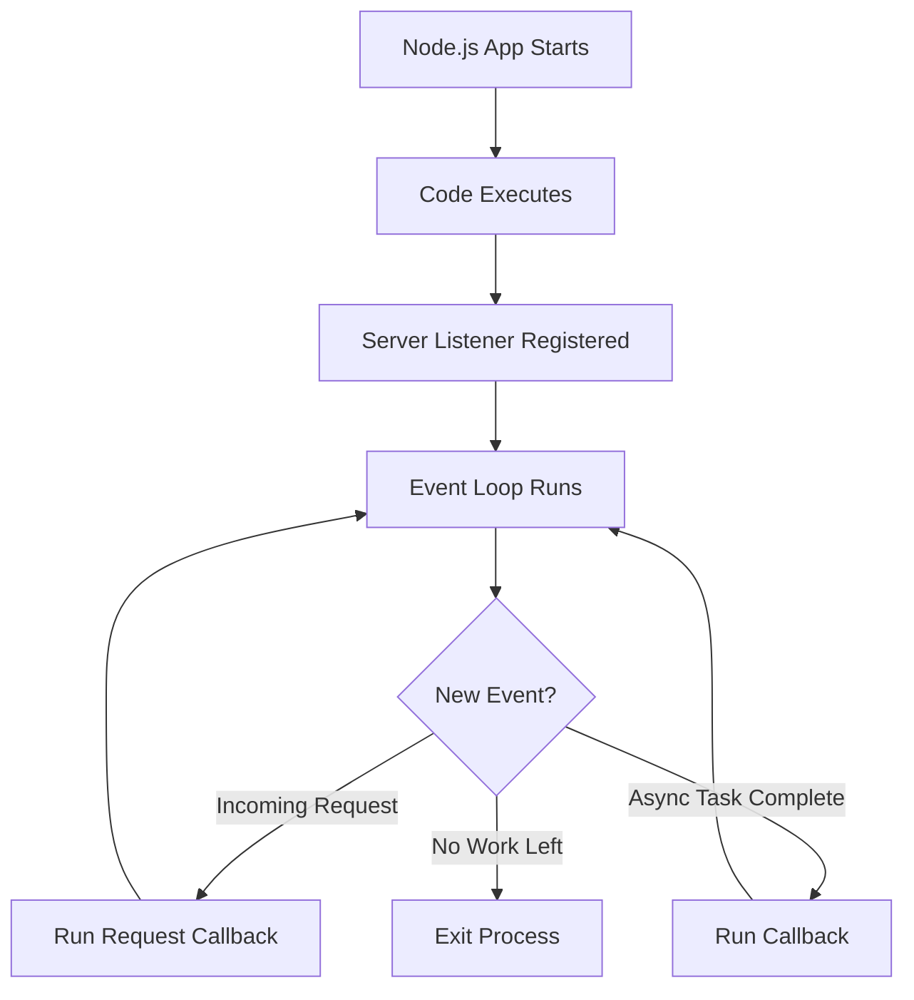
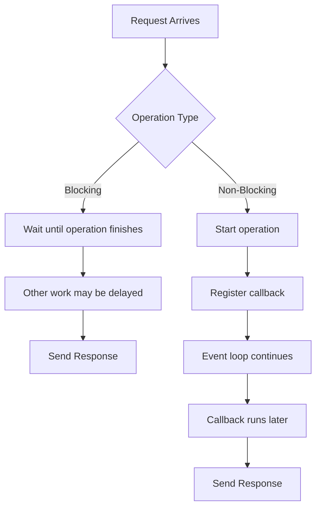
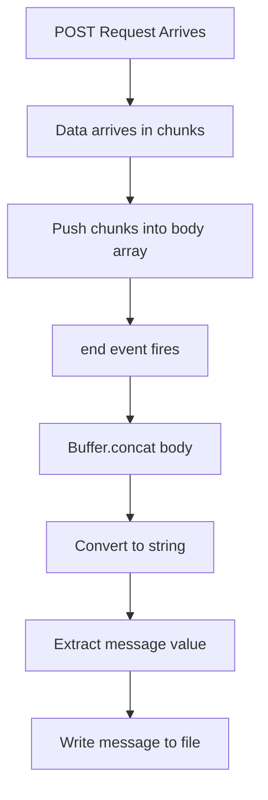

# 016 - Wrap Up

## Section

Understanding the Basics

## Duration

5min

## Main Idea

This lesson wraps up the **Understanding the Basics** section.

Throughout this module, we learned how the web works, how Node.js fits into the request-response cycle, how to create a basic server, how to work with requests and responses, how routing works, and how Node.js handles asynchronous, event-driven, non-blocking code.

The most important takeaway is that Node.js runs on the server and helps us write backend JavaScript code that can receive requests, process data, interact with files or databases, and send responses back to the client.

---

## Learning Objectives

By the end of this lesson, you should be able to:

* Summarize how the web works at a high level.
* Explain the role of Node.js in a web application.
* Describe the request-response cycle.
* Understand why the event loop is central to Node.js.
* Explain why Node.js uses asynchronous and non-blocking code.
* Understand how requests and responses are handled in raw Node.js.
* Recognize why streams and buffers are used for request body parsing.
* Understand why `res.end()` should finish a response only once.
* Explain how Node.js core modules are imported.
* Understand how the Node module system helps split code across files.
* Prepare to move from raw Node.js into easier tools such as Express.js.

---

## Big Picture: How the Web Works

The web works through communication between a client and a server.

The client is usually the browser. The server is a computer that runs backend code.



A typical flow looks like this:

```text id="xf2prs"
1. The browser sends a request.
2. The server receives the request.
3. The server runs backend logic.
4. The server may work with files, databases, or APIs.
5. The server sends a response.
6. The browser displays or processes the response.
```

---

## Where Node.js Fits In

Node.js runs on the server.

It allows us to write server-side JavaScript code.

With Node.js, we can:

* Create a web server.
* Listen for incoming requests.
* Read request data.
* Send responses.
* Work with files.
* Use core modules.
* Split code into modules.
* Handle asynchronous operations.
* Build backend applications.



---

## Core Flow Built in This Module

By the end of this module, we created a small Node.js server that can:

```text id="qgjrrm"
1. Show an HTML form.
2. Receive a POST request.
3. Parse the submitted request body.
4. Write the submitted message into a file.
5. Redirect the user back to the homepage.
```

---

## Final Application Flow



---

## Key Concept 1: Request and Response

Every incoming request gives us two important objects:

```js id="m8urc2"
(req, res) => {
  // req = incoming request
  // res = outgoing response
}
```

| Object | Purpose                                  |
| ------ | ---------------------------------------- |
| `req`  | Contains data about the incoming request |
| `res`  | Used to send data back to the client     |

Important request properties include:

```js id="ymsrti"
req.url
req.method
req.headers
```

Important response methods include:

```js id="j71vlv"
res.setHeader()
res.write()
res.end()
```

---

## Key Concept 2: Routing

Routing means deciding what should happen based on the requested URL and HTTP method.

Example:

```text id="jqo4ec"
GET /           → Show the form
POST /message   → Process the submitted message
Other routes    → Show a default response
```

A route usually combines:

```text id="n2hqx0"
HTTP method + URL path + handler logic
```

Example from raw Node.js:

```js id="x7a1ek"
if (url === '/message' && method === 'POST') {
  // handle form submission
}
```

---

## Key Concept 3: The Event Loop

The event loop is one of the most important concepts in Node.js.

Node.js uses the event loop to keep running as long as there is work to do.

In a server application, this is important because the server should keep listening for new requests.



A normal Node.js script can end quickly.

A server keeps running because `server.listen()` registers a listener that waits for future requests.

---

## Key Concept 4: Asynchronous Code

Node.js often does not execute all code immediately in the order it is written.

Instead, it frequently registers callbacks that will run later.

Example:

```js id="kxod0k"
req.on('end', () => {
  // This runs later, when the request body is fully received
});
```

This means:

```text id="hax96c"
Register now, execute later.
```

That is why code inside event listeners or callbacks may run after later lines of code have already executed.

---

## Key Concept 5: Non-Blocking Code

Node.js is designed to avoid blocking the main JavaScript thread.

Blocking code waits until an operation finishes:

```js id="gdnwwt"
fs.writeFileSync('message.txt', message);
```

Non-blocking code starts the operation and runs a callback later:

```js id="ylm1e0"
fs.writeFile('message.txt', message, (err) => {
  // Runs after the file is written
});
```

Non-blocking code helps Node.js stay responsive and handle more requests efficiently.

---

## Blocking vs Non-Blocking



---

## Key Concept 6: Streams and Buffers

When a request sends body data, Node.js receives that data as a stream.

The data may arrive in chunks.

We collect those chunks:

```js id="pyglwm"
const body = [];

req.on('data', (chunk) => {
  body.push(chunk);
});
```

When all chunks are received, we combine them:

```js id="jn2d92"
const parsedBody = Buffer.concat(body).toString();
```

This gives us the submitted body data as a string.

Example:

```text id="g9fs58"
message=hello
```

---

## Request Body Parsing Flow



---

## Key Concept 7: One Response Per Request

A request should receive one final response.

Once you call:

```js id="p5dcvb"
res.end();
```

you should not try to write more data or set more headers for that same response.

Bad pattern:

```js id="ouo8vm"
res.end();
res.setHeader('Location', '/');
```

This can cause errors such as:

```text id="zv24ei"
Cannot set headers after they are sent to the client
```

This often happens when asynchronous code sends a response later, but another response was already sent earlier.

---

## Key Concept 8: Core Modules

Node.js includes built-in modules called core modules.

Examples:

| Module | Purpose                             |
| ------ | ----------------------------------- |
| `http` | Create servers and work with HTTP   |
| `fs`   | Work with the file system           |
| `path` | Build safe file paths               |
| `os`   | Access operating system information |

We import core modules with `require()`:

```js id="fw5473"
const http = require('http');
const fs = require('fs');
```

A core module must be imported in every file where it is used.

---

## Key Concept 9: The Node Module System

As applications grow, we should split code into multiple files.

In this module, we moved routing logic into `routes.js`.

Example structure:

```text id="dq7042"
node-basics/
├── app.js
├── routes.js
└── message.txt
```

`app.js` starts the server:

```js id="kfk51k"
const http = require('http');

const routes = require('./routes');

const server = http.createServer(routes);

server.listen(3000);
```

`routes.js` handles the request logic:

```js id="5f7nve"
const requestHandler = (req, res) => {
  // route handling logic
};

module.exports = requestHandler;
```

---

## Import and Export Flow


---

## Important Module System Rules

### Importing a Core Module

```js id="g1700i"
const http = require('http');
```

### Importing a Local File

```js id="d4mvwt"
const routes = require('./routes');
```

The `./` is important because it tells Node.js to look for a local file.

### Exporting One Value

```js id="ym9qp1"
module.exports = requestHandler;
```

### Exporting Multiple Values

```js id="9hcptg"
exports.handler = requestHandler;
exports.someText = 'Some text';
```

---

## What This Module Built

The final raw Node.js application includes:

```text id="tkalqa"
1. A server created with the http module.
2. A homepage route that sends an HTML form.
3. A POST /message route.
4. Manual request body parsing with streams and buffers.
5. Non-blocking file writing with fs.writeFile().
6. A redirect response using status code 302 and Location header.
7. A separate routes.js file exported into app.js.
```

---

## Final Code Overview

### `app.js`

```js id="t2epz5"
const http = require('http');

const routes = require('./routes');

const server = http.createServer(routes);

server.listen(3000);
```

### `routes.js`

```js id="kdm85z"
const fs = require('fs');

const requestHandler = (req, res) => {
  const url = req.url;
  const method = req.method;

  if (url === '/') {
    res.setHeader('Content-Type', 'text/html');

    res.write('<html>');
    res.write('<head><title>Enter Message</title></head>');
    res.write('<body>');
    res.write('<form action="/message" method="POST">');
    res.write('<input type="text" name="message">');
    res.write('<button type="submit">Send</button>');
    res.write('</form>');
    res.write('</body>');
    res.write('</html>');

    return res.end();
  }

  if (url === '/message' && method === 'POST') {
    const body = [];

    req.on('data', (chunk) => {
      body.push(chunk);
    });

    return req.on('end', () => {
      const parsedBody = Buffer.concat(body).toString();
      const message = parsedBody.split('=')[1];

      fs.writeFile('message.txt', message, (err) => {
        res.statusCode = 302;
        res.setHeader('Location', '/');
        return res.end();
      });
    });
  }

  res.setHeader('Content-Type', 'text/html');

  res.write('<html>');
  res.write('<head><title>My First Page</title></head>');
  res.write('<body><h1>Hello from my Node.js Server!</h1></body>');
  res.write('</html>');

  res.end();
};

module.exports = requestHandler;
```

---

## What Should Feel Comfortable Before Moving On

Before moving to the next section, you should be comfortable with these ideas:

```text id="s06w5c"
1. The browser sends requests and receives responses.
2. Node.js runs on the server.
3. http.createServer() creates a server.
4. req contains request data.
5. res is used to send responses.
6. Routing can be done by checking req.url and req.method.
7. Request bodies arrive as streams.
8. Buffers can combine request body chunks.
9. Asynchronous code often runs later.
10. Non-blocking code keeps Node.js responsive.
11. Core modules are imported with require().
12. Custom files can export and import functionality.
```

---

## Why This Section Matters

This section may feel low-level and verbose, but it is very important.

Many courses start directly with Express.js, which makes server development much easier.

However, learning raw Node.js first helps you understand what Express.js hides behind the scenes.

Because of this section, you now understand the foundation behind:

* Request handling.
* Response sending.
* Routing.
* Form submission.
* Redirects.
* Body parsing.
* File writing.
* Async callbacks.
* Module organization.

This makes you a stronger Node.js developer.

---

## Practice

Write a five-bullet recap from memory.

Example:

```text id="h5amrk"
1. Node.js runs JavaScript on the server.
2. A browser sends requests and receives responses.
3. The event loop keeps Node.js running and handles callbacks.
4. Request body data arrives in chunks and can be buffered.
5. Modules help split code into multiple files.
```

Then reopen the section index and add any missing concepts.

---

## Practice Challenge

Rebuild the mini server from memory.

Requirements:

```text id="kxpnte"
1. Create app.js.
2. Create routes.js.
3. Use the http module to create a server.
4. Export a request handler from routes.js.
5. Show a form on GET /.
6. Submit the form to POST /message.
7. Parse the request body manually.
8. Write the message to message.txt with fs.writeFile().
9. Redirect back to /.
```

Then explain the request flow aloud from browser to server and back.

---

## Review Questions

1. What is the basic request-response cycle of the web?
2. Where does Node.js run in a web application?
3. What does `http.createServer()` do?
4. Why does a Node.js server keep running after `server.listen()`?
5. What is the event loop responsible for?
6. What does non-blocking code mean?
7. Why should long synchronous operations be avoided in a server?
8. What is the difference between `fs.writeFileSync()` and `fs.writeFile()`?
9. What does the `req` object contain?
10. What is the `res` object used for?
11. Why should you not send multiple responses for one request?
12. Why does request body data arrive in chunks?
13. What does `Buffer.concat()` help us do?
14. What is a Node.js core module?
15. What does `require()` do?
16. What does `module.exports` do?
17. Why is splitting code into modules useful?
18. Why is it helpful to understand raw Node.js before learning Express.js?

---

## Summary

This lesson wraps up the **Understanding the Basics** section.

We reviewed how the web works, how Node.js runs on the server, how requests and responses are handled, and how a basic Node.js server can be created with the `http` module.

We also learned that Node.js uses an event-driven, non-blocking architecture. The event loop keeps the process alive and executes callbacks when events occur. This allows Node.js to stay responsive while handling asynchronous operations like file writing.

We worked with request body parsing by collecting chunks from a stream, combining them with `Buffer.concat()`, and converting them into a string. We also learned why response logic must be placed carefully to avoid sending multiple responses.

Finally, we introduced the Node module system by moving routing logic into `routes.js` and exporting it into `app.js`.

This section was intentionally low-level. The code may not look elegant yet, but it reveals what happens behind the scenes. From here, the course can move toward tools like Express.js, which simplify many of these tasks while still relying on the same core ideas.
