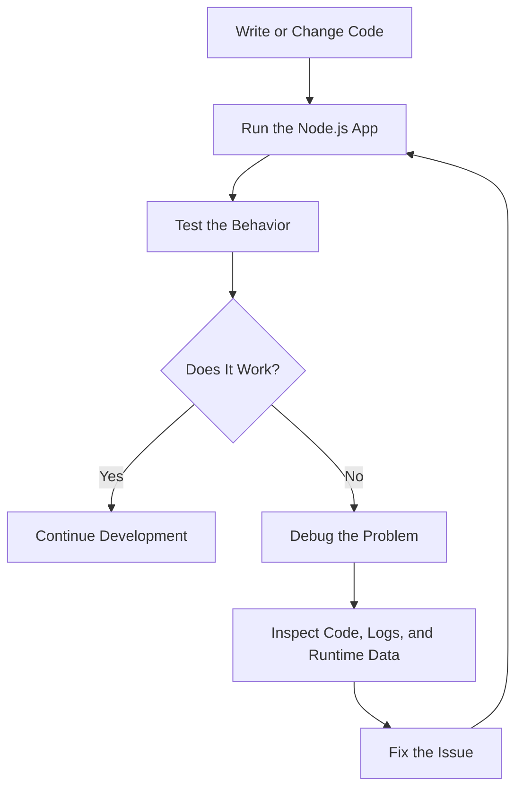
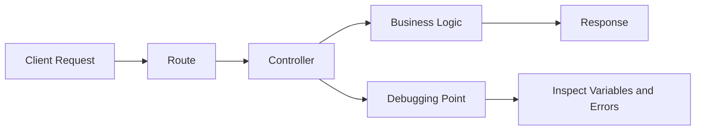

# 001 - Module Introduction

## Section

Improved Development Workflow and Debugging

## Duration

1 minute

---

## Overview

This lesson introduces the **Improved Development Workflow and Debugging** module. After learning the basics of Node.js and building several examples, this section takes a step back to focus on how to work more efficiently during development.

The main goal is to learn practical tools, techniques, and workflows that make Node.js development faster, easier to manage, and easier to debug.

---

## Main Idea

In this module, you will learn how to improve the way you build Node.js applications by using better development workflows and debugging techniques.

Instead of only writing code, this section focuses on understanding what happens inside your application, finding problems more easily, and using tools that support a smoother development process.

---

## Learning Objectives

By the end of this lesson, you should be able to:

* Understand the purpose of the **Improved Development Workflow and Debugging** section.
* Explain why development tools are important in Node.js projects.
* Recognize the need for debugging when building backend applications.
* Identify how workflow improvements can speed up development.
* Prepare for upcoming lessons about tools, debugging, and better project practices.

---

## Why This Module Matters

When building Node.js applications, writing code is only one part of the process. As applications grow, you also need to:

* Restart the server frequently during development.
* Understand how data moves through the application.
* Find and fix bugs.
* Inspect errors and unexpected behavior.
* Improve productivity with helpful tools.
* Build applications in a more efficient and reliable way.

This module helps you move from simply writing Node.js code to developing Node.js applications in a more professional and controlled workflow.

---

## Key Concepts

### 1. Improved Development Workflow

A development workflow is the process you follow while building an application.

A better workflow can help you:

* Write code faster.
* Test changes more easily.
* Reduce repetitive manual steps.
* Improve project structure.
* Stay focused on solving the actual problem.

### 2. Debugging

Debugging means finding and fixing problems in your code.

In Node.js applications, debugging helps you understand:

* Why a request fails.
* Why a variable has the wrong value.
* Why the server crashes.
* Why a route, controller, or middleware does not behave as expected.
* What happens step by step during execution.

### 3. Understanding Application Behavior

Good developers do not only write code. They also understand what their application is doing internally.

This includes knowing:

* Which file handles a request.
* Which function is executed first.
* What data is passed between functions.
* Where errors happen.
* How to inspect the runtime behavior of the app.

---

## Simple Workflow Diagram

---

## Practical Example

Imagine you are building a Node.js application with routes and controllers.

Without a good workflow, every small change may require you to:

1. Stop the server manually.
2. Restart the server.
3. Test the route again.
4. Guess where the problem is if something breaks.

With an improved workflow and debugging tools, you can:

1. Automatically restart the server after code changes.
2. Use logs or debugging tools to inspect values.
3. Pause execution at important points.
4. Trace the request flow from route to controller.
5. Fix problems more confidently.

---

## Example Request Flow

---

## Key Points

* This module focuses on making Node.js development easier and more efficient.
* Debugging helps you understand what is happening inside your application.
* A better workflow reduces repetitive manual work.
* Tools can help you restart, inspect, and test your application faster.
* Before fixing a problem, you should first understand where and why it happens.
* Good debugging starts with tracing the application flow step by step.

---

## Practice Task

Write a short example explaining how improved workflow and debugging can help in a Node.js project.

Example:

> When building a Node.js server, I may change a route handler many times. Instead of manually restarting the server after every change, I can use a development tool to restart it automatically. If the route does not return the expected response, I can use debugging techniques to inspect the request data, controller logic, and response output.

---

## Review Questions

1. What is the main goal of the **Improved Development Workflow and Debugging** module?
2. Why is debugging important in Node.js applications?
3. What problems can happen if a developer does not use debugging tools?
4. How can a better workflow speed up development?
5. Which part of a Node.js app would you inspect first when a request does not work?
6. How would you prove that your final application behavior works correctly?

---

## Summary

This lesson introduces the purpose of the **Improved Development Workflow and Debugging** module. After learning the basics of Node.js, it is important to improve the way you develop, test, and debug applications.

The upcoming lessons will focus on tools, tips, and techniques that help you build Node.js applications more efficiently and understand what is happening inside your code.

---

# Bài luyện tập

## Mục tiêu

## Đề bài

## Yêu cầu hoàn thành

- [ ] 
- [ ] 
- [ ] 

## Kết quả / lời giải

## Ghi chú
