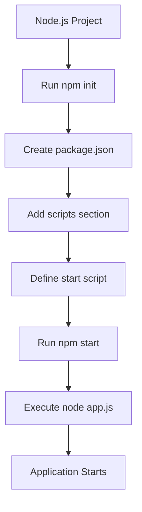
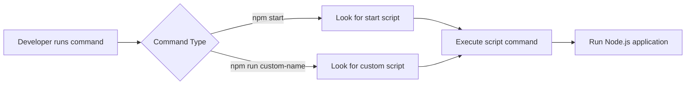

# 002 - Understanding NPM Scripts

## Section

Improved Development Workflow and Debugging

## Duration

7 minutes

---

## Overview

This lesson introduces **NPM scripts**, a useful feature for improving the development workflow in Node.js projects.

Instead of manually typing commands like `node app.js` every time you want to start the application, you can define reusable commands inside a `package.json` file. These commands make your project easier to run, easier to share, and easier to maintain.

---

## Main Idea

NPM scripts allow you to define common project commands in one central place.

In this lesson, the main example is creating a `start` script so the application can be started with:

```bash
npm start
```

instead of manually running:

```bash
node app.js
```

This may seem like a small improvement, but it is an important habit in Node.js development because most real-world Node projects rely heavily on scripts for starting, testing, building, debugging, and deploying applications.

---

## Learning Objectives

By the end of this lesson, you should be able to:

* Understand what NPM is and why it is used in Node.js projects.
* Explain the purpose of the `package.json` file.
* Create a Node.js project configuration using `npm init`.
* Add custom scripts inside the `scripts` section of `package.json`.
* Understand the difference between special scripts like `start` and custom script names.
* Run scripts using `npm start` and `npm run <script-name>`.
* Explain how NPM scripts improve the Node.js development workflow.

---

## What Is NPM?

NPM stands for **Node Package Manager**.

It is installed automatically together with Node.js, so you do not need to install it separately.

NPM is mainly used to:

* Initialize Node.js projects.
* Manage project dependencies.
* Install third-party packages.
* Define reusable project scripts.
* Help standardize how a project is run.

---

## Why NPM Scripts Matter

Before using NPM scripts, you may start your Node.js application like this:

```bash
node app.js
```

This works, but it has some drawbacks:

* Other developers need to know which file starts the application.
* Commands may become longer as the project grows.
* Repetitive commands are easy to mistype.
* There is no central place documenting common project commands.

With NPM scripts, you can define a standard command in `package.json`, such as:

```bash
npm start
```

This makes the project easier to use and more professional.

---

## Creating a `package.json` File

To initialize a Node.js project, run this command inside the project folder:

```bash
npm init
```

NPM will ask several questions, such as:

* Package name
* Version
* Description
* Entry point
* Test command
* Keywords
* Author
* License

You can press `Enter` to accept the default values.

After completing the setup, NPM creates a file called:

```text
package.json
```

---

## What Is `package.json`?

The `package.json` file is the main configuration file for a Node.js project.

It stores information such as:

* Project name
* Version
* Description
* Entry point
* Author
* License
* Scripts
* Dependencies

Example:

```json
{
  "name": "node-complete-guide",
  "version": "1.0.0",
  "description": "Complete Node.js Guide",
  "main": "app.js",
  "scripts": {
    "test": "echo \"Error: no test specified\" && exit 1"
  },
  "author": "",
  "license": "ISC"
}
```

---

## JSON Format Reminder

The `package.json` file uses the **JSON** format.

Important JSON rules:

* Keys must use double quotation marks.
* String values must use double quotation marks.
* Numbers, booleans, and arrays do not always need quotation marks.
* Each key-value pair is separated by a comma.
* The file must be valid JSON, or NPM may fail to read it.

Example:

```json
{
  "name": "my-project",
  "version": "1.0.0",
  "private": true
}
```

---

## Adding a Start Script

Inside the `scripts` section, you can define your own commands.

Example:

```json
{
  "scripts": {
    "start": "node app.js"
  }
}
```

Now you can start the application with:

```bash
npm start
```

This command tells NPM to look for the `start` script and execute:

```bash
node app.js
```

---

## Why `start` Is Special

The script name `start` is special in NPM.

Because it is a reserved script name, you can run it directly with:

```bash
npm start
```

You do not need to type:

```bash
npm run start
```

Although `npm run start` also works, `npm start` is the common shorter form.

---

## Adding a Custom Script

You can also define your own custom script names.

Example:

```json
{
  "scripts": {
    "start": "node app.js",
    "start-server": "node app.js"
  }
}
```

However, custom script names are not run directly with `npm <script-name>`.

This will not work:

```bash
npm start-server
```

Instead, you must use:

```bash
npm run start-server
```

---

## Special Script vs Custom Script

| Script Type        | Example Script Name | Command to Run         |
| ------------------ | ------------------- | ---------------------- |
| Special NPM script | `start`             | `npm start`            |
| Custom script      | `start-server`      | `npm run start-server` |
| Custom script      | `build`             | `npm run build`        |
| Custom script      | `dev`               | `npm run dev`          |
| Custom script      | `test-custom`       | `npm run test-custom`  |

---

## Simple Workflow Diagram



---

## NPM Script Execution Flow



---

## Practical Example

Before using NPM scripts:

```bash
node app.js
```

After adding a script in `package.json`:

```json
{
  "scripts": {
    "start": "node app.js"
  }
}
```

You can now run:

```bash
npm start
```

This is useful because other developers can immediately understand how to start the project without guessing which JavaScript file is the entry point.

---

## Common Use Cases for NPM Scripts

NPM scripts are often used for:

* Starting the application.
* Starting a development server.
* Running tests.
* Running build tools.
* Running code formatters.
* Running linters.
* Running debugging commands.
* Preparing the application for deployment.

Example:

```json
{
  "scripts": {
    "start": "node app.js",
    "dev": "nodemon app.js",
    "test": "jest",
    "build": "webpack"
  }
}
```

---

## Connection to Improved Development Workflow

This lesson supports the broader goal of improving development workflow because it helps standardize common project commands.

Instead of manually remembering and typing commands, you can save them in `package.json`.

This makes development:

* Faster
* More consistent
* Easier for teams
* Easier to document
* Easier to automate

---

## Key Points

* NPM is installed automatically with Node.js.
* `npm init` creates a `package.json` file.
* `package.json` is the main configuration file for a Node.js project.
* NPM scripts are defined inside the `scripts` section.
* The `start` script is special and can be run with `npm start`.
* Custom scripts must be run with `npm run <script-name>`.
* NPM scripts help make common commands repeatable and easier to share.
* Using scripts is a common practice in professional Node.js projects.

---

## Practice Task

Create a simple `package.json` file and add a script that starts your Node.js application.

Example:

```json
{
  "name": "my-node-app",
  "version": "1.0.0",
  "description": "A simple Node.js project",
  "main": "app.js",
  "scripts": {
    "start": "node app.js"
  },
  "author": "",
  "license": "ISC"
}
```

Then run:

```bash
npm start
```

Check whether the application starts correctly.

---

## Review Questions

1. What does NPM stand for?
2. What is the purpose of the `package.json` file?
3. Which command creates a `package.json` file?
4. Where do you define NPM scripts?
5. Why is `start` considered a special script name?
6. What is the difference between `npm start` and `npm run start-server`?
7. Why are NPM scripts useful in a Node.js project?
8. How do NPM scripts make a project easier to share with other developers?
9. What command would you use to run a custom script named `dev`?
10. How does this lesson improve the development workflow?

---

## Summary

This lesson explains how to use NPM scripts to simplify common project commands in Node.js.

By creating a `package.json` file with `npm init`, you can define scripts such as:

```json
{
  "scripts": {
    "start": "node app.js"
  }
}
```

Then, instead of manually running `node app.js`, you can simply run:

```bash
npm start
```

This improves the development workflow by making commands easier to remember, easier to repeat, and easier for other developers to use.

---

# Bài luyện tập

## Mục tiêu


## Đề bài


## Yêu cầu hoàn thành

- [ ] 
- [ ] 
- [ ] 

## Kết quả / lời giải


## Ghi chú
