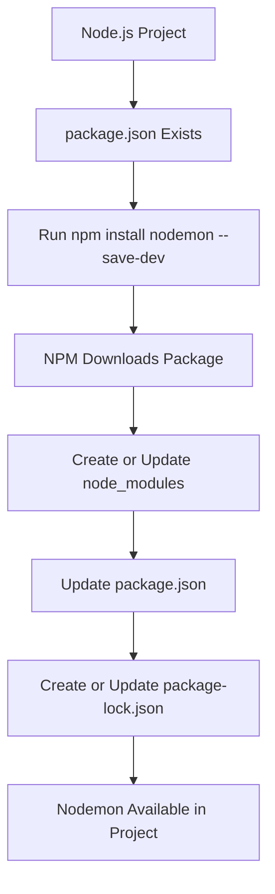
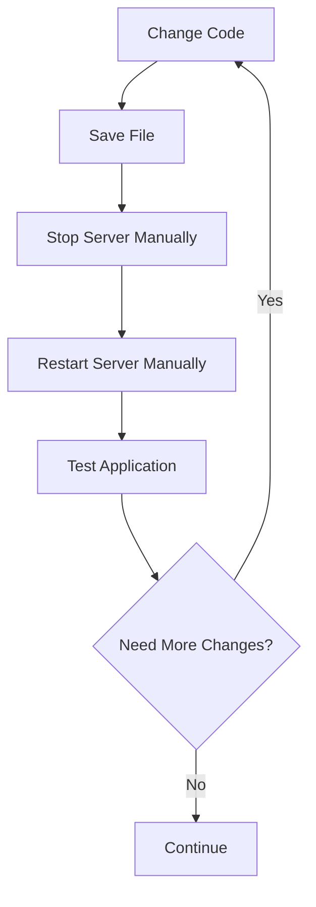
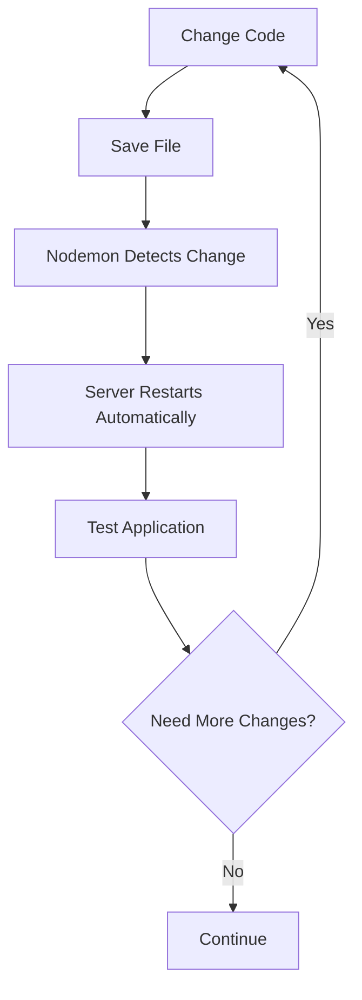

# 003 - Installing 3rd Party Packages

## Section

Improved Development Workflow and Debugging

## Duration

8 minutes

---

## Overview

This lesson explains how to install **third-party packages** in a Node.js project using NPM.

After creating a `package.json` file and adding NPM scripts, the project is now a managed Node.js project. This means we can install external packages from the NPM registry and use them to improve our development workflow.

The main package introduced in this lesson is **nodemon**, a development tool that automatically restarts the Node.js server whenever source files change.

---

## Main Idea

Node.js includes core modules such as `fs` and `http`, but real-world applications often need additional functionality that is not built into Node.js.

Third-party packages solve this problem by providing reusable code written by other developers.

In this lesson, we install a package called `nodemon` to improve the development workflow.

Instead of manually stopping and restarting the server every time we change the code, `nodemon` watches the project files and restarts the server automatically.

---

## Learning Objectives

By the end of this lesson, you should be able to:

* Understand why third-party packages are useful in Node.js projects.
* Explain what the NPM registry is.
* Install a package using `npm install`.
* Understand the difference between development dependencies and production dependencies.
* Install `nodemon` as a development dependency.
* Explain the purpose of the `node_modules` folder.
* Explain the purpose of `package-lock.json`.
* Understand when to install packages locally or globally.
* Use installed tools to improve the development workflow.

---

## Why Third-Party Packages Matter

A Node.js project usually contains:

* Your own application code.
* Node.js core modules.
* Third-party packages installed from NPM.

Node.js core modules are useful, but they do not solve every problem.

Third-party packages can help with tasks such as:

* Parsing incoming request bodies.
* Validating user input.
* Creating web servers more easily.
* Handling routing.
* Managing authentication.
* Improving development workflow.
* Automatically restarting the server during development.

Examples of common packages include:

* `express`
* `body-parser`
* `nodemon`
* `dotenv`
* `mongoose`
* `jest`

---

## What Is the NPM Registry?

The **NPM registry** is an online package repository where thousands of JavaScript and Node.js packages are published.

Developers can install these packages into their projects using NPM.

For example, to install a package, you use:

```bash
npm install package-name
```

or the shorter version:

```bash
npm i package-name
```

You can also search for package documentation on the NPM website by searching for:

```text
npm package-name
```

For example:

```text
npm nodemon
```

A package page usually includes:

* Package description
* Installation command
* Usage instructions
* Configuration options
* Current version
* Package popularity
* Source code link
* Dependency information

---

## The Development Problem

Before installing `nodemon`, the development process looks like this:

```bash
npm start
```

Then, whenever we change the source code, we must manually:

1. Save the file.
2. Stop the running server with `Ctrl + C`.
3. Restart the server.
4. Test the application again.

This works, but it becomes repetitive and slows down development.

---

## Improved Workflow with Nodemon

`nodemon` solves this problem by automatically restarting the Node.js application whenever files change.

Instead of manually restarting the server, we can let `nodemon` watch the project and restart it for us.

This creates a much faster feedback loop while developing.

---

## Installing Nodemon

Because `nodemon` is only needed during development, we install it as a development dependency.

```bash
npm install nodemon --save-dev
```

This command does three important things:

1. Downloads `nodemon` from the NPM registry.
2. Installs it into the current project.
3. Adds it to the `devDependencies` section in `package.json`.

---

## Development Dependency vs Production Dependency

There are different types of dependencies in a Node.js project.

### Development Dependencies

Development dependencies are only needed while building or developing the application.

Examples:

* `nodemon`
* testing tools
* build tools
* linters
* formatters

Install a development dependency with:

```bash
npm install package-name --save-dev
```

Example:

```bash
npm install nodemon --save-dev
```

In `package.json`, it appears under:

```json
{
  "devDependencies": {
    "nodemon": "^3.0.0"
  }
}
```

### Production Dependencies

Production dependencies are needed when the application runs in production.

Examples:

* `express`
* `body-parser`
* `mongoose`

Install a production dependency with:

```bash
npm install package-name --save
```

or simply:

```bash
npm install package-name
```

In modern NPM versions, packages are saved as production dependencies by default.

They appear under:

```json
{
  "dependencies": {
    "express": "^4.18.0"
  }
}
```

---

## Local vs Global Installation

Packages can be installed locally or globally.

### Local Installation

A local package is installed inside the current project.

Example:

```bash
npm install nodemon --save-dev
```

Local installation is usually preferred because:

* The package belongs to the project.
* Different projects can use different versions.
* Other developers can install the same dependencies using `npm install`.
* The project remains predictable and easier to share.

### Global Installation

A global package is installed on your entire machine.

Example:

```bash
npm install nodemon -g
```

Global installation makes the command available everywhere on your computer.

However, global installation should only be used when a tool truly belongs globally. For most project-specific tools, local installation is better.

---

## Files and Folders Created After Installation

After installing `nodemon`, the project gets new or updated files.

### 1. `node_modules`

The `node_modules` folder contains the installed package code.

It includes:

* The package you installed.
* Its dependencies.
* Dependencies of those dependencies.

This folder can become very large.

You usually do not edit files inside `node_modules`.

### 2. `package.json`

The `package.json` file is updated with the installed package information.

Example:

```json
{
  "devDependencies": {
    "nodemon": "^3.0.0"
  }
}
```

This tells the project that `nodemon` is required for development.

### 3. `package-lock.json`

The `package-lock.json` file stores the exact versions of installed packages.

This helps ensure that other developers install the same versions when they run:

```bash
npm install
```

---

## What Happens If `node_modules` Is Deleted?

You can delete the `node_modules` folder if you need to free disk space.

However, the installed packages will no longer be available until you reinstall them.

To recreate `node_modules`, run:

```bash
npm install
```

NPM will read the dependency information from:

* `package.json`
* `package-lock.json`

Then it will reinstall the required packages.

---

## Installation Flow Diagram



---

## Development Workflow Before Nodemon



---

## Development Workflow With Nodemon



---

## Updating the NPM Script

After installing `nodemon`, you can use it in the `scripts` section of `package.json`.

Example:

```json
{
  "scripts": {
    "start": "node app.js",
    "start-server": "nodemon app.js"
  },
  "devDependencies": {
    "nodemon": "^3.0.0"
  }
}
```

Now you can run:

```bash
npm run start-server
```

This starts the app with `nodemon` instead of plain `node`.

---

## Why This Improves Development Workflow

Using `nodemon` improves development because it:

* Removes the need to manually restart the server.
* Makes code changes faster to test.
* Shortens the feedback loop.
* Reduces repetitive manual work.
* Helps developers focus on writing and debugging code.

This is especially useful when working on routes, controllers, middleware, and server-side logic.

---

## Practical Example

Suppose you are editing a route in `app.js`.

Without `nodemon`, you must restart the server manually after every change:

```bash
Ctrl + C
npm start
```

With `nodemon`, you only need to save the file.

`nodemon` automatically restarts the application, so you can immediately test the updated behavior in the browser or API client.

---

## Common Failure to Check First

If `nodemon` does not work, check these first:

1. Is `nodemon` installed in the project?

```bash
npm install
```

2. Is the script written correctly in `package.json`?

```json
{
  "scripts": {
    "start-server": "nodemon app.js"
  }
}
```

3. Are you running the custom script correctly?

```bash
npm run start-server
```

4. Are you inside the correct project folder?

```bash
pwd
```

or on Windows:

```bash
cd
```

5. Does the entry file actually exist?

```text
app.js
```

---

## Key Points

* Third-party packages add functionality that is not included in Node.js core.
* NPM is used to install and manage packages.
* Packages are downloaded from the NPM registry.
* `nodemon` automatically restarts the server during development.
* Development dependencies are installed with `--save-dev`.
* Production dependencies are required when the app runs in production.
* Local project dependencies are usually preferred over global installations.
* `node_modules` stores installed package files.
* `package-lock.json` stores exact installed package versions.
* If `node_modules` is deleted, it can be recreated with `npm install`.

---

## Practice Task

Install `nodemon` as a development dependency in a Node.js project.

```bash
npm install nodemon --save-dev
```

Then update `package.json`:

```json
{
  "scripts": {
    "start": "node app.js",
    "start-server": "nodemon app.js"
  }
}
```

Run the development server:

```bash
npm run start-server
```

Change something in `app.js`, save the file, and confirm that the server restarts automatically.

---

## Review Questions

1. Why do Node.js projects use third-party packages?
2. What is the NPM registry?
3. Which command installs a package?
4. What problem does `nodemon` solve?
5. Why is `nodemon` installed as a development dependency?
6. What is the difference between `dependencies` and `devDependencies`?
7. What is the purpose of the `node_modules` folder?
8. What is the purpose of `package-lock.json`?
9. Why should most project dependencies be installed locally?
10. How can you reinstall packages after deleting `node_modules`?
11. Which file would you inspect first to check whether a package was installed correctly?
12. How would you prove that `nodemon` is working?

---

## Summary

This lesson introduces third-party packages in Node.js and explains how NPM helps install and manage them.

The example package is `nodemon`, a development tool that automatically restarts the server whenever project files change.

By installing it with:

```bash
npm install nodemon --save-dev
```

and using it in an NPM script, we improve the development workflow by reducing manual restarts and making code changes faster to test.

This is an important step toward building Node.js applications more efficiently and professionally.
