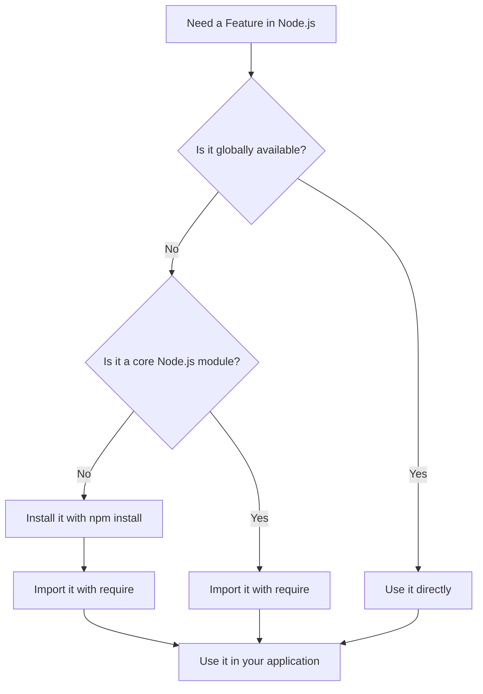
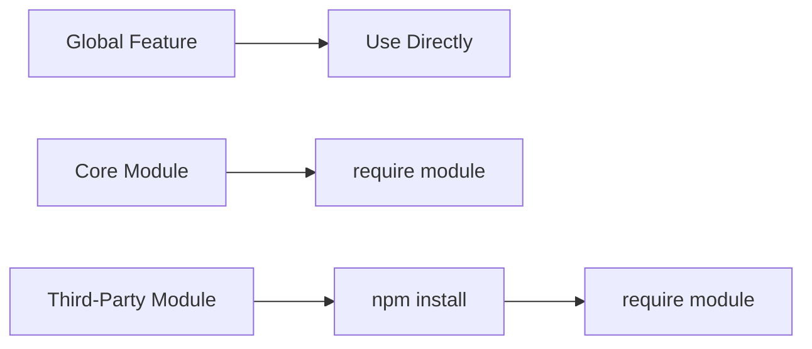

# 004 - Global Features vs Core Modules vs Third-Party Modules

## Section

Improved Development Workflow and Debugging

## Duration

1 minute

---

## Overview

This lesson explains the difference between **global features**, **core Node.js modules**, and **third-party modules**.

Understanding these three categories is important because it helps you know when a feature is already available, when it must be imported, and when it must be installed first.

---

## Main Idea

Node.js gives you access to different kinds of features:

1. **Global features** are always available.
2. **Core modules** come with Node.js, but must be imported before use.
3. **Third-party modules** must be installed with NPM and then imported into your code.

This distinction helps you write cleaner code and avoid confusion when using Node.js features.

---

## Learning Objectives

By the end of this lesson, you should be able to:

* Explain what global features are.
* Identify examples of Node.js core modules.
* Understand what third-party modules are.
* Know when `npm install` is required.
* Know when `require()` is required.
* Distinguish between built-in Node.js functionality and external packages.

---

## Three Types of Features in Node.js

### 1. Global Features

Global features are available automatically in every Node.js file.

You do not need to import or install them.

Examples include:

* `const`
* `let`
* `function`
* `process`
* `console`
* `setTimeout`

Example:

```js
const name = 'Node.js';

console.log(name);
console.log(process.version);
```

In this example:

* `const` is a JavaScript keyword.
* `console` is globally available.
* `process` is a global Node.js object.

No import is required.

---

### 2. Core Node.js Modules

Core modules are built into Node.js.

You do not need to install them with NPM, but you must import them before using them.

Common core modules include:

* `fs`
* `path`
* `http`
* `https`
* `os`

Example:

```js
const fs = require('fs');

fs.writeFileSync('message.txt', 'Hello from Node.js!');
```

In this example:

* `fs` is a core Node.js module.
* It does not require `npm install`.
* It must be imported with `require('fs')`.

---

### 3. Third-Party Modules

Third-party modules are external packages created by other developers.

They are not included in Node.js by default.

To use them, you must:

1. Install them with NPM.
2. Import them into your code.

Example installation command:

```bash
npm install express-session
```

Example usage in code:

```js
const session = require('express-session');
```

In this example:

* `express-session` is not part of Node.js core.
* It must be installed first.
* It must also be imported before use.

---

## Comparison Table

| Feature Type         | Needs Installation? | Needs Import? | Example                                 |
| -------------------- | ------------------: | ------------: | --------------------------------------- |
| Global Features      |                  No |            No | `console`, `process`, `setTimeout`      |
| Core Node.js Modules |                  No |           Yes | `fs`, `path`, `http`                    |
| Third-Party Modules  |                 Yes |           Yes | `express`, `nodemon`, `express-session` |

---

## Decision Flow



---

## Import and Installation Summary



---

## Practical Examples

### Global Feature Example

```js
console.log('Server is starting...');
```

No installation or import is needed.

---

### Core Module Example

```js
const http = require('http');

const server = http.createServer((req, res) => {
  res.end('Hello from Node.js');
});

server.listen(3000);
```

The `http` module is built into Node.js, but it still needs to be imported.

---

### Third-Party Module Example

Install the package first:

```bash
npm install express
```

Then import it:

```js
const express = require('express');

const app = express();

app.get('/', (req, res) => {
  res.send('Hello from Express');
});

app.listen(3000);
```

The `express` package is not built into Node.js, so it must be installed and imported.

---

## Common Mistakes

### Mistake 1: Trying to Import a Global Feature

You do not need to do this:

```js
const console = require('console');
```

Instead, just use:

```js
console.log('Hello');
```

---

### Mistake 2: Installing a Core Module

You do not need to run:

```bash
npm install fs
```

The `fs` module already comes with Node.js.

Correct usage:

```js
const fs = require('fs');
```

---

### Mistake 3: Using a Third-Party Module Without Installing It

This will fail if `express` has not been installed:

```js
const express = require('express');
```

Fix it by running:

```bash
npm install express
```

---

## How This Supports Better Development Workflow

This lesson supports the broader goal of **Improved Development Workflow and Debugging** because it helps you understand where your tools and features come from.

When something does not work, you can debug faster by asking:

* Is this feature global?
* Is this a core module?
* Is this a third-party package?
* Did I install it?
* Did I import it correctly?
* Is it listed in `package.json`?

This makes it easier to identify setup mistakes and dependency issues.

---

## Key Points

* Global features are always available.
* Core Node.js modules are built into Node.js.
* Core modules do not need installation, but they must be imported.
* Third-party modules must be installed with NPM.
* Third-party modules must also be imported before use.
* `package.json` helps track installed third-party packages.
* Understanding these categories helps avoid common Node.js setup errors.

---

## Practice Task

Create a small Node.js file and use one example from each category.

```js
// Global feature
console.log('Node.js version:', process.version);

// Core module
const path = require('path');
console.log(path.join(__dirname, 'app.js'));

// Third-party module
// First run: npm install express
const express = require('express');
console.log('Express loaded successfully');
```

Then answer:

* Which feature was global?
* Which module was built into Node.js?
* Which package had to be installed with NPM?

---

## Review Questions

1. What is a global feature in Node.js?
2. Do global features need to be imported?
3. What is a core Node.js module?
4. Do core modules need to be installed with NPM?
5. Why do core modules still need to be imported?
6. What is a third-party module?
7. What are the two steps required to use a third-party module?
8. Why should you not run `npm install fs`?
9. Which file helps track installed third-party packages?
10. How does this distinction help when debugging a Node.js project?

---

## Summary

This lesson explains the difference between global features, core Node.js modules, and third-party modules.

Global features can be used directly. Core modules are built into Node.js but must be imported. Third-party modules must be installed with NPM and then imported into the project.

Understanding this distinction helps you avoid common setup mistakes and makes it easier to debug Node.js applications.
