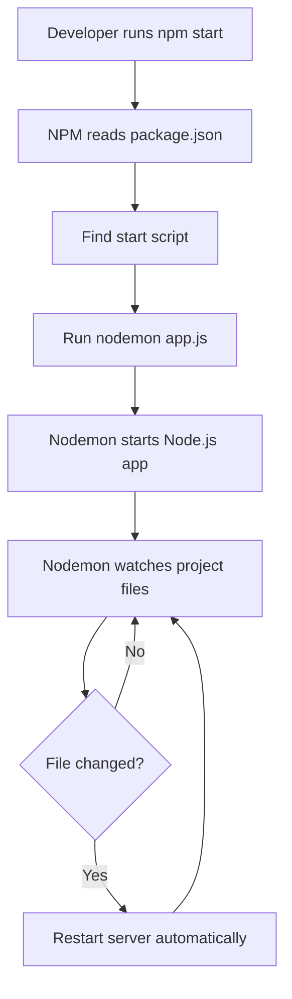
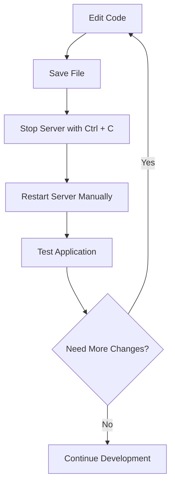
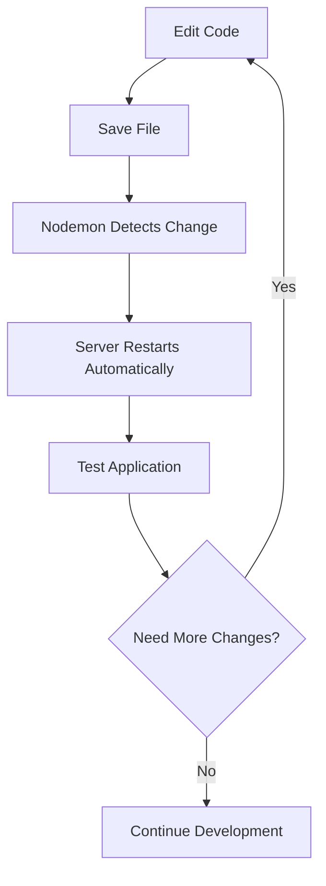
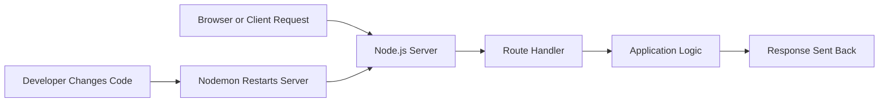

# 005 - Using Nodemon for Autorestarts

## Section

Improved Development Workflow and Debugging

## Duration

2 minutes

---

## Overview

This lesson explains how to use **Nodemon** to automatically restart a Node.js application whenever project files change.

In the previous lesson, `nodemon` was installed as a development dependency. Now, we use it inside an NPM script so the development server can restart automatically without manually stopping and starting it again.

---

## Main Idea

During development, we often change files such as `app.js`, `routes.js`, controllers, or other project files.

Without Nodemon, every change requires this manual process:

```bash
Ctrl + C
npm start
```

With Nodemon, the server watches the files for changes and restarts automatically.

This improves the development workflow because it shortens the feedback loop and allows developers to test changes faster.

---

## Learning Objectives

By the end of this lesson, you should be able to:

* Understand what Nodemon does in a Node.js project.
* Use Nodemon through an NPM script.
* Explain why local project tools are usually run through NPM scripts.
* Update the `start` script to use `nodemon`.
* Test whether the server restarts automatically after a file change.
* Explain how autorestarts improve development speed.

---

## The Problem Before Nodemon

Before using Nodemon, the development workflow is repetitive.

Every time you change the code, you must:

1. Save the file.
2. Stop the running server manually.
3. Restart the server manually.
4. Test the application again.

Example:

```bash
node app.js
```

or:

```bash
npm start
```

After editing a file, you would need to stop the server with:

```bash
Ctrl + C
```

Then restart it again.

This works, but it slows down development.

---

## What Nodemon Does

Nodemon is a development utility that:

* Runs your Node.js application.
* Watches your project files for changes.
* Automatically restarts the Node.js process when a file changes.
* Saves time during development.

In the end, Nodemon still runs your Node.js application, but it adds file-watching and automatic restart behavior.

---

## Updating the NPM Start Script

Before using Nodemon, the `start` script may look like this:

```json
{
  "scripts": {
    "start": "node app.js"
  }
}
```

To use Nodemon, change it to:

```json
{
  "scripts": {
    "start": "nodemon app.js"
  }
}
```

Now, when you run:

```bash
npm start
```

NPM will execute:

```bash
nodemon app.js
```

This starts the server through Nodemon instead of plain Node.js.

---

## Why It Works Through NPM Scripts

Nodemon was installed locally inside the project, not globally on the machine.

That means this command may not work directly in the terminal:

```bash
nodemon app.js
```

It may fail because the terminal looks for a globally installed `nodemon` command.

However, this works:

```bash
npm start
```

Why?

Because NPM scripts can access locally installed project tools from `node_modules`.

So even if Nodemon is not installed globally, it can still be used inside the project through `package.json` scripts.

---

## Local Tool Execution Flow



---

## Development Workflow Before Nodemon



---

## Development Workflow With Nodemon



---

## Example Project Setup

### `package.json`

```json
{
  "name": "node-development-workflow",
  "version": "1.0.0",
  "description": "A Node.js project using Nodemon for autorestarts",
  "main": "app.js",
  "scripts": {
    "start": "nodemon app.js"
  },
  "devDependencies": {
    "nodemon": "^3.0.0"
  }
}
```

### Start the Server

```bash
npm start
```

### Test Autorestart

1. Start the application with `npm start`.
2. Open a file such as `routes.js` or `app.js`.
3. Make a small change.
4. Save the file.
5. Check the terminal.
6. Nodemon should restart the server automatically.

---

## Example Request Flow While Using Nodemon

Nodemon does not change how requests move through the application. It only improves the development process.



---

## Important Note

Nodemon is mainly used during development.

It should not usually be used on a real production server because production code is not supposed to change dynamically while the app is running.

For production, the application is normally started with `node app.js` or managed by a process manager.

---

## Common Mistakes

### Mistake 1: Running Nodemon Directly Without Global Installation

This may fail:

```bash
nodemon app.js
```

If Nodemon is only installed locally, use:

```bash
npm start
```

or:

```bash
npm run start-server
```

depending on your script name.

---

### Mistake 2: Forgetting to Update `package.json`

If your script still says:

```json
{
  "scripts": {
    "start": "node app.js"
  }
}
```

then Nodemon is not being used.

Change it to:

```json
{
  "scripts": {
    "start": "nodemon app.js"
  }
}
```

---

### Mistake 3: Installing Nodemon as a Production Dependency

Nodemon should usually be installed as a development dependency:

```bash
npm install nodemon --save-dev
```

This keeps it separate from packages needed in production.

---

## How This Supports Better Development Workflow

Using Nodemon improves the development workflow because it:

* Removes repetitive manual restarts.
* Makes testing changes faster.
* Helps developers stay focused on coding.
* Shortens the edit-save-test cycle.
* Makes backend development smoother.
* Works well with routes, controllers, middleware, and server-side logic.

---

## Key Points

* Nodemon is a development utility for Node.js.
* It watches files for changes.
* It restarts the server automatically after saving changes.
* Nodemon should usually be installed locally as a development dependency.
* Local tools can be executed through NPM scripts.
* The `start` script can be changed from `node app.js` to `nodemon app.js`.
* Automatic restarts make development faster and more convenient.
* Nodemon improves workflow, but it does not change the actual request-response logic of the app.

---

## Practice Task

Update your Node.js project to use Nodemon.

### Step 1: Install Nodemon

```bash
npm install nodemon --save-dev
```

### Step 2: Update `package.json`

```json
{
  "scripts": {
    "start": "nodemon app.js"
  }
}
```

### Step 3: Run the App

```bash
npm start
```

### Step 4: Test Autorestart

Edit `routes.js` or `app.js`, save the file, and check whether the server restarts automatically.

Write down:

* The command you used.
* The file you changed.
* What happened in the terminal.
* How you confirmed that the updated behavior worked.

---

## Review Questions

1. What problem does Nodemon solve during development?
2. Why is manually restarting the server inefficient?
3. How do you update the `start` script to use Nodemon?
4. Why can `npm start` run a locally installed Nodemon package?
5. Why might `nodemon app.js` fail when typed directly in the terminal?
6. Should Nodemon usually be used in production? Why or why not?
7. Which file would you inspect first to check whether Nodemon is configured correctly?
8. How would you prove that Nodemon is working?
9. Does Nodemon change how requests move through routes and controllers?
10. How does automatic restarting improve the development workflow?

---

## Summary

This lesson shows how to use Nodemon for automatic server restarts in a Node.js project.

By changing the NPM start script from:

```json
{
  "start": "node app.js"
}
```

to:

```json
{
  "start": "nodemon app.js"
}
```

you can run the application with:

```bash
npm start
```

Now, when you edit and save a file, Nodemon automatically restarts the server.

This makes development faster, reduces repetitive manual work, and creates a smoother workflow for building Node.js applications.
