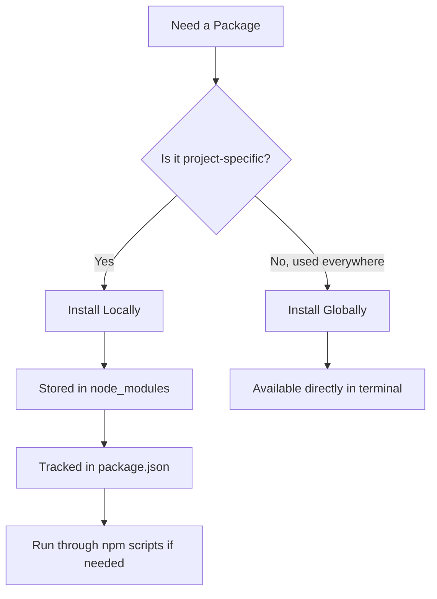
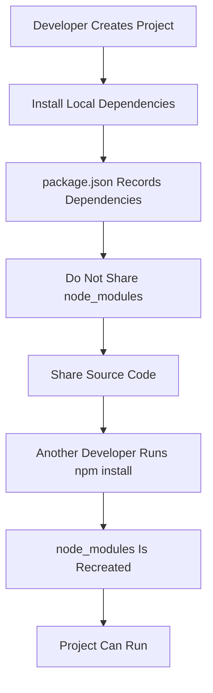

# 006 - Global & Local npm Packages

## Section

Improved Development Workflow and Debugging

## Duration

1 minute

---

## Overview

This lesson explains the difference between **local npm packages** and **global npm packages**.

In the previous lesson, `nodemon` was installed as a local development dependency. This means it belongs to the current project, not to the whole computer.

Understanding the difference between local and global packages helps you know when a command can be run directly in the terminal and when it should be run through an NPM script.

---

## Main Idea

NPM packages can be installed in two main ways:

1. **Locally** inside a specific project.
2. **Globally** on your machine.

Most project dependencies should be installed locally because this keeps the project predictable, portable, and easier to share.

Global packages should only be used for tools that you truly want to run from anywhere on your computer.

---

## Learning Objectives

By the end of this lesson, you should be able to:

* Explain what a local npm package is.
* Explain what a global npm package is.
* Understand why most project dependencies should be installed locally.
* Understand why `nodemon app.js` may not work directly in the terminal.
* Know how to install a package globally with the `-g` flag.
* Explain why `npm install` can recreate the `node_modules` folder.
* Understand why shared course code often does not include `node_modules`.

---

## Local npm Packages

A local npm package is installed inside the current project.

Example:

```bash id="akubio"
npm install nodemon --save-dev
```

This installs `nodemon` into the project’s `node_modules` folder and records it in `package.json`.

Local packages are useful because:

* They belong to the project.
* They are tracked in `package.json`.
* Different projects can use different package versions.
* Other developers can install the same packages with `npm install`.
* The project can be shared without including the large `node_modules` folder.

---

## Global npm Packages

A global npm package is installed on your entire machine.

Example:

```bash id="mxsgo1"
npm install -g nodemon
```

The `-g` flag means **global**.

After installing a package globally, you can use its command directly from almost anywhere in the terminal.

For example, if `nodemon` is installed globally, this command can work directly:

```bash id="i6pjk2"
nodemon app.js
```

However, global installation is not required for this course because `nodemon` can be used locally through NPM scripts.

---

## Local vs Global Packages

| Package Type   | Installed Where?     | Command Example                  | Best Used For                   |
| -------------- | -------------------- | -------------------------------- | ------------------------------- |
| Local package  | Inside the project   | `npm install nodemon --save-dev` | Project-specific dependencies   |
| Global package | On the whole machine | `npm install -g nodemon`         | Tools used across many projects |

---

## Why Local Packages Are Preferred

Local packages are usually preferred because they make the project easier to share and reproduce.

When sharing a Node.js project, you usually do not include the `node_modules` folder because it can be very large.

Instead, you share:

```text id="ntmrin"
project-files/
package.json
package-lock.json
```

Then another developer can run:

```bash id="f7ymiv"
npm install
```

This command reads `package.json` and `package-lock.json`, then recreates the `node_modules` folder.

---

## Why `node_modules` Is Usually Not Shared

The `node_modules` folder contains all installed package files.

It can become very large because it includes:

* Your direct dependencies.
* Dependencies required by those packages.
* Dependencies required by those dependencies.

Because of this, projects are usually shared without `node_modules`.

Instead, dependencies are restored using:

```bash id="q772kt"
npm install
```

This is also why course code snippets often require you to run `npm install` after extracting the project files.

---

## Why `nodemon app.js` May Not Work Directly

If `nodemon` is only installed locally, this command may fail:

```bash id="6r57jc"
nodemon app.js
```

That is because the terminal looks for a globally available `nodemon` command.

If `nodemon` is local, you should run it through an NPM script instead.

Example `package.json`:

```json id="gmrp0r"
{
  "scripts": {
    "start": "nodemon app.js"
  },
  "devDependencies": {
    "nodemon": "^3.0.0"
  }
}
```

Then run:

```bash id="pealop"
npm start
```

NPM can find locally installed tools inside the project.

---

## Package Usage Flow



---

## Sharing a Project with Local Dependencies



---

## Practical Example

### Step 1: Install Nodemon Locally

```bash id="r2eina"
npm install nodemon --save-dev
```

### Step 2: Add an NPM Script

```json id="7j0e6x"
{
  "scripts": {
    "start": "nodemon app.js"
  }
}
```

### Step 3: Run the Project

```bash id="19hmfl"
npm start
```

This works even if `nodemon` is not installed globally.

---

## Optional: Installing Nodemon Globally

You could install `nodemon` globally with:

```bash id="jyzcpv"
npm install -g nodemon
```

Then this command would work directly:

```bash id="198jzh"
nodemon app.js
```

However, this is optional and not required when using local project scripts.

---

## Common Mistakes

### Mistake 1: Expecting a Local Package to Work Globally

If you installed `nodemon` locally, this may fail:

```bash id="zc5dnl"
nodemon app.js
```

Use this instead:

```bash id="ue1a75"
npm start
```

---

### Mistake 2: Sharing `node_modules`

Avoid sharing the `node_modules` folder.

Instead, share the source code with:

```text id="gmpyav"
package.json
package-lock.json
```

Then reinstall dependencies with:

```bash id="frik0y"
npm install
```

---

### Mistake 3: Installing Everything Globally

Do not install every package globally.

Most packages should be local because they belong to a specific project.

Global installation is better for command-line tools that you intentionally want to use across many projects.

---

## How This Supports Better Development Workflow

Understanding local and global packages improves development workflow because it helps you:

* Avoid command-not-found errors.
* Keep project dependencies organized.
* Share projects more easily.
* Recreate dependencies using `npm install`.
* Use local tools through NPM scripts.
* Avoid unnecessary global installations.

---

## Key Points

* Local packages are installed inside a specific project.
* Global packages are installed on your whole machine.
* Most project dependencies should be installed locally.
* Local dependencies are stored in `node_modules`.
* `node_modules` is usually not shared because it can be very large.
* `npm install` can recreate `node_modules`.
* The `-g` flag installs a package globally.
* Local tools like `nodemon` can be run through NPM scripts.
* Installing `nodemon` globally is optional, not required.

---

## Practice Task

Create a short note comparing local and global npm packages.

Example:

```text id="myjrwq"
Local package:
Installed inside one project.
Tracked in package.json.
Used through npm scripts.

Global package:
Installed on the whole machine.
Can be run directly in the terminal.
Useful for tools needed across many projects.
```

Then test your project:

1. Delete `node_modules`.
2. Run `npm install`.
3. Start the app with `npm start`.
4. Confirm that the app still works.

---

## Review Questions

1. What is a local npm package?
2. What is a global npm package?
3. What does the `-g` flag do?
4. Why are local packages usually preferred?
5. Why should `node_modules` usually not be shared?
6. Which command recreates the `node_modules` folder?
7. Why might `nodemon app.js` fail in the terminal?
8. How can a locally installed `nodemon` package still be used?
9. When would global installation be useful?
10. How does understanding local and global packages improve the development workflow?

---

## Summary

This lesson explains the difference between local and global npm packages.

Local packages are installed inside a project and are usually preferred for project dependencies. They are tracked in `package.json`, stored in `node_modules`, and can be restored with `npm install`.

Global packages are installed on your machine and can be used directly from the terminal. For example:

```bash id="qdt2yl"
npm install -g nodemon
```

However, global installation is not required in this course because local packages like `nodemon` can be used through NPM scripts such as:

```bash id="h96y70"
npm start
```

Understanding this distinction helps you manage dependencies correctly and avoid common Node.js setup problems.

---

# Bài luyện tập

## Mục tiêu


## Đề bài


## Yêu cầu hoàn thành

- [ ] 
- [ ] 
- [ ] 

## Kết quả / lời giải


## Ghi chú
