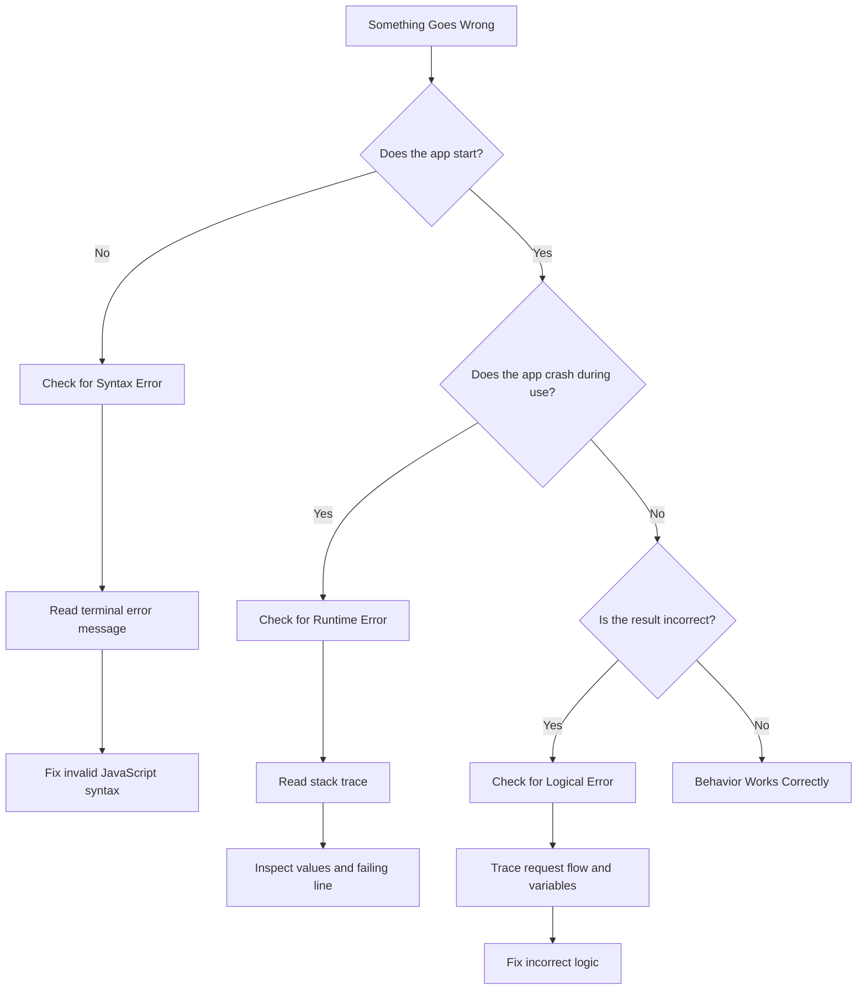
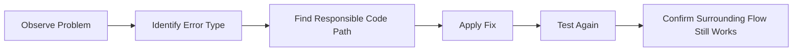

# 007 - Understanding Different Error Types

## Section

Improved Development Workflow and Debugging

## Duration

2 minutes

---

## Overview

This lesson introduces the main types of errors you may encounter while developing Node.js applications.

Errors are a normal part of programming. No application is written perfectly from the beginning, so learning how to identify, understand, and fix errors is an essential part of becoming a better developer.

Before using debugging tools, it is important to understand what kind of error you are dealing with.

---

## Main Idea

There are different types of errors in Node.js applications, and each type requires a different debugging approach.

The three main categories introduced in this lesson are:

1. **Syntax errors**
2. **Runtime errors**
3. **Logical errors**

Syntax errors usually prevent the application from starting. Runtime errors happen while the application is running. Logical errors are the hardest to detect because the application may run without crashing, but the result is still wrong.

---

## Learning Objectives

By the end of this lesson, you should be able to:

* Understand why errors are a normal part of development.
* Identify the difference between syntax errors, runtime errors, and logical errors.
* Use error messages to locate problems in the code.
* Understand why logical errors are often harder to find.
* Choose the right debugging approach based on the error type.
* Connect error handling and debugging to a better development workflow.

---

## Why Understanding Error Types Matters

When something goes wrong in a Node.js application, the first question should not be only:

> “How do I fix this?”

A better first question is:

> “What type of error is this?”

Knowing the error type helps you decide where to look first and which tool or strategy to use.

For example:

* A syntax error may point directly to a broken line of code.
* A runtime error may require checking the value of a variable during execution.
* A logical error may require tracing the full request flow and comparing expected behavior with actual behavior.

---

## Main Error Types

## 1. Syntax Errors

A **syntax error** happens when the code is not valid JavaScript.

This usually happens because of a typo or missing syntax element.

Common causes include:

* Missing closing braces
* Missing parentheses
* Missing quotation marks
* Incorrect keywords
* Invalid JavaScript structure

Example:

```js
const server = http.createServer((req, res) => {
  res.end('Hello from Node.js');
// Missing closing parenthesis and brace
```

In this case, Node.js cannot even run the application because the code structure is invalid.

### How to Fix Syntax Errors

To fix syntax errors:

1. Read the error message carefully.
2. Check the file and line number mentioned in the terminal.
3. Look for missing or incorrect syntax.
4. Fix the typo or missing character.
5. Restart the application and confirm that it starts correctly.

---

## 2. Runtime Errors

A **runtime error** happens while the application is running.

The code may be syntactically valid, but it breaks when executed.

Common causes include:

* Accessing a property on `undefined`
* Calling a function that does not exist
* Reading a missing file
* Using invalid input
* Trying to use a package that was not imported correctly

Example:

```js
const user = undefined;

console.log(user.name);
```

This code is valid JavaScript, but it crashes when it runs because `user` is `undefined`.

### How to Fix Runtime Errors

To fix runtime errors:

1. Read the error message and stack trace.
2. Identify which line caused the crash.
3. Check the values used on that line.
4. Add validation, checks, or correct data flow.
5. Run the application again and test the behavior.

Example fix:

```js
const user = undefined;

if (user) {
  console.log(user.name);
} else {
  console.log('User not found');
}
```

---

## 3. Logical Errors

A **logical error** happens when the application runs without crashing, but the result is wrong.

This is often the hardest type of error to find because there may be no error message.

Common causes include:

* Wrong condition in an `if` statement
* Incorrect calculation
* Wrong route logic
* Sending the wrong response
* Updating the wrong variable
* Handling request data incorrectly

Example:

```js
const price = 100;
const discount = 20;

const finalPrice = price + discount;
```

The code runs successfully, but the logic is wrong because a discount should probably be subtracted.

Correct version:

```js
const price = 100;
const discount = 20;

const finalPrice = price - discount;
```

### How to Fix Logical Errors

To fix logical errors:

1. Define the expected behavior clearly.
2. Compare the actual behavior with the expected behavior.
3. Trace the code step by step.
4. Inspect variable values.
5. Use logs or a debugger.
6. Test the corrected behavior carefully.

---

## Error Type Comparison

| Error Type    | When It Happens                  | Error Message? | Difficulty | Example                              |
| ------------- | -------------------------------- | -------------: | ---------: | ------------------------------------ |
| Syntax Error  | Before the app runs              |    Usually yes |       Easy | Missing brace or typo                |
| Runtime Error | While the app is running         |    Usually yes |     Medium | Reading property of `undefined`      |
| Logical Error | App runs but behaves incorrectly |     Usually no |       Hard | Wrong condition or wrong calculation |

---

## Debugging Decision Flow



---

## Node.js Debugging Mindset

When debugging a Node.js application, follow a structured process:



---

## Practical Example in a Node.js App

Imagine a route is supposed to return a success response.

```js
if (req.url === '/success') {
  res.write('<h1>Success</h1>');
  res.end();
}
```

Possible issues:

### Syntax Error

```js
if (req.url === '/success' {
  res.write('<h1>Success</h1>');
  res.end();
}
```

The app will not start because the condition is missing a closing parenthesis.

### Runtime Error

```js
console.log(req.body.name);
```

If `req.body` is `undefined`, the app may crash when this line runs.

### Logical Error

```js
if (req.url === '/sucess') {
  res.write('<h1>Success</h1>');
  res.end();
}
```

The app runs, but the route does not work because `/success` was misspelled as `/sucess`.

---

## How This Supports Better Development Workflow

Understanding different error types improves your development workflow because it helps you debug faster.

Instead of randomly changing code, you can follow a clear process:

1. Check whether the application starts.
2. Read the error message if there is one.
3. Identify the type of error.
4. Inspect the most likely file or code path.
5. Apply a focused fix.
6. Confirm that the surrounding flow still works.

This saves time and reduces frustration during development.

---

## Key Points

* Errors are a normal part of software development.
* Syntax errors happen when the code is not valid JavaScript.
* Runtime errors happen while the application is running.
* Logical errors happen when the app runs but produces the wrong result.
* Syntax and runtime errors usually provide error messages.
* Logical errors often require careful tracing and debugging.
* Understanding the error type helps you choose the right fix.
* A good debugging process improves the overall development workflow.

---

## Practice Task

Create three small examples in a Node.js project:

### 1. Syntax Error

Intentionally remove a closing brace or parenthesis.

Then run:

```bash
npm start
```

Observe the terminal error message and fix the syntax.

### 2. Runtime Error

Try to access a property on an undefined value.

Example:

```js
const user = undefined;
console.log(user.name);
```

Run the app, read the error message, and fix the issue.

### 3. Logical Error

Create a route with a wrong condition or typo.

Example:

```js
if (req.url === '/hom') {
  res.end('Home Page');
}
```

Test the route, find the problem, and correct it to:

```js
if (req.url === '/home') {
  res.end('Home Page');
}
```

---

## Review Questions

1. Why is it important to understand different error types?
2. What is a syntax error?
3. What is a runtime error?
4. What is a logical error?
5. Which error type usually prevents the application from starting?
6. Which error type usually happens while the application is running?
7. Which error type is often the hardest to find?
8. Why do logical errors often not show an error message?
9. Which file or code path would you inspect first when a route behaves incorrectly?
10. How would you prove that a fixed error does not break the surrounding flow?

---

## Summary

This lesson introduces three important categories of errors: syntax errors, runtime errors, and logical errors.

Syntax errors are caused by invalid code structure. Runtime errors happen while the application is executing. Logical errors happen when the application runs but produces incorrect behavior.

Understanding these error types helps you debug Node.js applications more effectively and choose the right strategy for finding and fixing problems.
