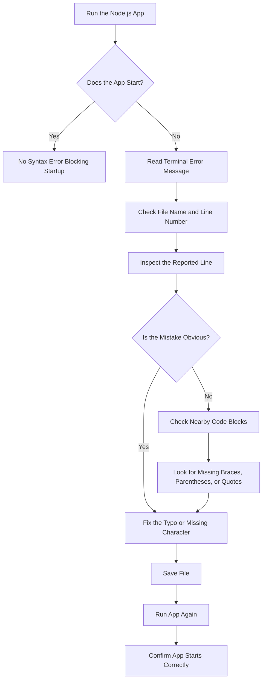

# 008 - Finding & Fixing Syntax Errors

## Section

Improved Development Workflow and Debugging

## Duration

3 minutes

---

## Overview

This lesson explains how to find and fix **syntax errors** in a Node.js application.

Syntax errors happen when the code is not valid JavaScript. They are usually caused by typos, missing characters, extra characters, or incorrect code structure.

Although syntax errors can be annoying, they are often easier to fix than runtime or logical errors because Node.js and the IDE usually show an error message.

---

## Main Idea

Syntax errors usually prevent the application from starting.

When a syntax error exists, Node.js will crash and print an error message in the terminal. The error message may not always explain the exact mistake clearly, but it usually points to the file and line where Node.js noticed the problem.

To fix syntax errors, you need to carefully inspect the reported line and nearby code.

---

## Learning Objectives

By the end of this lesson, you should be able to:

* Understand what syntax errors are.
* Recognize common causes of syntax errors.
* Use terminal error messages to locate syntax problems.
* Use IDE hints to find missing or incorrect characters.
* Check surrounding code when the reported line is not the true source of the problem.
* Confirm that the application starts again after fixing the error.

---

## What Is a Syntax Error?

A **syntax error** happens when JavaScript code is written in an invalid format.

Node.js cannot understand invalid JavaScript, so the application will not run.

Common syntax error causes include:

* Misspelled keywords
* Missing curly braces
* Missing parentheses
* Missing quotation marks
* Extra closing braces
* Invalid object or function structure
* Incorrect variable declarations

---

## Example 1: Misspelled Keyword

Suppose you accidentally write:

```js
cons server = http.createServer((req, res) => {
  res.end('Hello');
});
```

The intended keyword was:

```js
const
```

But the code says:

```js
cons
```

This is invalid JavaScript.

Correct version:

```js
const server = http.createServer((req, res) => {
  res.end('Hello');
});
```

---

## Why the Error Message May Be Confusing

Sometimes the IDE or terminal does not explain the real mistake perfectly.

For example, if you write:

```js
cons server = http.createServer();
```

The IDE might show a confusing message such as:

```text
';' expected
```

This happens because the editor tries to interpret `cons` as something else, not as a misspelled `const`.

The important lesson is:

> Do not only trust the exact wording of the error. Also inspect the line carefully.

---

## Example 2: Missing Closing Curly Brace

A missing closing brace is another common syntax error.

Incorrect example:

```js
if (req.url === '/') {
  res.write('<h1>Hello</h1>');
  res.end();
```

The `if` block is missing its closing brace:

```js
}
```

Correct version:

```js
if (req.url === '/') {
  res.write('<h1>Hello</h1>');
  res.end();
}
```

---

## Using the Terminal Error Message

When you run the app with:

```bash
npm start
```

and a syntax error exists, Node.js will usually crash and show an error message.

The message often includes:

* Error type
* File name
* Line number
* Problem location
* Short explanation

Example:

```text
SyntaxError: Unexpected identifier
```

or:

```text
SyntaxError: Unexpected token
```

These messages are helpful starting points, but they do not always point to the exact missing character.

---

## Using the IDE to Find Syntax Errors

Modern editors like Visual Studio Code can help you find syntax errors before running the app.

Useful IDE signals include:

* Red squiggly underline
* Highlighted error location
* Hover message
* Bracket matching
* Problem panel
* Automatic indentation hints

For braces, parentheses, and brackets, VS Code can highlight matching pairs.

This is useful when checking whether every opening brace has a matching closing brace.

---

## Debugging Flow for Syntax Errors



---

## Syntax Error Checklist

When fixing syntax errors, check for:

* Misspelled keywords like `const`, `let`, `function`, or `return`
* Missing closing curly braces `}`
* Missing closing parentheses `)`
* Missing closing brackets `]`
* Missing quotation marks `'` or `"`
* Extra commas
* Extra braces or parentheses
* Incorrect function or object syntax
* Invalid variable declarations

---

## Practical Node.js Example

### Broken Code

```js
const http = require('http');

const server = http.createServer((req, res) => {
  if (req.url === '/') {
    res.write('<h1>Hello from Node.js</h1>');
    res.end();
);

server.listen(3000);
```

This code contains a syntax error because the function and `if` block are not closed correctly.

### Fixed Code

```js
const http = require('http');

const server = http.createServer((req, res) => {
  if (req.url === '/') {
    res.write('<h1>Hello from Node.js</h1>');
    res.end();
  }
});

server.listen(3000);
```

---

## How to Confirm the Fix

After fixing the syntax error:

1. Save the file.
2. Run the app again.

```bash
npm start
```

3. Check that the app starts without crashing.
4. Open the browser or API client.
5. Test the affected route.
6. Confirm that the expected response is returned.

Example:

```text
Server running on port 3000
```

If you use Nodemon, it should automatically restart after saving the file.

---

## Common Mistake: Looking Only at the Reported Line

Sometimes the terminal points to a line where Node.js finally noticed the problem, not where the problem actually started.

For example, if a closing brace is missing earlier in the file, the error might appear near the bottom of the file.

In that case, inspect:

* The reported line
* The lines directly above it
* The nearest `if`, `else`, function, or callback block
* Matching opening and closing braces

---

## How This Supports Better Development Workflow

Finding and fixing syntax errors quickly improves development workflow because it helps you:

* Restart the application successfully.
* Avoid wasting time on unrelated code.
* Understand terminal error messages.
* Use IDE hints more effectively.
* Build confidence when reading stack traces and syntax messages.

Syntax errors are often the first type of error you should eliminate before debugging runtime or logical problems.

---

## Key Points

* Syntax errors happen when JavaScript code is invalid.
* They usually prevent the application from starting.
* Node.js usually shows an error message in the terminal.
* The error message often includes a file name and line number.
* The reported line is not always the exact source of the mistake.
* IDE hints can help find missing braces, parentheses, or typos.
* Common syntax errors include misspelled keywords and missing closing braces.
* After fixing the error, rerun the app and confirm that it starts correctly.

---

## Practice Task

Create and fix a simple syntax error in a Node.js project.

### Step 1: Introduce an Error

Change this:

```js
const server = http.createServer();
```

to this:

```js
cons server = http.createServer();
```

### Step 2: Run the App

```bash
npm start
```

### Step 3: Read the Error

Look at:

* The error type
* The file name
* The line number
* The code near the reported line

### Step 4: Fix the Error

Change `cons` back to:

```js
const
```

### Step 5: Confirm the Fix

Run the app again and confirm that it starts normally.

---

## Review Questions

1. What is a syntax error?
2. Why do syntax errors usually prevent the application from starting?
3. What information does the terminal error message usually provide?
4. Why can the reported line number sometimes be misleading?
5. How can Visual Studio Code help you find syntax errors?
6. What should you check when a closing curly brace is missing?
7. What is the difference between a typo in a keyword and a missing block character?
8. Which file would you inspect first when Node.js reports a syntax error?
9. How would you prove that the syntax error has been fixed?
10. Why should syntax errors be fixed before debugging runtime or logical errors?

---

## Summary

This lesson shows how to find and fix syntax errors in a Node.js application.

Syntax errors are usually caused by invalid JavaScript structure, such as misspelled keywords or missing braces. Node.js and the IDE usually help by showing an error message, file name, and line number.

Even if the message is not perfectly clear, carefully inspecting the reported line and nearby code usually helps you find the issue. After fixing the syntax error, the application should start again successfully.

---

# Bài luyện tập

## Mục tiêu


## Đề bài


## Yêu cầu hoàn thành

- [ ] 
- [ ] 
- [ ] 

## Kết quả / lời giải


## Ghi chú
