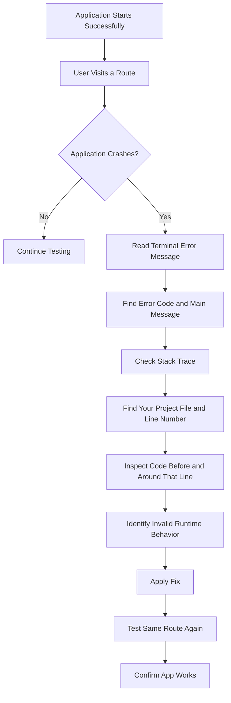
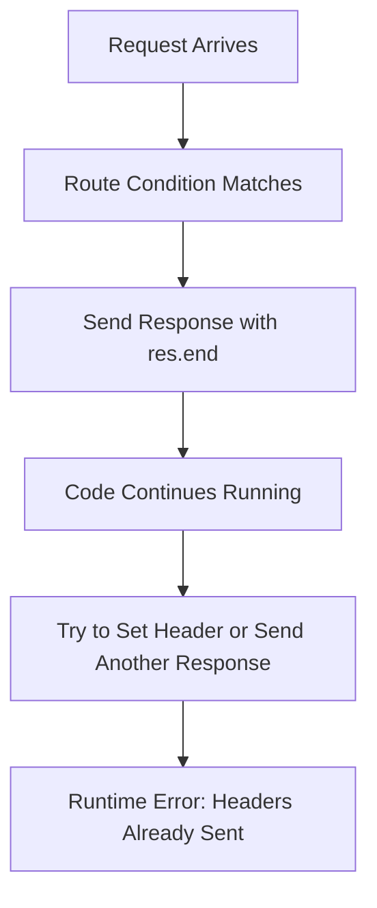
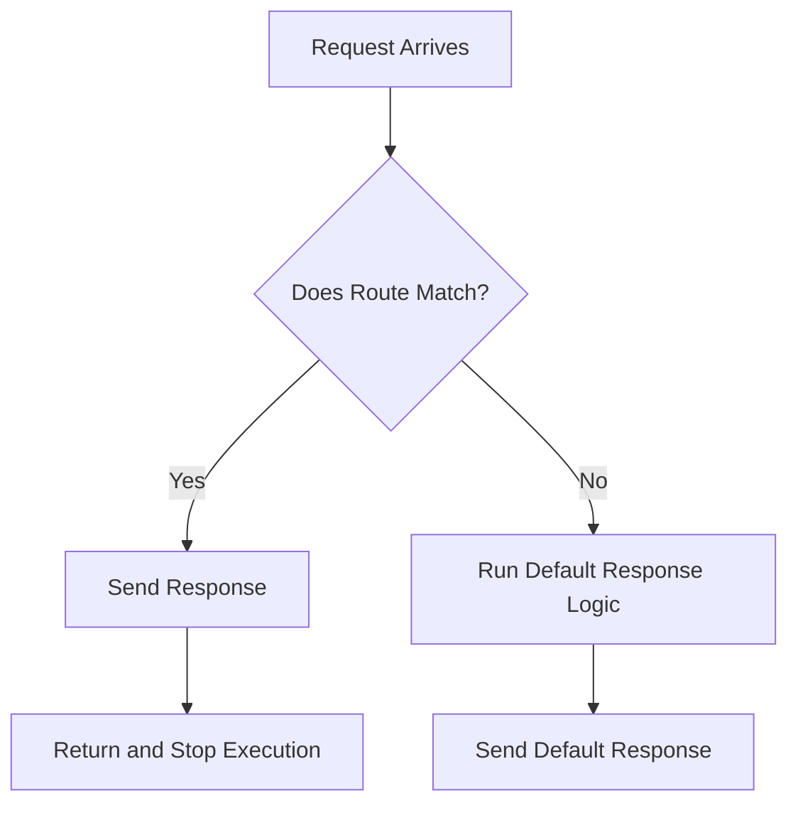

# 009 - Dealing with Runtime Errors

## Section

Improved Development Workflow and Debugging

## Duration

3 minutes

---

## Overview

This lesson explains how to deal with **runtime errors** in a Node.js application.

Unlike syntax errors, runtime errors do not always appear when the application starts. The code may look valid and the server may start normally, but the application can still break when a specific request or code path is executed.

Runtime errors are important to understand because they often happen while users interact with the application.

---

## Main Idea

A runtime error happens when the code is syntactically correct, but something goes wrong while the application is running.

In this lesson, the example error happens when the application tries to modify the response headers after the response has already been sent to the client.

This kind of error can happen when code execution continues after calling `res.end()`.

---

## Learning Objectives

By the end of this lesson, you should be able to:

* Understand what runtime errors are.
* Recognize how runtime errors differ from syntax errors.
* Read terminal error messages more effectively.
* Use the stack trace to find the responsible file and line.
* Understand why code execution may continue after sending a response.
* Fix runtime errors by stopping execution or restructuring conditions.
* Confirm that the application works after the fix.

---

## What Is a Runtime Error?

A **runtime error** happens while the application is running.

The code itself may be valid JavaScript, but it fails when a specific action happens.

Examples of runtime errors include:

* Accessing a property on `undefined`
* Calling a function that does not exist
* Sending multiple responses for one request
* Setting headers after the response has already been sent
* Reading a missing file
* Using invalid data during execution

---

## Runtime Errors vs Syntax Errors

| Error Type    | When It Appears          | Does the App Start? | Example                             |
| ------------- | ------------------------ | ------------------: | ----------------------------------- |
| Syntax Error  | Before the app runs      |          Usually no | Missing brace or misspelled keyword |
| Runtime Error | While the app is running |         Usually yes | Sending a response twice            |

A syntax error prevents Node.js from understanding the code.

A runtime error happens after Node.js successfully starts the application, but the code breaks during execution.

---

## Example Problem: Sending a Response Twice

In Node.js, once you finish a response with `res.end()`, the response is sent to the client.

However, calling `res.end()` does **not automatically stop the rest of the JavaScript function**.

That means the code after `res.end()` may still run.

This can cause problems if the later code tries to set headers or send another response.

---

## Broken Example

```js id="89qvqx"
const http = require('http');

const server = http.createServer((req, res) => {
  if (req.url === '/') {
    res.write('<html>');
    res.write('<body><h1>Hello from Home Page</h1></body>');
    res.write('</html>');
    res.end();
  }

  res.setHeader('Content-Type', 'text/html');
  res.write('<html>');
  res.write('<body><h1>Default Page</h1></body>');
  res.write('</html>');
  res.end();
});

server.listen(3000);
```

At first, this code looks valid. There is no syntax error.

The server may start successfully.

However, when the user visits `/`, the first response is sent with:

```js id="5sbk4i"
res.end();
```

Then the code continues and reaches:

```js id="qgcvyw"
res.setHeader('Content-Type', 'text/html');
```

This causes a runtime error because Node.js cannot set response headers after the response has already been sent.

---

## Common Error Message

A typical error message may look like this:

```text id="tg46k3"
Error [ERR_HTTP_HEADERS_SENT]: Cannot set headers after they are sent to the client
```

This message means the application already sent the response, but later code tried to modify the response again.

---

## How to Read a Runtime Error Message

When a runtime error appears in the terminal, do not only copy the message.

Read it carefully.

Focus on:

1. **The error code**

```text id="wc191a"
ERR_HTTP_HEADERS_SENT
```

2. **The main error message**

```text id="9xzm6d"
Cannot set headers after they are sent to the client
```

3. **The stack trace**

The stack trace shows where the error happened.

Look for your own project files, such as:

```text id="f7xg9q"
routes.js
app.js
```

Then check the line number mentioned in the stack trace.

---

## Why the Error Happens

The main issue is not that `res.end()` is wrong.

The issue is that code execution continues after `res.end()`.

Example:

```js id="ib30oc"
if (req.url === '/') {
  res.end('Home Page');
}

res.end('Another Response');
```

Both responses may try to run for the same request.

This creates an invalid response flow.

---

## Fix 1: Use `return` After Sending the Response

A simple fix is to return immediately after ending the response.

```js id="7u70jj"
const http = require('http');

const server = http.createServer((req, res) => {
  if (req.url === '/') {
    res.write('<html>');
    res.write('<body><h1>Hello from Home Page</h1></body>');
    res.write('</html>');
    return res.end();
  }

  res.setHeader('Content-Type', 'text/html');
  res.write('<html>');
  res.write('<body><h1>Default Page</h1></body>');
  res.write('</html>');
  res.end();
});

server.listen(3000);
```

The `return` stops the function from continuing after the response is sent.

---

## Fix 2: Use an `else` Block

Another fix is to structure the logic so only one response path can run.

```js id="pqcvfp"
const http = require('http');

const server = http.createServer((req, res) => {
  if (req.url === '/') {
    res.write('<html>');
    res.write('<body><h1>Hello from Home Page</h1></body>');
    res.write('</html>');
    res.end();
  } else {
    res.setHeader('Content-Type', 'text/html');
    res.write('<html>');
    res.write('<body><h1>Default Page</h1></body>');
    res.write('</html>');
    res.end();
  }
});

server.listen(3000);
```

This works because the default response only runs when the first condition is not matched.

---

## Runtime Error Debugging Flow



---

## Response Flow Problem Diagram



---

## Correct Response Flow Diagram



---

## Practical Debugging Steps

When dealing with a runtime error:

1. Reproduce the error by visiting the same route or performing the same action.
2. Read the error message from the top.
3. Identify the main error message.
4. Look for your own file names in the stack trace.
5. Go to the reported file and line number.
6. Inspect the surrounding code.
7. Check whether earlier code already changed the state or sent a response.
8. Apply a focused fix.
9. Test the same behavior again.
10. Test nearby routes or flows to make sure nothing else broke.

---

## Common Runtime Error Causes in Node.js

| Cause                  | Example Problem                                    | Possible Fix                  |
| ---------------------- | -------------------------------------------------- | ----------------------------- |
| Sending response twice | `res.end()` runs, then later another response runs | Add `return` or use `else`    |
| Missing object data    | `user.name` when `user` is `undefined`             | Check if `user` exists first  |
| Missing import         | Function or package is not available               | Import the module correctly   |
| Invalid file path      | File cannot be read                                | Check path and file existence |
| Wrong request data     | Expected field is missing                          | Validate request data         |

---

## Common Mistake: Ignoring the Stack Trace

Many beginners only see a long error message and assume it is too difficult to understand.

Instead, focus on the useful part.

The most useful part is usually where the stack trace points to your own code.

Example:

```text id="te5u78"
at requestHandler (.../routes.js:32:7)
```

This tells you:

* The error happened inside `requestHandler`.
* The relevant file is `routes.js`.
* The important line is around line `32`.

Then inspect that location and the code before it.

---

## How Nodemon Helps

Because the project uses Nodemon, you do not need to manually restart the server after fixing the runtime error.

After saving the file:

1. Nodemon detects the change.
2. The server restarts automatically.
3. You can reload the browser and test again.

This makes debugging faster.

---

## How This Supports Better Development Workflow

Understanding runtime errors improves development workflow because it helps you:

* Read error messages instead of guessing.
* Use stack traces to find the responsible code path.
* Understand how request-response flow works.
* Avoid sending multiple responses for one request.
* Fix problems more quickly.
* Confirm that the corrected route behaves as expected.

---

## Key Points

* Runtime errors happen while the application is running.
* The application may start successfully even when a runtime error exists.
* Runtime errors often appear only after visiting a specific route or triggering a specific action.
* Error messages and stack traces are important debugging tools.
* The top part of the error message is often the most useful.
* `Cannot set headers after they are sent to the client` usually means the response was already sent.
* `res.end()` sends the response but does not automatically stop the function.
* Use `return` or better conditional logic to prevent multiple response paths from running.
* Nodemon helps by restarting the server automatically after saving fixes.

---

## Practice Task

Create a small runtime error and then fix it.

### Step 1: Create the Error

```js id="ujymyu"
if (req.url === '/') {
  res.end('Home Page');
}

res.setHeader('Content-Type', 'text/html');
res.end('Default Page');
```

### Step 2: Run the App

```bash id="jxnrqs"
npm start
```

### Step 3: Trigger the Error

Open:

```text id="8l5hvk"
http://localhost:3000/
```

### Step 4: Read the Error Message

Look for:

```text id="5uoqfz"
Cannot set headers after they are sent to the client
```

### Step 5: Fix the Error

```js id="pczpmh"
if (req.url === '/') {
  return res.end('Home Page');
}

res.setHeader('Content-Type', 'text/html');
res.end('Default Page');
```

### Step 6: Confirm the Fix

Reload the page and confirm that:

* The app no longer crashes.
* The correct response is shown.
* Other routes still work as expected.

---

## Review Questions

1. What is a runtime error?
2. How is a runtime error different from a syntax error?
3. Why can the app start successfully even if a runtime error exists?
4. What does `Cannot set headers after they are sent to the client` mean?
5. Why does code continue after `res.end()`?
6. How can `return res.end()` prevent the error?
7. What part of the error message should you read first?
8. Why is the stack trace useful?
9. Which file would you inspect first when the stack trace points to `routes.js`?
10. How would you prove that the runtime error is fixed?

---

## Summary

This lesson explains how to deal with runtime errors in a Node.js application.

Runtime errors happen while the app is running, often after a specific route or action is triggered. In the example, the app crashes because it tries to set headers after the response has already been sent.

The correct debugging approach is to read the error message, inspect the stack trace, find the responsible code path, and fix the response flow. Using `return` after `res.end()` or restructuring the logic with `else` can prevent multiple responses from being sent for the same request.

---

# Bài luyện tập

## Mục tiêu


## Đề bài


## Yêu cầu hoàn thành

- [ ] 
- [ ] 
- [ ] 

## Kết quả / lời giải


## Ghi chú
