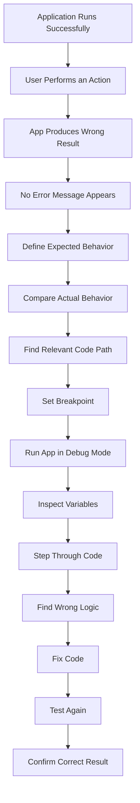
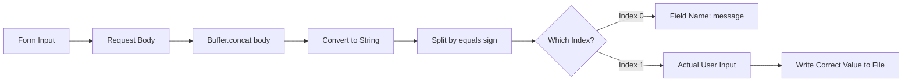

# 010 - Logical Errors

## Section

Improved Development Workflow and Debugging

## Duration

7 minutes

---

## Overview

This lesson explains **logical errors**, which are often the hardest type of error to find and fix.

Unlike syntax errors or runtime errors, logical errors usually do not crash the application. There may be no error message at all. Instead, the application simply behaves differently from what you expected.

Because there is no clear error message, logical errors often require careful investigation, step-by-step debugging, and a strong understanding of the expected behavior.

---

## Main Idea

A logical error happens when the code runs successfully, but the result is wrong.

In this lesson, the example logical error happens when the application stores the wrong value from parsed request data.

The app does not crash, but the wrong text is saved into the `message.txt` file. To find this kind of issue, we can use the Node.js debugger in Visual Studio Code.

---

## Learning Objectives

By the end of this lesson, you should be able to:

* Understand what logical errors are.
* Explain why logical errors are harder to find than syntax or runtime errors.
* Identify incorrect behavior even when no error message appears.
* Use breakpoints in Visual Studio Code.
* Inspect variables while the application is running.
* Step through code execution line by line.
* Use the debugger to find the responsible code path.
* Confirm that the fixed logic produces the expected result.

---

## What Is a Logical Error?

A **logical error** happens when the program runs without crashing, but the behavior is incorrect.

The code is valid JavaScript, and Node.js can execute it successfully. However, the code does not do what the developer intended.

Examples of logical errors include:

* Saving the wrong value.
* Using the wrong array index.
* Checking the wrong condition.
* Redirecting to the wrong page.
* Writing incorrect data to a file.
* Returning the wrong response.
* Calculating a value incorrectly.

---

## Why Logical Errors Are Difficult

Logical errors are difficult because they usually do not produce an error message.

With syntax errors, Node.js tells you that the code is invalid.

With runtime errors, Node.js often gives you a stack trace.

With logical errors, the app may look like it is working, but the result is wrong.

That means you need to compare:

```text
Expected behavior vs actual behavior
```

---

## Example Logical Error

Suppose the application receives form data like this:

```text
message=Hello
```

After parsing the request body, the code might split the value like this:

```js
const parsedBody = Buffer.concat(body).toString();
const message = parsedBody.split('=')[0];
```

This code runs successfully, but it stores the wrong value.

The result of `parsedBody.split('=')` is:

```js
['message', 'Hello']
```

Index `0` gives:

```text
message
```

Index `1` gives:

```text
Hello
```

So the correct code should be:

```js
const message = parsedBody.split('=')[1];
```

---

## Broken Code

```js
req.on('end', () => {
  const parsedBody = Buffer.concat(body).toString();
  const message = parsedBody.split('=')[0];

  fs.writeFileSync('message.txt', message);
});
```

This code does not crash.

However, it writes this into `message.txt`:

```text
message
```

instead of the actual user input.

---

## Fixed Code

```js
req.on('end', () => {
  const parsedBody = Buffer.concat(body).toString();
  const message = parsedBody.split('=')[1];

  fs.writeFileSync('message.txt', message);
});
```

Now the application writes the actual submitted value into the file.

---

## Logical Error Debugging Flow



---

## Using the VS Code Debugger

Visual Studio Code has built-in support for debugging Node.js applications.

The debugger allows you to pause code execution and inspect what is happening while the program is running.

This is especially useful for logical errors because there may be no error message to guide you.

---

## Basic Debugger Steps

### Step 1: Open the Entry File

Open the main entry file, such as:

```text
app.js
```

This helps VS Code understand which Node.js application should be started.

---

### Step 2: Start Debugging

In Visual Studio Code:

```text
Debug → Start Debugging
```

Then choose:

```text
Node.js
```

When debugging starts, VS Code shows:

* A debug toolbar at the top.
* A debug console.
* A red or colored status bar.
* Debug controls for stepping through code.

---

### Step 3: Set a Breakpoint

A **breakpoint** tells the debugger where to pause code execution.

To set a breakpoint:

1. Open the relevant file, such as `routes.js`.
2. Move your mouse to the left of the line number.
3. Click when the red dot appears.

Example location:

```js
const message = parsedBody.split('=')[0];
```

The debugger will pause before or around this line when that code is reached.

---

## What Happens at a Breakpoint?

When the application reaches a breakpoint:

* Code execution pauses.
* The current line is highlighted.
* You can inspect variables.
* You can hover over values.
* You can step through the code line by line.
* You can check the call stack.
* You can watch specific variables.

This allows you to understand what the application is doing at that exact moment.

---

## Inspecting Variables

When paused at a breakpoint, you can inspect values such as:

```js
parsedBody
```

Example value:

```text
message=Hello
```

Then you can inspect:

```js
parsedBody.split('=')
```

Expected result:

```js
['message', 'Hello']
```

This makes it easier to see why index `0` is wrong and index `1` is correct.

---

## Watch Expressions

A **watch expression** lets you track a specific value while stepping through the code.

Examples of useful watch expressions:

```js
message
```

```js
parsedBody
```

```js
parsedBody.split('=')
```

Watch expressions are helpful when you want to observe how values change during execution.

---

## Debugger Controls

The debugger toolbar includes several useful controls.

| Control           | Purpose                                                   |
| ----------------- | --------------------------------------------------------- |
| Continue / Resume | Continue running until the next breakpoint                |
| Step Over         | Move to the next line without entering function internals |
| Step Into         | Enter the function being called                           |
| Step Out          | Leave the current function                                |
| Stop              | Stop the debugging session                                |

---

## Step Over vs Step Into

### Step Over

Use **Step Over** when you want to move to the next line in your own code.

This is useful when you do not need to inspect the internal implementation of a function.

### Step Into

Use **Step Into** when you want to enter a function and inspect what happens inside it.

However, if you step into built-in Node.js functions like `fs.writeFileSync`, you may enter Node.js internal code, which is often not helpful for beginners.

---

## Call Stack

The **call stack** shows how the program reached the current line.

It may include:

* Your own project files
* Node.js internal files
* Callback functions
* Event handlers

For most beginner debugging tasks, focus mainly on your own files, such as:

```text
app.js
routes.js
```

---

## Debugging Example

### Problem

The user submits:

```text
Hello
```

But the file stores:

```text
message
```

### Investigation

The relevant code is:

```js
const parsedBody = Buffer.concat(body).toString();
const message = parsedBody.split('=')[0];
```

### Debugging Observation

When paused at the breakpoint:

```js
parsedBody
```

contains:

```text
message=Hello
```

Splitting it gives:

```js
['message', 'Hello']
```

The code uses:

```js
[0]
```

but the actual user input is at:

```js
[1]
```

### Fix

```js
const message = parsedBody.split('=')[1];
```

---

## Logical Error Investigation Diagram



---

## Common Logical Errors in Node.js

| Logical Error           | Example                          | Result                      |
| ----------------------- | -------------------------------- | --------------------------- |
| Wrong array index       | `split('=')[0]` instead of `[1]` | Wrong value stored          |
| Wrong route condition   | `req.url === '/messege'`         | Route does not match        |
| Missing `return`        | Code continues after response    | Unexpected behavior         |
| Wrong HTTP method check | Checking `GET` instead of `POST` | Form submission not handled |
| Incorrect file path     | Writing to wrong file            | Data appears missing        |
| Wrong variable used     | Saving `key` instead of `value`  | Incorrect output            |

---

## How This Supports Better Development Workflow

Understanding logical errors improves development workflow because it teaches you to debug behavior, not just crashes.

When there is no error message, you need a structured process:

1. Define what should happen.
2. Observe what actually happens.
3. Find the responsible code path.
4. Pause execution with a breakpoint.
5. Inspect values during runtime.
6. Step through the code.
7. Fix the incorrect logic.
8. Confirm the result.

This is a major step toward professional debugging.

---

## Practical Debugging Checklist

When the app behaves incorrectly but does not crash, ask:

* What did I expect to happen?
* What actually happened?
* Which route or function controls this behavior?
* Which file writes or returns the incorrect data?
* What variables are involved?
* What value does each variable contain at runtime?
* Is the wrong condition being checked?
* Is the wrong array index being used?
* Is the wrong response being sent?
* Can I reproduce the issue consistently?

---

## Key Points

* Logical errors do not usually produce error messages.
* The application may run successfully but still behave incorrectly.
* Logical errors are often harder to debug than syntax or runtime errors.
* The debugger helps inspect code while it is running.
* Breakpoints pause execution at specific lines.
* You can inspect variables, watch expressions, and step through code.
* The call stack shows how execution reached the current point.
* A common logical error is using the wrong index after splitting data.
* The fix must be confirmed by testing the actual behavior again.

---

## Practice Task

Create and fix a logical error in a small Node.js project.

### Step 1: Create the Error

Use the wrong index when parsing form data:

```js
const parsedBody = Buffer.concat(body).toString();
const message = parsedBody.split('=')[0];
```

### Step 2: Run the App

```bash
npm start
```

### Step 3: Submit a Form

Submit a message such as:

```text
Hello from Node.js
```

### Step 4: Check the Output

Open `message.txt`.

If it contains:

```text
message
```

then the app has a logical error.

### Step 5: Debug the Code

Set a breakpoint on this line:

```js
const message = parsedBody.split('=')[0];
```

Inspect:

```js
parsedBody
```

and:

```js
parsedBody.split('=')
```

### Step 6: Fix the Logic

Change the index from `0` to `1`:

```js
const message = parsedBody.split('=')[1];
```

### Step 7: Confirm the Fix

Submit the form again and confirm that `message.txt` now contains the actual user input.

---

## Review Questions

1. What is a logical error?
2. Why are logical errors often harder to find than syntax errors?
3. Why might a logical error produce no error message?
4. What was the logical error in the message parsing example?
5. Why does `parsedBody.split('=')[0]` return the wrong value?
6. Which index contains the actual submitted message?
7. What is a breakpoint?
8. How does the VS Code debugger help with logical errors?
9. What is the purpose of watch expressions?
10. What is the difference between Step Over and Step Into?
11. Which file would you inspect first when the wrong value is saved?
12. How would you prove that the logical error is fixed?

---

## Summary

This lesson explains logical errors and introduces the Node.js debugger in Visual Studio Code.

Logical errors occur when the application runs without crashing but produces the wrong result. In the example, the app saves the wrong part of the parsed request body because it uses index `0` instead of index `1`.

Since logical errors often do not show error messages, the debugger becomes very useful. By setting breakpoints, inspecting variables, and stepping through code, you can understand what the app is doing and find the exact place where the logic goes wrong.
