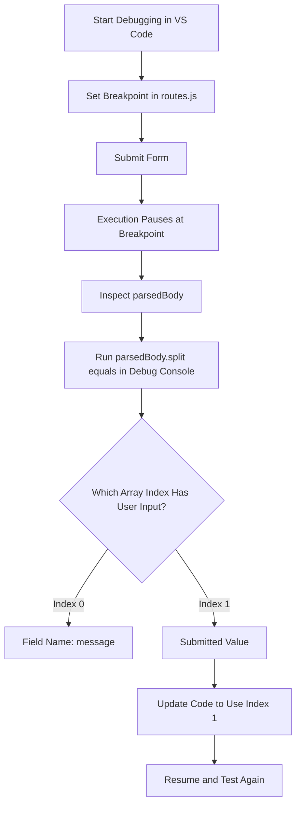

# 011 - Using the Debugger

## Section

Improved Development Workflow and Debugging

## Duration

3 minutes

---

## Overview

This lesson shows how to use the **Node.js debugger in Visual Studio Code** to inspect code while it is running.

The debugger is especially useful for finding logical errors, where the application does not crash but still produces the wrong result.

---

## Main Idea

A debugger lets you pause code execution, inspect variables, step through code line by line, and understand exactly how your application behaves at runtime.

In this lesson, the debugger is used to find why the wrong value is written to a file after submitting a form.

---

## Learning Objectives

By the end of this lesson, you should be able to:

* Start a Node.js debugging session in VS Code.
* Set and remove breakpoints.
* Pause execution at important lines.
* Inspect variables like `parsedBody` and `message`.
* Use the debug console to test expressions.
* Step through asynchronous code carefully.
* Understand that callbacks may run later, not immediately.
* Fix a logical error based on runtime values.

---

## The Problem

The application receives form data like this:

```text
message=test
```

The expected saved value is:

```text
test
```

But the application saves:

```text
message
```

This means the app is running, but the logic is wrong.

---

## Relevant Code

```js
const parsedBody = Buffer.concat(body).toString();
const message = parsedBody.split('=')[0];

fs.writeFileSync('message.txt', message);
```

The issue is this line:

```js
const message = parsedBody.split('=')[0];
```

`parsedBody.split('=')` returns:

```js
['message', 'test']
```

So index `0` is the field name, while index `1` is the submitted value.

---

## Using the Debugger Step by Step

### 1. Start Debugging

Open `app.js`, then start debugging in VS Code:

```text
Debug → Start Debugging → Node.js
```

VS Code starts the Node.js app in debug mode.

---

### 2. Set a Breakpoint

Open `routes.js` and set a breakpoint near the message parsing logic:

```js
const parsedBody = Buffer.concat(body).toString();
const message = parsedBody.split('=')[0];
```

When the form is submitted, execution pauses at this line.

---

### 3. Inspect Runtime Values

When execution pauses, inspect:

```js
parsedBody
```

Example value:

```text
message=test
```

Then inspect:

```js
message
```

If `message` contains:

```text
message
```

then the wrong part of the split result is being used.

---

### 4. Use the Debug Console

You can test expressions directly in the debug console:

```js
parsedBody.split('=')
```

Result:

```js
['message', 'test']
```

This confirms that `split()` works correctly. The problem is the selected index.

---

### 5. Fix the Logic

Change this:

```js
const message = parsedBody.split('=')[0];
```

to this:

```js
const message = parsedBody.split('=')[1];
```

Now the app stores the actual submitted message.

---

## Debugger Flow Diagram



---

## Understanding Asynchronous Callbacks

Node.js does not always execute code strictly from top to bottom in the way beginners expect.

Some functions register callbacks that run later.

For example:

```js
fs.writeFile('message.txt', message, err => {
  // This callback runs after the file operation finishes
});
```

If you want to inspect code inside a callback, set a breakpoint inside that callback.

Then resume execution. The debugger will pause again when the callback actually runs.

---

## Debugger Controls

| Control           | Meaning                                                   |
| ----------------- | --------------------------------------------------------- |
| Continue / Resume | Continue running until the next breakpoint                |
| Step Over         | Move to the next line without entering function internals |
| Step Into         | Enter the function being called                           |
| Step Out          | Leave the current function                                |
| Stop              | End the debugging session                                 |

---

## Important Debugging Insight

When using the debugger, do not only look at the code.

Look at the actual runtime values.

In this example:

```js
parsedBody
```

contains:

```text
message=test
```

and:

```js
parsedBody.split('=')
```

returns:

```js
['message', 'test']
```

That clearly shows the correct value is at index `1`, not index `0`.

---

## How This Supports Better Development Workflow

Using the debugger improves development because it helps you:

* Stop guessing.
* See real values while the app runs.
* Trace request data step by step.
* Understand asynchronous callback behavior.
* Find logical errors more confidently.
* Confirm that a fix solves the actual problem.

---

## Key Points

* The debugger pauses code execution at breakpoints.
* Breakpoints help inspect code at important moments.
* The debug console can evaluate expressions during execution.
* Logical errors often require inspecting runtime values.
* `parsedBody.split('=')[0]` returns the field name.
* `parsedBody.split('=')[1]` returns the submitted value.
* Callback functions may run later, so breakpoints inside callbacks are useful.
* Debugging is more reliable than guessing.

---

## Practice Task

Use the VS Code debugger to inspect form data.

1. Start the app in debug mode.
2. Set a breakpoint near the message parsing logic.
3. Submit a form value.
4. Inspect `parsedBody`.
5. Run this in the debug console:

```js
parsedBody.split('=')
```

6. Confirm which index contains the user input.
7. Fix the code.
8. Submit the form again and check `message.txt`.

---

## Review Questions

1. What problem does the debugger solve?
2. What is a breakpoint?
3. Why is the debugger useful for logical errors?
4. What value does `parsedBody` contain after submitting the form?
5. What does `parsedBody.split('=')` return?
6. Why is index `0` wrong in this example?
7. Which index contains the actual submitted message?
8. How can the debug console help during debugging?
9. Why do callbacks sometimes require their own breakpoints?
10. How would you prove that the debugger helped fix the issue?

---

## Summary

This lesson demonstrates how to use the Node.js debugger in Visual Studio Code.

By setting breakpoints, inspecting variables, and testing expressions in the debug console, you can find logical errors more effectively.

In the example, the debugger shows that the code extracts the wrong array element from `parsedBody.split('=')`. Changing the index from `0` to `1` fixes the issue and makes the application save the correct submitted message.

---

# Bài luyện tập

## Mục tiêu


## Đề bài


## Yêu cầu hoàn thành

- [ ] 
- [ ] 
- [ ] 

## Kết quả / lời giải


## Ghi chú
