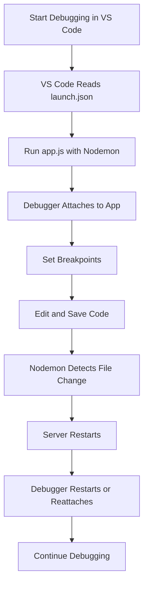
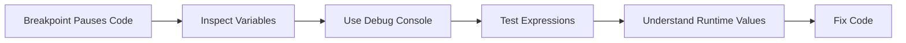

# 012 - Restarting the Debugger Automatically After Editing Our App

## Section

Improved Development Workflow and Debugging

## Duration

6 minutes

---

## Overview

This lesson explains how to configure the **VS Code debugger** so it automatically restarts after editing a Node.js application.

Previously, Nodemon was used to restart the server automatically whenever files changed. However, when debugging, the debugger itself may not restart automatically by default.

This lesson shows how to combine **Nodemon** and the **VS Code debugger** so both the server and debugging process restart after code changes.

---

## Main Idea

When developing a Node.js app, Nodemon improves the workflow by restarting the server after file changes.

However, if you are using the debugger, you also want the debugging session to restart automatically when the app changes.

To achieve this, you configure VS Code using a `launch.json` file and tell it to run the app through `nodemon`.

---

## Learning Objectives

By the end of this lesson, you should be able to:

* Understand why the debugger may need automatic restart support.
* Use the debug console to inspect and test runtime expressions.
* Create a VS Code debug configuration.
* Configure `launch.json` for a Node.js app.
* Use Nodemon as the debugger runtime executable.
* Understand why globally installed Nodemon may be required for this setup.
* Use the integrated terminal with Nodemon debugging.
* Stop the Nodemon process correctly after debugging.

---

## Why Auto-Restarting the Debugger Matters

Without automatic debugger restart, the workflow can become inconsistent.

Nodemon restarts the app when files change, but the debugger may not restart in the same way.

That means you might need to manually stop and restart debugging after each code change.

This slows down development.

With the correct setup:

1. You edit a file.
2. Nodemon detects the change.
3. The server restarts.
4. The debugger reconnects or restarts.
5. You can continue debugging without manually restarting everything.

---

## Debug Console Reminder

The debug console is useful because it allows you to inspect values while the code is paused at a breakpoint.

For example, if the current scope contains:

```js
const parsedBody = 'message=test';
```

You can type this in the debug console:

```js
parsedBody
```

Output:

```text
message=test
```

You can also run expressions:

```js
parsedBody.split('=')
```

Output:

```js
['message', 'test']
```

This does not change your running code. It only helps you inspect and test ideas while debugging.

---

## Creating a Debug Configuration

To configure debugging in VS Code:

```text
Debug → Add Configuration → Node.js
```

VS Code creates a folder and file:

```text
.vscode/launch.json
```

The `launch.json` file controls how the debugger starts the app.

---

## Example `launch.json` Configuration

```json
{
  "version": "0.2.0",
  "configurations": [
    {
      "type": "node",
      "request": "launch",
      "name": "Launch Program with Nodemon",
      "runtimeExecutable": "nodemon",
      "program": "${workspaceFolder}/app.js",
      "restart": true,
      "console": "integratedTerminal"
    }
  ]
}
```

---

## Important Configuration Fields

| Field                                    | Purpose                                             |
| ---------------------------------------- | --------------------------------------------------- |
| `"type": "node"`                         | Tells VS Code this is a Node.js debug configuration |
| `"request": "launch"`                    | Starts a new debugging session                      |
| `"runtimeExecutable": "nodemon"`         | Uses Nodemon instead of plain Node.js               |
| `"program": "${workspaceFolder}/app.js"` | Always starts from `app.js`                         |
| `"restart": true`                        | Restarts debugging when changes are detected        |
| `"console": "integratedTerminal"`        | Sends output to the integrated terminal             |

---

## Why `program` Should Point to `app.js`

Even if you are debugging code inside `routes.js`, the app must still start from the main entry file.

For this project, that file is:

```text
app.js
```

The server starts from `app.js`, and then other files such as `routes.js` are loaded from there.

So the debugger should always start with:

```json
"program": "${workspaceFolder}/app.js"
```

This is more convenient because you do not need to manually open `app.js` before starting the debugger.

---

## Why Global Nodemon May Be Needed

If the debugger configuration uses:

```json
"runtimeExecutable": "nodemon"
```

VS Code may look for Nodemon globally.

If Nodemon is only installed locally in the project, debugging may fail with a command-not-found error.

To install Nodemon globally:

```bash
npm install -g nodemon
```

On macOS or Linux, you may need:

```bash
sudo npm install -g nodemon
```

After this, the `nodemon` command can be used directly from the terminal.

---

## Local vs Global Nodemon in This Lesson

| Usage                                | Command          | Nodemon Type               |
| ------------------------------------ | ---------------- | -------------------------- |
| Run through NPM script               | `npm start`      | Local Nodemon works        |
| Run directly in terminal             | `nodemon app.js` | Global Nodemon needed      |
| Run from VS Code `runtimeExecutable` | `"nodemon"`      | Often needs global Nodemon |

---

## Why Use the Integrated Terminal?

When Nodemon is used with the debugger, there are two related processes:

1. The debugging session
2. The Nodemon process

If you stop the debugger, the Nodemon process may still need to be stopped separately.

Using the integrated terminal allows you to stop Nodemon with:

```bash
Ctrl + C
```

That is why this configuration uses:

```json
"console": "integratedTerminal"
```

---

## Auto-Restart Debugging Flow



---

## Debugging with Breakpoints

After starting the debugger with Nodemon:

1. Set a breakpoint in `routes.js`.
2. Submit a form or visit a route.
3. The debugger pauses when the breakpoint is reached.
4. Inspect variables.
5. Use the debug console if needed.
6. Edit the code.
7. Save the file.
8. Nodemon restarts the server automatically.

---

## Debug Console Flow



---

## Practical Example

Suppose you are debugging this code:

```js
const parsedBody = Buffer.concat(body).toString();
const message = parsedBody.split('=')[1];
```

At a breakpoint, you can test:

```js
parsedBody
```

and:

```js
parsedBody.split('=')
```

This helps confirm whether the submitted form data is being parsed correctly.

If the code is wrong, you can edit it, save the file, and let Nodemon restart the debugging session automatically.

---

## When to Use This Setup

This setup is helpful when:

* You are actively debugging a difficult issue.
* You need breakpoints across multiple files.
* You want automatic restarts while debugging.
* You are working on request parsing, routing, or file-writing logic.
* You want to inspect runtime values after each code change.

However, you do not always need to run the debugger.

For normal development, it is often enough to use:

```bash
npm start
```

Then start the debugger only when you need deeper investigation.

---

## Common Mistakes

### Mistake 1: Forgetting to Install Nodemon Globally

If this configuration fails:

```json
"runtimeExecutable": "nodemon"
```

Install Nodemon globally:

```bash
npm install -g nodemon
```

---

### Mistake 2: Starting Debugging from the Wrong File

Do not configure the debugger to start from `routes.js`.

The server should start from:

```text
app.js
```

Correct:

```json
"program": "${workspaceFolder}/app.js"
```

---

### Mistake 3: Using the Debug Console as the Main Terminal

The debug console is useful for inspecting values and running expressions.

But when using Nodemon, normal process output and stopping the process should happen in the integrated terminal.

Use:

```bash
Ctrl + C
```

to stop Nodemon.

---

## How This Supports Better Development Workflow

This lesson improves the development workflow by combining:

* Nodemon auto-restart
* VS Code debugging
* Breakpoints
* Runtime inspection
* Debug console expressions
* Integrated terminal output

Together, these tools make it easier to find and fix difficult bugs without manually restarting the server or debugger after every code change.

---

## Key Points

* The debug console can inspect variables and run expressions.
* Expressions in the debug console do not modify the running code unless you explicitly execute code with side effects.
* VS Code debug behavior can be configured with `.vscode/launch.json`.
* `"runtimeExecutable": "nodemon"` tells VS Code to use Nodemon.
* `"restart": true` enables automatic restart behavior.
* `"program"` should point to the app entry file, usually `app.js`.
* `"console": "integratedTerminal"` is useful when using Nodemon.
* Nodemon may need to be installed globally for this debugger setup.
* The debugger does not need to be used all the time; use it when you need deeper inspection.

---

## Practice Task

Configure automatic debugger restart in a small Node.js project.

### Step 1: Install Nodemon Globally

```bash
npm install -g nodemon
```

### Step 2: Create a Debug Configuration

Create or edit:

```text
.vscode/launch.json
```

### Step 3: Add This Configuration

```json
{
  "version": "0.2.0",
  "configurations": [
    {
      "type": "node",
      "request": "launch",
      "name": "Launch Program with Nodemon",
      "runtimeExecutable": "nodemon",
      "program": "${workspaceFolder}/app.js",
      "restart": true,
      "console": "integratedTerminal"
    }
  ]
}
```

### Step 4: Start Debugging

Start the debugger in VS Code.

### Step 5: Test Auto-Restart

1. Set a breakpoint in `routes.js`.
2. Trigger the route.
3. Edit and save a file.
4. Check that Nodemon restarts the server.
5. Trigger the route again and confirm the debugger still works.

---

## Review Questions

1. Why might the debugger need to restart automatically?
2. What is the purpose of `launch.json`?
3. What does `"runtimeExecutable": "nodemon"` do?
4. Why should the `program` field point to `app.js`?
5. What does `"restart": true` enable?
6. Why is `"console": "integratedTerminal"` useful with Nodemon?
7. Why might Nodemon need to be installed globally?
8. How do you stop the Nodemon process in the terminal?
9. What can you do in the debug console?
10. When should you use the debugger instead of only running `npm start`?

---

## Summary

This lesson shows how to restart the VS Code debugger automatically after editing a Node.js application.

By creating a `.vscode/launch.json` file and configuring the debugger to use Nodemon, the app and debugger can restart when files change.

This creates a smoother debugging workflow because you can edit code, save files, restart automatically, and continue inspecting runtime behavior with breakpoints and the debug console.

---

# Bài luyện tập

## Mục tiêu


## Đề bài


## Yêu cầu hoàn thành

- [ ] 
- [ ] 
- [ ] 

## Kết quả / lời giải


## Ghi chú
