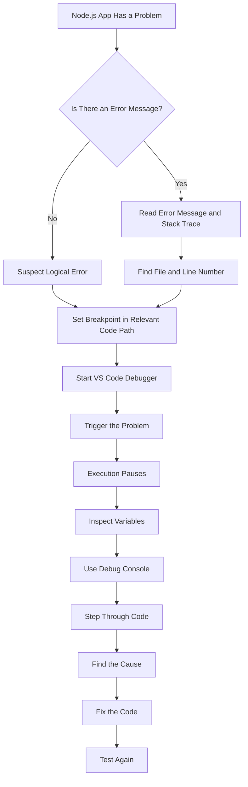
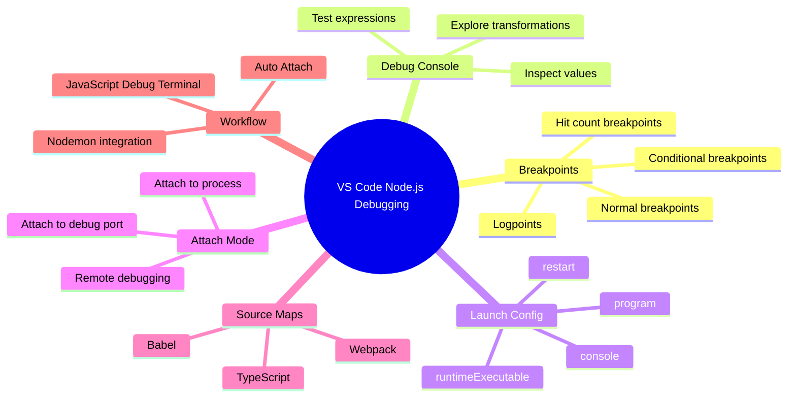

# 013 - Debugging Node.js in Visual Studio Code

## Section

Improved Development Workflow and Debugging

## Duration

1 minute

---

## Overview

This lesson points you to the official Visual Studio Code documentation for debugging Node.js applications.

The previous lessons introduced basic debugging concepts such as breakpoints, stepping through code, inspecting variables, and restarting the debugger with Nodemon. This lesson encourages you to explore the deeper debugging features that VS Code provides for Node.js development.

---

## Main Idea

Visual Studio Code includes powerful built-in debugging support for Node.js applications.

You do not need to learn every debugging feature immediately, but understanding what VS Code can do will help you debug applications more effectively when problems become more complex.

---

## Learning Objectives

By the end of this lesson, you should be able to:

* Recognize VS Code as a powerful debugging environment for Node.js.
* Know where to find official documentation for Node.js debugging in VS Code.
* Understand that VS Code supports multiple debugging workflows.
* Identify useful debugging features to explore later.
* Apply debugging tools when syntax, runtime, or logical errors appear.

---

## Why This Lesson Matters

Debugging is not only about fixing errors after they happen.

It is also about understanding how your application behaves while it runs.

VS Code can help you:

* Pause execution with breakpoints.
* Inspect variable values.
* Step through code line by line.
* Debug asynchronous callbacks.
* Attach to running Node.js processes.
* Use launch configurations.
* Debug with Nodemon.
* Skip unimportant internal code.
* Work with source maps for TypeScript or transpiled JavaScript.

---

## Main Debugging Options in VS Code

VS Code provides several ways to debug Node.js applications.

| Debugging Method          | Description                                                                                 | Best For                                         |
| ------------------------- | ------------------------------------------------------------------------------------------- | ------------------------------------------------ |
| Auto Attach               | Automatically attaches the debugger to Node.js processes started in the integrated terminal | Quick debugging without manual configuration     |
| JavaScript Debug Terminal | Runs terminal commands with debugging enabled automatically                                 | Simple debugging while using terminal commands   |
| Launch Configuration      | Uses `.vscode/launch.json` to define how the app starts in debug mode                       | More complex or repeatable debugging setups      |
| Attach Configuration      | Attaches VS Code to an already running Node.js process                                      | Debugging external or manually started processes |

---

## Common Debugging Features

### Breakpoints

Breakpoints pause code execution at a specific line.

They are useful when you want to inspect values at a certain moment.

```js
const message = parsedBody.split('=')[1];
```

You can place a breakpoint on this line and inspect `parsedBody`, `message`, and other variables.

---

### Debug Console

The debug console allows you to evaluate expressions while execution is paused.

Example:

```js
parsedBody
```

```js
parsedBody.split('=')
```

This helps you test ideas without changing your source code immediately.

---

### Step Controls

The debugger toolbar lets you move through your code carefully.

| Control   | Purpose                                           |
| --------- | ------------------------------------------------- |
| Continue  | Resume execution until the next breakpoint        |
| Step Over | Move to the next line without entering a function |
| Step Into | Enter the function being called                   |
| Step Out  | Leave the current function                        |
| Stop      | End the debugging session                         |

---

### Launch Configuration

A `launch.json` file lets you define how VS Code should start or attach to your Node.js app.

Example:

```json
{
  "version": "0.2.0",
  "configurations": [
    {
      "type": "node",
      "request": "launch",
      "name": "Launch App",
      "program": "${workspaceFolder}/app.js",
      "console": "integratedTerminal"
    }
  ]
}
```

This makes debugging repeatable because VS Code always knows which file should start the application.

---

## Debugging with Nodemon

VS Code can also be configured to work with Nodemon.

This is useful when you want the server to restart automatically after code changes.

Example:

```json
{
  "type": "node",
  "request": "launch",
  "name": "Launch App with Nodemon",
  "runtimeExecutable": "nodemon",
  "program": "${workspaceFolder}/app.js",
  "console": "integratedTerminal",
  "restart": true
}
```

This setup combines:

* Nodemon auto-restart
* VS Code breakpoints
* Runtime variable inspection
* Integrated terminal output

---

## Debugging Workflow Diagram



---

## VS Code Debugging Tools Map



---

## Useful Features to Explore Later

You do not need to memorize every feature now, but these are useful topics to revisit:

* Auto Attach
* JavaScript Debug Terminal
* Launch configurations
* Attach configurations
* Conditional breakpoints
* Logpoints
* Hit count breakpoints
* Source maps
* Skipping Node internals
* Remote debugging
* Debugging TypeScript
* Debugging with Nodemon

---

## Practical Example

Suppose your Node.js app saves the wrong message to a file.

Instead of guessing, you can:

1. Start the debugger in VS Code.
2. Set a breakpoint near the request body parsing code.
3. Submit the form.
4. Inspect `parsedBody`.
5. Run this in the debug console:

```js
parsedBody.split('=')
```

6. Check whether the code extracts the correct value.
7. Fix the logic.
8. Submit the form again and confirm the output.

---

## How This Supports Better Development Workflow

This lesson supports the broader goal of **Improved Development Workflow and Debugging** because it encourages you to use professional debugging tools instead of relying only on `console.log()` or guessing.

A stronger debugging workflow helps you:

* Understand application behavior.
* Find problems faster.
* Inspect real runtime values.
* Debug asynchronous code more confidently.
* Avoid random code changes.
* Confirm fixes more reliably.

---

## Key Points

* VS Code has built-in support for debugging Node.js applications.
* You can debug with breakpoints, the debug console, and step controls.
* `launch.json` allows repeatable debugging configurations.
* Auto Attach and JavaScript Debug Terminal provide faster debugging workflows.
* Nodemon can be combined with the debugger for automatic restarts.
* Advanced features like conditional breakpoints, logpoints, and source maps are useful for larger projects.
* You do not need to memorize every feature immediately, but you should know that these tools exist.

---

## Practice Task

Explore the official VS Code Node.js debugging documentation and try one feature you have not used before.

Suggested practice:

1. Open a small Node.js project.
2. Set a breakpoint in a route handler.
3. Start debugging in VS Code.
4. Trigger the route from the browser.
5. Inspect a variable.
6. Use the debug console to run an expression.
7. Step through the code.
8. Stop the debugger.

Then write a short note:

```text
Feature tested:
Where I used it:
What it helped me understand:
When I would use it again:
```

---

## Review Questions

1. What problem does VS Code debugging solve in Node.js development?
2. What is the purpose of a breakpoint?
3. What can you do in the debug console?
4. What is the purpose of `launch.json`?
5. When would you use Auto Attach?
6. When would you use a JavaScript Debug Terminal?
7. Why is Nodemon useful when debugging?
8. What is the difference between launching and attaching a debugger?
9. How can source maps help when debugging TypeScript?
10. How would you prove that debugging helped you fix an issue?

---

## Summary

This lesson points to the official Visual Studio Code documentation for Node.js debugging.

VS Code provides many debugging tools, including breakpoints, step controls, debug console expressions, launch configurations, auto attach, JavaScript debug terminals, Nodemon integration, and source map support.

You do not need to master everything immediately. The key takeaway is that VS Code gives you a professional debugging environment that helps you understand and fix Node.js applications more effectively.
