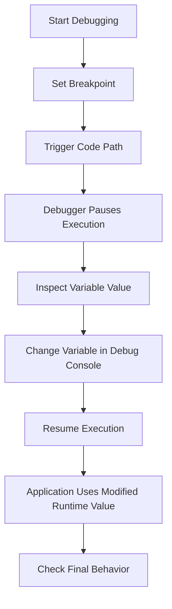

# 014 - Changing Variables in the Debug Console

## Section

Improved Development Workflow and Debugging

## Duration

1 minute

---

## Overview

This lesson introduces another useful feature of the Node.js debugger in Visual Studio Code: changing variable values while the application is paused.

In previous lessons, the debug console was used to inspect variables and test expressions. In this lesson, you learn that you can also modify variable values during a debugging session.

This can help you quickly test different scenarios without changing the source code immediately.

---

## Main Idea

When the debugger pauses at a breakpoint, you can inspect the current runtime state of your application.

You can also change some variable values directly from the debug view or debug console. After changing a value, the application continues running with the updated value.

This is useful when you want to test how your code behaves with different data.

---

## Learning Objectives

By the end of this lesson, you should be able to:

* Pause a Node.js application at a breakpoint.
* Inspect variables in the VS Code debugger.
* Change variable values while debugging.
* Understand that modified values affect the current runtime.
* Use variable manipulation to test possible fixes.
* Confirm how changed values affect the final application behavior.

---

## Why Changing Variables Can Be Useful

Sometimes you want to test a different value without editing your source code.

For example, suppose the current value is:

```js
parsedBody = 'message=test'
```

You may want to temporarily change it to:

```js
parsedBody = 'message=testing'
```

This lets you check how the rest of the code behaves with a different value.

---

## Example Scenario

The application receives form data and stores a message in a file.

Example runtime value:

```text
message=test
```

The parsed value may be stored in a variable:

```js
const parsedBody = Buffer.concat(body).toString();
const message = parsedBody.split('=')[1];
```

When execution pauses at a breakpoint, you can inspect:

```js
parsedBody
```

and see:

```text
message=test
```

You can then change the value during debugging to test another case.

---

## Changing a Variable While Debugging

### Step 1: Start Debugging

Start the Node.js app in VS Code debug mode.

```text
Run and Debug → Start Debugging
```

---

### Step 2: Set a Breakpoint

Set a breakpoint near the code you want to inspect.

Example:

```js
const parsedBody = Buffer.concat(body).toString();
const message = parsedBody.split('=')[1];
```

---

### Step 3: Trigger the Breakpoint

Submit a form or visit a route that reaches this code.

The debugger pauses execution at the breakpoint.

---

### Step 4: Inspect the Variable

In the debugger panel, look for the variable:

```js
parsedBody
```

Example value:

```text
message=test
```

---

### Step 5: Change the Variable Value

You can edit the variable value in the debug view or use the debug console.

Example:

```js
parsedBody = 'message=testing'
```

Now the current runtime value has changed.

---

### Step 6: Resume Execution

Resume the program.

The application continues running with the modified value.

If the code writes the message to `message.txt`, the file may now contain:

```text
testing
```

---

## Debug Console Example

While paused at a breakpoint, you can type:

```js
parsedBody
```

Example output:

```text
message=test
```

Then change it:

```js
parsedBody = 'message=testing'
```

Then test the split result:

```js
parsedBody.split('=')
```

Output:

```js
['message', 'testing']
```

This helps you quickly confirm how the value will be processed.

---

## Debugging Flow Diagram



---

## Important Note

Changing a variable in the debugger affects the current running process only.

It does not permanently change your source code.

For example, this debug console command:

```js
parsedBody = 'message=testing'
```

changes the runtime value during this debugging session.

It does not edit the original code file.

---

## When to Use This Feature

Changing variables in the debugger is useful when you want to:

* Test a possible fix quickly.
* Simulate different request values.
* Check how code behaves with another input.
* Avoid repeatedly editing and restarting code.
* Understand how one variable affects later logic.
* Confirm whether a bug is caused by a specific value.

---

## When to Be Careful

This feature is powerful, but it should be used carefully.

Changing runtime values can help you test ideas, but it can also make debugging confusing if you forget that the value was manually changed.

Use it mainly for investigation.

After testing, update the real source code if the change represents the correct fix.

---

## Example: Testing Message Parsing

Original runtime value:

```js
parsedBody = 'message=test'
```

Test another value:

```js
parsedBody = 'message=hello'
```

Then check:

```js
parsedBody.split('=')[1]
```

Result:

```text
hello
```

This confirms that the parsing logic extracts the second part of the string.

---

## How This Supports Better Development Workflow

Changing variables in the debug console improves development workflow because it allows faster experimentation.

Instead of repeatedly changing source code, restarting the app, and submitting the form again, you can pause execution and test different values directly.

This helps you understand the behavior of your code before committing to a real code change.

---

## Key Points

* The VS Code debugger can inspect runtime values.
* The debug console can evaluate expressions.
* Some variables can be changed while execution is paused.
* Modified values affect the current runtime behavior.
* Runtime changes do not permanently edit the source code.
* This feature is useful for testing ideas quickly.
* After confirming the correct behavior, apply the real fix in the code.

---

## Practice Task

Use the debugger to change a variable value.

1. Start the Node.js app in debug mode.
2. Set a breakpoint near the request body parsing code.
3. Submit a form to trigger the breakpoint.
4. Inspect the value of `parsedBody`.
5. Change it in the debug console:

```js
parsedBody = 'message=testing'
```

6. Resume execution.
7. Check the output file or response.
8. Confirm that the changed runtime value affected the result.

---

## Review Questions

1. What does it mean to change a variable in the debug console?
2. Does changing a variable in the debugger permanently edit the source code?
3. Why can changing variables be useful during debugging?
4. What must happen before you can inspect or change local variables?
5. How can you confirm that a changed variable affected the runtime result?
6. When should you update the actual source code after testing in the debugger?
7. Why should this feature be used carefully?
8. How does this feature help with logical errors?
9. Which variable would you inspect first when debugging parsed form data?
10. How would you prove that the final behavior works correctly?

---

## Summary

This lesson shows that the VS Code Node.js debugger can do more than inspect variables. It can also change variable values while the application is paused.

By modifying a variable such as `parsedBody` during a debugging session, you can quickly test how the application behaves with different data.

This is useful for investigating bugs, testing possible fixes, and understanding runtime behavior before making permanent changes to the source code.

---

# Bài luyện tập

## Mục tiêu


## Đề bài


## Yêu cầu hoàn thành

- [ ] 
- [ ] 
- [ ] 

## Kết quả / lời giải


## Ghi chú
