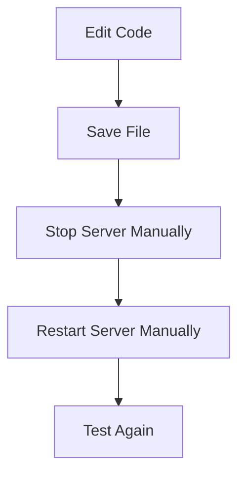
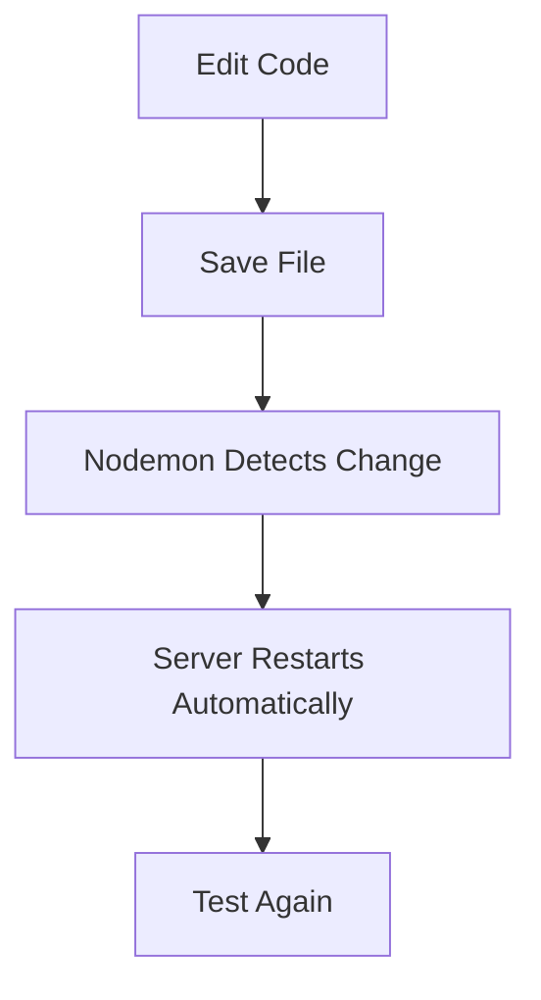
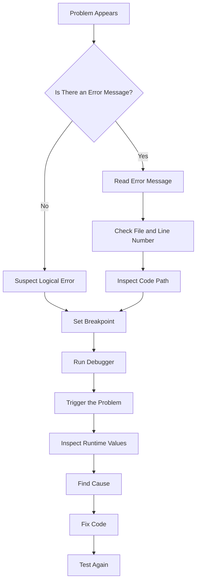
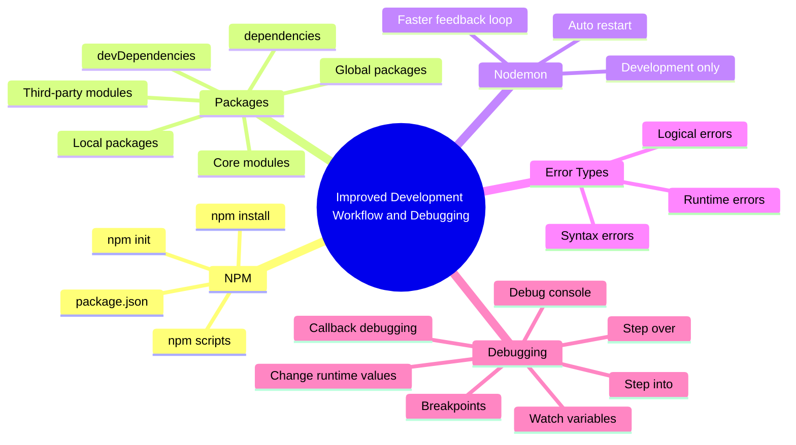
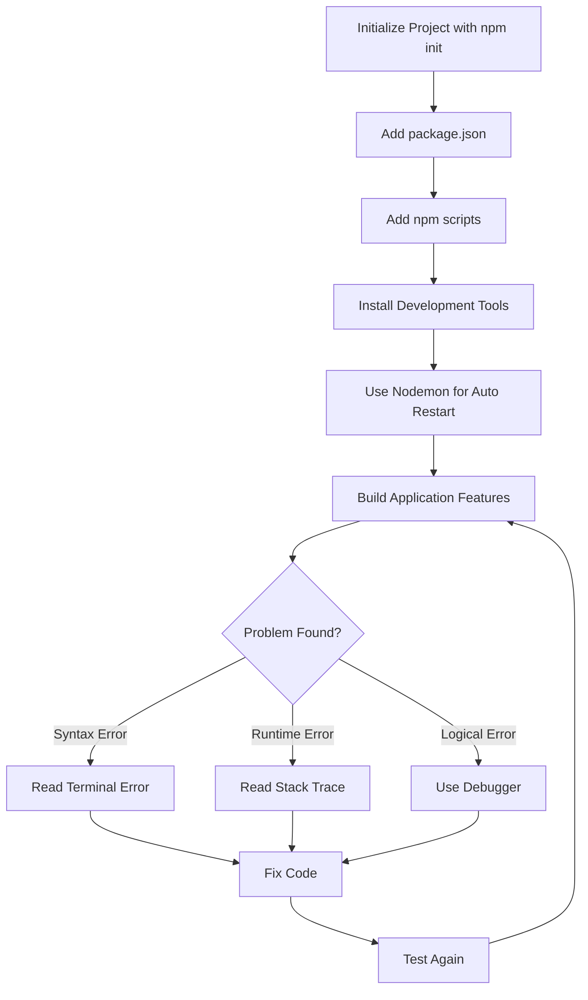

# 015 - Wrap Up

## Section

Improved Development Workflow and Debugging

## Duration

3 minutes

---

## Overview

This lesson wraps up the **Improved Development Workflow and Debugging** section.

In this module, you learned how to make Node.js development easier, faster, and more reliable. The section introduced tools and techniques for managing projects, installing packages, restarting the server automatically, understanding errors, and debugging code with Visual Studio Code.

---

## Main Idea

The main goal of this module was to improve how you develop Node.js applications.

Instead of only writing code manually and restarting the server again and again, you learned how to use tools such as:

* NPM
* `package.json`
* NPM scripts
* Third-party packages
* Nodemon
* VS Code Debugger

You also learned how to identify and fix different types of errors.

---

## Learning Objectives

By the end of this lesson, you should be able to:

* Review the main tools introduced in this module.
* Explain why NPM is important in Node.js projects.
* Understand how `package.json` helps manage a project.
* Use NPM scripts to simplify repeated commands.
* Install and manage third-party packages.
* Understand the difference between local, global, development, and production dependencies.
* Use Nodemon to restart the server automatically.
* Identify syntax, runtime, and logical errors.
* Use the VS Code debugger to inspect and fix problems.
* Prepare for the next section of the course.

---

## Module Recap

This module covered two major topics:

1. **Improving the development workflow**
2. **Debugging Node.js applications**

The workflow improvements focused on making development faster and less repetitive.

The debugging lessons focused on understanding errors and using tools to inspect code while it runs.

---

## 1. NPM and Project Management

NPM stands for:

```text
Node Package Manager
```

It is installed together with Node.js and is used to manage Node.js projects.

With NPM, you can:

* Initialize a project.
* Create a `package.json` file.
* Install third-party packages.
* Manage dependencies.
* Define reusable scripts.
* Share projects more easily.

To initialize a Node.js project, you use:

```bash
npm init
```

This creates a `package.json` file.

---

## 2. The `package.json` File

The `package.json` file is the main configuration file of a Node.js project.

It can store:

* Project name
* Version
* Description
* Entry point
* Scripts
* Dependencies
* Development dependencies
* License information

Example:

```json
{
  "name": "node-debugging-project",
  "version": "1.0.0",
  "main": "app.js",
  "scripts": {
    "start": "nodemon app.js"
  },
  "devDependencies": {
    "nodemon": "^3.0.0"
  }
}
```

---

## 3. NPM Scripts

NPM scripts allow you to define shortcuts for commands you run often.

Instead of typing:

```bash
node app.js
```

you can define:

```json
{
  "scripts": {
    "start": "node app.js"
  }
}
```

Then run:

```bash
npm start
```

This makes the project easier to run and easier to share with other developers.

---

## 4. Third-Party Packages

Node.js comes with core modules, but real projects often need extra functionality.

Third-party packages are installed from the NPM registry.

Example:

```bash
npm install nodemon --save-dev
```

Third-party packages help you avoid reinventing the wheel.

Examples include:

* `nodemon`
* `express`
* `body-parser`
* `mongoose`
* testing tools
* validation tools

---

## 5. Dependency Types

This module introduced different dependency types.

| Dependency Type        | Command                               | Purpose                                 |
| ---------------------- | ------------------------------------- | --------------------------------------- |
| Production dependency  | `npm install package-name`            | Needed when the app runs in production  |
| Development dependency | `npm install package-name --save-dev` | Needed only during development          |
| Global package         | `npm install -g package-name`         | Available from anywhere in the terminal |
| Local package          | `npm install package-name`            | Installed inside one project            |

---

## 6. Local vs Global Packages

Most packages should be installed locally.

Local packages are stored in:

```text
node_modules
```

They are tracked in:

```text
package.json
package-lock.json
```

This allows you to share the project without the large `node_modules` folder.

Another developer can restore dependencies by running:

```bash
npm install
```

Global packages are installed with:

```bash
npm install -g package-name
```

Global packages can be used directly from the terminal.

---

## 7. Nodemon

Nodemon is a development tool that automatically restarts your Node.js server whenever files change.

Without Nodemon:



With Nodemon:



This makes development faster and more convenient.

---

## 8. Error Types

The module introduced three main categories of errors.

| Error Type    | Description                      | Error Message? | Example                |
| ------------- | -------------------------------- | -------------: | ---------------------- |
| Syntax Error  | Invalid JavaScript code          |    Usually yes | Missing brace or typo  |
| Runtime Error | Code breaks while running        |    Usually yes | Sending response twice |
| Logical Error | App runs but behaves incorrectly |     Usually no | Saving the wrong value |

---

## 9. Syntax Errors

Syntax errors happen when the code is not valid JavaScript.

Examples:

```js
cons server = http.createServer();
```

or:

```js
if (req.url === '/') {
  res.end('Home');
```

Syntax errors usually prevent the application from starting.

To fix them:

1. Read the terminal error.
2. Check the file and line number.
3. Inspect the reported line and nearby code.
4. Fix the typo or missing character.
5. Restart the app.

---

## 10. Runtime Errors

Runtime errors happen while the application is running.

Example:

```js
res.end('Home Page');

res.setHeader('Content-Type', 'text/html');
res.end('Another Response');
```

This can cause an error like:

```text
Cannot set headers after they are sent to the client
```

The fix is to stop execution after sending the response:

```js
return res.end('Home Page');
```

or use proper conditional logic:

```js
if (req.url === '/') {
  res.end('Home Page');
} else {
  res.end('Default Page');
}
```

---

## 11. Logical Errors

Logical errors are often the hardest to find.

The app does not crash, but the result is wrong.

Example:

```js
const parsedBody = Buffer.concat(body).toString();
const message = parsedBody.split('=')[0];
```

If the submitted data is:

```text
message=test
```

then:

```js
parsedBody.split('=')
```

returns:

```js
['message', 'test']
```

Index `0` gives the field name.

Index `1` gives the real user input.

Correct code:

```js
const message = parsedBody.split('=')[1];
```

---

## 12. Using the Debugger

The VS Code debugger helps you inspect code while it is running.

You learned how to:

* Start debugging.
* Set breakpoints.
* Pause code execution.
* Inspect variables.
* Use the debug console.
* Step through code.
* Understand callback execution.
* Change variable values during debugging.

---

## Debugging Workflow



---

## 13. Debugging and Callbacks

Node.js is event-driven and uses callbacks heavily.

This means code is not always executed strictly line by line from top to bottom.

Example:

```js
fs.writeFile('message.txt', message, err => {
  // This callback runs later
});
```

If you want to debug code inside a callback, place the breakpoint inside the callback.

Do not only place it before the callback is registered.

---

## 14. Changing Variables in the Debugger

The debugger can also change variable values during runtime.

For example:

```js
parsedBody = 'message=testing'
```

This affects the current running process, but it does not permanently change your source code.

This is useful for quickly testing different values while debugging.

---

## Full Module Mind Map



---

## Development Workflow After This Module



---

## Key Points

* NPM helps manage Node.js projects.
* `npm init` creates a `package.json` file.
* NPM scripts make repeated commands easier to run.
* Third-party packages are installed through NPM.
* `--save-dev` is used for development dependencies.
* `-g` installs packages globally.
* Local dependencies are preferred for project-specific tools.
* Nodemon restarts the server automatically during development.
* Syntax errors prevent code from running.
* Runtime errors happen while the app is running.
* Logical errors produce wrong behavior without necessarily showing an error.
* The debugger helps inspect code at runtime.
* Breakpoints pause execution at important lines.
* Debugging callbacks requires placing breakpoints inside callback functions.
* Variable values can be inspected and changed during debugging.

---

## Five-Bullet Recap

* NPM and `package.json` help manage Node.js projects and dependencies.
* NPM scripts make common commands like starting the server repeatable.
* Nodemon improves development by restarting the server automatically after changes.
* Errors can be grouped into syntax, runtime, and logical errors.
* The VS Code debugger helps inspect, step through, and fix code while it runs.

---

## Practice Task

Write a five-bullet recap from memory.

Example:

```text
1. npm init creates package.json.
2. npm scripts simplify repeated commands.
3. nodemon restarts the server automatically.
4. syntax, runtime, and logical errors require different debugging approaches.
5. the VS Code debugger helps inspect runtime values.
```

Then reopen the section index and add any missing concepts.

---

## Review Questions

1. What was the main goal of the Improved Development Workflow and Debugging section?
2. What does NPM help with in a Node.js project?
3. What is the purpose of `package.json`?
4. Why are NPM scripts useful?
5. What problem does Nodemon solve?
6. What is the difference between local and global packages?
7. What is the difference between `dependencies` and `devDependencies`?
8. What are the three main types of errors discussed in this section?
9. Why are logical errors harder to fix than syntax errors?
10. How does the VS Code debugger help with logical errors?
11. Why do callbacks require special attention when debugging Node.js code?
12. How would you prove that your development workflow is working correctly?

---

## Summary

This module showed how to improve the development workflow and debugging process for Node.js applications.

You learned how to initialize and manage a project with NPM, define scripts in `package.json`, install third-party packages, and use Nodemon to automatically restart the server during development.

You also learned how to understand and fix syntax errors, runtime errors, and logical errors. Finally, you practiced using the Visual Studio Code debugger to pause code execution, inspect variables, step through code, and even change runtime values.

These tools and techniques help you develop Node.js applications more efficiently and prepare you for larger projects in the next sections of the course.

---

# Bài luyện tập

## Mục tiêu


## Đề bài


## Yêu cầu hoàn thành

- [ ] 
- [ ] 
- [ ] 

## Kết quả / lời giải


## Ghi chú
