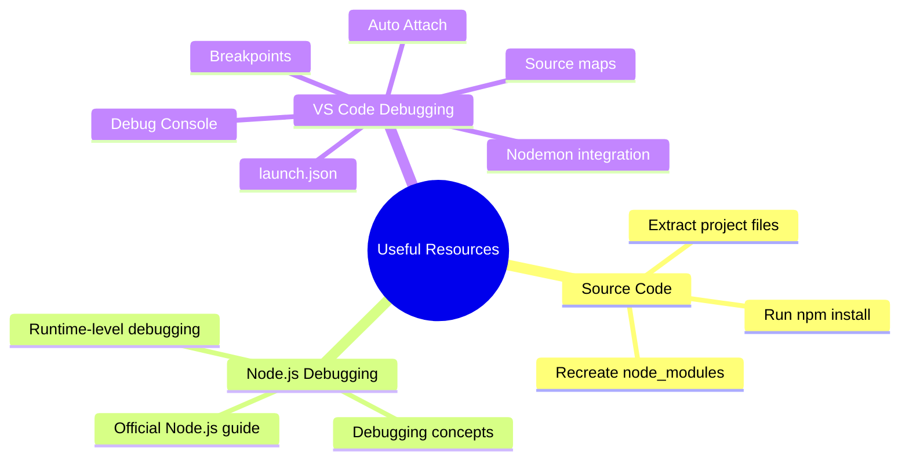
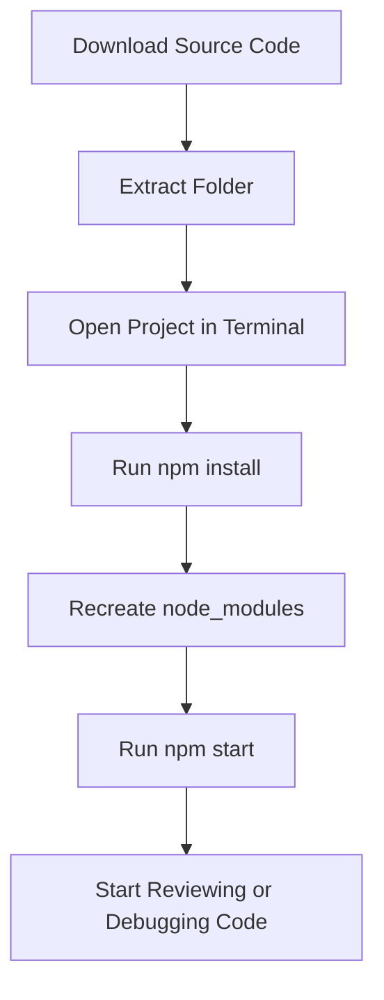

# 016 - Useful Resources & Links

## Section

Improved Development Workflow and Debugging

## Duration

1 minute

---

## Overview

This lesson collects useful resources and links for the **Improved Development Workflow and Debugging** section.

The goal is to keep important documentation, source code notes, and debugging references close to the section where they are most useful.

---

## Main Idea

After learning about NPM, third-party packages, Nodemon, error types, and debugging in Visual Studio Code, it is helpful to keep a small resource list for future review.

These resources can help you revisit important topics when you need to debug a Node.js application or set up a development workflow again.

---

## Learning Objectives

By the end of this lesson, you should be able to:

* Identify the supporting resources for this section.
* Know what to do after downloading the attached source code.
* Understand when to return to the Node.js debugging documentation.
* Understand when to use the Visual Studio Code debugging documentation.
* Keep useful references organized for later review.

---

## Attached Source Code Note

The source code for this section is attached to the course lesson.

When using the provided source code, make sure to run this command inside the extracted project folder:

```bash
npm install
```

This command recreates the `node_modules` folder based on the dependencies listed in:

```text
package.json
package-lock.json
```

The `node_modules` folder is usually not included when sharing project files because it can be very large.

---

## Useful Resources

### 1. More on Debugging Node.js

Official Node.js debugging guide:

```text
https://nodejs.org/en/docs/guides/debugging-getting-started/
```

Use this resource when you want to understand Node.js debugging concepts more deeply, including how Node.js debugging works at the runtime level.

---

### 2. Debugging Node.js in Visual Studio Code

Official VS Code documentation:

```text
https://code.visualstudio.com/docs/nodejs/nodejs-debugging
```

Use this resource when you want to explore VS Code debugging features such as:

* Breakpoints
* Debug Console
* Auto Attach
* JavaScript Debug Terminal
* Launch configurations
* Attach configurations
* Nodemon setup
* Source maps
* Skipping Node internals

---

## Resource Map



---

## When to Return to These Resources

| Resource                | Use It When                                                         |
| ----------------------- | ------------------------------------------------------------------- |
| Attached source code    | You want to compare your code with the course version               |
| `npm install` note      | You downloaded or extracted a project without `node_modules`        |
| Node.js debugging guide | You want to understand debugging at the Node.js runtime level       |
| VS Code debugging docs  | You want to configure or improve your debugging workflow in VS Code |

---

## Practical Example

If you download the section source code, your workflow should look like this:



---

## Key Points

* The course source code may not include the `node_modules` folder.
* Run `npm install` after extracting the project files.
* `npm install` reads dependency information from `package.json`.
* The official Node.js debugging guide is useful for runtime debugging concepts.
* The VS Code debugging documentation is useful for practical debugger setup.
* Keep these links close to this section for future review.

---

## Practice Task

Create a short resource list for this section.

Example:

```text
1. Source code:
   Use it to compare my implementation with the course version.

2. Node.js debugging guide:
   Return to this when I want to understand Node.js debugging concepts more deeply.

3. VS Code debugging documentation:
   Return to this when I need help with breakpoints, launch.json, Nodemon debugging, or Auto Attach.
```

Then download the source code, extract it, and run:

```bash
npm install
```

Finally, start the app and confirm that the project runs correctly.

---

## Review Questions

1. Why do you need to run `npm install` after extracting the source code?
2. Why is `node_modules` usually not shared with the project?
3. Which file tells NPM which packages to install?
4. What is the purpose of the official Node.js debugging guide?
5. What is the purpose of the VS Code Node.js debugging documentation?
6. When would you return to these resources?
7. How would you prove that the downloaded source code works correctly?

---

## Summary

This lesson provides useful resources and links for the **Improved Development Workflow and Debugging** section.

The most important practical note is that after downloading and extracting the source code, you should run:

```bash
npm install
```

This restores the project dependencies and recreates the `node_modules` folder.

The two main documentation resources are the official Node.js debugging guide and the Visual Studio Code Node.js debugging documentation. These references are useful when you want to better understand debugging concepts or configure a stronger debugging workflow.
