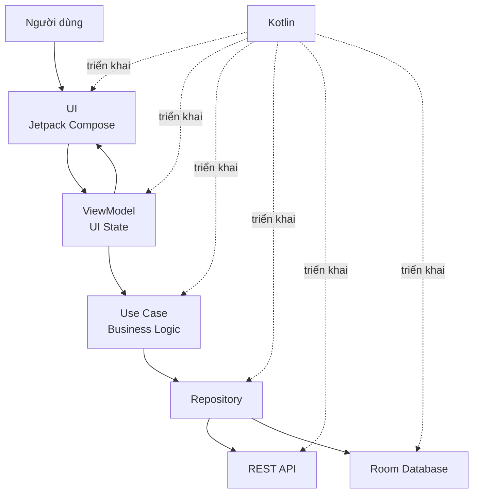
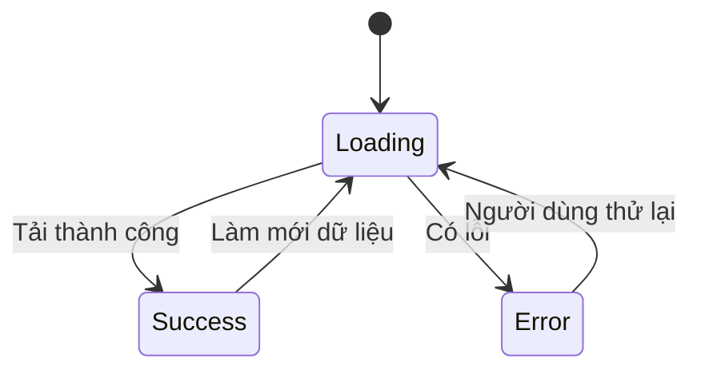
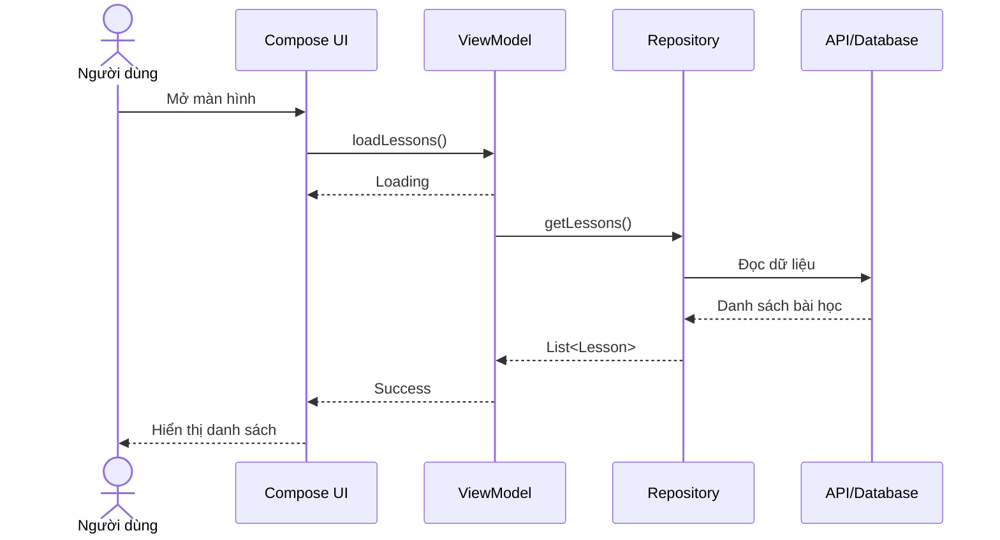

# 001 — Kotlin

| Thuộc tính              | Nội dung                                               |
| ----------------------- | ------------------------------------------------------ |
| **Học phần**            | 01 — Language and Android Fundamentals                 |
| **Module**              | Module 01 — Pick a Language                            |
| **Nhóm nội dung**       | Language Choice                                        |
| **Nguồn roadmap**       | Pick a Language / Language Choice                      |
| **Loại bài**            | Lesson                                                 |
| **Thứ tự trong module** | 001                                                    |
| **Thời lượng gợi ý**    | 24 phút                                                |
| **Mức độ**              | Nhập môn                                               |
| **Artifact đầu ra**     | Code Kotlin, sơ đồ kiến trúc, unit test và README ngắn |

---

## 1. Tóm tắt

**Kotlin** là ngôn ngữ được Google khuyến nghị khi xây dựng ứng dụng Android mới. Hệ sinh thái Android hiện đại được phát triển theo hướng **Kotlin-first**: tài liệu, thư viện Jetpack, ví dụ, công cụ và Jetpack Compose thường ưu tiên trải nghiệm dành cho lập trình viên Kotlin. Java vẫn được hỗ trợ và có thể sử dụng chung trong cùng một dự án.

Trong ứng dụng Android, Kotlin có thể xuất hiện ở hầu hết các tầng:

* Viết giao diện bằng **Jetpack Compose**.
* Quản lý trạng thái trong `ViewModel`.
* Gọi API và xử lý bất đồng bộ bằng **Coroutines**.
* Quan sát dữ liệu thay đổi bằng **Flow**.
* Truy cập cơ sở dữ liệu Room.
* Viết business logic, repository và use case.
* Viết unit test và integration test.
* Tích hợp với các thư viện Java hiện có.

Kotlin không tự động làm ứng dụng có kiến trúc tốt. Giá trị của ngôn ngữ chỉ phát huy khi lập trình viên sử dụng đúng các tính năng như **null safety**, immutable state, data class, sealed class, coroutine có lifecycle và quy ước viết code rõ ràng.

---

## 2. Ảnh minh họa

### Kotlin và Android


*Nguồn ảnh: Android Developers.*

### Quy chuẩn sử dụng logo Kotlin


*Nguồn ảnh: Kotlin Documentation.*

Các tài nguyên hình ảnh chính thức:

* [Kotlin Brand Assets](https://kotlinlang.org/docs/kotlin-brand-assets.html)
* [Android Kotlin-first Approach](https://developer.android.com/kotlin/first)
* [Khóa học Android Basics with Compose](https://developer.android.com/courses/android-basics-compose/course)

---

## 3. Mục tiêu học tập

Sau bài học, bạn có thể:

* Giải thích Kotlin là gì bằng ngôn ngữ của mình.
* Hiểu vì sao Android hiện đại sử dụng cách tiếp cận Kotlin-first.
* Nhận biết vị trí của Kotlin trong một ứng dụng Android.
* Phân biệt `val`, `var`, kiểu nullable và kiểu non-null.
* Sử dụng cơ bản:

  * Function.
  * Data class.
  * Sealed class hoặc sealed interface.
  * Extension function.
  * Lambda và collection operation.
* Hiểu vai trò ban đầu của Coroutines và Flow.
* Viết một ví dụ Kotlin nhỏ có thể đưa vào portfolio.
* Nhận biết các lỗi phổ biến của lập trình viên Android mới.

---

## 4. Kotlin là gì?

Kotlin là một ngôn ngữ lập trình hiện đại do JetBrains phát triển. Kotlin có cú pháp ngắn gọn, hỗ trợ nhiều nền tảng và có khả năng tương tác với Java. Kotlin được tích hợp trực tiếp trong Android Studio và có thể được sử dụng cùng code Java trong một dự án Android.

Ví dụ chương trình Kotlin đơn giản:

```kotlin
fun main() {
    val learnerName = "An Khánh"
    println("Xin chào $learnerName")
}
```

Kết quả:

```text
Xin chào An Khánh
```

Trong ví dụ này:

| Thành phần     | Ý nghĩa                         |
| -------------- | ------------------------------- |
| `fun`          | Khai báo một function           |
| `main()`       | Điểm bắt đầu của chương trình   |
| `val`          | Biến chỉ được gán một lần       |
| `"An Khánh"`   | Giá trị kiểu `String`           |
| `$learnerName` | String template                 |
| `println()`    | In nội dung ra màn hình console |

---

## 5. Kotlin nằm ở đâu trong ứng dụng Android?



Kotlin không chỉ là ngôn ngữ để viết giao diện. Nó có thể được sử dụng xuyên suốt toàn bộ ứng dụng:

```text
Compose UI
    ↓
ViewModel + State
    ↓
Use Case
    ↓
Repository
    ↓
Network / Database / Device API
```

### Ví dụ theo từng tầng

| Tầng       | Kotlin thường được dùng để làm gì?             |
| ---------- | ---------------------------------------------- |
| UI         | Viết composable, xử lý sự kiện, hiển thị state |
| ViewModel  | Quản lý UI state và coroutine                  |
| Domain     | Viết business rule và use case                 |
| Data       | Repository, API service, Room DAO              |
| Background | WorkManager, coroutine, scheduled task         |
| Test       | Unit test, fake repository, UI test            |
| Build      | Gradle Kotlin DSL                              |

---

## 6. Vì sao Android sử dụng Kotlin-first?

Android Kotlin-first không có nghĩa Java bị loại bỏ. Điều này có nghĩa những công cụ, tài liệu, thư viện và ví dụ Android mới thường được thiết kế trước hết cho người dùng Kotlin, trong khi API Java vẫn tiếp tục được hỗ trợ. Jetpack Compose là toolkit giao diện được xây dựng dành cho Kotlin.

### 6.1. Cú pháp ngắn gọn

Java:

```java
public class User {
    private final String name;

    public User(String name) {
        this.name = name;
    }

    public String getName() {
        return name;
    }
}
```

Kotlin:

```kotlin
data class User(
    val name: String
)
```

Kotlin giúp giảm phần code lặp lại, nhưng mục tiêu không phải là viết ít dòng nhất. Mục tiêu là làm cho ý nghĩa của code rõ ràng hơn.

---

### 6.2. Null safety

Trong Kotlin, kiểu dữ liệu nullable và non-null được phân biệt ở cấp độ hệ thống kiểu.

```kotlin
val username: String = "Khanh"
val avatarUrl: String? = null
```

* `String` không được chứa `null`.
* `String?` có thể chứa `null`.

Null safety được thiết kế để giảm nguy cơ truy cập vào một tham chiếu `null`, nguyên nhân phổ biến dẫn đến `NullPointerException`.

#### Truy cập an toàn

```kotlin
val avatarLength = avatarUrl?.length
```

Nếu `avatarUrl` là `null`, kết quả cũng là `null` thay vì làm ứng dụng crash.

#### Giá trị mặc định với Elvis operator

```kotlin
val displayAvatar = avatarUrl ?: "default_avatar.png"
```

#### Kiểm tra trước khi sử dụng

```kotlin
if (avatarUrl != null) {
    println(avatarUrl.length)
}
```

#### Cần hạn chế sử dụng `!!`

```kotlin
val length = avatarUrl!!.length
```

Toán tử `!!` yêu cầu Kotlin coi giá trị chắc chắn không phải `null`. Nếu giả định sai, ứng dụng vẫn có thể phát sinh `NullPointerException`.

Cách an toàn hơn:

```kotlin
val length = avatarUrl?.length ?: 0
```

---

### 6.3. `val` và `var`

```kotlin
val appName = "English Learning"
var lessonCount = 10
```

* `val`: tham chiếu không được gán lại.
* `var`: tham chiếu có thể thay đổi.

Trong Android, nên ưu tiên `val` và dữ liệu bất biến khi có thể.

```kotlin
val lessons = listOf("Kotlin", "Compose", "Coroutines")
```

Cách này giúp:

* Dễ theo dõi state.
* Giảm thay đổi ngoài dự kiến.
* Dễ viết test.
* Hạn chế lỗi khi nhiều coroutine cùng xử lý dữ liệu.

---

### 6.4. Type inference

Kotlin có thể tự suy luận kiểu dữ liệu:

```kotlin
val age = 23
val name = "Khanh"
val premium = false
```

Tương đương:

```kotlin
val age: Int = 23
val name: String = "Khanh"
val premium: Boolean = false
```

Nên khai báo kiểu rõ ràng khi:

* Đó là public API.
* Kiểu trả về khó nhận biết.
* Việc ghi rõ kiểu giúp code dễ đọc hơn.
* Bạn đang định nghĩa boundary giữa các module.

---

## 7. Data class

Data class phù hợp để biểu diễn dữ liệu trong ứng dụng.

```kotlin
data class Lesson(
    val id: Long,
    val title: String,
    val completed: Boolean
)
```

Compiler Kotlin tự sinh nhiều thành phần hữu ích cho data class, bao gồm `equals()`, `hashCode()`, `toString()`, `componentN()` và `copy()`.

### Tạo đối tượng

```kotlin
val lesson = Lesson(
    id = 1,
    title = "Kotlin Basics",
    completed = false
)
```

### Sao chép và thay đổi một thuộc tính

```kotlin
val completedLesson = lesson.copy(
    completed = true
)
```

Đối tượng ban đầu không bị sửa:

```text
lesson.completed          = false
completedLesson.completed = true
```

Cách này rất phù hợp với mô hình immutable UI state:

```kotlin
uiState = uiState.copy(
    isLoading = true
)
```

---

## 8. Sealed class và sealed interface

Sealed class hoặc sealed interface giúp biểu diễn một tập trạng thái hữu hạn đã biết trước.

```kotlin
sealed interface LessonUiState {
    data object Loading : LessonUiState

    data class Success(
        val lessons: List<Lesson>
    ) : LessonUiState

    data class Error(
        val message: String
    ) : LessonUiState
}
```

Khi sử dụng sealed hierarchy với `when`, compiler có thể kiểm tra xem bạn đã xử lý đủ các trường hợp hay chưa. Đây là lý do sealed class rất phù hợp để mô hình hóa UI state, kết quả API hoặc lỗi nghiệp vụ.

```kotlin
fun describeState(state: LessonUiState): String {
    return when (state) {
        LessonUiState.Loading -> "Đang tải"

        is LessonUiState.Success ->
            "Có ${state.lessons.size} bài học"

        is LessonUiState.Error ->
            state.message
    }
}
```

Không cần nhánh `else` vì mọi trạng thái đã được xử lý.

### Mô hình state



---

## 9. Extension function

Extension function cho phép khai báo một function mới có thể được gọi giống như member của một class, nhưng không thực sự thay đổi class đó.

```kotlin
fun Lesson.toDisplayLabel(): String {
    return if (completed) {
        "✓ $title"
    } else {
        title
    }
}
```

Sử dụng:

```kotlin
val lesson = Lesson(
    id = 1,
    title = "Kotlin Basics",
    completed = true
)

println(lesson.toDisplayLabel())
```

Kết quả:

```text
✓ Kotlin Basics
```

Extension function hữu ích cho:

* Chuyển domain model thành chuỗi hiển thị.
* Format ngày tháng.
* Chuyển DTO sang domain model.
* Chuyển domain model sang UI model.
* Gom logic lặp lại thành function có tên rõ ràng.

Không nên sử dụng extension function để giấu một lượng lớn business logic hoặc tạo API khó đoán.

---

## 10. Lambda và collection operation

Kotlin hỗ trợ cách xử lý collection dễ đọc:

```kotlin
val lessons = listOf(
    Lesson(1, "Kotlin", true),
    Lesson(2, "Compose", false),
    Lesson(3, "Coroutines", false)
)
```

### Lọc dữ liệu

```kotlin
val incompleteLessons = lessons.filter { lesson ->
    !lesson.completed
}
```

Dạng ngắn:

```kotlin
val incompleteLessons = lessons.filter { !it.completed }
```

### Chuyển đổi dữ liệu

```kotlin
val lessonTitles = lessons.map { it.title }
```

### Tìm phần tử

```kotlin
val kotlinLesson = lessons.find {
    it.title == "Kotlin"
}
```

### Kiểm tra điều kiện

```kotlin
val allCompleted = lessons.all {
    it.completed
}
```

### Đếm phần tử

```kotlin
val completedCount = lessons.count {
    it.completed
}
```

Collection operation giúp code gần với ý nghĩa nghiệp vụ hơn, nhưng không nên tạo chuỗi xử lý quá dài khiến code khó đọc hoặc phát sinh nhiều collection trung gian không cần thiết.

---

## 11. Coroutines và Flow

### 11.1. Coroutines

Ứng dụng Android thường phải thực hiện những công việc không nên chặn main thread:

* Gọi API.
* Đọc cơ sở dữ liệu.
* Xử lý file.
* Tính toán kéo dài.
* Đồng bộ dữ liệu.

Kotlin Coroutines cung cấp mô hình lập trình bất đồng bộ có cấu trúc. Coroutine có thể tạm dừng mà không cần chặn thread. Jetpack Compose cũng tích hợp sâu với coroutine trong nhiều API.

Ví dụ:

```kotlin
viewModelScope.launch {
    val lessons = repository.getLessons()
    uiState = LessonUiState.Success(lessons)
}
```

`viewModelScope` gắn công việc với vòng đời của `ViewModel`.

---

### 11.2. Flow

Một suspending function thường trả về một giá trị:

```kotlin
suspend fun getUser(): User
```

Flow có thể phát ra nhiều giá trị theo thời gian:

```kotlin
fun observeLessons(): Flow<List<Lesson>>
```

Flow phù hợp với:

* Dữ liệu Room thay đổi.
* Trạng thái đăng nhập.
* Cài đặt ứng dụng.
* Kết quả tìm kiếm.
* Tiến trình tải dữ liệu.
* Dữ liệu cảm biến.

Flow biểu diễn một luồng giá trị bất đồng bộ tuần tự và có thể dùng để xây dựng pipeline xử lý dữ liệu phản ứng.

```text
Room Database
      │
      ▼
Flow<List<Lesson>>
      │
      ▼
ViewModel
      │
      ▼
Compose UI
```

---

## 12. Jetpack Compose và Kotlin

Jetpack Compose sử dụng nhiều đặc điểm của Kotlin:

* Function và annotation.
* Named argument.
* Default argument.
* Lambda.
* Higher-order function.
* Delegated property.
* Extension function.
* Coroutine.
* Immutable state.

```kotlin
@Composable
fun Greeting(
    name: String,
    modifier: Modifier = Modifier
) {
    Text(
        text = "Xin chào $name",
        modifier = modifier
    )
}
```

Compose được thiết kế dành cho Kotlin và không cung cấp trải nghiệm tương đương bằng Java.

---

## 13. Ví dụ hoàn chỉnh: mô hình bài học Kotlin

### 13.1. Model

```kotlin
data class Lesson(
    val id: Long,
    val title: String,
    val completed: Boolean = false
)
```

### 13.2. Extension function

```kotlin
fun Lesson.toDisplayLabel(): String {
    return if (completed) {
        "✓ $title"
    } else {
        title
    }
}
```

### 13.3. UI state

```kotlin
sealed interface LessonUiState {
    data object Loading : LessonUiState

    data class Success(
        val lessons: List<Lesson>
    ) : LessonUiState

    data class Error(
        val message: String
    ) : LessonUiState
}
```

### 13.4. Repository contract

```kotlin
interface LessonRepository {
    suspend fun getLessons(): List<Lesson>
}
```

### 13.5. ViewModel

```kotlin
class LessonViewModel(
    private val repository: LessonRepository
) : ViewModel() {

    var uiState by mutableStateOf<LessonUiState>(
        LessonUiState.Loading
    )
        private set

    fun loadLessons() {
        viewModelScope.launch {
            uiState = LessonUiState.Loading

            uiState = try {
                val lessons = repository.getLessons()
                LessonUiState.Success(lessons)
            } catch (exception: Exception) {
                LessonUiState.Error(
                    message = exception.message
                        ?: "Không thể tải bài học"
                )
            }
        }
    }
}
```

### 13.6. Compose UI

```kotlin
@Composable
fun LessonScreen(
    state: LessonUiState,
    onRetry: () -> Unit
) {
    when (state) {
        LessonUiState.Loading -> {
            CircularProgressIndicator()
        }

        is LessonUiState.Success -> {
            LazyColumn {
                items(
                    items = state.lessons,
                    key = { lesson -> lesson.id }
                ) { lesson ->
                    Text(
                        text = lesson.toDisplayLabel()
                    )
                }
            }
        }

        is LessonUiState.Error -> {
            Column {
                Text(text = state.message)

                Button(onClick = onRetry) {
                    Text(text = "Thử lại")
                }
            }
        }
    }
}
```

### Luồng hoạt động



---

## 14. Ví dụ chương trình Kotlin thuần

Đoạn code này có thể chạy trong Kotlin Playground:

```kotlin
data class Lesson(
    val id: Long,
    val title: String,
    val completed: Boolean = false
)

fun Lesson.toDisplayLabel(): String {
    return if (completed) "✓ $title" else title
}

fun main() {
    val lessons = listOf(
        Lesson(
            id = 1,
            title = "Kotlin Basics",
            completed = true
        ),
        Lesson(
            id = 2,
            title = "Null Safety"
        ),
        Lesson(
            id = 3,
            title = "Data Classes"
        )
    )

    val unfinishedLessons = lessons
        .filterNot { it.completed }
        .map { it.toDisplayLabel() }

    unfinishedLessons.forEach(::println)
}
```

Kết quả:

```text
Null Safety
Data Classes
```

Trong một ví dụ nhỏ, chúng ta đã sử dụng:

* Data class.
* Default parameter.
* Extension function.
* Immutable list.
* Lambda.
* `filterNot`.
* `map`.
* Function reference.

---

## 15. Ảnh hưởng đến sản phẩm Android

| Khía cạnh           | Kotlin có thể hỗ trợ như thế nào?                            | Điều cần lưu ý                                     |
| ------------------- | ------------------------------------------------------------ | -------------------------------------------------- |
| **UX**              | Coroutine giúp thực hiện tác vụ nền mà không khóa UI         | Không chạy tác vụ nặng trên main thread            |
| **Độ ổn định**      | Null safety và sealed state giảm lỗi trạng thái không hợp lệ | Không lạm dụng `!!`                                |
| **Maintainability** | Data class và cú pháp ngắn giúp giảm boilerplate             | Code ngắn nhưng khó hiểu vẫn là code xấu           |
| **Testing**         | Function thuần và immutable model dễ kiểm thử                | Không gắn business logic trực tiếp vào Android API |
| **State**           | `copy()` phù hợp với immutable UI state                      | Tránh sửa trực tiếp mutable list                   |
| **Lifecycle**       | Coroutine có thể gắn với `ViewModel` hoặc lifecycle          | Tránh coroutine không có owner rõ ràng             |
| **Java interop**    | Có thể tái sử dụng code Java hiện tại                        | Cẩn thận với platform type và null từ Java         |
| **Release**         | Hệ sinh thái Gradle và Android Studio hỗ trợ trực tiếp       | Kiểm tra tương thích plugin và thư viện            |

---

## 16. Lỗi thường gặp của lập trình viên mới

### 16.1. Lạm dụng toán tử `!!`

Không nên:

```kotlin
val username = user!!.name!!
```

Nên biểu diễn rõ trường hợp thiếu dữ liệu:

```kotlin
val username = user?.name ?: "Người dùng"
```

---

### 16.2. Dùng `var` cho mọi thứ

Không nên:

```kotlin
var appName = "Learning App"
var userId = 10L
```

Khi giá trị không cần thay đổi:

```kotlin
val appName = "Learning App"
val userId = 10L
```

---

### 16.3. Sửa trực tiếp mutable UI state

Không nên:

```kotlin
uiState.lessons.add(newLesson)
```

Nên tạo state mới:

```kotlin
uiState = uiState.copy(
    lessons = uiState.lessons + newLesson
)
```

---

### 16.4. Đặt business logic trong Composable

Không nên:

```kotlin
@Composable
fun CheckoutScreen() {
    val finalPrice =
        calculateTax() +
        calculateShipping() -
        calculateDiscount()
}
```

Nên xử lý business logic trong use case hoặc ViewModel:

```kotlin
class CalculateCheckoutTotalUseCase {
    operator fun invoke(
        subtotal: Double,
        shipping: Double,
        discount: Double
    ): Double {
        return subtotal + shipping - discount
    }
}
```

---

### 16.5. Tạo coroutine không có lifecycle rõ ràng

Không nên dùng một coroutine tồn tại lâu hơn màn hình hoặc component sở hữu nó mà không có cơ chế hủy.

Trong Android, hãy chọn scope phù hợp:

```text
Tác vụ thuộc ViewModel
        → viewModelScope

Tác vụ thuộc LifecycleOwner
        → lifecycleScope

Tác vụ bền vững cần tiếp tục
        → WorkManager
```

---

### 16.6. Dùng scope function chỉ để làm code ngắn

Ví dụ khó đọc:

```kotlin
user?.let {
    it.profile?.run {
        address?.also {
            saveAddress(it)
        }
    }
}
```

Cách rõ ràng hơn:

```kotlin
val userProfile = user?.profile
val address = userProfile?.address

if (address != null) {
    saveAddress(address)
}
```

Mục tiêu của Kotlin là code rõ ràng, không phải code có nhiều kỹ thuật nhất.

---

## 17. Unit test nhỏ

### Function cần kiểm thử

```kotlin
fun Lesson.toDisplayLabel(): String {
    return if (completed) "✓ $title" else title
}
```

### Test

```kotlin
class LessonExtensionsTest {

    @Test
    fun completedLesson_hasCheckMark() {
        val lesson = Lesson(
            id = 1,
            title = "Kotlin",
            completed = true
        )

        val result = lesson.toDisplayLabel()

        assertEquals("✓ Kotlin", result)
    }

    @Test
    fun incompleteLesson_hasOriginalTitle() {
        val lesson = Lesson(
            id = 2,
            title = "Compose",
            completed = false
        )

        val result = lesson.toDisplayLabel()

        assertEquals("Compose", result)
    }
}
```

Test này chứng minh rằng:

* Logic hiển thị đã được tách khỏi UI.
* Function không phụ thuộc Android framework.
* Có thể kiểm tra nhanh mà không cần emulator.

---

## 18. Bài thực hành 24 phút

### Phút 0–5: Viết ghi chú năm dòng

Mẫu trả lời:

> Kotlin là ngôn ngữ hiện đại được khuyến nghị cho Android.
> Kotlin có cú pháp ngắn gọn và tương tác được với Java.
> Null safety giúp giảm nguy cơ lỗi liên quan đến giá trị null.
> Kotlin kết hợp tự nhiên với Compose, Coroutines và Flow.
> Kotlin hiệu quả nhất khi đi kèm kiến trúc và quản lý state rõ ràng.

---

### Phút 5–10: Chạy chương trình đầu tiên

```kotlin
fun main() {
    val courseName = "Android Developer Roadmap"
    val completedLessons = 1

    println("Khóa học: $courseName")
    println("Đã hoàn thành: $completedLessons bài")
}
```

Yêu cầu chỉnh sửa:

1. Thêm tên học viên.
2. Thêm tổng số bài.
3. Tính phần trăm hoàn thành.
4. In kết quả ra console.

---

### Phút 10–18: Tạo data class và collection

```kotlin
data class RoadmapItem(
    val title: String,
    val completed: Boolean
)
```

Tạo ít nhất ba bài học:

```kotlin
val roadmap = listOf(
    RoadmapItem("Kotlin", true),
    RoadmapItem("Java", false),
    RoadmapItem("Kotlin vs Java", false)
)
```

Sau đó:

* Lọc các bài chưa hoàn thành.
* Đếm các bài đã hoàn thành.
* In tên từng bài.
* Tính phần trăm tiến độ.

---

### Phút 18–22: Viết một unit test

Kiểm tra một function tính tiến độ:

```kotlin
fun calculateProgress(
    completed: Int,
    total: Int
): Int {
    if (total <= 0) return 0

    return completed * 100 / total
}
```

Test mong đợi:

```kotlin
@Test
fun oneOfFourLessons_returns25Percent() {
    assertEquals(
        25,
        calculateProgress(
            completed = 1,
            total = 4
        )
    )
}
```

---

### Phút 22–24: Viết README

```markdown
# Kotlin Basics Demo

## Nội dung

Ứng dụng minh họa các khái niệm Kotlin cơ bản:

- Data class
- Null safety
- Extension function
- Collection operations
- Unit testing

## Kết quả

Chương trình có thể lọc bài học, tính tiến độ và hiển thị trạng thái.
```

---

## 19. Bài tập

### Bài 1 — User profile

Tạo data class:

```kotlin
data class UserProfile(
    val name: String,
    val email: String?,
    val premium: Boolean
)
```

Yêu cầu:

* Nếu `email` là `null`, hiển thị `"Chưa cập nhật email"`.
* Nếu `premium` là `true`, thêm nhãn `"Premium"`.
* Viết extension function `toDisplayText()`.

---

### Bài 2 — Trạng thái đăng nhập

Tạo sealed interface:

```kotlin
sealed interface LoginUiState
```

Bao gồm:

* `Idle`.
* `Loading`.
* `Success`.
* `Error`.

Viết function sử dụng `when` để chuyển mỗi state thành nội dung hiển thị.

---

### Bài 3 — Danh sách bài học

Tạo danh sách gồm ít nhất năm bài học.

Thực hiện:

* Lọc bài đã hoàn thành.
* Sắp xếp theo tiêu đề.
* Chuyển thành danh sách chuỗi.
* Đếm số bài còn lại.
* Tính phần trăm hoàn thành.

---

### Bài 4 — Liên hệ với UX

Viết từ 100–150 từ trả lời:

> Việc sử dụng null safety, sealed UI state và coroutine có thể ảnh hưởng như thế nào đến trải nghiệm người dùng trong ứng dụng Android?

---

## 20. Artifact gợi ý cho portfolio

Cấu trúc project:

```text
kotlin-basics-demo/
├── app/
│   └── src/
│       ├── main/
│       │   └── java/
│       │       └── Lesson.kt
│       └── test/
│           └── LessonExtensionsTest.kt
├── screenshots/
│   └── lesson-list.png
├── diagrams/
│   └── kotlin-android-flow.png
└── README.md
```

README nên có:

1. Mục tiêu project.
2. Các tính năng Kotlin đã sử dụng.
3. Sơ đồ luồng dữ liệu.
4. Ảnh chụp màn hình.
5. Hướng dẫn chạy project.
6. Kết quả unit test.
7. Những điều đã học.
8. Hướng cải tiến tiếp theo.

### Mô tả portfolio mẫu

> Xây dựng một ứng dụng Android nhỏ bằng Kotlin và Jetpack Compose để quản lý tiến độ học tập. Ứng dụng sử dụng data class cho model, sealed interface cho UI state, coroutine để tải dữ liệu và unit test cho business logic. Code được tổ chức theo luồng UI – ViewModel – Repository.

---

## 21. Ghi chú production

Khi đưa code Kotlin vào production, cần đặt các câu hỏi sau.

### State và lifecycle

* State có bị mất khi xoay màn hình không?
* State nào chỉ tồn tại trong UI?
* State nào cần đặt trong `ViewModel`?
* State nào cần lưu vào database hoặc `SavedStateHandle`?
* Coroutine có được hủy khi component không còn tồn tại không?

### Network và storage

* Trạng thái loading được hiển thị thế nào?
* Mất mạng có thông báo rõ ràng không?
* Có nút thử lại không?
* Dữ liệu cache có bị lỗi thời không?
* Exception có được chuyển thành domain error rõ ràng không?

### Testing

* Business logic đã được tách khỏi UI chưa?
* Có unit test cho success, empty và error state không?
* Coroutine test có kiểm soát dispatcher không?
* Có test cho dữ liệu `null` từ Java hoặc API không?

### Debugging

* Log có chứa thông tin nhạy cảm không?
* Error message có đủ để tìm nguyên nhân không?
* Có request ID hoặc trace ID không?
* Có thể tái hiện lỗi từ crash report không?

### Release

* Phiên bản Kotlin và plugin có tương thích không?
* Compose compiler và Kotlin plugin đã cấu hình đúng chưa?
* Có warning mới khi build release không?
* R8 có loại bỏ nhầm class cần reflection không?
* Build release đã được kiểm tra trên thiết bị thật chưa?

---

## 22. Quy ước code

Kotlin và Android Studio hỗ trợ định dạng code theo Kotlin style guide. Việc duy trì quy ước thống nhất giúp code dễ đọc, review và cộng tác hơn.

Một số quy tắc cơ bản:

```kotlin
// Class: PascalCase
class LessonRepository

// Function và property: camelCase
fun loadLessons()

val completedLessonCount = 10

// Constant: UPPER_SNAKE_CASE
const val MAX_RETRY_COUNT = 3
```

Nên sử dụng tính năng format của Android Studio:

```text
Windows/Linux: Ctrl + Alt + L
macOS:         Option + Command + L
```

---

## 23. Checklist hoàn thành

### Kiến thức

* [ ] Giải thích được Kotlin là gì.
* [ ] Hiểu khái niệm Android Kotlin-first.
* [ ] Phân biệt được `val` và `var`.
* [ ] Phân biệt được `String` và `String?`.
* [ ] Biết sử dụng safe call `?.`.
* [ ] Biết sử dụng Elvis operator `?:`.
* [ ] Hiểu mục đích của data class.
* [ ] Hiểu mục đích của sealed class hoặc sealed interface.
* [ ] Biết extension function không thực sự sửa class gốc.
* [ ] Hiểu vai trò cơ bản của Coroutine và Flow.

### Thực hành

* [ ] Có một chương trình Kotlin chạy được.
* [ ] Có ít nhất một data class.
* [ ] Có ít nhất một extension function.
* [ ] Có xử lý giá trị nullable.
* [ ] Có collection operation.
* [ ] Có một sealed UI state.
* [ ] Có ít nhất một unit test.
* [ ] Có README mô tả project.
* [ ] Có sơ đồ hoặc ảnh chụp kết quả.

### Production awareness

* [ ] Không lạm dụng `!!`.
* [ ] Không chạy tác vụ nặng trên main thread.
* [ ] State có owner rõ ràng.
* [ ] Error state được biểu diễn rõ.
* [ ] Business logic không nằm trực tiếp trong Composable.
* [ ] Coroutine có lifecycle phù hợp.
* [ ] Release build đã được kiểm tra.

---

## 24. Câu hỏi ôn tập

1. Kotlin-first có nghĩa là Java không còn được Android hỗ trợ hay không?
2. `val` khác `var` như thế nào?
3. `String` khác `String?` như thế nào?
4. Tại sao không nên lạm dụng toán tử `!!`?
5. Data class tự sinh những thành phần nào?
6. Vì sao sealed interface phù hợp để biểu diễn UI state?
7. Extension function có thực sự thêm member vào class gốc không?
8. Coroutine giúp ích gì cho trải nghiệm người dùng?
9. Flow khác suspending function ở điểm nào?
10. Vì sao business logic nên được tách khỏi Composable?
11. Kotlin giúp maintainability như thế nào?
12. Một project Kotlin nhỏ cần artifact gì để đưa vào portfolio?

---

## 25. Kết luận

Kotlin là nền tảng ngôn ngữ quan trọng của Android hiện đại. Nó kết hợp tự nhiên với Jetpack Compose, ViewModel, Coroutines, Flow và các thư viện Jetpack.

Những khái niệm quan trọng nhất cần nắm ở giai đoạn đầu gồm:

```text
Kotlin
├── val và var
├── Type inference
├── Null safety
├── Functions
├── Data classes
├── Sealed classes
├── Extension functions
├── Lambdas
├── Collections
├── Coroutines
└── Flow
```

Tuy nhiên, cú pháp ngắn gọn không thay thế cho kiến trúc tốt. Một ứng dụng Kotlin production vẫn cần:

* State rõ ràng.
* Lifecycle đúng.
* Xử lý lỗi đầy đủ.
* Code dễ đọc.
* Test bảo vệ hành vi.
* Quy trình kiểm tra release.

---

## 26. Tài liệu tham khảo chính thức

* [Kotlin Documentation](https://kotlinlang.org/docs/home.html)
* [Kotlin Basic Syntax](https://kotlinlang.org/docs/basic-syntax.html)
* [Kotlin Null Safety](https://kotlinlang.org/docs/null-safety.html)
* [Kotlin Data Classes](https://kotlinlang.org/docs/data-classes.html)
* [Kotlin Sealed Classes](https://kotlinlang.org/docs/sealed-classes.html)
* [Kotlin Extension Functions](https://kotlinlang.org/docs/extensions.html)
* [Kotlin Coding Conventions](https://kotlinlang.org/docs/coding-conventions.html)
* [Kotlin Coroutines](https://kotlinlang.org/docs/coroutines-overview.html)
* [Kotlin Flow](https://kotlinlang.org/docs/flow.html)
* [Kotlin for Android](https://developer.android.com/kotlin)
* [Android Kotlin-first Approach](https://developer.android.com/kotlin/first)
* [Kotlin for Jetpack Compose](https://developer.android.com/develop/ui/compose/kotlin)
* [Android Basics with Compose](https://developer.android.com/courses/android-basics-compose/course)
