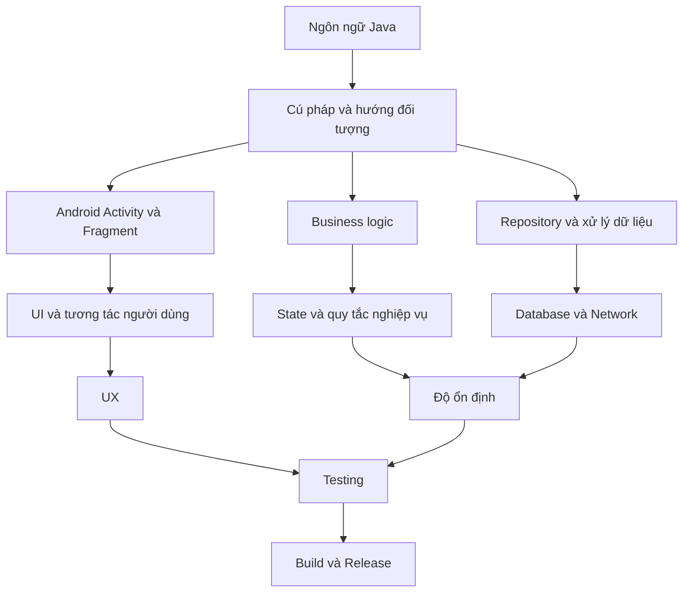
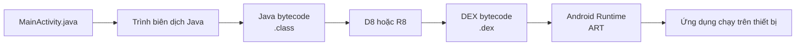
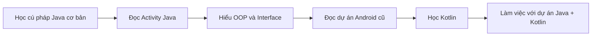
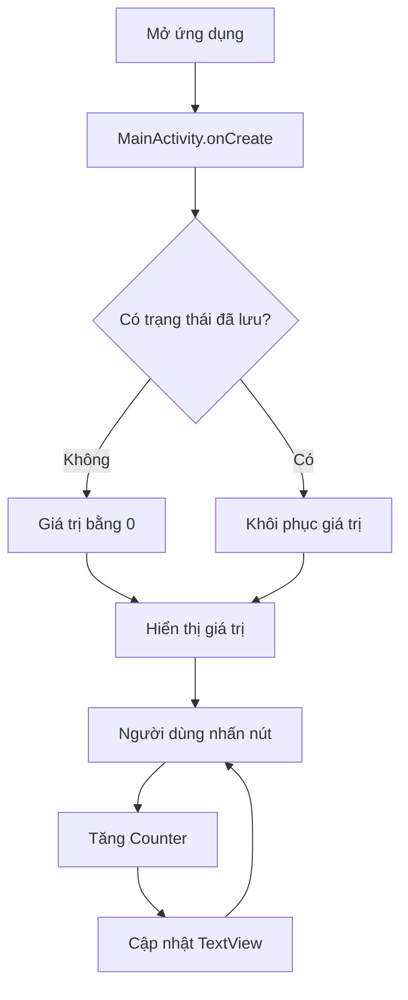
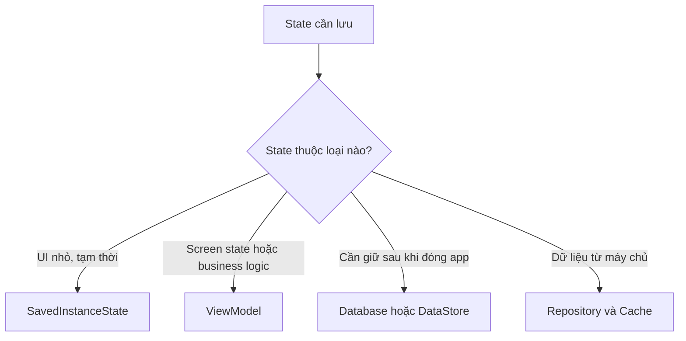

# 002 - Java

| Thông tin               | Nội dung                          |
| ----------------------- | --------------------------------- |
| **Học phần**            | 01 - Nền tảng ngôn ngữ và Android |
| **Module**              | Module 01 - Chọn ngôn ngữ         |
| **Nhóm nội dung**       | Lựa chọn ngôn ngữ                 |
| **Nguồn roadmap**       | Pick a Language / Language Choice |
| **Loại bài**            | Bài học                           |
| **Thứ tự trong module** | 002                               |
| **Thời lượng gợi ý**    | 24 phút                           |

---

## 1. Tổng quan

Java là một ngôn ngữ lập trình hướng đối tượng đã được sử dụng để phát triển ứng dụng Android trong nhiều năm. Hiện nay, hệ sinh thái Android áp dụng định hướng **Kotlin-first**: công cụ, thư viện Jetpack, tài liệu và ví dụ mới thường được thiết kế ưu tiên Kotlin. Tuy nhiên, Android vẫn tiếp tục hỗ trợ việc gọi các API từ Java.

Vì vậy, một Android Developer mới vẫn nên đọc và hiểu Java để:

* Bảo trì các dự án Android cũ.
* Đọc mã nguồn của thư viện hoặc SDK viết bằng Java.
* Hiểu các khái niệm hướng đối tượng như lớp, kế thừa và interface.
* Làm việc trong dự án sử dụng đồng thời Java và Kotlin.
* Chuyển đổi dần một dự án Java sang Kotlin.

Android Studio hỗ trợ chỉnh sửa, biên dịch, kiểm thử và gỡ lỗi mã nguồn Java trong dự án Android.

---

## 2. Hình ảnh minh họa

### 2.1. OpenJDK và Java


*Nguồn ảnh: [OpenJDK logo – Wikimedia Commons](https://commons.wikimedia.org/wiki/File:OpenJDK_logo.svg).*

### 2.2. Android Studio


*Nguồn ảnh: [Android Studio icon 2023 – Wikimedia Commons](https://commons.wikimedia.org/wiki/File:Android_Studio_icon_%282023%29.svg).*

### 2.3. Cú pháp Java


*Nguồn ảnh: [Java keywords highlighted – Wikimedia Commons](https://commons.wikimedia.org/wiki/File:Java_keywords_highlighted.svg).*

---

## 3. Mục tiêu học tập

Sau khi hoàn thành bài học, bạn có thể:

* Giải thích vai trò của Java trong phát triển Android.
* Đọc được cấu trúc cơ bản của một tệp Java.
* Nhận biết lớp, đối tượng, kế thừa, interface và đóng gói.
* Hiểu cách một `Activity` Java kết nối với giao diện XML.
* Xử lý một trạng thái giao diện đơn giản khi màn hình bị xoay.
* Viết một unit test nhỏ cho logic Java.
* Phân tích ảnh hưởng của Java đến UX, độ ổn định và khả năng bảo trì.
* Tạo một ứng dụng nhỏ làm sản phẩm portfolio.

---

## 4. Java trong Android Developer Roadmap

Java thuộc lớp **nền tảng ngôn ngữ**. Nó không trực tiếp quyết định giao diện đẹp hay xấu, nhưng ảnh hưởng đến cách lập trình viên xây dựng toàn bộ ứng dụng.



Java có thể xuất hiện trong hầu hết các phần của một ứng dụng Android:

| Thành phần  | Java được sử dụng như thế nào?                             |
| ----------- | ---------------------------------------------------------- |
| UI          | Xử lý sự kiện nhấn nút, nhập liệu và cập nhật `View`       |
| Lifecycle   | Xử lý `onCreate()`, `onStart()`, `onStop()`                |
| State       | Lưu và khôi phục trạng thái màn hình                       |
| Data        | Xây dựng model, repository và database                     |
| Network     | Gửi request và xử lý response                              |
| Testing     | Viết unit test hoặc instrumented test                      |
| Build       | Biên dịch mã Java thành định dạng có thể chạy trên Android |
| Maintenance | Đọc và sửa những dự án Android cũ                          |

---

## 5. Ghi chú năm dòng về Java

> 1. Java là ngôn ngữ lập trình hướng đối tượng có kiểu dữ liệu tĩnh.
> 2. Java từng là ngôn ngữ chính để phát triển ứng dụng Android.
> 3. Android hiện ưu tiên Kotlin cho dự án mới nhưng vẫn hỗ trợ Java.
> 4. Lập trình viên Android cần đọc được Java để bảo trì mã cũ và sử dụng thư viện.
> 5. Java giúp người học hiểu lớp, interface, kế thừa, trạng thái và cấu trúc ứng dụng.

---

## 6. Java được chạy trên Android như thế nào?

Mã Java trong dự án Android không được chạy trực tiếp giống một chương trình Java desktop thông thường. Quá trình build sẽ chuyển Java bytecode thành **DEX bytecode**, sau đó Android Runtime thực thi mã DEX trên thiết bị. Công cụ D8 của Android đảm nhiệm việc chuyển Java bytecode sang DEX.



### Ý nghĩa thực tế

* File `.java` chứa mã nguồn mà lập trình viên viết.
* Mã nguồn được biên dịch thành Java bytecode.
* D8 chuyển Java bytecode thành DEX.
* DEX được đóng gói trong APK hoặc Android App Bundle.
* Android Runtime chạy mã DEX trên thiết bị.

Android hỗ trợ nhiều tính năng và API Java mới thông qua quá trình **desugaring**, giúp một số tính năng Java hoạt động trên những phiên bản Android cũ hơn.

---

## 7. Các khái niệm Java cần biết khi học Android

### 7.1. Lớp và đối tượng

Lớp mô tả cấu trúc và hành vi của một loại đối tượng.

```java
public class User {
    private final String name;

    public User(String name) {
        this.name = name;
    }

    public String getName() {
        return name;
    }
}
```

Tạo một đối tượng từ lớp:

```java
User user = new User("An");
String name = user.getName();
```

---

### 7.2. Đóng gói

Thuộc tính thường được đặt là `private` để không cho phần khác của ứng dụng thay đổi trực tiếp.

```java
public final class Counter {

    private int value = 0;

    public int getValue() {
        return value;
    }

    public int increment() {
        value++;
        return value;
    }
}
```

Đóng gói giúp:

* Kiểm soát cách dữ liệu được thay đổi.
* Giảm lỗi do sửa dữ liệu tùy tiện.
* Làm cho mã dễ kiểm thử.
* Dễ thay đổi cách triển khai bên trong lớp.

---

### 7.3. Kế thừa

Trong Android, một `Activity` Java thường kế thừa từ một lớp Activity của AndroidX.

```java
public class MainActivity extends AppCompatActivity {
}
```

Ở đây:

* `MainActivity` là lớp con.
* `AppCompatActivity` là lớp cha.
* `MainActivity` được thừa hưởng các chức năng lifecycle và quản lý giao diện.

---

### 7.4. Ghi đè phương thức

Annotation `@Override` cho biết lớp con đang cung cấp cách triển khai mới cho phương thức của lớp cha.

```java
@Override
protected void onCreate(Bundle savedInstanceState) {
    super.onCreate(savedInstanceState);
}
```

`onCreate()` là một callback lifecycle được Android gọi khi tạo một instance của Activity.

---

### 7.5. Interface

Interface mô tả một tập hợp hành vi mà lớp khác có thể triển khai.

Ví dụ, sự kiện nhấn nút sử dụng `View.OnClickListener`:

```java
button.setOnClickListener(new View.OnClickListener() {
    @Override
    public void onClick(View view) {
        // Xử lý khi người dùng nhấn nút
    }
});
```

Có thể viết ngắn hơn bằng lambda:

```java
button.setOnClickListener(view -> {
    // Xử lý khi người dùng nhấn nút
});
```

---

### 7.6. Null trong Java

Một biến tham chiếu Java có thể chứa `null`.

```java
User currentUser = null;
```

Nếu gọi phương thức trên biến đang là `null`, ứng dụng có thể gặp `NullPointerException`.

```java
// Có thể gây lỗi
String name = currentUser.getName();
```

Cần kiểm tra trước khi sử dụng:

```java
if (currentUser != null) {
    String name = currentUser.getName();
}
```

Quản lý `null` không tốt có thể làm ứng dụng crash, làm gián đoạn user flow và giảm độ tin cậy của sản phẩm.

---

## 8. Java và Kotlin trong Android

Android hiện ưu tiên Kotlin khi xây dựng công cụ, tài liệu, thư viện và nội dung đào tạo mới. Tuy nhiên, phần lớn API Android vẫn có thể được gọi từ Java, đồng thời Kotlin và Java có khả năng tương tác với nhau trong cùng một dự án.

| Tiêu chí           | Java                                | Kotlin                                    |
| ------------------ | ----------------------------------- | ----------------------------------------- |
| Vị trí hiện tại    | Quan trọng với dự án cũ và thư viện | Được ưu tiên cho dự án Android mới        |
| Độ dài mã          | Thường dài hơn                      | Thường ngắn gọn hơn                       |
| Null safety        | Chủ yếu do lập trình viên kiểm soát | Có cơ chế null safety trong hệ thống kiểu |
| Hướng đối tượng    | Hỗ trợ đầy đủ                       | Hỗ trợ đầy đủ                             |
| Android API        | Được hỗ trợ                         | Được hỗ trợ và ưu tiên                    |
| Dự án hỗn hợp      | Có thể gọi Kotlin                   | Có thể gọi Java                           |
| Giá trị với junior | Cần đọc và sửa được                 | Nên dùng để phát triển tính năng mới      |

### Chiến lược học hợp lý



Bạn không nhất thiết phải thành chuyên gia Java trước khi học Kotlin. Mục tiêu phù hợp với Junior Android Developer là:

* Đọc hiểu Java tương đối thoải mái.
* Sửa được lỗi cơ bản.
* Viết được class, interface và unit test.
* Hiểu cách Java tương tác với Android lifecycle.
* Có thể chuyển một class Java nhỏ sang Kotlin.

Android Studio có hỗ trợ thêm Kotlin vào dự án hiện có và chuyển đổi mã Java sang Kotlin.

---

## 9. Thực hành: ứng dụng Java Counter

### 9.1. Yêu cầu

Xây dựng một màn hình gồm:

* Một dòng hiển thị số lần nhấn.
* Một nút **Tăng**.
* Mỗi lần nhấn, giá trị tăng thêm một.
* Khi xoay màn hình, giá trị không bị mất.

### 9.2. Luồng hoạt động



---

### 9.3. Cấu trúc thư mục

```text
app/
└── src/
    ├── main/
    │   ├── java/com/example/javacounter/
    │   │   ├── MainActivity.java
    │   │   └── Counter.java
    │   └── res/layout/
    │       └── activity_main.xml
    └── test/java/com/example/javacounter/
        └── CounterTest.java
```

---

### 9.4. Giao diện `activity_main.xml`

```xml
<?xml version="1.0" encoding="utf-8"?>
<LinearLayout
    xmlns:android="http://schemas.android.com/apk/res/android"
    android:layout_width="match_parent"
    android:layout_height="match_parent"
    android:orientation="vertical"
    android:gravity="center"
    android:padding="24dp">

    <TextView
        android:id="@+id/textCount"
        android:layout_width="wrap_content"
        android:layout_height="wrap_content"
        android:text="Số lần nhấn: 0"
        android:textSize="24sp"
        android:layout_marginBottom="24dp" />

    <Button
        android:id="@+id/buttonIncrement"
        android:layout_width="wrap_content"
        android:layout_height="wrap_content"
        android:text="Tăng" />

</LinearLayout>
```

---

### 9.5. Lớp `Counter.java`

```java
package com.example.javacounter;

public final class Counter {

    private int value = 0;

    public int getValue() {
        return value;
    }

    public int increment() {
        value++;
        return value;
    }

    public void restore(int restoredValue) {
        value = Math.max(0, restoredValue);
    }
}
```

Lớp này không phụ thuộc vào Android Framework nên có thể được kiểm thử bằng unit test thông thường.

---

### 9.6. `MainActivity.java`

```java
package com.example.javacounter;

import android.os.Bundle;
import android.widget.Button;
import android.widget.TextView;

import androidx.annotation.NonNull;
import androidx.appcompat.app.AppCompatActivity;

public class MainActivity extends AppCompatActivity {

    private static final String KEY_COUNT = "key_count";

    private final Counter counter = new Counter();
    private TextView textCount;

    @Override
    protected void onCreate(Bundle savedInstanceState) {
        super.onCreate(savedInstanceState);
        setContentView(R.layout.activity_main);

        textCount = findViewById(R.id.textCount);
        Button buttonIncrement = findViewById(R.id.buttonIncrement);

        if (savedInstanceState != null) {
            int restoredCount = savedInstanceState.getInt(KEY_COUNT, 0);
            counter.restore(restoredCount);
        }

        renderCount();

        buttonIncrement.setOnClickListener(view -> {
            counter.increment();
            renderCount();
        });
    }

    private void renderCount() {
        String message = getString(
                R.string.count_message,
                counter.getValue()
        );

        textCount.setText(message);
    }

    @Override
    protected void onSaveInstanceState(@NonNull Bundle outState) {
        outState.putInt(KEY_COUNT, counter.getValue());
        super.onSaveInstanceState(outState);
    }
}
```

---

### 9.7. Thêm string resource

Trong `res/values/strings.xml`:

```xml
<resources>
    <string name="app_name">Java Counter</string>
    <string name="count_message">Số lần nhấn: %1$d</string>
</resources>
```

Không nên ghép chuỗi hiển thị trực tiếp trong Java như sau:

```java
textCount.setText("Số lần nhấn: " + counter.getValue());
```

Đưa nội dung vào `strings.xml` giúp:

* Dễ dịch ứng dụng sang ngôn ngữ khác.
* Tập trung quản lý nội dung UI.
* Giảm hard-code.
* Dễ kiểm tra và bảo trì.

---

## 10. Lifecycle và trạng thái màn hình

Một lỗi phổ biến là cho rằng mọi biến trong `Activity` sẽ tồn tại cho đến khi người dùng đóng ứng dụng.

Thực tế, Android có thể hủy và tạo lại Activity khi:

* Người dùng xoay màn hình.
* Chuyển sang chế độ nhiều cửa sổ.
* Hệ thống thay đổi cấu hình.
* Tiến trình ứng dụng bị hủy để giải phóng bộ nhớ.

Người dùng thường kỳ vọng trạng thái giao diện vẫn được giữ sau khi xoay màn hình. Android cung cấp saved instance state để lưu trạng thái UI nhỏ, còn những state phức tạp hơn thường được quản lý bằng `ViewModel` hoặc lớp state phù hợp.

### Trường hợp không lưu state

```java
public class MainActivity extends AppCompatActivity {

    private int count = 0;
}
```

Khi Activity bị tạo lại, `count` trở về `0`.

### Trường hợp có lưu state

```java
@Override
protected void onSaveInstanceState(@NonNull Bundle outState) {
    outState.putInt("count", count);
    super.onSaveInstanceState(outState);
}
```

Khôi phục trong `onCreate()`:

```java
if (savedInstanceState != null) {
    count = savedInstanceState.getInt("count", 0);
}
```

---

## 11. Unit test cho logic Java

Tạo file `CounterTest.java` trong thư mục `src/test/java`.

```java
package com.example.javacounter;

import static org.junit.Assert.assertEquals;

import org.junit.Test;

public class CounterTest {

    @Test
    public void initialValue_isZero() {
        Counter counter = new Counter();

        assertEquals(0, counter.getValue());
    }

    @Test
    public void increment_increasesValueByOne() {
        Counter counter = new Counter();

        counter.increment();

        assertEquals(1, counter.getValue());
    }

    @Test
    public void restore_negativeValue_usesZero() {
        Counter counter = new Counter();

        counter.restore(-10);

        assertEquals(0, counter.getValue());
    }

    @Test
    public void restore_positiveValue_restoresValue() {
        Counter counter = new Counter();

        counter.restore(7);

        assertEquals(7, counter.getValue());
    }
}
```

Android Studio hỗ trợ tạo, chạy và xem kết quả test trực tiếp trong IDE. Một dự án Android thường có test chạy trên máy phát triển và instrumented test chạy trên thiết bị hoặc emulator.

---

## 12. Lỗi phổ biến của Junior Android Developer

### Lỗi: chỉ lưu state trong biến của Activity

```java
private int selectedItem = 0;
```

Lập trình viên kiểm thử bằng cách nhấn nút và thấy ứng dụng hoạt động nên cho rằng tính năng đã hoàn thành. Tuy nhiên, khi xoay màn hình, Activity được tạo lại và giá trị trở về mặc định.

### Hậu quả

* Người dùng mất dữ liệu đang thao tác.
* Form có thể bị reset.
* Danh sách quay lại vị trí ban đầu.
* Bước hiện tại trong một quy trình bị mất.
* UX thiếu ổn định và gây khó chịu.

### Cách sửa

Phân loại state trước khi lựa chọn nơi lưu:



Không nên đưa toàn bộ dữ liệu lớn vào `Bundle`. `Bundle` phù hợp hơn với trạng thái nhỏ, có thể tuần tự hóa và cần để tái tạo giao diện.

---

## 13. Ảnh hưởng đến chất lượng sản phẩm

### 13.1. UX

Java không trực tiếp tạo ra thiết kế giao diện, nhưng mã Java xử lý sự kiện và state có thể tác động mạnh đến trải nghiệm.

Ví dụ:

* Nút phản hồi chậm vì xử lý nặng trên main thread.
* Form bị reset sau khi xoay màn hình.
* Ứng dụng crash do `NullPointerException`.
* Người dùng nhấn nhiều lần và gửi request trùng lặp.

---

### 13.2. Độ ổn định

Java có thể tạo ra lỗi runtime khi:

* Không kiểm tra `null`.
* Ép kiểu sai.
* Truy cập phần tử ngoài phạm vi.
* Giữ tham chiếu đến Activity quá lâu.
* Không xử lý đầy đủ trạng thái lifecycle.
* Thực hiện network hoặc database trên main thread.

---

### 13.3. Khả năng bảo trì

Mã Java dễ bảo trì hơn khi:

* Lớp có một trách nhiệm rõ ràng.
* Business logic không đặt toàn bộ trong Activity.
* Dữ liệu được đóng gói.
* Tên biến và tên phương thức thể hiện đúng mục đích.
* Chuỗi UI nằm trong resource.
* Có unit test cho logic quan trọng.
* Method ngắn và ít side effect.

Ví dụ cấu trúc khó bảo trì:

```text
MainActivity
├── Cập nhật UI
├── Gọi API
├── Parse JSON
├── Truy vấn database
├── Kiểm tra đăng nhập
├── Tính toán nghiệp vụ
└── Điều hướng
```

Cấu trúc tốt hơn:

```text
MainActivity
├── Hiển thị UI
└── Chuyển sự kiện đến ViewModel

ViewModel
├── Quản lý screen state
└── Gọi use case hoặc repository

Repository
├── Network
├── Database
└── Cache
```

---

## 14. Java–Kotlin interoperability

Một dự án Android có thể chứa đồng thời:

```text
app/src/main/
└── java/com/example/app/
    ├── MainActivity.kt
    ├── LegacyParser.java
    ├── UserRepository.kt
    └── PaymentSdkAdapter.java
```

Mặc dù thư mục thường có tên `java`, nó có thể chứa cả mã Java và Kotlin.

### Kotlin gọi Java

```java
public class GreetingService {

    public String createGreeting(String name) {
        return "Hello, " + name;
    }
}
```

```kotlin
val service = GreetingService()
val message = service.createGreeting("An")
```

### Java gọi Kotlin

```kotlin
class PriceCalculator {
    fun calculate(price: Double, quantity: Int): Double {
        return price * quantity
    }
}
```

```java
PriceCalculator calculator = new PriceCalculator();
double total = calculator.calculate(25.0, 3);
```

Khi thiết kế API dùng chung giữa Java và Kotlin, cần chú ý tên phương thức, kiểu null, overload và cách API được gọi từ cả hai ngôn ngữ. Android cung cấp hướng dẫn riêng cho Kotlin–Java interoperability.

---

## 15. Bài thực hành 24 phút

| Thời gian | Hoạt động                                  |
| --------: | ------------------------------------------ |
|    3 phút | Đọc tổng quan về vai trò của Java          |
|    5 phút | Ôn class, object, inheritance và interface |
|    8 phút | Tạo ứng dụng Java Counter                  |
|    4 phút | Lưu state khi xoay màn hình                |
|    2 phút | Chạy unit test                             |
|    2 phút | Viết README và chụp ảnh kết quả            |

### Các bước thực hiện

1. Tạo một Android project sử dụng Java và XML Views.
2. Thêm `TextView` và `Button`.
3. Tạo lớp `Counter`.
4. Kết nối `MainActivity` với giao diện.
5. Cập nhật số lần nhấn.
6. Lưu giá trị bằng `onSaveInstanceState()`.
7. Xoay emulator để kiểm tra state.
8. Viết unit test cho `Counter`.
9. Chụp ảnh màn hình ứng dụng.
10. Viết README ngắn.

---

## 16. Bài tập

### Bài tập chính: Java Counter Plus

Mở rộng ứng dụng với ba nút:

* **Tăng**
* **Giảm**
* **Đặt lại**

### Yêu cầu chức năng

* Không cho giá trị nhỏ hơn `0`.
* Giữ giá trị khi xoay màn hình.
* Đưa toàn bộ chuỗi hiển thị vào `strings.xml`.
* Viết unit test cho các trường hợp tăng, giảm và đặt lại.
* Viết một đoạn giải thích Java ảnh hưởng đến UX và maintainability như thế nào.

### Yêu cầu mở rộng

* Đổi màu nội dung khi giá trị lớn hơn `10`.
* Vô hiệu hóa nút giảm khi giá trị bằng `0`.
* Lưu giá trị để vẫn còn sau khi đóng và mở lại ứng dụng.
* Chuyển lớp `Counter.java` sang Kotlin và so sánh hai phiên bản.

---

## 17. Artifact đưa vào portfolio

Tạo repository:

```text
android-java-counter
```

Repository nên có:

```text
android-java-counter/
├── app/
├── screenshots/
│   ├── counter-zero.png
│   ├── counter-incremented.png
│   └── counter-after-rotation.png
├── README.md
└── LICENSE
```

### Nội dung README gợi ý

```markdown
# Android Java Counter

Ứng dụng Android nhỏ được viết bằng Java nhằm minh họa:

- Class và encapsulation trong Java.
- Xử lý sự kiện nhấn nút.
- Android Activity lifecycle.
- Lưu và khôi phục UI state.
- Unit testing với JUnit.

## Tính năng

- Tăng giá trị bộ đếm.
- Giữ giá trị sau khi xoay màn hình.
- Tách business logic khỏi Activity.
- Có unit test cho lớp Counter.

## Công nghệ

- Java
- Android XML Views
- AndroidX AppCompat
- JUnit
```

### Điểm nên trình bày khi phỏng vấn

> Em tách logic bộ đếm khỏi Activity thành một lớp Java độc lập để có thể unit test. Em sử dụng saved instance state để tránh mất giá trị khi Activity bị tạo lại do configuration change. Qua bài này, em hiểu rằng một tính năng hoạt động trong trường hợp bình thường chưa đủ; cần kiểm tra lifecycle và state để đảm bảo trải nghiệm người dùng ổn định.

---

## 18. Checklist kiểm thử

### Chức năng

* [ ] Giá trị ban đầu bằng `0`.
* [ ] Nhấn nút một lần làm giá trị tăng thành `1`.
* [ ] Nhấn nhiều lần cho kết quả chính xác.
* [ ] Không xảy ra crash khi thao tác nhanh.
* [ ] Chuỗi hiển thị đúng ngôn ngữ.

### Lifecycle và state

* [ ] Giá trị không mất khi xoay màn hình.
* [ ] Giá trị đúng khi chuyển app sang background rồi quay lại.
* [ ] Không lưu dữ liệu quá lớn trong `Bundle`.
* [ ] Không giữ tham chiếu Activity trong đối tượng sống quá lâu.

### Testing

* [ ] Có test cho giá trị ban đầu.
* [ ] Có test cho thao tác tăng.
* [ ] Có test cho dữ liệu khôi phục.
* [ ] Tất cả unit test đều chạy thành công.

### Maintainability

* [ ] Business logic không nằm hoàn toàn trong Activity.
* [ ] Không hard-code chuỗi UI trong Java.
* [ ] Tên class và method rõ ràng.
* [ ] Không có method quá dài.
* [ ] README giải thích được quyết định kỹ thuật.

---

## 19. Checklist hoàn thành bài học

* [ ] Giải thích được Java bằng ngôn ngữ của bản thân.
* [ ] Biết vì sao Java vẫn quan trọng với Android Developer.
* [ ] Hiểu class, object, inheritance và interface.
* [ ] Đọc được một `MainActivity.java` cơ bản.
* [ ] Tạo được ứng dụng Java Counter.
* [ ] Xử lý được state khi xoay màn hình.
* [ ] Viết được ít nhất một unit test.
* [ ] Ghi lại một lỗi phổ biến của Junior Developer.
* [ ] Có screenshot hoặc GIF minh họa ứng dụng.
* [ ] Có repository hoặc README để đưa vào portfolio.

---

## 20. Ghi chú khi đưa vào production

Trước khi đưa một tính năng Java lên production, cần trả lời các câu hỏi sau:

### User flow

* Người dùng bắt đầu và kết thúc luồng ở đâu?
* Nhấn nút nhiều lần có tạo hành động trùng lặp không?
* Khi có lỗi, người dùng có thể tiếp tục hay thử lại không?

### State và lifecycle

* State có bị mất khi xoay màn hình không?
* Chuyển sang background rồi quay lại có hiển thị đúng không?
* Process bị hệ thống hủy có thể khôi phục màn hình không?

### Network và storage

* Có timeout và xử lý lỗi mạng không?
* Có thực hiện tác vụ nặng trên main thread không?
* Dữ liệu cục bộ có thể bị hỏng hoặc hết hạn không?

### Testing

* Business logic quan trọng đã có unit test chưa?
* Luồng chính đã được kiểm thử trên emulator hoặc thiết bị thật chưa?
* Đã kiểm tra nhiều kích thước màn hình chưa?

### Release

* Debug log có chứa dữ liệu nhạy cảm không?
* Build release có thành công không?
* R8 có làm lỗi reflection hoặc serialization không?
* Có kế hoạch theo dõi crash sau khi phát hành không?

---

## 21. Câu hỏi ôn tập

1. Vì sao Junior Android Developer vẫn cần đọc được Java?
2. `extends AppCompatActivity` thể hiện khái niệm Java nào?
3. `@Override` có ý nghĩa gì?
4. Vì sao một biến trong Activity có thể mất khi xoay màn hình?
5. Khi nào nên dùng saved instance state?
6. Business logic nên đặt trong Activity hay lớp riêng?
7. Java bytecode được chuyển sang định dạng nào để chạy trên Android?
8. Kotlin và Java có thể cùng tồn tại trong một dự án không?
9. Lỗi `NullPointerException` ảnh hưởng đến UX như thế nào?
10. Artifact nào có thể dùng để chứng minh bạn đã hiểu bài?

---

## 22. Kết luận

Java không còn là lựa chọn được ưu tiên cho phần lớn dự án Android mới, nhưng vẫn là một kỹ năng thực tế đối với Android Developer.

Mục tiêu của người mới không phải là ghi nhớ toàn bộ Java API. Bạn cần đạt khả năng:

* Đọc hiểu mã Java.
* Nhận biết cấu trúc hướng đối tượng.
* Sửa lỗi trong dự án cũ.
* Xử lý lifecycle và state đúng cách.
* Viết test cho logic Java.
* Làm việc trong codebase sử dụng cả Java và Kotlin.

Một ứng dụng Counter nhỏ có lưu state và unit test là artifact đủ tốt để chứng minh những kiến thức nền tảng này.

---

## 23. Tài liệu tham khảo

* [Android Kotlin-first approach](https://developer.android.com/kotlin/first)
* [Kotlin–Java interoperability guide](https://developer.android.com/kotlin/interop)
* [Thêm Kotlin vào ứng dụng hiện có](https://developer.android.com/kotlin/add-kotlin)
* [Android Activity lifecycle](https://developer.android.com/guide/components/activities/activity-lifecycle)
* [Lưu UI state với Views](https://developer.android.com/topic/libraries/architecture/views/saving-states-views)
* [D8 compiler](https://developer.android.com/tools/d8)
* [Hỗ trợ tính năng Java 8+](https://developer.android.com/studio/write/java8-support)
* [Kiểm thử ứng dụng trong Android Studio](https://developer.android.com/studio/test)
* [View Binding](https://developer.android.com/topic/libraries/view-binding)

---

# Bài luyện tập

## Mục tiêu


## Đề bài


## Yêu cầu hoàn thành

- [ ] 
- [ ] 
- [ ] 

## Kết quả / lời giải


## Ghi chú
