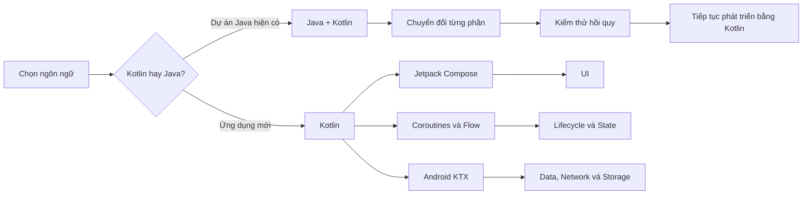
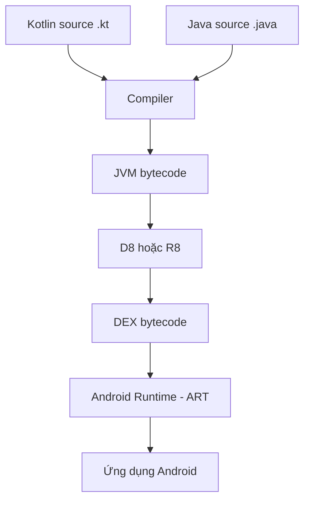
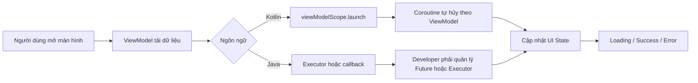
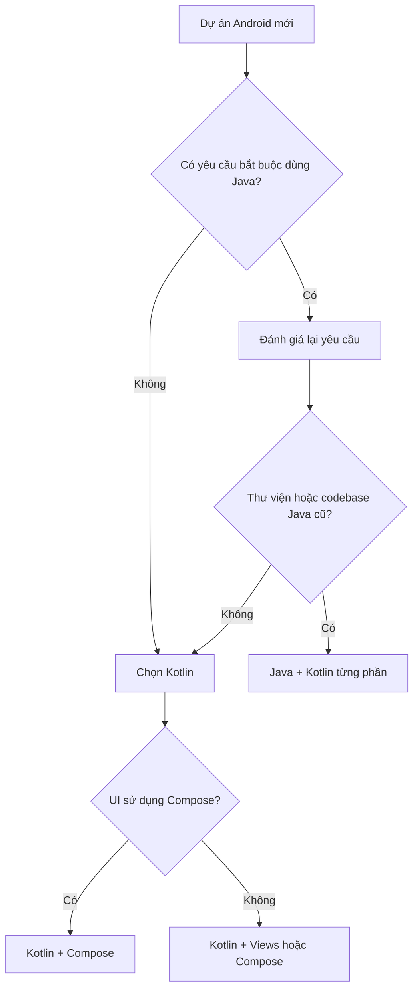
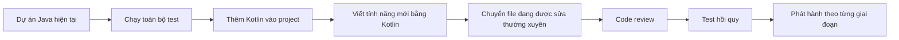
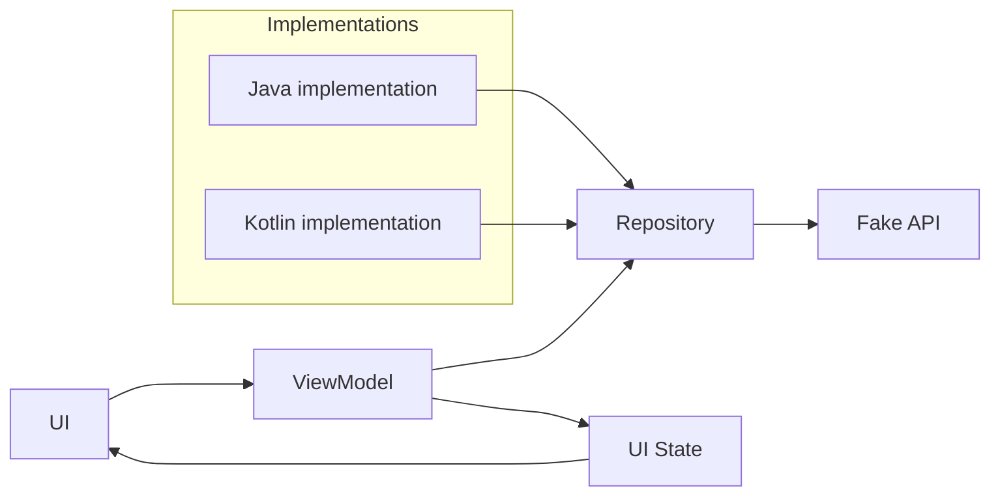

# 003 — Kotlin vs Java for Android

**Học phần:** 01 — Language and Android Fundamentals
**Module:** Module 01 — Pick a Language
**Nhóm nội dung:** Language Choice
**Nguồn roadmap:** Pick a Language / Language Choice
**Loại bài:** Lesson
**Thứ tự trong module:** 003
**Thời lượng gợi ý:** 24 phút

---

## 1. Tóm tắt

Bài học này so sánh **Kotlin và Java trong phát triển Android**, không chỉ ở cú pháp mà còn xét đến:

* Khả năng xây dựng UI hiện đại.
* Quản lý lifecycle và state.
* Xử lý bất đồng bộ, network và database.
* Độ an toàn trước lỗi `null`.
* Khả năng bảo trì code.
* Chiến lược áp dụng trong dự án Java cũ.
* Ảnh hưởng đến testing, debugging và release.

Android hiện đi theo hướng **Kotlin-first**. Kotlin được tích hợp trực tiếp vào tài liệu, Android Studio, Jetpack và các API Android hiện đại. Tuy nhiên, Java vẫn được hỗ trợ và hai ngôn ngữ có thể tồn tại trong cùng một dự án.

> **Kết luận nhanh:**
> Với một ứng dụng Android mới, nên chọn **Kotlin**.
> Với dự án Java cũ, nên chuyển đổi dần thay vì viết lại toàn bộ.

---

## 2. Mục tiêu học tập

Sau bài học, bạn có thể:

* Giải thích được sự khác nhau giữa Kotlin và Java trên Android.
* Chọn ngôn ngữ phù hợp cho dự án mới hoặc dự án legacy.
* Nhận biết ảnh hưởng của ngôn ngữ đến UX, reliability và maintainability.
* Viết cùng một chức năng đơn giản bằng Kotlin và Java.
* Hiểu cách Kotlin và Java cùng tồn tại trong một project.
* Tránh những lỗi phổ biến khi chuyển từ Java sang Kotlin.
* Xây dựng một artifact nhỏ để đưa vào portfolio.

---

## 3. Vị trí trong Android Developer Roadmap



Lựa chọn ngôn ngữ ảnh hưởng đến gần như toàn bộ các phần phía sau của roadmap:

| Thành phần  | Ảnh hưởng của lựa chọn ngôn ngữ                          |
| ----------- | -------------------------------------------------------- |
| UI          | Compose được thiết kế theo các idiom của Kotlin          |
| Lifecycle   | Kotlin hỗ trợ coroutine scope gắn với lifecycle          |
| State       | Kotlin có `data class`, sealed type, Flow và StateFlow   |
| Network     | Coroutines giúp viết luồng bất đồng bộ tuần tự hơn       |
| Database    | Room hỗ trợ cả hai nhưng API Kotlin thường ngắn gọn hơn  |
| Testing     | Kotlin giảm boilerplate nhưng cần hiểu coroutine testing |
| Maintenance | Kotlin thường cần ít code lặp hơn                        |
| Legacy      | Java vẫn quan trọng khi bảo trì codebase cũ              |

Theo tài liệu Android hiện tại, hệ sinh thái UI mới theo hướng **Compose-first**. Compose sử dụng mạnh các tính năng như lambda, higher-order function, delegated property và coroutine của Kotlin.

---

## 4. Kotlin và Java chạy trên Android như thế nào?

Kotlin không thay thế Android Runtime bằng một runtime hoàn toàn khác. Code Kotlin và Java đều được xử lý thành bytecode, sau đó chuyển thành định dạng DEX để chạy trên Android.



Nhờ khả năng tương tác giữa Kotlin và Java:

* Kotlin có thể gọi class hoặc method viết bằng Java.
* Java có thể gọi phần lớn class hoặc method viết bằng Kotlin.
* Một module có thể chứa cả file `.java` và `.kt`.
* Dự án có thể được chuyển đổi dần theo từng file hoặc từng tính năng.

Android Studio cũng có công cụ chuyển file Java sang Kotlin bằng lệnh:

```text
Code → Convert Java File to Kotlin File
```

Khả năng chuyển đổi và tích hợp từng phần được hỗ trợ chính thức trong Android Studio.

---

## 5. Bảng so sánh Kotlin và Java

| Tiêu chí                    | Kotlin                                | Java                                                       |
| --------------------------- | ------------------------------------- | ---------------------------------------------------------- |
| Định hướng Android hiện đại | Ngôn ngữ được ưu tiên                 | Vẫn được hỗ trợ                                            |
| Cú pháp                     | Ngắn gọn, biểu đạt cao                | Tường minh nhưng nhiều boilerplate                         |
| Null safety                 | Có trong type system                  | Chủ yếu dựa vào kiểm tra thủ công và annotation            |
| Data model                  | Có `data class`                       | Thường phải viết constructor, getter, `equals`, `hashCode` |
| Bất đồng bộ                 | Coroutines, Flow                      | Thread, Executor, Future, callback hoặc reactive library   |
| Jetpack Compose             | Phù hợp tự nhiên                      | Không phải lựa chọn thực tế cho Compose                    |
| Extension function          | Có                                    | Không có trực tiếp                                         |
| Smart cast                  | Có                                    | Thường phải ép kiểu thủ công                               |
| Checked exception           | Không bắt buộc khai báo               | Có checked exception                                       |
| Interoperability            | Gọi được Java                         | Gọi được Kotlin với một số lưu ý                           |
| Dự án legacy                | Dễ thêm dần vào codebase Java         | Phù hợp với code cũ đã ổn định                             |
| Độ dài code                 | Thường ngắn hơn                       | Thường dài hơn                                             |
| Learning curve              | Nhiều tính năng hiện đại cần làm quen | Cú pháp tường minh, phổ biến trong giáo dục                |
| Tooling Android             | Được Android Studio hỗ trợ trực tiếp  | Ổn định và trưởng thành                                    |

Kotlin đưa nullability vào hệ thống kiểu, hỗ trợ function type, read-only collection interface và nhiều tính năng nhằm giải quyết các vấn đề thường gặp trong Java.

---

## 6. Ví dụ 1: Model dữ liệu

Giả sử ứng dụng nhận thông tin người dùng từ API. Tên người dùng có thể bị thiếu.

### 6.1. Java

```java
public final class User {
    private final long id;
    private final String displayName;

    public User(long id, String displayName) {
        this.id = id;
        this.displayName = displayName;
    }

    public long getId() {
        return id;
    }

    public String getDisplayName() {
        return displayName;
    }

    @Override
    public String toString() {
        return "User{" +
                "id=" + id +
                ", displayName='" + displayName + '\'' +
                '}';
    }
}
```

### 6.2. Kotlin

```kotlin
data class User(
    val id: Long,
    val displayName: String?
)
```

`data class` tự sinh các thành phần thường dùng như:

* `equals()`
* `hashCode()`
* `toString()`
* `copy()`
* Component functions để destructuring

### 6.3. Ảnh hưởng đến maintainability

Kotlin giúp giảm số lượng code cần bảo trì. Tuy nhiên, ít code hơn không đồng nghĩa với code luôn dễ hiểu hơn. Việc lạm dụng scope function, operator hoặc extension function vẫn có thể khiến dự án khó đọc.

---

## 7. Ví dụ 2: Xử lý giá trị null

### Yêu cầu

Nếu tên người dùng:

* Có giá trị hợp lệ: hiển thị tên.
* Bị `null`, rỗng hoặc chỉ có khoảng trắng: hiển thị `"Khách"`.

### 7.1. Java

```java
public static String getDisplayName(User user) {
    String name = user.getDisplayName();

    if (name == null || name.trim().isEmpty()) {
        return "Khách";
    }

    return name.trim();
}
```

### 7.2. Kotlin

```kotlin
fun getDisplayName(user: User): String {
    return user.displayName
        ?.trim()
        ?.takeIf { it.isNotEmpty() }
        ?: "Khách"
}
```

Có thể viết ngắn hơn:

```kotlin
fun getDisplayName(user: User): String =
    user.displayName
        ?.trim()
        ?.takeIf(String::isNotEmpty)
        ?: "Khách"
```

### 7.3. Ý nghĩa của các toán tử Kotlin

| Cú pháp     | Ý nghĩa                                         |
| ----------- | ----------------------------------------------- |
| `String?`   | Giá trị có thể là `null`                        |
| `?.`        | Chỉ gọi hàm khi đối tượng khác `null`           |
| `?:`        | Elvis operator, dùng giá trị mặc định           |
| `!!`        | Khẳng định giá trị không null, có thể gây crash |
| `takeIf {}` | Giữ lại giá trị nếu điều kiện đúng              |

### Lưu ý quan trọng

Null safety của Kotlin không loại bỏ hoàn toàn `NullPointerException`.

Khi Kotlin gọi Java, một số kiểu có thể trở thành **platform type**. Compiler không phải lúc nào cũng xác định chắc chắn giá trị Java trả về có thể `null` hay không. Vì vậy, boundary giữa Java và Kotlin vẫn cần được kiểm tra cẩn thận.

---

## 8. Ví dụ 3: Xử lý sự kiện UI

### 8.1. Java với View Binding

```java
binding.saveButton.setOnClickListener(view -> {
    CharSequence input = binding.nameInput.getText();

    String name = input == null
            ? ""
            : input.toString().trim();

    viewModel.saveName(name);
});
```

### 8.2. Kotlin với View Binding

```kotlin
binding.saveButton.setOnClickListener {
    val name = binding.nameInput.text
        ?.toString()
        .orEmpty()
        .trim()

    viewModel.saveName(name)
}
```

### 8.3. Kotlin với Jetpack Compose

```kotlin
@Composable
fun ProfileEditor(
    name: String,
    onNameChange: (String) -> Unit,
    onSave: () -> Unit
) {
    Column {
        TextField(
            value = name,
            onValueChange = onNameChange,
            label = {
                Text("Tên hiển thị")
            }
        )

        Button(onClick = onSave) {
            Text("Lưu")
        }
    }
}
```

Compose sử dụng nhiều higher-order function và lambda. Đây là các tính năng có cú pháp tự nhiên trong Kotlin.

---

## 9. Lifecycle và xử lý bất đồng bộ

Lựa chọn Kotlin không tự động giải quyết lifecycle. Developer vẫn phải bảo đảm công việc bất đồng bộ được hủy khi màn hình hoặc ViewModel không còn tồn tại.

### 9.1. Kotlin với `viewModelScope`

```kotlin
class ProfileViewModel(
    private val repository: ProfileRepository
) : ViewModel() {

    private val _uiState = MutableStateFlow(ProfileUiState())
    val uiState = _uiState.asStateFlow()

    fun loadProfile() {
        viewModelScope.launch {
            _uiState.update {
                it.copy(
                    isLoading = true,
                    errorMessage = null
                )
            }

            runCatching {
                repository.getProfile()
            }.onSuccess { profile ->
                _uiState.value = ProfileUiState(
                    isLoading = false,
                    profile = profile
                )
            }.onFailure { error ->
                _uiState.value = ProfileUiState(
                    isLoading = false,
                    errorMessage = error.message
                        ?: "Không thể tải hồ sơ"
                )
            }
        }
    }
}
```

```kotlin
data class ProfileUiState(
    val isLoading: Boolean = false,
    val profile: User? = null,
    val errorMessage: String? = null
)
```

Khi `ViewModel` bị hủy, các coroutine trong `viewModelScope` cũng được hủy theo.

### 9.2. Java với `ExecutorService`

```java
public final class ProfileViewModel extends ViewModel {

    private final ProfileRepository repository;
    private final ExecutorService executor =
            Executors.newSingleThreadExecutor();

    private final MutableLiveData<ProfileUiState> uiState =
            new MutableLiveData<>(new ProfileUiState());

    public ProfileViewModel(ProfileRepository repository) {
        this.repository = repository;
    }

    public LiveData<ProfileUiState> getUiState() {
        return uiState;
    }

    public void loadProfile() {
        uiState.setValue(ProfileUiState.loading());

        executor.execute(() -> {
            try {
                User profile = repository.getProfile();
                uiState.postValue(ProfileUiState.success(profile));
            } catch (Exception error) {
                uiState.postValue(
                        ProfileUiState.error(
                                error.getMessage() != null
                                        ? error.getMessage()
                                        : "Không thể tải hồ sơ"
                        )
                );
            }
        });
    }

    @Override
    protected void onCleared() {
        executor.shutdownNow();
    }
}
```

### 9.3. So sánh



Kotlin coroutines cung cấp structured concurrency, giúp tổ chức network, database và các công việc nền theo scope rõ ràng hơn.

---

## 10. Ngôn ngữ có tự giữ state khi xoay màn hình không?

**Không.**

Dù dùng Kotlin hay Java, state vẫn có thể bị mất khi:

* Xoay màn hình.
* Thay đổi theme.
* Activity được tạo lại.
* Ứng dụng bị đưa xuống background.
* Process bị hệ điều hành giải phóng.
* Người dùng quay lại ứng dụng sau một thời gian.

Developer vẫn cần lựa chọn cơ chế phù hợp:

| Loại state                            | Cơ chế thường dùng        |
| ------------------------------------- | ------------------------- |
| State của màn hình                    | `ViewModel`               |
| State cần sống qua process recreation | `SavedStateHandle`        |
| State đơn giản trong Compose          | `rememberSaveable`        |
| Dữ liệu lâu dài                       | Room, DataStore hoặc file |
| Dữ liệu từ server                     | Repository và cache       |
| Navigation state                      | Navigation component      |

> Kotlin giúp biểu diễn state rõ ràng hơn bằng `data class`, sealed interface và StateFlow, nhưng không tự động lưu state cho ứng dụng.

---

## 11. Kotlin–Java Interoperability

Một project có thể có cấu trúc như sau:

```text
app/
└── src/main/
    ├── java/com/example/app/
    │   ├── legacy/
    │   │   └── LegacyPaymentManager.java
    │   ├── data/
    │   │   └── UserRepository.kt
    │   ├── domain/
    │   │   └── ValidateUserName.kt
    │   └── ui/
    │       └── ProfileViewModel.kt
    └── res/
```

### Kotlin gọi Java

```java
public final class LegacyFormatter {

    public static String formatId(long id) {
        return "USER-" + id;
    }
}
```

```kotlin
val formattedId = LegacyFormatter.formatId(125L)
```

### Java gọi Kotlin

```kotlin
object UserValidator {

    @JvmStatic
    fun isValidName(name: String): Boolean {
        return name.trim().length >= 2
    }
}
```

```java
boolean valid = UserValidator.isValidName("An");
```

Khi viết API Kotlin cần được gọi từ Java, có thể phải cân nhắc:

* `@JvmStatic`
* `@JvmOverloads`
* `@JvmField`
* Nullability annotation
* Tên getter và setter
* Default parameter
* Companion object
* Kiểu trả về `Unit`
* Checked exception

Android có hướng dẫn riêng về cách thiết kế API để cả Java và Kotlin đều sử dụng tự nhiên.

---

## 12. Khi nào nên chọn Kotlin?

Nên chọn Kotlin khi:

* Bắt đầu một ứng dụng Android mới.
* Sử dụng Jetpack Compose.
* Muốn sử dụng coroutine, Flow và StateFlow.
* Cần giảm boilerplate.
* Muốn biểu diễn UI state bằng immutable data class.
* Muốn tiếp cận tài liệu Android hiện đại thuận lợi hơn.
* Dự án có khả năng sử dụng Kotlin Multiplatform sau này.
* Team đã có kinh nghiệm Kotlin hoặc sẵn sàng học.



---

## 13. Khi nào Java vẫn phù hợp?

Java vẫn có giá trị trong các trường hợp:

* Bảo trì ứng dụng Android cũ.
* Team có một codebase Java lớn và ổn định.
* Dự án có nhiều module hoặc thư viện Java.
* Developer phải đọc Android framework source hoặc SDK cũ.
* Công ty chưa có thời gian đào tạo Kotlin trước deadline.
* Viết thư viện cần phục vụ lượng lớn Java consumer.
* Học các nền tảng JVM, OOP hoặc backend Java.

Java không bị Kotlin làm cho “vô dụng”. Kotlin được thiết kế để tương tác với Java, vì vậy hiểu Java vẫn giúp developer:

* Debug platform type.
* Đọc code Android cũ.
* Hiểu generic và JVM.
* Sử dụng thư viện Java.
* Thiết kế API tương thích hai chiều.

---

## 14. Có nên chuyển toàn bộ dự án Java sang Kotlin không?

Thông thường, **không nên chuyển toàn bộ cùng một lúc**.

Chiến lược an toàn hơn:



### Trình tự đề xuất

1. Đảm bảo project Java hiện tại build và test thành công.
2. Bật Kotlin cho project.
3. Giữ nguyên các module Java đang ổn định.
4. Viết tính năng mới bằng Kotlin.
5. Chuyển các utility nhỏ hoặc data model trước.
6. Chuyển repository và ViewModel sau khi đã có test.
7. Không chuyển file chỉ để thay đổi phần mở rộng `.java` thành `.kt`.
8. Review lại code được Android Studio tự động convert.
9. Theo dõi crash và regression sau release.

Tài liệu Android dành cho team lớn cũng khuyến nghị bắt đầu chậm, chuyển theo từng phần và kiểm thử thường xuyên.

---

## 15. Sai lầm phổ biến của junior developer

### Sai lầm 1: Dùng `!!` để bỏ qua null safety

```kotlin
val name = user.displayName!!
```

Nếu `displayName` là `null`, ứng dụng vẫn crash.

Nên viết:

```kotlin
val name = user.displayName ?: "Khách"
```

---

### Sai lầm 2: Cho rằng dùng Kotlin sẽ tự động tránh lỗi lifecycle

Ví dụ không tốt:

```kotlin
GlobalScope.launch {
    repository.loadData()
}
```

Coroutine này không gắn với Activity, Fragment hoặc ViewModel. Nó có thể tiếp tục chạy sau khi màn hình đã bị đóng.

Nên dùng scope phù hợp:

```kotlin
viewModelScope.launch {
    repository.loadData()
}
```

---

### Sai lầm 3: Convert toàn bộ code Java rồi merge ngay

Code được công cụ tự động chuyển đổi có thể:

* Chứa quá nhiều kiểu nullable.
* Lạm dụng `!!`.
* Giữ nguyên phong cách Java trong file Kotlin.
* Sinh ra collection hoặc generic khó đọc.
* Thay đổi hành vi liên quan đến overload.
* Làm test cũ thất bại.

Conversion tool chỉ tạo điểm khởi đầu, không thay thế code review.

---

### Sai lầm 4: Viết Kotlin quá “thông minh”

Ví dụ khó đọc:

```kotlin
user?.takeIf { it.active }
    ?.also(::cache)
    ?.let(::mapToUi)
    ?.run(::render)
```

Phiên bản rõ ràng hơn:

```kotlin
val activeUser = user
    ?.takeIf { it.active }
    ?: return

cache(activeUser)

val uiModel = mapToUi(activeUser)
render(uiModel)
```

Mục tiêu là code dễ hiểu và dễ bảo trì, không phải ít dòng nhất.

---

### Sai lầm 5: Cho rằng Java luôn chậm hơn Kotlin

Không nên chọn ngôn ngữ chỉ dựa trên giả định về tốc độ.

Hiệu năng thực tế còn phụ thuộc vào:

* Thuật toán.
* Số lượng allocation.
* Cách sử dụng collection.
* Serialization.
* Database query.
* Network.
* UI rendering.
* Coroutine dispatcher.
* Reflection.
* Code do compiler sinh ra.

Hãy sử dụng profiler, benchmark và macrobenchmark đối với workload thực tế.

---

## 16. Ảnh hưởng đến UX, reliability và maintainability

### 16.1. UX

Ngôn ngữ không trực tiếp quyết định giao diện đẹp hay xấu. Tuy nhiên, nó ảnh hưởng gián tiếp đến khả năng:

* Xử lý loading state.
* Hiển thị lỗi network.
* Hủy request khi người dùng rời màn hình.
* Phản hồi sự kiện nhanh.
* Tránh freeze main thread.
* Giữ state khi cấu hình thay đổi.

Kotlin thường giúp mô hình hóa các trạng thái rõ ràng:

```kotlin
sealed interface ProfileState {

    data object Loading : ProfileState

    data class Success(
        val user: User
    ) : ProfileState

    data class Error(
        val message: String
    ) : ProfileState
}
```

Khi mỗi state được biểu diễn thành một kiểu riêng, UI khó rơi vào trạng thái không hợp lệ như vừa `loading`, vừa `success`, vừa có `error`.

---

### 16.2. Reliability

Kotlin có thể cải thiện reliability thông qua:

* Null safety.
* Immutable property với `val`.
* Exhaustive `when`.
* Structured concurrency.
* Sealed class hoặc sealed interface.
* Type-safe builder và DSL.

Nhưng reliability vẫn phụ thuộc vào:

* Kiến trúc.
* Test coverage.
* Error handling.
* Lifecycle handling.
* Code review.
* Release monitoring.

---

### 16.3. Maintainability

Kotlin thường giảm:

* Getter và setter thủ công.
* Anonymous class dài.
* Null check lặp lại.
* Callback lồng nhau.
* Builder boilerplate.
* Code xử lý collection.

Java có lợi thế:

* Cú pháp tường minh.
* Số lượng developer có kinh nghiệm lớn.
* Tooling trưởng thành.
* Codebase và tài liệu legacy phong phú.

---

## 17. Testing

### 17.1. Test hàm Kotlin

```kotlin
class DisplayNameTest {

    @Test
    fun `returns guest when name is null`() {
        val user = User(
            id = 1L,
            displayName = null
        )

        assertEquals(
            "Khách",
            getDisplayName(user)
        )
    }

    @Test
    fun `trims valid display name`() {
        val user = User(
            id = 1L,
            displayName = "  An Khánh  "
        )

        assertEquals(
            "An Khánh",
            getDisplayName(user)
        )
    }
}
```

### 17.2. Test hàm Java

```java
public final class DisplayNameTest {

    @Test
    public void returnsGuestWhenNameIsNull() {
        User user = new User(1L, null);

        assertEquals(
                "Khách",
                ProfileFormatter.getDisplayName(user)
        );
    }

    @Test
    public void trimsValidDisplayName() {
        User user = new User(
                1L,
                "  An Khánh  "
        );

        assertEquals(
                "An Khánh",
                ProfileFormatter.getDisplayName(user)
        );
    }
}
```

### 17.3. Test cần có khi migration

* Unit test cho business rule.
* Test giá trị `null` từ Java API.
* Test parsing JSON.
* Test database migration.
* Test coroutine cancellation.
* Test rotate màn hình.
* Test process recreation.
* Test loading, success và error state.
* Test backward compatibility.
* Test ProGuard hoặc R8 release build.
* Smoke test trên thiết bị thật.

---

## 18. Debugging checklist

Khi gặp lỗi trong project Java–Kotlin hỗn hợp, hãy kiểm tra:

* [ ] Giá trị có đến từ Java platform type không?
* [ ] Có sử dụng `!!` không?
* [ ] Coroutine có chạy sai dispatcher không?
* [ ] Có cập nhật UI ngoài main thread không?
* [ ] Callback Java có được hủy khi screen đóng không?
* [ ] Exception Java có bị bỏ qua không?
* [ ] Method Kotlin có được Java gọi đúng overload không?
* [ ] R8 có loại bỏ class được gọi qua reflection không?
* [ ] Model JSON có constructor phù hợp không?
* [ ] Test release build đã chạy chưa?

---

## 19. Production và release checklist

### Trước khi merge

* [ ] Code mới tuân thủ Kotlin coding convention.
* [ ] Không lạm dụng `!!`.
* [ ] Public API tương thích với Java nếu cần.
* [ ] Coroutine có lifecycle-aware scope.
* [ ] Không chạy network hoặc database trên main thread.
* [ ] Có test cho boundary giữa Java và Kotlin.
* [ ] Code tự động convert đã được refactor.
* [ ] Không thay đổi quá nhiều file không liên quan.

### Trước khi release

* [ ] Build debug và release đều thành công.
* [ ] Unit test và instrumentation test đều chạy.
* [ ] R8 hoặc ProGuard không gây lỗi runtime.
* [ ] Crash analytics đã được cấu hình.
* [ ] Kiểm tra rotate, background và process recreation.
* [ ] Có rollback plan nếu migration gây regression.
* [ ] Theo dõi crash theo version sau khi phát hành.

---

## 20. Quyết định thực tế

| Tình huống                              | Lựa chọn đề xuất                |
| --------------------------------------- | ------------------------------- |
| Ứng dụng Android mới                    | Kotlin                          |
| Ứng dụng mới dùng Compose               | Kotlin                          |
| Sinh viên bắt đầu học Android năm 2026  | Kotlin trước, Java sau          |
| Dự án Java lớn đang ổn định             | Giữ Java và thêm Kotlin dần     |
| Chỉ sửa một bug nhỏ trong module Java   | Không cần chuyển toàn bộ module |
| Tính năng mới trong dự án Java          | Có thể viết bằng Kotlin         |
| Thư viện phục vụ Java consumer          | Thiết kế API interop cẩn thận   |
| Cần bảo trì app Android cũ              | Phải đọc và hiểu Java           |
| Team chưa biết Kotlin, deadline rất gần | Có thể tiếp tục Java ngắn hạn   |
| Có kế hoạch Compose hoặc KMP            | Ưu tiên Kotlin                  |

---

## 21. Ghi chú 5 dòng

> Kotlin là lựa chọn được ưu tiên cho phát triển Android hiện đại.
> Java vẫn được hỗ trợ và vẫn xuất hiện trong nhiều codebase Android cũ.
> Kotlin có cú pháp ngắn gọn, null safety, coroutine và khả năng tương tác với Java.
> Một project có thể sử dụng đồng thời Kotlin và Java nên không cần viết lại toàn bộ ứng dụng.
> Với app mới nên chọn Kotlin; với app Java cũ nên migration từng phần và kiểm thử thường xuyên.

---

## 22. Bài thực hành

### Mini project: Profile Language Comparison

Xây dựng một ứng dụng nhỏ có chức năng:

1. Nhập tên người dùng.
2. Nhấn nút **Lưu**.
3. Nếu tên rỗng, hiển thị `"Khách"`.
4. Nếu tên hợp lệ, loại bỏ khoảng trắng thừa.
5. Giữ state khi xoay màn hình.
6. Có loading state mô phỏng trong một giây.
7. Có ít nhất hai unit test.

### Yêu cầu cấu trúc

```text
profile-language-comparison/
├── app/
│   └── src/
│       ├── main/
│       │   ├── java/
│       │   │   ├── java-version/
│       │   │   └── kotlin-version/
│       │   └── res/
│       └── test/
├── screenshots/
│   ├── empty-name.png
│   ├── valid-name.png
│   └── loading-state.png
└── README.md
```

### Nội dung README

```markdown
# Kotlin vs Java Profile Demo

## Mục tiêu
So sánh cách triển khai cùng một business rule bằng Kotlin và Java.

## Chức năng
- Nhập và chuẩn hóa tên.
- Hiển thị tên mặc định.
- Giữ UI state.
- Unit test.

## So sánh
- Số dòng code.
- Null handling.
- Async handling.
- Testability.
- Maintainability.

## Kết luận
Nêu ngôn ngữ phù hợp hơn với dự án và giải thích lý do.
```

---

## 23. Artifact đưa vào portfolio

Artifact đề xuất:

### Kotlin–Java Android Comparison Demo

Bao gồm:

* Một feature được triển khai bằng cả Kotlin và Java.
* Sơ đồ luồng dữ liệu.
* Unit test cho hai phiên bản.
* Screenshot loading, success và error.
* Bảng so sánh số lượng boilerplate.
* README giải thích quyết định kỹ thuật.
* Một commit chuyển một file Java sang Kotlin.
* Ghi chú về lỗi phát hiện trong quá trình migration.

### Sơ đồ kiến trúc trong portfolio



---

## 24. Bài tập

### Bài tập cơ bản

Giải thích bằng 150–200 từ:

* Kotlin và Java khác nhau như thế nào trên Android?
* Tại sao Kotlin phù hợp với app mới?
* Tại sao Java vẫn cần thiết?
* Khi nào không nên chuyển một file Java sang Kotlin?

### Bài tập code

Viết hàm kiểm tra email bằng cả hai ngôn ngữ:

```text
Input:
"  USER@example.com  "

Output:
"user@example.com"
```

Yêu cầu:

* Xử lý `null`.
* Loại bỏ khoảng trắng.
* Chuyển về chữ thường.
* Trả về lỗi nếu không có ký tự `@`.
* Viết ít nhất ba unit test.

### Bài tập nâng cao

Chọn một class Java trong project cũ và thực hiện:

1. Chụp lại code trước khi chuyển.
2. Chạy test hiện tại.
3. Convert sang Kotlin.
4. Loại bỏ `!!` không cần thiết.
5. Thay POJO bằng `data class` nếu phù hợp.
6. Chạy lại test.
7. Viết migration note.
8. So sánh hành vi trước và sau.

---

## 25. Checklist hoàn thành bài học

* [ ] Giải thích được Kotlin-first là gì.
* [ ] Biết Java vẫn được Android hỗ trợ.
* [ ] So sánh được null handling của hai ngôn ngữ.
* [ ] Viết được một data model bằng Kotlin và Java.
* [ ] Hiểu Kotlin–Java interoperability.
* [ ] Biết lý do không nên migration toàn bộ project cùng lúc.
* [ ] Biết Kotlin không tự động xử lý lifecycle.
* [ ] Có unit test cho ví dụ.
* [ ] Có sơ đồ kiến trúc hoặc data flow.
* [ ] Có screenshot hoặc README cho portfolio.
* [ ] Có production và release checklist.
* [ ] Không lạm dụng toán tử `!!`.

---

## 26. Tài nguyên và ảnh minh họa

### Tài liệu chính thức

* [Kotlin và Android — Android Developers](https://developer.android.com/kotlin)
* [Android Kotlin-first approach](https://developer.android.com/kotlin/first)
* [Thêm Kotlin vào ứng dụng Android hiện có](https://developer.android.com/kotlin/add-kotlin)
* [Kotlin–Java Interop Guide](https://developer.android.com/kotlin/interop)
* [Kotlin dành cho Jetpack Compose](https://developer.android.com/develop/ui/compose/kotlin)
* [Java interoperability — Kotlin Documentation](https://kotlinlang.org/docs/java-interop.html)
* [So sánh Kotlin với Java](https://kotlinlang.org/docs/comparison-to-java.html)

### Link ảnh và logo minh họa

* [Kotlin Brand Assets — logo Kotlin chính thức](https://kotlinlang.org/docs/kotlin-brand-assets.html)
* [Android Brand Guidelines — Android Robot PNG/SVG](https://developer.android.com/distribute/marketing-tools/brand-guidelines)
* [Trang Kotlin và Android có hình minh họa tính năng](https://developer.android.com/kotlin)
* [Kotlin Media Kit](https://kotlinlang.org/assets/kotlin-media-kit.pdf)

> Khi dùng Android Robot trong tài liệu công khai, cần tuân thủ hướng dẫn attribution của Google.

---

## 27. Kết luận

Kotlin và Java đều có thể tạo ra ứng dụng Android ổn định. Sự khác biệt chính không nằm ở việc ngôn ngữ nào “chạy được” trên Android, mà ở trải nghiệm phát triển và mức độ phù hợp với hệ sinh thái hiện tại.

**Kotlin phù hợp hơn với:**

* Dự án mới.
* Jetpack Compose.
* Coroutine và Flow.
* UI state hiện đại.
* Codebase muốn giảm boilerplate.

**Java vẫn quan trọng đối với:**

* Dự án legacy.
* Thư viện JVM.
* Android API và source code cũ.
* Team đang migration.
* Developer cần hiểu sâu hệ sinh thái JVM.

Quyết định tốt nhất cho phần lớn dự án Android mới năm 2026 là:

```text
Kotlin làm ngôn ngữ chính
        +
Java để đọc, bảo trì và tích hợp code cũ
```

---

# Bài luyện tập

## Mục tiêu


## Đề bài


## Yêu cầu hoàn thành

- [ ] 
- [ ] 
- [ ] 

## Kết quả / lời giải


## Ghi chú
