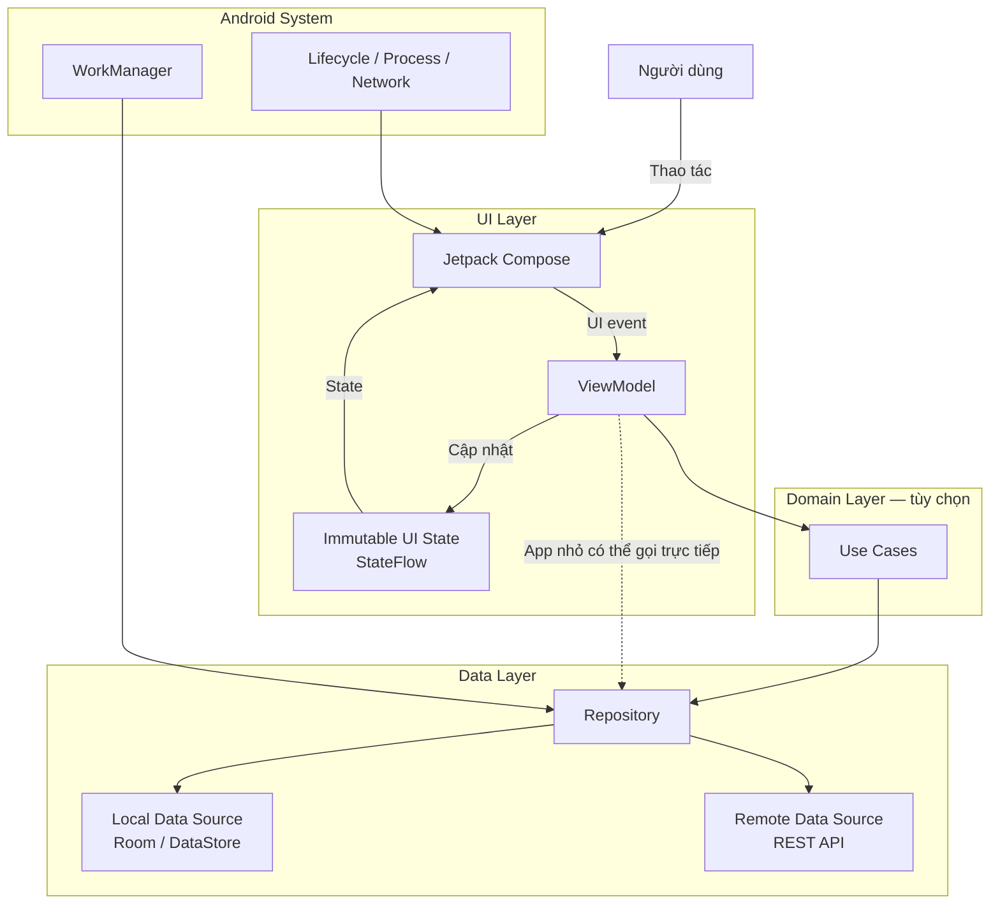
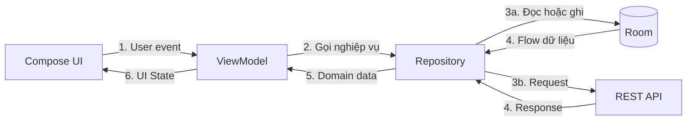
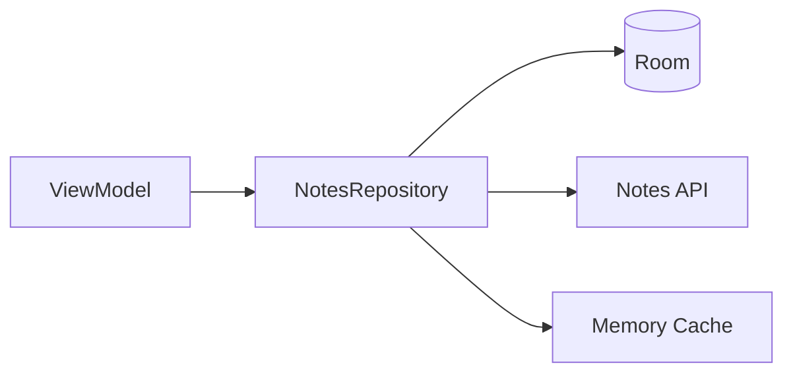
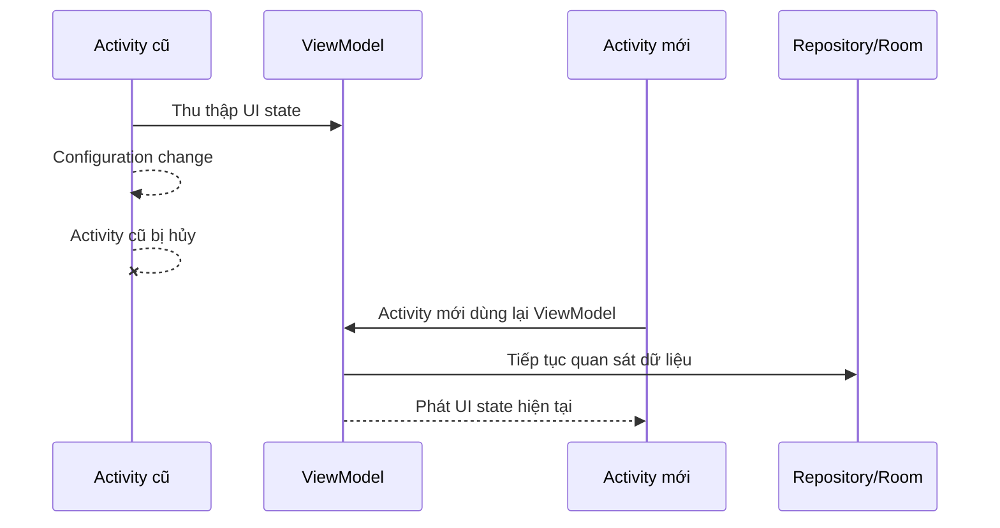

# 004 — Modern Android Stack

| Thông tin               | Nội dung                               |
| ----------------------- | -------------------------------------- |
| **Học phần**            | 01 — Language and Android Fundamentals |
| **Module**              | Module 01 — Pick a Language            |
| **Nhóm nội dung**       | Language Choice                        |
| **Nguồn roadmap**       | Pick a Language / Language Choice      |
| **Loại bài**            | Lesson                                 |
| **Thứ tự trong module** | 004                                    |
| **Thời lượng gợi ý**    | 24 phút                                |

---

## 1. Tóm tắt

**Modern Android Stack** là tập hợp ngôn ngữ, thư viện, công cụ và mô hình kiến trúc thường được dùng để xây dựng ứng dụng Android hiện đại.

Nó không phải một framework duy nhất và cũng không phải danh sách bắt buộc cho mọi dự án. Một stack tham khảo thường bao gồm:

* **Kotlin** cho ngôn ngữ lập trình.
* **Jetpack Compose** cho giao diện.
* **ViewModel, StateFlow và Unidirectional Data Flow** để quản lý trạng thái.
* **Repository** để tách UI khỏi nguồn dữ liệu.
* **Room** cho dữ liệu có cấu trúc.
* **DataStore** cho cài đặt hoặc dữ liệu nhỏ.
* **Coroutines và Flow** cho xử lý bất đồng bộ.
* **Hilt** cho dependency injection.
* **WorkManager** cho công việc nền cần bảo đảm thực thi.
* Unit test, Compose UI test, CI và các công cụ đo hiệu năng.

Android hiện khuyến nghị ứng dụng có ít nhất hai lớp là **UI layer** và **data layer**; domain layer có thể được thêm khi nghiệp vụ phức tạp hoặc cần tái sử dụng. Jetpack Compose được khuyến nghị cho UI mới, còn coroutines và Flow được khuyến nghị để giao tiếp giữa các lớp. ([Android Developers][1])

> **Ý tưởng cốt lõi:** Modern Android Stack không chỉ là “dùng thư viện mới”, mà là tổ chức ứng dụng sao cho trạng thái rõ ràng, dữ liệu có nguồn duy nhất, tác vụ tôn trọng lifecycle và từng thành phần có thể kiểm thử độc lập.

---

## 2. Mục tiêu học tập

Sau bài học, bạn có thể:

* Giải thích Modern Android Stack bằng ngôn ngữ của mình.
* Nhận biết vai trò của Kotlin, Compose, ViewModel, Flow, Repository, Room, DataStore, Hilt và WorkManager.
* Mô tả đường đi của dữ liệu từ database hoặc API đến giao diện.
* Phân biệt UI state, business data và trạng thái tạm thời của một composable.
* Viết một màn hình Compose sử dụng ViewModel và `StateFlow`.
* Thu thập trạng thái theo lifecycle bằng `collectAsStateWithLifecycle()`.
* Xác định các lỗi kiến trúc thường gặp ở lập trình viên Android mới.
* Tạo một mini project có thể đưa vào portfolio.

---

## 3. Định nghĩa ngắn gọn

> **Modern Android Stack là tập hợp công nghệ và nguyên tắc kiến trúc hiện đại dùng để xây dựng ứng dụng Android có UI khai báo, luồng dữ liệu một chiều, xử lý bất đồng bộ an toàn, phân tách trách nhiệm rõ ràng và có khả năng kiểm thử.**

Một ghi chú năm dòng có thể viết như sau:

```text
Modern Android Stack thường sử dụng Kotlin và Jetpack Compose.
UI nhận trạng thái từ ViewModel thay vì tự gọi database hoặc API.
ViewModel giao tiếp với data layer thông qua Repository.
Coroutines và Flow xử lý tác vụ bất đồng bộ và truyền dữ liệu phản ứng.
Room, DataStore, Hilt, WorkManager và testing hỗ trợ lưu trữ, DI, background work và chất lượng.
```

---

## 4. Bức tranh tổng thể

| Khu vực              | Công nghệ hoặc mô hình thường dùng      | Vai trò                                   |
| -------------------- | --------------------------------------- | ----------------------------------------- |
| Ngôn ngữ             | Kotlin                                  | Viết ứng dụng Android                     |
| UI                   | Jetpack Compose, Material 3             | Xây dựng giao diện khai báo               |
| UI state             | ViewModel, StateFlow                    | Lưu và cung cấp trạng thái màn hình       |
| Lifecycle            | Lifecycle Compose                       | Chỉ thu thập dữ liệu khi UI phù hợp       |
| Bất đồng bộ          | Coroutines, Flow                        | Network, database, xử lý nền              |
| Kiến trúc            | UI layer, domain layer, data layer      | Phân tách trách nhiệm                     |
| Truy cập dữ liệu     | Repository                              | Điểm truy cập dữ liệu thống nhất          |
| Database             | Room                                    | Dữ liệu có cấu trúc, truy vấn, quan hệ    |
| Thiết lập nhỏ        | DataStore                               | Theme, ngôn ngữ, tùy chọn người dùng      |
| Network              | Retrofit/OkHttp, Ktor hoặc client khác  | Giao tiếp REST API                        |
| Dependency injection | Hilt hoặc constructor injection         | Cung cấp dependency và hỗ trợ test        |
| Công việc nền        | WorkManager                             | Đồng bộ hoặc upload trì hoãn              |
| Điều hướng           | Navigation cho Compose                  | Chuyển màn hình và quản lý back stack     |
| Kiểm thử             | JUnit, coroutine test, Compose UI test  | Bảo vệ hành vi ứng dụng                   |
| Hiệu năng            | Macrobenchmark, Baseline Profiles       | Đo và tối ưu startup, thao tác quan trọng |
| Build                | Gradle Kotlin DSL, Version Catalog, KSP | Quản lý build và dependency               |

Đây là stack tham khảo, không phải yêu cầu rằng một ứng dụng nhỏ phải dùng toàn bộ thư viện. Tài liệu kiến trúc Android nhấn mạnh rằng các khuyến nghị cần được điều chỉnh theo quy mô và yêu cầu thực tế của ứng dụng. ([Android Developers][1])

---

## 5. Sơ đồ Modern Android Stack



Kiến trúc Android được khuyến nghị đặt Repository làm điểm truy cập data layer; composable hoặc ViewModel không nên truy cập trực tiếp database, DataStore hay network data source. ([Android Developers][1])

---

## 6. Luồng dữ liệu một chiều

Modern Android thường áp dụng **Unidirectional Data Flow — UDF**:



### Quy tắc dễ nhớ

```text
State đi xuống ↓
Event đi lên ↑
```

Ví dụ:

1. Người dùng nhấn **Lưu ghi chú**.
2. Compose gửi sự kiện `onSaveNote`.
3. ViewModel xử lý sự kiện.
4. Repository lưu ghi chú vào Room.
5. Room phát danh sách mới qua Flow.
6. ViewModel chuyển dữ liệu thành `NotesUiState`.
7. Compose nhận state mới và tự cập nhật giao diện.

UDF giúp hình thành một nguồn trạng thái rõ ràng, giảm tình trạng UI và database giữ hai giá trị mâu thuẫn nhau. Compose đặc biệt phù hợp với UDF vì composable nhận state và phát event thay vì tự sửa dữ liệu ở nhiều nơi.

---

# 7. Các thành phần chính

## 7.1. Kotlin

Kotlin là lựa chọn trung tâm trong Android hiện đại vì hỗ trợ:

* Null safety.
* Data class.
* Extension function.
* Sealed interface và sealed class.
* Coroutines.
* Flow.
* Khả năng tương tác với Java.

Android áp dụng hướng tiếp cận **Kotlin-first**, đồng thời Kotlin vẫn tương tác được với code Java trong cùng dự án. ([Android Developers][2])

Ví dụ mô hình trạng thái:

```kotlin
data class NotesUiState(
    val notes: List<Note> = emptyList(),
    val isLoading: Boolean = false,
    val errorMessage: String? = null
)
```

`data class` giúp biểu diễn một snapshot trạng thái bất biến, dễ so sánh và dễ kiểm thử.

---

## 7.2. Jetpack Compose

Jetpack Compose là UI toolkit khai báo được Android khuyến nghị cho ứng dụng mới. Thay vì tìm View rồi thay đổi từng thuộc tính, bạn mô tả giao diện tương ứng với state hiện tại. ([Android Developers][1])

### Cách tư duy cũ

```text
Tìm TextView
→ thay đổi nội dung
→ bật hoặc tắt ProgressBar
→ cập nhật RecyclerView
```

### Cách tư duy với Compose

```kotlin
when {
    uiState.isLoading -> CircularProgressIndicator()
    uiState.errorMessage != null -> ErrorMessage(uiState.errorMessage)
    else -> NotesList(uiState.notes)
}
```

Khi `uiState` thay đổi, Compose thực hiện recomposition cho phần giao diện liên quan.

---

## 7.3. ViewModel

`ViewModel` thường là state holder ở cấp màn hình. Nó:

* Nhận sự kiện từ UI.
* Truy cập Repository hoặc Use Case.
* Chuyển application data thành UI state.
* Tồn tại qua những lần tái tạo Activity do configuration change.
* Tách logic màn hình khỏi composable.

Android khuyến nghị dùng ViewModel để quản lý screen-level UI state khi màn hình cần truy cập data layer. ([Android Developers][3])

> ViewModel không phải nơi lưu dữ liệu vĩnh viễn. Process death vẫn có thể làm mất dữ liệu chỉ tồn tại trong bộ nhớ.

---

## 7.4. Coroutines và Flow

### Coroutine

Coroutine dùng cho công việc bất đồng bộ như:

* Gọi API.
* Ghi database.
* Đọc file.
* Xử lý dữ liệu.
* Chờ timeout.

`viewModelScope` tự hủy coroutine khi ViewModel bị clear, giúp tránh tiếp tục chạy công việc không còn cần thiết. ([Android Developers][4])

```kotlin
fun refresh() {
    viewModelScope.launch {
        repository.refreshNotes()
    }
}
```

### Flow

`Flow<T>` biểu diễn một chuỗi giá trị phát theo thời gian.

```kotlin
val notes: Flow<List<Note>>
```

Ví dụ Room có thể phát danh sách ghi chú mới mỗi khi bảng thay đổi. ViewModel biến Flow đó thành `StateFlow<NotesUiState>` để UI quan sát.

---

## 7.5. Repository

Repository là lớp trung gian giữa ViewModel và nguồn dữ liệu.



Repository có thể:

* Quyết định đọc local hay remote.
* Đồng bộ API với database.
* Xử lý cache.
* Chuyển đổi data model.
* Giải quyết xung đột giữa nhiều nguồn dữ liệu.
* Cung cấp API dễ kiểm thử cho ViewModel.

```kotlin
interface NotesRepository {
    fun observeNotes(): Flow<List<Note>>
    suspend fun addNote(title: String)
    suspend fun refresh()
}
```

UI không cần biết dữ liệu đến từ Room, API hay file cục bộ.

---

## 7.6. Room

Room là lớp trừu tượng trên SQLite, cung cấp kiểm tra truy vấn SQL khi biên dịch, annotation giúp giảm boilerplate và cơ chế migration database. Android khuyến nghị Room thay cho việc thao tác trực tiếp với SQLite API trong các trường hợp thông thường. ([Android Developers][5])

```kotlin
@Entity(tableName = "notes")
data class NoteEntity(
    @PrimaryKey(autoGenerate = true)
    val id: Long = 0,
    val title: String,
    val createdAt: Long
)

@Dao
interface NoteDao {

    @Query("SELECT * FROM notes ORDER BY createdAt DESC")
    fun observeAll(): Flow<List<NoteEntity>>

    @Insert
    suspend fun insert(note: NoteEntity)
}
```

### Room phù hợp khi

* Có nhiều bản ghi.
* Có query và filter.
* Cần quan hệ giữa bảng.
* Cần transaction.
* Cần migration schema.
* Cần cache dữ liệu để hỗ trợ offline.

---

## 7.7. DataStore

DataStore thích hợp cho dữ liệu nhỏ như:

* Dark mode.
* Ngôn ngữ ứng dụng.
* Trạng thái hoàn thành onboarding.
* Tùy chọn thông báo.
* Bộ lọc mặc định.

DataStore lưu dữ liệu bất đồng bộ bằng coroutines và Flow. Với dữ liệu lớn, quan hệ phức tạp hoặc cần cập nhật từng phần, Room phù hợp hơn. ([Android Developers][6])

```kotlin
data class UserPreferences(
    val darkModeEnabled: Boolean,
    val language: String
)
```

### Không nên dùng DataStore như database

```text
Không phù hợp:
- 10.000 sản phẩm
- Quan hệ người dùng – đơn hàng
- Truy vấn tìm kiếm phức tạp
- Cập nhật từng hàng riêng biệt
```

---

## 7.8. Hilt và Dependency Injection

Dependency Injection giúp một class nhận dependency từ bên ngoài thay vì tự tạo bên trong.

### Không nên

```kotlin
class NotesViewModel : ViewModel() {
    private val database = Room.databaseBuilder(...)
    private val repository = NotesRepositoryImpl(database.noteDao())
}
```

ViewModel trên:

* Phụ thuộc trực tiếp Android Context.
* Khó thay Repository bằng fake.
* Khó viết unit test.
* Tự chịu trách nhiệm tạo quá nhiều object.

### Nên dùng constructor injection

```kotlin
@HiltViewModel
class NotesViewModel @Inject constructor(
    private val repository: NotesRepository
) : ViewModel()
```

Hilt là thư viện dependency injection được khuyến nghị chính thức cho Android và được tối ưu cho Compose cũng như kiến trúc single-activity. ([Android Developers][7])

Với dự án nhỏ, constructor injection thủ công vẫn có thể đủ. Không cần thêm Hilt chỉ để “stack trông hiện đại”.

---

## 7.9. WorkManager

WorkManager dành cho công việc nền có thể trì hoãn nhưng cần được hệ thống lên lịch đáng tin cậy, chẳng hạn:

* Đồng bộ dữ liệu định kỳ.
* Upload log hoặc ảnh.
* Gửi dữ liệu đang chờ khi có mạng.
* Dọn cache.
* Tải nội dung cho chế độ offline.

```kotlin
class SyncNotesWorker(
    appContext: Context,
    params: WorkerParameters,
    private val repository: NotesRepository
) : CoroutineWorker(appContext, params) {

    override suspend fun doWork(): Result {
        return runCatching {
            repository.refresh()
        }.fold(
            onSuccess = { Result.success() },
            onFailure = { Result.retry() }
        )
    }
}
```

Không nên dùng WorkManager cho animation, tác vụ phải hoàn tất ngay trong màn hình hoặc công việc chỉ có ý nghĩa khi composable còn hiển thị.

---

# 8. Ví dụ thực hành: ứng dụng Quick Notes

## 8.1. Yêu cầu

Tạo ứng dụng nhỏ có các chức năng:

* Hiển thị danh sách ghi chú.
* Thêm ghi chú mới.
* Hiển thị loading.
* Hiển thị thông báo lỗi.
* Giữ dữ liệu khi xoay màn hình.
* Có Repository để sau này thay fake data bằng Room.

---

## 8.2. Cấu trúc thư mục

```text
com.example.quicknotes
├── data
│   ├── local
│   │   ├── NoteDao.kt
│   │   ├── NoteEntity.kt
│   │   └── NotesDatabase.kt
│   ├── repository
│   │   ├── NotesRepository.kt
│   │   └── OfflineFirstNotesRepository.kt
│   └── mapper
│       └── NoteMapper.kt
│
├── domain
│   └── model
│       └── Note.kt
│
├── ui
│   └── notes
│       ├── NotesRoute.kt
│       ├── NotesScreen.kt
│       ├── NotesUiState.kt
│       └── NotesViewModel.kt
│
├── di
│   └── DataModule.kt
│
└── MainActivity.kt
```

Với một app rất nhỏ, bạn có thể chỉ dùng package `data` và `ui`. Chỉ tách thành nhiều module khi quy mô, số lượng developer hoặc thời gian build thực sự cần điều đó.

---

## 8.3. Domain model

```kotlin
data class Note(
    val id: Long,
    val title: String
)
```

---

## 8.4. Repository

```kotlin
interface NotesRepository {
    fun observeNotes(): Flow<List<Note>>
    suspend fun addNote(title: String)
}
```

Fake Repository phục vụ giai đoạn đầu và kiểm thử:

```kotlin
class FakeNotesRepository : NotesRepository {

    private val notes = MutableStateFlow<List<Note>>(emptyList())

    override fun observeNotes(): Flow<List<Note>> = notes

    override suspend fun addNote(title: String) {
        val normalizedTitle = title.trim()

        require(normalizedTitle.isNotEmpty()) {
            "Tiêu đề không được để trống"
        }

        val newNote = Note(
            id = System.currentTimeMillis(),
            title = normalizedTitle
        )

        notes.update { currentNotes ->
            listOf(newNote) + currentNotes
        }
    }
}
```

---

## 8.5. UI state

```kotlin
data class NotesUiState(
    val notes: List<Note> = emptyList(),
    val isLoading: Boolean = true,
    val input: String = "",
    val errorMessage: String? = null
)
```

Trạng thái được gom vào một object giúp UI có một nguồn dữ liệu rõ ràng.

---

## 8.6. ViewModel

```kotlin
class NotesViewModel(
    private val repository: NotesRepository
) : ViewModel() {

    private val input = MutableStateFlow("")
    private val errorMessage = MutableStateFlow<String?>(null)

    val uiState: StateFlow<NotesUiState> =
        combine(
            repository.observeNotes(),
            input,
            errorMessage
        ) { notes, currentInput, currentError ->
            NotesUiState(
                notes = notes,
                isLoading = false,
                input = currentInput,
                errorMessage = currentError
            )
        }.stateIn(
            scope = viewModelScope,
            started = SharingStarted.WhileSubscribed(5_000),
            initialValue = NotesUiState()
        )

    fun onInputChanged(value: String) {
        input.value = value
        errorMessage.value = null
    }

    fun saveNote() {
        val title = input.value.trim()

        if (title.isEmpty()) {
            errorMessage.value = "Hãy nhập nội dung ghi chú"
            return
        }

        viewModelScope.launch {
            runCatching {
                repository.addNote(title)
            }.onSuccess {
                input.value = ""
            }.onFailure { error ->
                errorMessage.value =
                    error.message ?: "Không thể lưu ghi chú"
            }
        }
    }
}
```

---

## 8.7. Route thu thập state theo lifecycle

```kotlin
@Composable
fun NotesRoute(
    viewModel: NotesViewModel
) {
    val uiState by viewModel.uiState.collectAsStateWithLifecycle()

    NotesScreen(
        uiState = uiState,
        onInputChanged = viewModel::onInputChanged,
        onSaveClicked = viewModel::saveNote
    )
}
```

`collectAsStateWithLifecycle()` chuyển Flow thành Compose State và tự quản lý việc đăng ký theo lifecycle. Theo mặc định, việc thu thập bắt đầu khi lifecycle ở trạng thái `STARTED` và dừng khi chuyển sang `STOPPED`. ([Android Developers][4])

---

## 8.8. Composable thuần

```kotlin
@Composable
fun NotesScreen(
    uiState: NotesUiState,
    onInputChanged: (String) -> Unit,
    onSaveClicked: () -> Unit
) {
    Column(
        modifier = Modifier
            .fillMaxSize()
            .padding(16.dp),
        verticalArrangement = Arrangement.spacedBy(12.dp)
    ) {
        Text(
            text = "Quick Notes",
            style = MaterialTheme.typography.headlineMedium
        )

        OutlinedTextField(
            value = uiState.input,
            onValueChange = onInputChanged,
            modifier = Modifier.fillMaxWidth(),
            label = { Text("Nội dung ghi chú") },
            isError = uiState.errorMessage != null,
            supportingText = {
                uiState.errorMessage?.let {
                    Text(text = it)
                }
            }
        )

        Button(
            onClick = onSaveClicked,
            modifier = Modifier.fillMaxWidth()
        ) {
            Text("Lưu ghi chú")
        }

        when {
            uiState.isLoading -> {
                CircularProgressIndicator()
            }

            uiState.notes.isEmpty() -> {
                Text("Chưa có ghi chú")
            }

            else -> {
                LazyColumn(
                    verticalArrangement = Arrangement.spacedBy(8.dp)
                ) {
                    items(
                        items = uiState.notes,
                        key = { note -> note.id }
                    ) { note ->
                        Card(
                            modifier = Modifier.fillMaxWidth()
                        ) {
                            Text(
                                text = note.title,
                                modifier = Modifier.padding(16.dp)
                            )
                        }
                    }
                }
            }
        }
    }
}
```

`NotesScreen()` không biết Repository, Room hay Hilt. Nó chỉ:

1. Nhận state.
2. Vẽ state.
3. Phát callback khi người dùng thao tác.

Điều này làm composable dễ preview và dễ kiểm thử độc lập.

---

# 9. Lifecycle và state

## 9.1. Các loại trạng thái

| Trạng thái                   | Nơi giữ phù hợp       | Ví dụ                      |
| ---------------------------- | --------------------- | -------------------------- |
| Trạng thái UI rất nhỏ        | `remember`            | Menu đang mở               |
| Cần qua configuration change | `rememberSaveable`    | Text đang nhập đơn giản    |
| Trạng thái cấp màn hình      | ViewModel + StateFlow | Danh sách, loading, filter |
| Dữ liệu cần tồn tại lâu dài  | Room hoặc DataStore   | Ghi chú, tùy chọn          |
| Công việc nền bền vững       | WorkManager           | Đồng bộ dữ liệu            |

### `remember`

```kotlin
var expanded by remember {
    mutableStateOf(false)
}
```

Giá trị tồn tại trong composition nhưng có thể mất khi composable bị loại khỏi composition.

### `rememberSaveable`

```kotlin
var query by rememberSaveable {
    mutableStateOf("")
}
```

Phù hợp với dữ liệu nhỏ có thể lưu vào `Bundle`.

### ViewModel

```kotlin
val uiState: StateFlow<SearchUiState>
```

Phù hợp với state cấp màn hình và logic cần truy cập data layer.

### Room hoặc DataStore

Dùng khi dữ liệu phải tồn tại sau:

* Process death.
* Khởi động lại ứng dụng.
* Khởi động lại thiết bị.
* Cập nhật UI ở nhiều màn hình.

---

## 9.2. Điều gì xảy ra khi xoay màn hình?



ViewModel hỗ trợ giữ trạng thái qua configuration change, nhưng dữ liệu quan trọng vẫn nên có nguồn bền vững ở data layer.

---

# 10. Một lỗi thường gặp ở junior developer

## Lỗi: gọi API trực tiếp trong composable

```kotlin
@Composable
fun ProfileScreen() {
    val api = Retrofit.Builder()
        .baseUrl("https://example.com")
        .build()
        .create(ProfileApi::class.java)

    LaunchedEffect(Unit) {
        api.getProfile()
    }
}
```

### Vấn đề

* UI tự tạo network dependency.
* Composable khó kiểm thử.
* Dễ gọi lại request khi composition thay đổi.
* Không có Repository.
* Không có state model rõ ràng.
* Khó xử lý loading, retry và cache.
* Khó thay API bằng fake data.
* Logic có thể không phù hợp với lifecycle.

### Hướng sửa

```text
Composable
   ↓ event
ViewModel
   ↓
Repository
   ↓
RemoteDataSource
```

Composable chỉ nhận `ProfileUiState` và gửi callback.

---

# 11. Các lỗi phổ biến khác

## 11.1. Mỗi composable giữ một bản sao state

```kotlin
var localName by remember { mutableStateOf(user.name) }
```

Nếu `user.name` thay đổi từ database, `localName` có thể không tự đồng bộ như mong muốn.

**Cách xử lý:** xác định rõ owner của state và chỉ tạo local state khi thực sự cần bản nháp tạm thời.

---

## 11.2. Dùng `GlobalScope`

```kotlin
GlobalScope.launch {
    repository.sync()
}
```

Coroutine không gắn với lifecycle rõ ràng.

**Thay thế:**

* `viewModelScope` cho công việc của ViewModel.
* `LaunchedEffect` cho side effect gắn với composition.
* WorkManager cho công việc nền bền vững.
* Scope được inject cho tác vụ cấp ứng dụng.

---

## 11.3. Truyền `Context` vào ViewModel không cần thiết

ViewModel không nên phụ thuộc vào Activity hoặc composable. Nếu cần tài nguyên Android, hãy cân nhắc:

* Chuyển đổi dữ liệu ở UI.
* Inject abstraction.
* Dùng application context chỉ khi thực sự cần.
* Không giữ Activity context trong object sống lâu.

---

## 11.4. Dùng `try/catch` chỉ trong UI

Network và database error nên được chuyển thành trạng thái hoặc kiểu kết quả có nghĩa ở data layer/ViewModel.

```kotlin
sealed interface LoadState {
    data object Loading : LoadState
    data class Success(val notes: List<Note>) : LoadState
    data class Error(val message: String) : LoadState
}
```

---

## 11.5. Thêm quá nhiều abstraction

Một app chỉ có một màn hình không nhất thiết cần:

```text
View
→ Presenter
→ ViewModel
→ UseCase
→ Interactor
→ Service
→ Repository
→ DataSource
→ Gateway
```

Modern không đồng nghĩa với nhiều layer. Mỗi abstraction phải giải quyết một vấn đề cụ thể.

---

# 12. Ảnh hưởng đến UX và chất lượng

| Lựa chọn                  | Ảnh hưởng tích cực             | Rủi ro khi làm sai                           |
| ------------------------- | ------------------------------ | -------------------------------------------- |
| Compose + immutable state | UI nhất quán với state         | Recomposition không cần thiết                |
| ViewModel                 | Giảm mất state khi rotate      | Đưa quá nhiều trách nhiệm vào ViewModel      |
| StateFlow                 | UI phản ứng với dữ liệu mới    | Collect không theo lifecycle gây lãng phí    |
| Repository                | Dễ cache và test               | Repository quá lớn thành “God class”         |
| Room                      | Offline và dữ liệu có cấu trúc | Migration sai làm crash hoặc mất dữ liệu     |
| DataStore                 | Lưu preferences an toàn        | Dùng cho dataset lớn                         |
| Coroutines                | UI không bị block              | Chạy CPU work trên Main dispatcher           |
| Hilt                      | Dễ thay dependency khi test    | Scope sai gây giữ object quá lâu             |
| WorkManager               | Công việc nền đáng tin cậy     | Lạm dụng cho công việc cần phản hồi tức thời |
| UI test                   | Ngăn regression                | Test phụ thuộc text hoặc layout quá chi tiết |
| Baseline Profile          | Startup và tương tác mượt hơn  | Tối ưu trước khi đo                          |

Room migration phải được kiểm thử vì migration sai có thể làm ứng dụng crash hoặc ảnh hưởng dữ liệu người dùng. ([Android Developers][8])

---

# 13. Kiểm thử

Android khuyến nghị tối thiểu nên có unit test cho ViewModel và Flow, unit test cho data layer, cùng UI navigation test có thể chạy trong CI. Fake thường được ưu tiên hơn mock trong hướng dẫn kiến trúc chính thức. ([Android Developers][1])

## 13.1. Kiểm thử ViewModel

```kotlin
class NotesViewModelTest {

    private lateinit var repository: FakeNotesRepository
    private lateinit var viewModel: NotesViewModel

    @Before
    fun setUp() {
        repository = FakeNotesRepository()
        viewModel = NotesViewModel(repository)
    }

    @Test
    fun saveNote_addsNoteAndClearsInput() = runTest {
        viewModel.onInputChanged("Học StateFlow")
        viewModel.saveNote()

        advanceUntilIdle()

        val state = viewModel.uiState.value

        assertEquals("", state.input)
        assertEquals("Học StateFlow", state.notes.first().title)
    }
}
```

---

## 13.2. Kiểm thử Compose UI

```kotlin
@get:Rule
val composeRule = createComposeRule()

@Test
fun emptyState_isDisplayed() {
    composeRule.setContent {
        NotesScreen(
            uiState = NotesUiState(
                notes = emptyList(),
                isLoading = false
            ),
            onInputChanged = {},
            onSaveClicked = {}
        )
    }

    composeRule
        .onNodeWithText("Chưa có ghi chú")
        .assertIsDisplayed()
}
```

Compose cung cấp API để tìm node, kiểm tra thuộc tính và mô phỏng thao tác của người dùng. ([Android Developers][9])

---

# 14. Debugging checklist

Khi màn hình không hiển thị đúng, kiểm tra theo thứ tự:

```text
1. UI có thực sự collect StateFlow không?
2. collect có dùng collectAsStateWithLifecycle không?
3. Repository có phát dữ liệu mới không?
4. Room query có trả Flow đúng không?
5. UI state có được tạo lại sau khi dữ liệu thay đổi không?
6. Composable có đọc đúng field trong UI state không?
7. List có dùng key ổn định không?
8. Exception có bị nuốt trong coroutine không?
9. Dispatcher có làm block main thread không?
10. Dependency được inject có đúng implementation không?
```

Một số công cụ hữu ích:

* Logcat.
* Android Studio debugger.
* Layout Inspector.
* Database Inspector.
* Network Inspector.
* Compose recomposition/highlight tools.
* Memory Profiler.
* CPU Profiler.
* Macrobenchmark.

---

# 15. Production checklist

## Kiến trúc

* [ ] UI không truy cập trực tiếp database hoặc API.
* [ ] Repository là điểm truy cập data layer.
* [ ] UI state bất biến.
* [ ] State đi xuống, event đi lên.
* [ ] Domain layer chỉ được thêm khi có nhu cầu thực tế.

## Lifecycle và state

* [ ] Flow được collect theo lifecycle.
* [ ] Không dùng `GlobalScope`.
* [ ] Tác vụ ViewModel dùng scope phù hợp.
* [ ] State quan trọng không chỉ tồn tại trong `remember`.
* [ ] Đã kiểm tra rotate, background và process recreation.

## Network và storage

* [ ] Có loading, empty, error và retry state.
* [ ] Có timeout và xử lý mất mạng.
* [ ] Dữ liệu cần offline được cache phù hợp.
* [ ] Room migration được kiểm thử.
* [ ] Không ghi token nhạy cảm vào log.
* [ ] DataStore không bị dùng thay database lớn.

## Testing

* [ ] Có unit test cho ViewModel.
* [ ] Có test cho Repository.
* [ ] Có test cho database migration nếu dùng Room.
* [ ] Có Compose UI test cho luồng quan trọng.
* [ ] Test chạy được trong CI.
* [ ] Dependency có thể thay bằng fake.

## Release

* [ ] Chạy unit test và instrumented test.
* [ ] Chạy lint.
* [ ] Kiểm tra release build, không chỉ debug build.
* [ ] Kiểm tra minification/R8.
* [ ] Kiểm tra cold start.
* [ ] Kiểm tra crash và ANR.
* [ ] Kiểm tra nhiều kích thước màn hình.
* [ ] Kiểm tra dark mode và accessibility.
* [ ] Không chứa API key hoặc secret trong repository.

---

# 16. Artifact cho portfolio

## Đề xuất: Quick Notes — Offline-first

### Tính năng tối thiểu

* Compose + Material 3.
* ViewModel + StateFlow.
* Repository interface.
* Room database.
* DataStore lưu dark mode.
* Hilt hoặc constructor injection.
* WorkManager đồng bộ dữ liệu giả lập.
* Unit test cho ViewModel.
* Compose UI test.
* README có sơ đồ kiến trúc.

### Nội dung README

```markdown
# Quick Notes

Ứng dụng ghi chú Android được xây dựng bằng Kotlin và Jetpack Compose.

## Tech Stack

- Kotlin
- Jetpack Compose
- ViewModel
- Coroutines and StateFlow
- Room
- DataStore
- Hilt
- WorkManager

## Architecture

UI → ViewModel → Repository → Room/API

## Quality

- ViewModel unit tests
- Compose UI tests
- Offline support
- Lifecycle-aware state collection
```

### Ảnh nên đưa vào portfolio

1. Màn hình danh sách ghi chú.
2. Empty state.
3. Error state.
4. Dark mode.
5. Sơ đồ kiến trúc.
6. Kết quả test.
7. GIF hoặc video ngắn thể hiện thêm và lưu ghi chú.

Bạn có thể tham khảo **Now in Android**, một ứng dụng mẫu chính thức được xây dựng hoàn toàn bằng Kotlin và Compose, tuân theo hướng dẫn kiến trúc Android, có modularization, testing và Baseline Profile. ([GitHub][10])

---

# 17. Bài tập thực hành

## Bài 1 — Giải thích khái niệm

Viết một đoạn 100–150 từ trả lời:

> Modern Android Stack là gì và tại sao nó không chỉ là danh sách thư viện?

---

## Bài 2 — Vẽ luồng dữ liệu

Vẽ lại luồng sau bằng Mermaid:

```text
Người dùng
→ Compose
→ ViewModel
→ Repository
→ Room/API
→ Repository
→ ViewModel
→ Compose
```

Bổ sung vị trí của:

* StateFlow.
* WorkManager.
* Hilt.
* DataStore.

---

## Bài 3 — Cài đặt ví dụ nhỏ

Tạo màn hình todo có:

* `TodoUiState`.
* `TodoViewModel`.
* `TodoRepository`.
* Một fake repository.
* Compose UI.
* Một unit test.

---

## Bài 4 — Phân tích lỗi

Giải thích vấn đề trong đoạn code:

```kotlin
@Composable
fun ProductsScreen() {
    var products by remember {
        mutableStateOf<List<Product>>(emptyList())
    }

    GlobalScope.launch {
        products = api.getProducts()
    }

    LazyColumn {
        items(products) {
            Text(it.name)
        }
    }
}
```

Gợi ý cần phát hiện:

* Dùng `GlobalScope`.
* Gọi API trong composable body.
* Có thể gọi lại nhiều lần khi recomposition.
* Sửa state từ coroutine không có lifecycle phù hợp.
* Không có ViewModel.
* Không có Repository.
* Không có loading/error state.

---

# 18. Checklist hoàn thành bài học

* [ ] Có định nghĩa ngắn gọn về Modern Android Stack.
* [ ] Giải thích được vai trò của Kotlin và Compose.
* [ ] Phân biệt UI layer, domain layer và data layer.
* [ ] Vẽ được luồng UDF.
* [ ] Biết ViewModel giữ screen-level state.
* [ ] Biết Repository che giấu nguồn dữ liệu.
* [ ] Phân biệt Room và DataStore.
* [ ] Biết dùng coroutine scope phù hợp.
* [ ] Biết collect Flow theo lifecycle.
* [ ] Có code mẫu Compose + ViewModel + StateFlow.
* [ ] Có ít nhất một unit test.
* [ ] Có artifact nhỏ để đưa vào portfolio.
* [ ] Có ghi chú về rotate, background và process death.
* [ ] Có production checklist.

---

# 19. Hình ảnh và tài liệu minh họa

## Hình minh họa chính thức

* [Sơ đồ UI layer và Unidirectional Data Flow](https://developer.android.com/topic/architecture/ui-layer)
* [Sơ đồ Compose UI Architecture](https://developer.android.com/develop/ui/compose/architecture)
* [Sơ đồ Data Layer và Repository](https://developer.android.com/topic/architecture/data-layer)
* [State hoisting trong Jetpack Compose](https://developer.android.com/develop/ui/compose/state-hoisting)
* [Ứng dụng mẫu Now in Android](https://github.com/android/nowinandroid)

## Tài liệu đọc thêm

* [Guide to app architecture](https://developer.android.com/topic/architecture)
* [Android architecture recommendations](https://developer.android.com/topic/architecture/recommendations)
* [Kotlin coroutines on Android](https://developer.android.com/kotlin/coroutines)
* [Kotlin Flow on Android](https://developer.android.com/kotlin/flow)
* [Room database](https://developer.android.com/training/data-storage/room)
* [DataStore](https://developer.android.com/topic/libraries/architecture/datastore)
* [Dependency injection with Hilt](https://developer.android.com/training/dependency-injection/hilt-android)
* [WorkManager](https://developer.android.com/develop/background-work/background-tasks/persistent/getting-started)
* [Compose UI testing](https://developer.android.com/develop/ui/compose/testing)
* [Baseline Profiles](https://developer.android.com/topic/performance/baselineprofiles/overview)

---

# 20. Kết luận

Một Modern Android Stack tốt không được đánh giá bằng số lượng thư viện mà dự án sử dụng. Nó được đánh giá bằng việc:

```text
UI có phản ánh đúng state không?
State có một owner rõ ràng không?
Data có đi qua Repository không?
Coroutine có tôn trọng lifecycle không?
Dữ liệu có tồn tại đúng thời gian cần thiết không?
Các thành phần có thể kiểm thử độc lập không?
Ứng dụng có xử lý loading, offline, error và retry không?
Release có được bảo vệ bằng test và đo hiệu năng không?
```

Công thức ghi nhớ:

```text
Kotlin
+ Compose
+ UDF
+ ViewModel
+ Coroutines/Flow
+ Repository
+ Room/DataStore
+ Dependency Injection
+ Testing
= Nền tảng Android hiện đại, dễ mở rộng và bảo trì
```

[1]: https://developer.android.com/topic/architecture/recommendations "Recommendations for Android architecture  |  App architecture  |  Android Developers"
[2]: https://developer.android.com/kotlin/first?utm_source=chatgpt.com "Android's Kotlin-first approach"
[3]: https://developer.android.com/topic/architecture/ui-layer "UI layer  |  App architecture  |  Android Developers"
[4]: https://developer.android.com/topic/libraries/architecture/coroutines "Use Kotlin coroutines with lifecycle-aware components  |  App architecture  |  Android Developers"
[5]: https://developer.android.com/training/data-storage/room "Save data in a local database using Room  |  App data and files  |  Android Developers"
[6]: https://developer.android.com/topic/libraries/architecture/datastore "App Architecture: Data Layer - DataStore - Android Developers  |  App architecture"
[7]: https://developer.android.com/training/dependency-injection/hilt-android "Dependency injection with Hilt  |  App architecture  |  Android Developers"
[8]: https://developer.android.com/training/data-storage/room/migrating-db-versions?utm_source=chatgpt.com "Migrate your Room database | App data and files"
[9]: https://developer.android.com/develop/ui/compose/testing?utm_source=chatgpt.com "Test your Compose layout | Jetpack Compose"
[10]: https://github.com/android/nowinandroid "GitHub - android/nowinandroid: A fully functional Android app built entirely with Kotlin and Jetpack Compose · GitHub"
