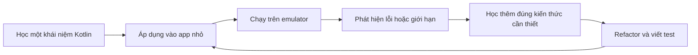
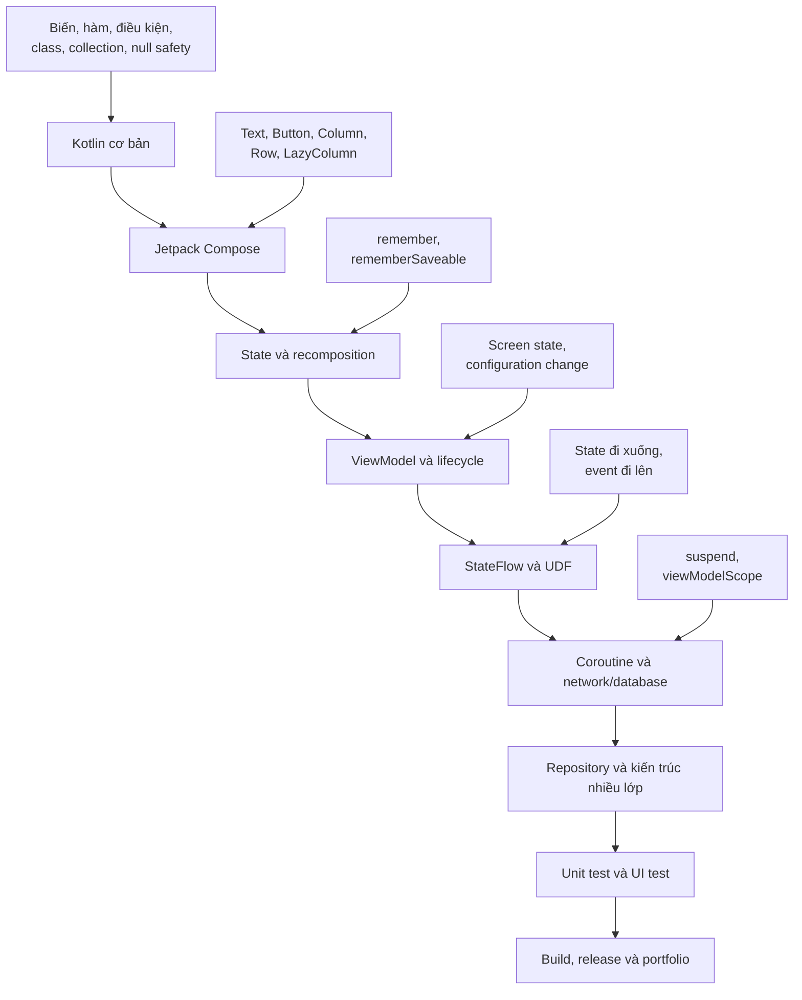
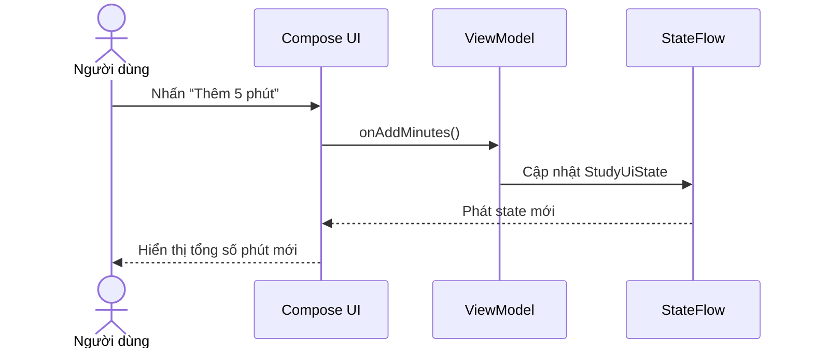
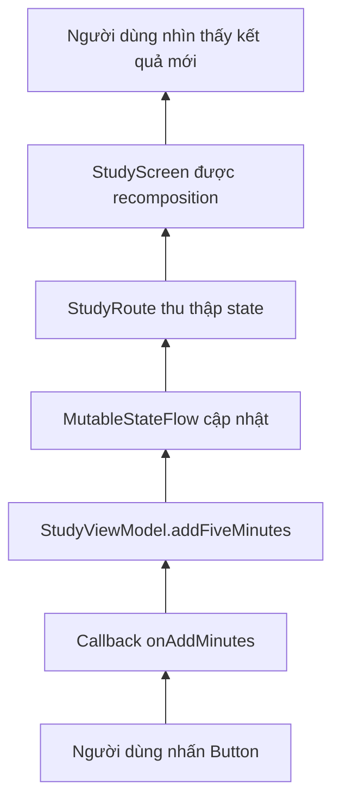

# 005 — Chiến lược học Kotlin-First

| Thông tin               | Nội dung                               |
| ----------------------- | -------------------------------------- |
| **Học phần**            | 01 — Language and Android Fundamentals |
| **Module**              | Module 01 — Pick a Language            |
| **Nhóm nội dung**       | Language Choice                        |
| **Nguồn roadmap**       | Pick a Language / Language Choice      |
| **Loại bài**            | Lesson                                 |
| **Thứ tự trong module** | 005                                    |
| **Thời lượng gợi ý**    | 24 phút                                |

---

## 1. Tóm tắt

**Kotlin-First Learning Strategy** là chiến lược ưu tiên học Kotlin thông qua việc xây dựng ứng dụng Android thực tế, thay vì học toàn bộ ngôn ngữ một cách tách biệt rồi mới bắt đầu Android.

Android hiện áp dụng định hướng **Kotlin-first**: công cụ, thư viện Jetpack, tài liệu, ví dụ và nội dung đào tạo mới được thiết kế với người dùng Kotlin làm trọng tâm. Java vẫn được hỗ trợ, nhưng Kotlin là lựa chọn được khuyến nghị khi bắt đầu dự án Android mới.

Chiến lược phù hợp cho người mới là:

> **Học một phần Kotlin → áp dụng ngay vào ứng dụng → gặp vấn đề → học thêm Kotlin để giải quyết vấn đề đó.**

Không cần học hết mọi tính năng của Kotlin trước khi tạo ứng dụng đầu tiên.

---

## 2. Mục tiêu học tập

Sau bài học, anh có thể:

* Giải thích được Kotlin-first bằng ngôn ngữ của mình.
* Phân biệt giữa **học Kotlin thuần túy** và **học Kotlin trong bối cảnh Android**.
* Xây dựng một lộ trình học từ Kotlin cơ bản đến Compose, state, ViewModel và coroutine.
* Lựa chọn đúng nơi lưu state để hạn chế mất dữ liệu khi giao diện được tạo lại.
* Viết một màn hình Compose nhỏ theo mô hình state đi xuống, event đi lên.
* Tạo một artifact nhỏ có thể đưa vào portfolio.

---

## 3. Ghi chú năm dòng về Kotlin-first

1. Kotlin-first là ưu tiên dùng Kotlin khi học và phát triển ứng dụng Android mới.
2. Người học chỉ cần nắm Kotlin cơ bản trước khi bắt đầu Jetpack Compose.
3. Mỗi khái niệm Kotlin nên được gắn với một chức năng Android cụ thể.
4. Sau UI, cần học tiếp state, lifecycle, ViewModel, coroutine và data layer.
5. Mục tiêu cuối cùng không phải thuộc cú pháp, mà là tạo được ứng dụng ổn định và dễ bảo trì.

---

## 4. Kotlin-first thực sự có nghĩa là gì?

### 4.1. Không có nghĩa là bỏ hoàn toàn Java

Kotlin-first không đồng nghĩa với việc:

* Java không còn chạy được trên Android.
* Dự án Java cũ phải được viết lại toàn bộ.
* Không cần biết cách đọc Java.
* Mọi thư viện Android đều được viết bằng Kotlin.

Kotlin và Java có khả năng tương tác trong cùng một dự án. Android vẫn hỗ trợ Java, nhưng các API dành riêng cho Kotlin như KTX, coroutine và Jetpack Compose khiến Kotlin trở thành con đường trực tiếp hơn cho dự án hiện đại.

### 4.2. Ý nghĩa đối với người mới

Một người mới không nên đi theo lộ trình:

```text
Học toàn bộ Kotlin
        ↓
Học toàn bộ Java
        ↓
Học Android SDK
        ↓
Học XML
        ↓
Cuối cùng mới làm ứng dụng
```

Cách học này dễ tạo ra cảm giác học rất nhiều nhưng chưa xây dựng được sản phẩm.

Chiến lược Kotlin-first nên đi theo vòng lặp:



---

## 5. Vì sao nên bắt đầu bằng Kotlin và Compose?

Khóa học nhập môn được Android Developers khuyến nghị hiện bắt đầu bằng Kotlin, sau đó sử dụng Jetpack Compose để xây dựng giao diện. Các phần nâng cao tiếp tục đưa người học đến lifecycle, ViewModel, UI state, StateFlow, navigation và kiến trúc ứng dụng.

Compose cũng phù hợp với Kotlin-first vì giao diện được mô tả trực tiếp bằng hàm Kotlin:

```kotlin
@Composable
fun Greeting(name: String) {
    Text(text = "Xin chào, $name!")
}
```

Thay vì phải học đồng thời:

* Java hoặc Kotlin.
* XML layout.
* View Binding.
* Adapter và nhiều lớp giao tiếp giao diện.

Người học có thể tập trung sớm hơn vào ba yếu tố chính:

```text
State hiện tại → UI hiển thị → Event của người dùng
```

---

## 6. Sơ đồ lộ trình Kotlin-first



Kiến trúc Android hiện đại thường kết hợp UI layer, data layer, state holder, luồng dữ liệu một chiều, coroutine và Flow.

---

## 7. Những phần Kotlin nên học trước

### 7.1. Nhóm bắt buộc trước ứng dụng đầu tiên

| Khái niệm               | Ứng dụng trong Android             |
| ----------------------- | ---------------------------------- |
| `val` và `var`          | Lưu dữ liệu và state               |
| Kiểu dữ liệu            | Text, số lượng, trạng thái bật/tắt |
| Hàm                     | Event handler, xử lý nghiệp vụ     |
| `if`, `when`            | Hiển thị UI theo trạng thái        |
| Class và `data class`   | Model và UI state                  |
| List và collection      | Hiển thị danh sách                 |
| Lambda                  | `onClick`, `onValueChange`         |
| Nullable type           | Xử lý dữ liệu có thể vắng mặt      |
| Named/default arguments | Viết Composable dễ đọc             |

Ví dụ:

```kotlin
data class User(
    val id: Long,
    val name: String,
    val avatarUrl: String? = null
)

fun displayName(user: User): String {
    return user.name.ifBlank { "Người dùng chưa đặt tên" }
}
```

Kotlin có hệ thống null safety nhằm giảm rủi ro truy cập vào tham chiếu `null`, nhưng lập trình viên vẫn có thể tạo lỗi nếu lạm dụng `!!` hoặc tương tác với dữ liệu không được kiểm soát tốt.

### 7.2. Chưa cần học ngay

Ở giai đoạn đầu, anh chưa cần đào quá sâu vào:

* DSL nâng cao.
* Delegate tùy chỉnh.
* Reflection.
* Inline và reified generics phức tạp.
* Compiler plugin.
* Kotlin Multiplatform.
* Operator overloading nâng cao.
* Coroutine internals.

Các chủ đề này nên được học khi dự án thực sự phát sinh nhu cầu.

---

## 8. Chiến lược học theo lát cắt dọc

Thay vì học riêng từng tầng trong nhiều tuần, hãy hoàn thành một chức năng nhỏ từ đầu đến cuối.

### Ví dụ: chức năng ghi nhận thời gian học



Qua một chức năng nhỏ này, người học có thể tiếp xúc với:

* Hàm Kotlin.
* `data class`.
* Lambda callback.
* Jetpack Compose.
* State.
* ViewModel.
* StateFlow.
* Unit test.

Đây chính là tư duy Kotlin-first: **học ngôn ngữ trong luồng vận hành thật của ứng dụng**.

---

## 9. Ví dụ thực hành: Study Tracker

### 9.1. Yêu cầu

Tạo một màn hình cho phép:

* Hiển thị số phút đã học.
* Mỗi lần nhấn nút sẽ cộng thêm 5 phút.
* Đạt 30 phút thì hiển thị thông báo hoàn thành mục tiêu.
* Có nút đặt lại dữ liệu.

### 9.2. UI state

```kotlin
data class StudyUiState(
    val totalMinutes: Int = 0,
    val dailyGoalMinutes: Int = 30
) {
    val isGoalReached: Boolean
        get() = totalMinutes >= dailyGoalMinutes
}
```

Điểm đáng chú ý:

* State được biểu diễn bằng một `data class`.
* UI nhận một snapshot bất biến.
* `isGoalReached` được suy ra từ dữ liệu gốc.
* Không cần lưu đồng thời cả `totalMinutes` và một biến boolean có thể bị lệch trạng thái.

### 9.3. ViewModel

```kotlin
import androidx.lifecycle.ViewModel
import kotlinx.coroutines.flow.MutableStateFlow
import kotlinx.coroutines.flow.StateFlow
import kotlinx.coroutines.flow.asStateFlow
import kotlinx.coroutines.flow.update

class StudyViewModel : ViewModel() {

    private val _uiState = MutableStateFlow(StudyUiState())

    val uiState: StateFlow<StudyUiState> = _uiState.asStateFlow()

    fun addFiveMinutes() {
        _uiState.update { currentState ->
            currentState.copy(
                totalMinutes = currentState.totalMinutes + 5
            )
        }
    }

    fun reset() {
        _uiState.value = StudyUiState()
    }
}
```

Quy ước quan trọng:

* `MutableStateFlow` được giữ ở chế độ `private`.
* UI chỉ nhận `StateFlow` không cho phép chỉnh sửa trực tiếp.
* Mọi thay đổi state đi qua hàm của ViewModel.
* ViewModel trở thành nguồn sự thật duy nhất của màn hình.

Android khuyến nghị áp dụng **Unidirectional Data Flow**, trong đó ViewModel phát UI state và UI gửi action ngược lại thông qua lời gọi hàm.

### 9.4. Compose UI

```kotlin
import androidx.compose.foundation.layout.Arrangement
import androidx.compose.foundation.layout.Column
import androidx.compose.foundation.layout.fillMaxSize
import androidx.compose.foundation.layout.padding
import androidx.compose.material3.Button
import androidx.compose.material3.OutlinedButton
import androidx.compose.material3.Text
import androidx.compose.runtime.Composable
import androidx.compose.runtime.getValue
import androidx.compose.ui.Alignment
import androidx.compose.ui.Modifier
import androidx.compose.ui.unit.dp
import androidx.lifecycle.compose.collectAsStateWithLifecycle
import androidx.lifecycle.viewmodel.compose.viewModel

@Composable
fun StudyRoute(
    viewModel: StudyViewModel = viewModel()
) {
    val uiState by viewModel.uiState.collectAsStateWithLifecycle()

    StudyScreen(
        uiState = uiState,
        onAddMinutes = viewModel::addFiveMinutes,
        onReset = viewModel::reset
    )
}

@Composable
fun StudyScreen(
    uiState: StudyUiState,
    onAddMinutes: () -> Unit,
    onReset: () -> Unit,
    modifier: Modifier = Modifier
) {
    Column(
        modifier = modifier
            .fillMaxSize()
            .padding(24.dp),
        horizontalAlignment = Alignment.CenterHorizontally,
        verticalArrangement = Arrangement.spacedBy(16.dp)
    ) {
        Text(text = "Đã học: ${uiState.totalMinutes} phút")

        Text(
            text = if (uiState.isGoalReached) {
                "Đã hoàn thành mục tiêu hôm nay!"
            } else {
                "Mục tiêu: ${uiState.dailyGoalMinutes} phút"
            }
        )

        Button(onClick = onAddMinutes) {
            Text("Thêm 5 phút")
        }

        OutlinedButton(onClick = onReset) {
            Text("Đặt lại")
        }
    }
}
```

### 9.5. Luồng dữ liệu của ví dụ



Trong Compose, state đi xuống UI và event đi ngược lên state holder. Mô hình này giúp tách phần hiển thị khỏi phần lưu và thay đổi trạng thái.

---

## 10. State nên được đặt ở đâu?

Không phải mọi state đều cần đưa vào ViewModel.

| Loại state                             | Nơi lưu phù hợp                 | Ví dụ                       |
| -------------------------------------- | ------------------------------- | --------------------------- |
| Chỉ dùng trong một lần composition     | `remember`                      | Expanded/collapsed tạm thời |
| Cần giữ qua cấu hình được hệ thống lưu | `rememberSaveable`              | Nội dung ô nhập đơn giản    |
| State cấp màn hình có business logic   | `ViewModel`                     | Danh sách sản phẩm, bộ lọc  |
| Cần khôi phục sau process death        | `SavedStateHandle` hoặc storage | ID màn hình, bản nháp       |
| Dữ liệu lâu dài                        | Room/DataStore/server           | Ghi chú, tài khoản, cài đặt |

Compose khuyến nghị đặt state tại tổ tiên chung thấp nhất của các composable cần đọc hoặc thay đổi nó, đồng thời chỉ đưa state lên ViewModel khi business logic hoặc phạm vi cấp màn hình yêu cầu.

`rememberSaveable` có thể giữ các kiểu dữ liệu phù hợp qua configuration change thông qua cơ chế saved state. ViewModel cũng giữ screen state qua việc Activity được tạo lại, nhưng không nên coi ViewModel là cơ sở dữ liệu lâu dài.

---

## 11. Unit test cho ViewModel

```kotlin
import com.google.common.truth.Truth.assertThat
import org.junit.Before
import org.junit.Test

class StudyViewModelTest {

    private lateinit var viewModel: StudyViewModel

    @Before
    fun setUp() {
        viewModel = StudyViewModel()
    }

    @Test
    fun addFiveMinutes_increasesTotalMinutes() {
        viewModel.addFiveMinutes()

        assertThat(viewModel.uiState.value.totalMinutes)
            .isEqualTo(5)
    }

    @Test
    fun addMinutes_untilThirty_marksGoalAsReached() {
        repeat(6) {
            viewModel.addFiveMinutes()
        }

        assertThat(viewModel.uiState.value.isGoalReached)
            .isTrue()
    }

    @Test
    fun reset_restoresInitialState() {
        repeat(3) {
            viewModel.addFiveMinutes()
        }

        viewModel.reset()

        assertThat(viewModel.uiState.value)
            .isEqualTo(StudyUiState())
    }
}
```

Điểm mạnh của ví dụ này là phần logic có thể được kiểm thử mà không cần khởi chạy emulator hay render giao diện.

---

## 12. Khi nào cần học coroutine?

Sau khi đã hiểu Kotlin cơ bản, Compose và state, hãy chuyển sang coroutine khi ứng dụng cần:

* Gọi API.
* Đọc hoặc ghi database.
* Đọc file.
* Đồng bộ dữ liệu.
* Thực hiện công việc có thể mất thời gian.
* Chạy nhiều tác vụ có liên quan đến lifecycle.

Ví dụ:

```kotlin
class QuoteViewModel(
    private val repository: QuoteRepository
) : ViewModel() {

    private val _uiState = MutableStateFlow(QuoteUiState())
    val uiState = _uiState.asStateFlow()

    fun loadQuote() {
        viewModelScope.launch {
            _uiState.update { it.copy(isLoading = true) }

            runCatching {
                repository.getQuote()
            }.onSuccess { quote ->
                _uiState.update {
                    it.copy(
                        isLoading = false,
                        quote = quote,
                        errorMessage = null
                    )
                }
            }.onFailure {
                _uiState.update {
                    it.copy(
                        isLoading = false,
                        errorMessage = "Không tải được dữ liệu"
                    )
                }
            }
        }
    }
}
```

Coroutine là giải pháp được Android khuyến nghị cho lập trình bất đồng bộ. Tác vụ dài cần tránh chặn main thread để giao diện không bị treo hoặc mất phản hồi.

---

## 13. Chiến lược phân bổ thời gian học

Có thể sử dụng tỷ lệ thực hành sau như một quy tắc cá nhân, không phải tiêu chuẩn bắt buộc:

```text
70% — Xây dựng và sửa ứng dụng
20% — Đọc tài liệu, xem codelab, phân tích sample
10% — Ghi chú cú pháp và ôn lý thuyết
```

Ví dụ với hai giờ học:

| Thời gian | Hoạt động                           |
| --------: | ----------------------------------- |
|   20 phút | Học một khái niệm Kotlin            |
|   60 phút | Áp dụng vào ứng dụng                |
|   20 phút | Debug và viết test                  |
|   20 phút | Refactor, chụp ảnh, cập nhật README |

Mỗi buổi học nên tạo ra ít nhất một thay đổi có thể quan sát được:

* Một màn hình mới.
* Một trạng thái mới.
* Một test mới.
* Một lỗi đã được sửa.
* Một đoạn README được cập nhật.
* Một commit có ý nghĩa.

---

## 14. Kế hoạch Kotlin-first theo sáu giai đoạn

### Giai đoạn 1 — Kotlin nền tảng

Học:

* Biến và kiểu dữ liệu.
* Hàm.
* Điều kiện và vòng lặp.
* Class, object và `data class`.
* Collection.
* Lambda.
* Null safety.

Artifact:

```text
kotlin-practice/
├── Variables.kt
├── Functions.kt
├── Collections.kt
├── NullSafety.kt
└── README.md
```

### Giai đoạn 2 — Compose UI

Học:

* `@Composable`.
* `Text`, `Button`, `Image`.
* `Column`, `Row`, `Box`.
* Modifier.
* Material 3.
* Preview.
* Lazy list.

Artifact:

* Profile card.
* Danh sách từ vựng.
* Màn hình sản phẩm.
* Ứng dụng đếm đơn giản.

### Giai đoạn 3 — State và event

Học:

* `remember`.
* `rememberSaveable`.
* State hoisting.
* Stateless composable.
* Recomposition.
* Unidirectional Data Flow.

Artifact:

* Form đăng ký.
* Bộ lọc danh sách.
* Counter có validation.

### Giai đoạn 4 — Lifecycle và ViewModel

Học:

* Activity lifecycle.
* Configuration change.
* ViewModel.
* `StateFlow`.
* Thu thập state theo lifecycle.

Artifact:

* Quiz app.
* Study tracker.
* Giỏ hàng đơn giản.

### Giai đoạn 5 — Data và coroutine

Học:

* `suspend`.
* `viewModelScope`.
* Dispatcher.
* Repository.
* Room.
* Retrofit/Ktor client.
* Loading, success và error state.

Artifact:

* Weather app.
* Notes app.
* GitHub repository browser.
* Offline vocabulary app.

### Giai đoạn 6 — Quality và release

Học:

* Unit test.
* Compose UI test.
* Logging.
* Error handling.
* Accessibility.
* Adaptive layout.
* Build variant.
* Signed APK hoặc App Bundle.

Artifact:

* GitHub repository hoàn chỉnh.
* README có ảnh và kiến trúc.
* Video demo ngắn.
* Release APK cho portfolio.

---

## 15. Những sai lầm phổ biến của junior developer

### Sai lầm 1 — Học quá nhiều cú pháp trước khi viết app

**Biểu hiện:**

* Học generic, reflection và coroutine nâng cao.
* Chưa từng tạo một màn hình Compose hoàn chỉnh.
* Không biết state thay đổi UI như thế nào.

**Cách sửa:**

Mỗi khái niệm Kotlin mới phải được gắn với một use case Android nhỏ.

---

### Sai lầm 2 — Đưa mọi logic vào Composable

Không nên:

```kotlin
@Composable
fun CheckoutScreen() {
    // Gọi API
    // Tính giá
    // Lưu database
    // Điều hướng
    // Render UI
}
```

Nên tách:

```text
Composable → Hiển thị và gửi event
ViewModel → Tạo screen state, xử lý action
Repository → Truy cập và thay đổi dữ liệu
```

Việc viết toàn bộ code trong Activity hoặc UI component là một lỗi kiến trúc phổ biến; Android khuyến nghị tách trách nhiệm và xây dựng ít nhất UI layer cùng data layer.

---

### Sai lầm 3 — Lưu screen state bằng biến cục bộ không phù hợp

```kotlin
@Composable
fun OrderScreen() {
    var totalPrice = 0
}
```

Khi recomposition xảy ra, biến có thể được khởi tạo lại và không tạo ra UI state có thể quan sát.

Cần dùng:

```kotlin
var totalPrice by rememberSaveable {
    mutableIntStateOf(0)
}
```

Hoặc đưa state vào ViewModel khi nó thuộc nghiệp vụ cấp màn hình.

---

### Sai lầm 4 — Lạm dụng toán tử `!!`

Không nên:

```kotlin
val avatar = user.avatarUrl!!
```

An toàn hơn:

```kotlin
val avatar = user.avatarUrl ?: DEFAULT_AVATAR_URL
```

Hoặc:

```kotlin
user.avatarUrl?.let { url ->
    loadAvatar(url)
}
```

---

### Sai lầm 5 — Chạy công việc nặng trên main thread

Không nên:

```kotlin
fun loadData() {
    val result = blockingNetworkRequest()
}
```

Công việc network hoặc disk kéo dài có thể làm giao diện mất phản hồi. Hãy dùng API bất đồng bộ và bảo đảm hàm truy cập dữ liệu có tính main-safe.

---

### Sai lầm 6 — Chỉ kiểm tra “app chạy được”

Một tính năng chưa hoàn thành nếu chỉ chạy được trong happy path.

Cần kiểm tra thêm:

* Không có mạng.
* API trả lỗi.
* Dữ liệu rỗng.
* Người dùng nhấn nút nhiều lần.
* Xoay màn hình.
* Đưa app xuống background rồi quay lại.
* Process bị hệ thống hủy.
* Font scale lớn.
* Thiết bị màn hình rộng.

---

## 16. Ảnh hưởng đến sản phẩm Android

| Khía cạnh               | Ảnh hưởng của chiến lược Kotlin-first                                                  |
| ----------------------- | -------------------------------------------------------------------------------------- |
| **UX**                  | Người học sớm biết cách xây dựng loading, success và error state                       |
| **Độ ổn định**          | Null safety, state rõ ràng và structured concurrency giảm một số nhóm lỗi phổ biến     |
| **Maintainability**     | Data class, UDF và separation of concerns giúp code dễ đọc hơn                         |
| **Performance**         | Coroutine và main-safe data access giúp tránh chặn UI thread                           |
| **Testing**             | Stateless UI và ViewModel tách biệt dễ kiểm thử hơn                                    |
| **Release risk**        | Có test, state model và error handling giúp giảm lỗi hồi quy                           |
| **Khả năng tuyển dụng** | Portfolio thể hiện được Kotlin, Compose, architecture và test thay vì chỉ có giao diện |

---

## 17. Kế hoạch bài học 24 phút

|  Thời gian | Nội dung                                     |
| ---------: | -------------------------------------------- |
|   0–3 phút | Hiểu Kotlin-first là gì                      |
|   3–6 phút | Xem lộ trình Kotlin → Compose → architecture |
|  6–10 phút | Học `data class` và UI state                 |
| 10–17 phút | Đọc và chạy ví dụ Study Tracker              |
| 17–20 phút | Viết unit test                               |
| 20–22 phút | Kiểm tra rotate/background                   |
| 22–24 phút | Viết README và ghi lại bài học               |

---

## 18. Bài thực hành

### Nhiệm vụ chính

Mở rộng Study Tracker với các yêu cầu:

1. Cho phép người dùng chọn mục tiêu 30, 45 hoặc 60 phút.
2. Không cho phép tổng số phút nhỏ hơn 0.
3. Thêm nút trừ 5 phút.
4. Hiển thị progress theo phần trăm.
5. Giữ screen state khi xoay màn hình.
6. Viết ít nhất bốn unit test.
7. Thêm nội dung mô tả kiến trúc vào README.

### Thử thách nâng cao

Lưu tổng thời gian học bằng DataStore hoặc Room để dữ liệu vẫn còn sau khi đóng và mở lại ứng dụng.

---

## 19. Câu hỏi tự kiểm tra

### Câu 1

Kotlin-first có nghĩa là gì?

<details>
<summary>Đáp án gợi ý</summary>

Ưu tiên Kotlin khi học và xây dựng ứng dụng Android mới, đồng thời học Kotlin thông qua các tình huống Android thực tế. Nó không có nghĩa là Java bị loại bỏ hoàn toàn.

</details>

### Câu 2

Khi nào nên sử dụng ViewModel?

<details>
<summary>Đáp án gợi ý</summary>

Khi state thuộc phạm vi màn hình, tham gia vào business logic, được sử dụng bởi nhiều UI element hoặc cần tồn tại độc lập với một lần composition cụ thể.

</details>

### Câu 3

Trong UDF, state và event di chuyển như thế nào?

<details>
<summary>Đáp án gợi ý</summary>

State đi từ state holder xuống UI; event đi từ UI ngược lên state holder.

</details>

### Câu 4

Vì sao không nên lạm dụng `!!`?

<details>
<summary>Đáp án gợi ý</summary>

`!!` chuyển một nullable value thành non-null bằng cách ép buộc và có thể tạo `NullPointerException` tại runtime.

</details>

---

## 20. Artifact đưa vào portfolio

### Cấu trúc đề xuất

```text
kotlin-first-study-tracker/
├── app/
│   └── src/
│       ├── main/
│       │   └── java/com/example/studytracker/
│       │       ├── ui/
│       │       │   ├── StudyScreen.kt
│       │       │   └── StudyUiState.kt
│       │       └── StudyViewModel.kt
│       └── test/
│           └── StudyViewModelTest.kt
├── screenshots/
│   ├── initial-state.png
│   ├── progress-state.png
│   └── completed-goal.png
├── docs/
│   └── architecture.md
└── README.md
```

### Nội dung README tối thiểu

```markdown
# Kotlin-First Study Tracker

Ứng dụng Android nhỏ minh họa chiến lược học Kotlin-first.

## Công nghệ

- Kotlin
- Jetpack Compose
- Material 3
- ViewModel
- StateFlow
- JUnit

## Kiến trúc

Ứng dụng sử dụng Unidirectional Data Flow:

UI Event → ViewModel → StateFlow → Compose UI

## Những gì tôi đã học

- Biểu diễn UI state bằng data class.
- Tách stateful route khỏi stateless screen.
- Cập nhật immutable state bằng copy().
- Viết unit test cho ViewModel.
- Kiểm tra state khi configuration change.

## Ảnh chụp

Chèn ảnh initial, progress và completed state tại đây.
```

---

## 21. Checklist hoàn thành

### Kiến thức

* [ ] Giải thích được Kotlin-first trong năm dòng.
* [ ] Hiểu Kotlin-first không đồng nghĩa với loại bỏ Java.
* [ ] Biết nhóm kiến thức Kotlin cần học trước.
* [ ] Hiểu state đi xuống và event đi lên.
* [ ] Phân biệt được `remember`, `rememberSaveable` và ViewModel.
* [ ] Biết khi nào cần học coroutine.

### Code

* [ ] Có `StudyUiState`.
* [ ] Có `StudyViewModel`.
* [ ] `MutableStateFlow` được để `private`.
* [ ] UI chỉ nhận immutable state.
* [ ] Event được truyền qua callback.
* [ ] Có trạng thái mục tiêu hoàn thành.
* [ ] Có ít nhất ba unit test.

### UX và reliability

* [ ] Không mất screen state khi xoay màn hình.
* [ ] Không cho phép dữ liệu không hợp lệ.
* [ ] Có thông báo rõ ràng khi đạt mục tiêu.
* [ ] Nút có nội dung dễ hiểu.
* [ ] Kiểm tra font scale và màn hình nhỏ.
* [ ] Không thực hiện công việc nặng trên main thread.

### Portfolio

* [ ] Có README.
* [ ] Có sơ đồ kiến trúc.
* [ ] Có ảnh chụp màn hình.
* [ ] Có hướng dẫn chạy project.
* [ ] Có phần “Những gì tôi đã học”.
* [ ] Git history có commit rõ ràng.

---

## 22. Ghi chú khi đưa vào production

Trước khi release một tính năng Kotlin/Compose, hãy tự hỏi:

1. State nào thuộc UI tạm thời, state nào thuộc nghiệp vụ?
2. State có bị mất khi rotate, background hoặc process death không?
3. UI có đầy đủ loading, empty, success và error state không?
4. Network và storage có được gọi ngoài main thread không?
5. Coroutine có gắn với lifecycle phù hợp không?
6. Dữ liệu có một nguồn sự thật duy nhất không?
7. Có thể unit test logic mà không cần khởi chạy emulator không?
8. Có log đủ để phân tích lỗi production không?
9. Có xử lý thao tác lặp, nhấn nhiều lần hoặc request trùng không?
10. Release checklist có cần thêm migration, permission hoặc cấu hình ProGuard/R8 không?

---

## 23. Ảnh minh họa và tài liệu trực quan

* [Android’s Kotlin-first approach — hình và bảng so sánh Kotlin/Java](https://developer.android.com/kotlin/first)
* [Compose UI Architecture — sơ đồ state đi xuống, event đi lên](https://developer.android.com/develop/ui/compose/architecture)
* [Guide to App Architecture — sơ đồ UI, domain và data layer](https://developer.android.com/topic/architecture)
* [ViewModel and State in Compose — codelab có sơ đồ UI state](https://developer.android.com/codelabs/basic-android-kotlin-compose-viewmodel-and-state)
* [Android Basics with Compose — lộ trình học chính thức](https://developer.android.com/courses/android-basics-compose/course)
* [Kotlin Null Safety — tài liệu và ví dụ minh họa](https://kotlinlang.org/docs/null-safety.html)

---

## 24. Kết luận

Chiến lược Kotlin-first hiệu quả không yêu cầu anh học hết Kotlin trước khi bắt đầu Android. Anh chỉ cần học đủ cú pháp để tạo một chức năng nhỏ, sau đó mở rộng kiến thức theo nhu cầu thực tế của ứng dụng.

```text
Học Kotlin vừa đủ
        ↓
Tạo UI có thể tương tác
        ↓
Quản lý state đúng cách
        ↓
Kết nối dữ liệu bất đồng bộ
        ↓
Viết test
        ↓
Đóng gói thành portfolio
```

Mốc hoàn thành của bài học không phải là “đã đọc hết lý thuyết”, mà là:

> **Có một ứng dụng Kotlin nhỏ chạy được, state rõ ràng, có test, có sơ đồ và có README giải thích quyết định kỹ thuật.**

---

# Bài luyện tập

## Mục tiêu


## Đề bài


## Yêu cầu hoàn thành

- [ ] 
- [ ] 
- [ ] 

## Kết quả / lời giải


## Ghi chú
